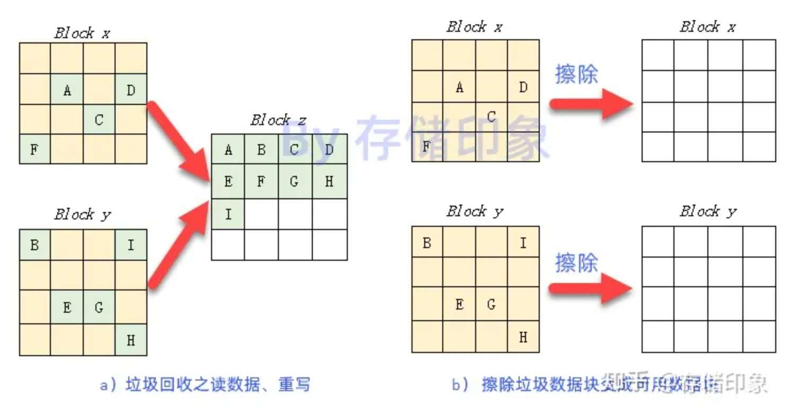
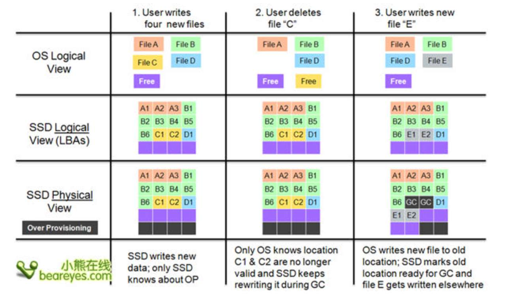
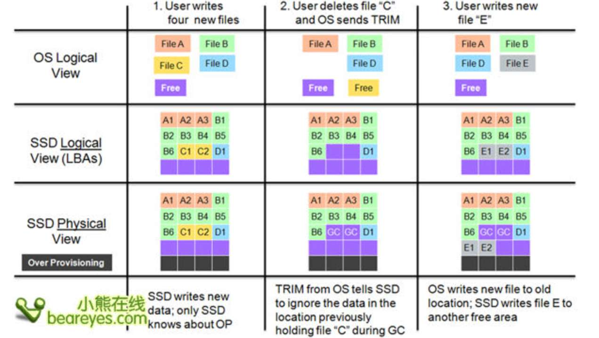
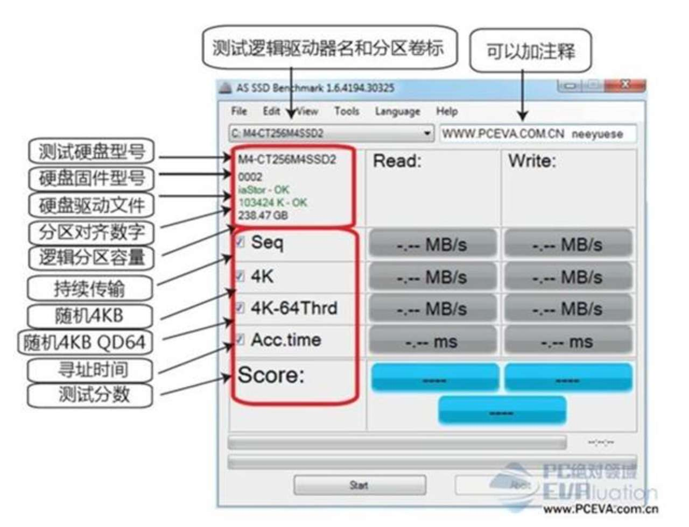
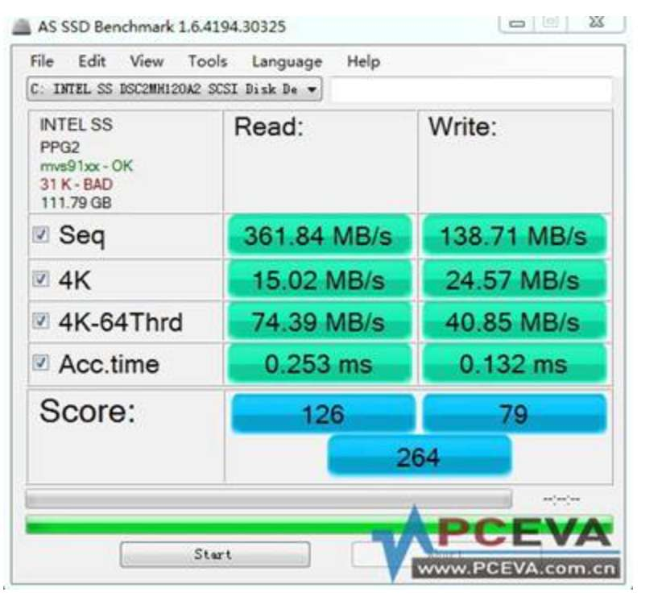
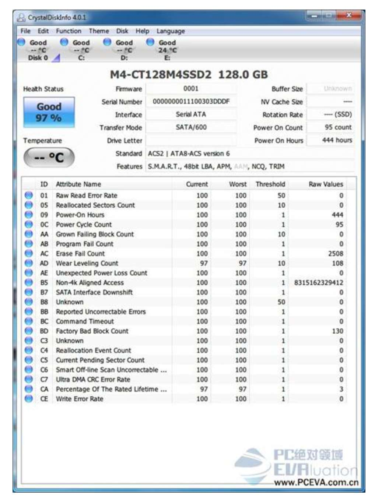

防震抗摔性：机械硬盘都是磁碟型的，数据储存在磁碟扇区里。而固态硬盘是使用闪存颗粒制作而成，SSD 即使在高速移动甚至伴随翻转倾斜的情况下也不会影响到正常使用，而且在发生碰撞和震荡时能够将数据丢失的可能性比机械硬盘小。  

顺序读写比较好理解，顾名思义就是将要处理的数据集中起来排好队，按照最优化的速度进行连续读写，通常在读写大型文件时可以获得比较理想的顺序读写速度。概括来说，顺序读写是指固态硬盘在读写数据的过程中按照数据先后顺序进行工作，具备读写连续性的特点，具体表现为读写时间较短且具备连续性、读写数据大且集中。当我们拷贝几十 GB 以上的视频文件时，发挥的就是固态硬盘的顺序读写性能。  

随机读写的特征在于读写具有随机性，不遵循文件的先后顺序进行数据的读取和写入，可任意跳到某个文件节点处进行读写操作。当一个固态硬盘被使用了一段时间后，之前不断写入数据和删除数据，时间长了，自然会在固态硬盘的闪存颗粒里产生很多零零散散的存储空间或数据存放地址不集中在某个连续空间，此时读写数据的方式就不是顺序读写（连续读写）了，这个读写速度通常比顺序读写速度要低，甚至低很多。随机读写的特点是读写数据小而分散，随机性强，读写时间较长。随机读写性能是固态硬盘的关键指标，其单位为 IOPS（Input/Output Operations Per Second），即每秒进行读写（I/O）操作的次数。随机读写性能越强，处理零碎文件（如启动程序、病毒扫描等）任务就越快。小文件存储（图片）、邮件服务器、OLTP 数据库等应用均属于随机读写比较频繁的情形，应对这样的应用场景，在选择固态硬盘时更关注其随机读写性能，关键的衡量指标是 IOPS。  

要理解什么是 4k 读写，首先要理解这里的 4k 是指什么。这里的 4K 指的是文件的最小占用是 4kb，是 windows 下最小的文件占用空间，那么 4k 读写性能其实就是针对小文件的读写性能。平时用固态硬盘拷贝一个完整的大文件时写入速度很快，说明该固态硬盘的顺序读写速度很快，然而当拷贝很多琐碎的文件时，发现固态硬盘的读写速度明显下降，此时的读写速度就是随机读写速度，随机读写速度往往与 4K 读写性能息息相关，4k 读写性能的强弱直接影响读写大量小文件时的效率。4k 随机读写更贴近我们的日常使用习惯。例如，电脑开启、系统文件更新、网页缓存写入、大量图片拷贝、游戏程序加载和响应等，都需要 4k 随机读写性能发挥作用，4k 读写性能对电脑的操作体验至关重要。

[超详细！SSD固态硬盘万能攻略，一站式固态硬盘基础知识入门指南！哔哩哔哩bilibili](https://www.bilibili.com/video/BV1XW4y187Nc)  
 [【硬件科普】固态硬盘的缓存是干什么的？有缓存和无缓存有什么区别？哔哩哔哩bilibili](https://www.bilibili.com/video/BV1aF411u7Ct)  
[你真的需要高速PCIe4.0的固态嘛？机械硬盘 sata固态PCIe3.0 PCIe4.0固态除了跑分，实际使用场景上究竟有什么区别？实测给你答案！哔哩哔哩bilibili](https://www.bilibili.com/video/BV13L41187NE/)，这个视频测试各种硬盘的顺序读写/随机读写速度对开机、玩游戏、打开工程文件、拷贝文件等应用场景的区别  
[选固态很纠结？其实你用起来都差不多哔哩哔哩bilibili](https://www.bilibili.com/video/BV1eF411A7fB/)  
[市面主流固态硬盘品牌，售后大调查！哔哩哔哩bilibili](https://www.bilibili.com/video/BV1v14y1t75o/)  
在京东打开一个 ssd 的详情页，规格参数里的缓存指的 dram 缓存  
英睿达是美光（micron）旗下的品牌，西数收购了闪迪，2023 年 5 月 21 日，国家网信办网络安全审查办公室表示，美光公司在华销售的产品未通过网络安全审查，我国内关键信息基础设施的运营者应停止采购美光公司产品  
[西数“冷数据门”是怎么回事？用四个月对比两块SSD，告诉你答案](https://baijiahao.baidu.com/s?id=1699919111937329895&wfr=spider&for=pc)  
[如何看待西数/闪迪多款固态硬盘爆出“冷数据读取掉速门”？ - 知乎](https://www.zhihu.com/question/432411720)

ssd 长期不通电丢失数据的原理：[SSD固态硬盘不删除数据长时间数据会丢失吗？ - 知乎](https://www.zhihu.com/question/375294855/answer/2419449158)  
以 NAND 为基础的 SSD 的存储单元在长时间不对其进行读写操作的情况下，其浮栅门级中存放的电荷会逐步漏电，导致原本存储的数据发生变化。随着电荷的泄露，数据由“0”变为“1”，数据错误就此发生。ECC 是“Error Checking and Correcting”的简写，中文名称是“错误检查和纠正”。LDPC 硬编码是硬盘上纠错的一种方式，长时间不通电导致数据出错后主控会通过 ecc 把数据纠正过来，出错的数据越来越多超过纠错的能力后一些数据就不能纠正过来可能造成无法开机、拷贝文件过程中卡住、文件丢失等情况  

金士顿闪存盘还在 NAND 闪存设备中采用备用块。这些存储区通常位于驱动器的预留空间 (OP) 内，用户无法访问。如果 NAND 设备在数据块中存在过多错误，此块将被标记为坏块并被弃用，其中一个备用块将投入使用。在这个过程中，必要时会使用 ECC 对此数据进行修复。备用块的使用可以延长固态硬盘的使用寿命和耐久性。  

写入量远超厂家标称的 tbw 也不会挂掉，断电保存 3 年的掉速和数据完整性测试，只有英睿达 p5 会出现明显的掉速：[写入量超3000TBW！6款SSD哪个会挂掉？【SSD铁人三项测试赛】【SSD耐久性横评】哔哩哔哩bilibili](https://www.bilibili.com/video/BV1CS4y1j7iY/)  
断电保存半年至 5 年的掉速和数据完整性测试，英睿达 p5 在 1 年的时候就数据出错 读取数据失败：[揭秘:固态硬盘厂商不愿说的秘密——冷数据存储哔哩哔哩bilibili](https://www.bilibili.com/video/BV1uF41187QW/)  
相比固态硬盘，机械硬盘 光盘 磁带的断电保存数据时间长很多

500GB 铠侠 RC10 在这四款 SSD 中 TBW 标定值最高，为 200TBW，而一旦写入量突破了阈值，CrystalDiskinfo 中显示的健康状态便达到了 0，此时 CrystalDiskinfo 显示的便是不良并亮起了红灯，但这并不代表铠侠 RC10 无法继续使用。随后我们继续往四块 SSD 中写入数据，在各自达到 4 倍标定写入量之后，四款 SSD 表现均无异常情况

PCEVA 这个论坛，有 ssd 购买推荐等，也有其他硬件例如主板电源等的讨论

相信大家经常看到可用容量跟标称容量不对等的问题。缺少的容量叫 OP，全称 Over-Provisioning，也叫预留空间。预留空间一般占总硬盘容量的百分之 7 左右，这个容量一方面是由于计算机二进制算法产生的差异，另一方面这个预留空间是厂商在生产硬盘时用于垃圾回收 GC、存储 SSD 主控固件和备用数据块等用处，这个容量在购买的硬盘中看不见也不可修改调整和使用。  
[大佬们，关于硬盘的OP空间问题解惑【固态硬盘吧】百度贴吧](https://tieba.baidu.com/p/8077126092)  
[关于固态硬盘的op空间的实际测试【电脑吧】百度贴吧](https://tieba.baidu.com/p/6792418379)

[SSD的性能会随着已用容量越来越满而下降吗？ - 知乎](https://www.zhihu.com/question/275246366)

win7 以后安装原版系统默认都是 4k 对齐，[如何完全发挥固态硬盘性能！4K对齐你知道多少？ - 知乎](https://zhuanlan.zhihu.com/p/77127089)

与机械硬盘 (HDD) 不同，固态硬盘和其他 NAND 闪存无法覆盖现有数据。它们必须完成写入/擦除 (Program/Erase) 循环。闪存被分为块，块又被进一步分为页；数据在页级别被写入，在块级别被擦除，垃圾回收（Garbage Collection，简称 GC）是固态硬盘的一个重要任务，用于将存有分散数据的闪存块上的有效数据读出来，重写到一个可用的闪存块中，然后将原存有垃圾数据的闪存块（垃圾数据块）擦除，从而得到新的可用闪存块（干净块）。从下图可以看到，Block x 闪存块上存有有效数据 A、C、D、F，Block y 闪存块上存有有效数据 B、E、G、H、I，其余方块为无效数据，利用固态硬盘的垃圾回收机制找到一个可用的 Block y，将 Block x 和 Block y 上的有效数据搬移到 Block z 上，最后将没有了任何有效数据的 Block x 和 Block y 进行擦除以擦除垃圾数据，使它们变成两个可用的干净闪存块。

由于垃圾回收（GC）的存在，就有一个问题，用户要写入一定的数据，SSD 为了腾出空间写这些数据，需要额外的做一些数据的搬移，也就是额外的写，最后往往导致 SSD 往闪存中写入的数据量比实际用户写入 SSD 的数据量多。因此，SSD 中有个重要参数，就是写入放大

前台垃圾回收（Foreground GC）：当用户写入数据时，如果可用的闪存块小于一定阈值，这时就需要做垃圾回收，以腾出空间给用户写。这是被动方式，它是由于 SSD 没有多少可用的闪存块时，才去做的 GC。

后台垃圾回收（Background GC），它是在 SSD 空闲（Idle）的时候，SSD 主动去做的 GC，这样在用户写入的时候就有充裕的可用闪存块，从而改善用户写入性能。

下图是不使用 TRIM 命令的垃圾回收，用户删除文件 C，SSD 不知道该文件已被删除 (只有操作系统知道）。如果它此时执行 GC，它将移动文件 C 中的无效数据，因为它不知道它是无效的。操作系统写入新文件 E 时 在 LBAs 中将文件 E 写入到原来文件 C 的位置，SSD 此时才知道文件 C 已经被删除，同时 SSD 将文件 C 占用的物理空间标记为无效数据（ready for GC）

下图是使用 TRIM 命令进行垃圾回收。在删除文件 C 时 OS 就可以通知 SSD 文件 C 已经删除，这样 GC 就不用再移动 C，减少数据写入量和擦写次数 ，增加闪存寿命

如果你的是英特尔固态，你在 win10 关闭了 trim，你可以下载英特尔固态工具箱，选择里面的 intel ssd optimizer 选项，你可以选择手动运行 trim 或者调度计划每天或每周每月在你设置的时间自动运行 trim 指令，三星的魔术师应该也有这样的功能，其他的就不清楚了，一般正规大厂应该都有类似管理软件。  

平时关闭 trim 使用 SSD 只是增加恢复数据的可能性，因为即使关闭 trim ，被删除的数据一样能被垃圾回收看上面垃圾回收的机制原理  

数据误删后，立刻把 ssd 断电防止主控进行垃圾回收擦除数据，断电指直接拔电，正常关机需要时间主控可能会进行垃圾回收，不要往硬盘写入数据免得覆盖掉原数据，可以送到专业的数据恢复高手或机构中，他们可能进行的操作是把固态的闪存颗粒（数据储存在闪存颗粒上）拆下来安装到另一个没主控不会进行垃圾回收的固态上进行数据恢复

搬移重要文件时不要用剪切因为例如你把一个文件剪切到 U 盘 途中出了什么差错例如突然断电，此时原来的文件很难找回来  

可以将把数据存储在机械硬盘，系统和一些要求性能的软件装在固态硬盘，机械硬盘容易恢复数据，重要的文件存云端 ，上版本管理  

有时候用数据恢复软件把数据恢复出来但打不开  

待验证：如果误删的文件在系统盘，断电关机后用 PE 系统进行恢复数据，PE 系统是独立于主系统，这样主系统没有运行的话可能不会进行垃圾回收，多个数据恢复软件可能比单一的数据恢复软件恢复出来的数据多 ，不要用破解软件因为破解软件可能存在某些 bug 可能把恢复变成轻轻擦除一下 ，对于机械盘平时多整理文件碎片有助于提高恢复数据的几率，固态硬盘无需文件碎片整理，找别的电脑下载数据恢复软件装进 U 盘到你的电脑去运行而不是直接在你的电脑下载安装因为这样会往硬盘写入数据，最好平时电脑里就装有数据恢复软件，这样文件误删后能立刻用数据恢复软件  

[给你个100%成功恢复误删数据的思路，机械固态U盘均有效，再介绍几款真免费数据恢复工具(苏联\印度等)，误删文件、格式化、误删分区之后的正确处置，小白也没问题哔哩哔哩bilibili](https://www.bilibili.com/video/BV1gg411F7rp)，看 32：48，有些 ssd 开启 trim 删除文件后立刻用数据恢复软件只能恢复少量数据，关闭 trim 删除文件立刻用数据恢复软件能恢复很多数据

在遇到死机或任何异常情况时，请先冷静，不要随意重启、强制关机等导致设备重置或断电的操作。一般则建议等系统自动重启，若没自动重启，也至少通电等 10 分钟以上才手动按电源键强制重启，同时注意硬盘灯，若硬盘灯亮着或闪烁中，切忌操作，除非一直亮着（例如超过 20 分钟仍不熄灭）才可强制断电或重启。对于画面基本定格，但鼠标键盘无锁死，鼠标指针在屏幕能移动，但点击任何对象机器都无响应，这是一种典型的系统硬盘丢失表现，由于内存中仍有数据，所以鼠标可以在当前画面操作，只是因为系统盘丢失，所以任何操作没有反应，这种情况下若硬盘灯没亮，可以直接强制重启，但大家重启后，若出现 SSD 丢失的情形，切忌不断重启，这是由于刚才强制重启或关机，导致 SSD 意外掉电，此时 SSD 很可能在内部自行检查和修复错误，处于这种状态的 SSD 是会切断跟外界的一切联系，所以硬盘灯也不会闪动。若在此时再重启或关机，打断 SSD 的操作，可能会导致更严重后果，特别是反复重启，这样会令本来 SSD 可自行修复的情况变成完全出错，最严重的后果是只能申请返修。在这种时候，只需要通电耐心等待个 20-30 分钟让 SSD 自行修复，，再重启机器，一般 SSD 就会恢复。我个人比较喜欢进入 BIOS 界面等待，一般出状况重启后，直接进入 BIOS，检查 SSD 是否有被检测到，若是丢盘，就直接等待，没有的话，退出 BIOS 进系统  
[为什么固态会掉盘？著名的30分钟大法修复是什么原理？这么做对吗？ - 知乎](https://zhuanlan.zhihu.com/p/57617932)

 混合硬盘（sshd）顾名思义，就是机械硬盘与固态硬盘的结合体。原理就是使用一块小容量闪存（比如 8GB SLC NAND）作为高速缓存来提高速度。相当于机械键盘 + 闪存模块，机械硬盘缓存只有 16MB/32MB/64MB，所以混合硬盘对性能的提升还是明显的。混合硬盘的好处是：一定程度弥补纯机械硬盘的性能劣势，但保留了大容量优势，且仍然只占用一个硬盘位。当然，机械盘的震动和发热问题仍然存在。混合硬盘和机械硬盘（hdd）平均读写速度两者性能几乎相差无几 。不过从寻道时间上看， SSHD 相对于 HDD 大幅度缩减寻道时间。混合硬盘的闪存模块，需要用户对同一软件、游戏、系统运行 3 次以上，才能起到识别、记忆作用，将热数据导入闪存模块从而加速启动，磁盘碎片整理之后闪存区会清空，要一段时间重新”学习”要加速的内容。开机和软件启动速度位于 HDD 和 SSD 之间，目前 SSHD 的性价比比不上 SSD+hdd，SSHD 数据可恢复，里面的闪存模块坏了，整个硬盘报废，现在混合硬盘基本退出市场了

想让硬盘外接使用可以买 m.2 固态硬盘加硬盘盒，或直接买移动固态硬盘  
[贪小便宜吃大亏，百元硬盘盒干废千元固态硬盘哔哩哔哩bilibili](https://www.bilibili.com/video/BV1Pa411E786/)，有网友说视频这种情况只是 guid 分区损坏，重建 gpt 就行

## 读懂各种测试软件（信息久未更新 可能过时）

使用 CrystalDiskInfo、HD Tune 检测硬盘的通电时间、坏块数量：[如何检测SSD（固态硬盘）是不是二手（翻新）的？ - 知乎](https://www.zhihu.com/question/22654335/answer/3002042531)  

如果你选购的 SSD 产品有提供官方的工具箱软件（如 Intel、浦科特、闪迪、三星等），这些软件都会提供检查 SMART 数据的功能；如果没有官方的工具箱软件，这里我建议大家可以下载最新正式版的 CrystalDiskInfo 来查看，目前这款软件在多语言及对主流 SSD 产品的支持度方面都是做得比较好的，最重要的是这是一款免费软件  

评判一个 SSD 固态硬盘的性能，首先要看 4K 随机读写速度和 Seq 连续读写速度，其次看 Acc.Time 平均访问时间，至于 4K-64Thrd，主要针对多线程并发的性能的，常用于服务器级别的 SSD 性能评判，个人用户的 SSD 暂且不用考虑  
  
AS SSD Benchmark 在 SSD 容量对上一行的对齐数字中显示为：31K – BAD，这个 BAD 就代表分区未对齐。  
对齐数字中显示为：1024 – OK，显示为 OK 即代表分区已经对齐。  
另外有些用户会对于这个分区数字有所疑问，例如最常见的：103424K - OK，这其实是因为用 WIN7 安装程序为 SSD 进行分区时，会自动划分 1 个 100MB 大小的引导启动分区，102400KB（100MB）+1024KB=103424KB；而另外在笔记本电脑上还有可能见到如：1229820K 这类较为古怪的对齐数字，1229820-103424=1126400，1126400/1024=1100M，计算过后，除了 100M 的引导分区外，我们可以见到还包含了 1100MB 大小的空间，这是因为笔记本大多数会有厂商设置的还原隐藏分区，当用户使用迁移软件或克隆软件把笔记本原有系统迁移到 SSD 时，会连这个还原隐藏分区也一起迁移，所以便会出现这些较独特的对齐数字，但这个数字其实我们并不太需要理会，只要确定后面显示了绿色的 OK 字样，那便代表 SSD 肯定已经分区对齐。  
关于分区对齐，只要硬盘的首分区是对齐即可，有多个分区，首分区以外的分区是否对齐，并不重要

目前我们一般都推荐把 SSD 接在主板芯片原生的 SATA 接口使用，而不推荐使用第三方芯片提供的接口，因为第三方接口所受限制及影响较多。一般主板的说明书都会注明那个接口是原生，那个是第三方，不过有些朋友的主板没有提供中文说明书，而他们可能又没足够的英语水平看懂英文的说明书，所以没法判断自己是否接对了接口  

上图在显示驱动程序一栏中的文字为：mvs91xx – OK，正是这一栏让我们知道这位没有把 SSD 接到主板芯片原生的接口上，因为 mvs91xx 代表的是 marvell 磁盘控制器的驱动程序，目前主板上的第三方 SATA 芯片大多数都采用 marvell 的产品，因此才可以判断出这为朋友接在第三方芯片提供的 SATA 接口上。在 ASS 这软件的显示上，一般原生接口，开启了 AHCI 而安装 win7 自带驱动的话，驱动程序一栏显示的文字为 msahci，若是 I 平台在安装了对应驱动后，会显示为 iaStor，而 A 平台则为 amdsata  
若用户在 RAID 模式下，A 平台会显示 ahcix86 或 ahcix64，I 平台显示同为 iaStor。

 “msahci”字样，代表着驱动为 win7 操作系统自带驱动。"storahci" 代表 win10 自带驱动，“iaStorA”字样，代表着驱动为英特尔 RST 驱动。使用英特尔 RST 驱动后，东芝 DTS312 128G SSD 的性能提升很明显，整体表现要远好于使用 win7 系统自带驱动。  
这说明东芝 DTS312 128G SSD 更加适合用英特尔 RST 驱动。(一般来说多数 SSD 更换英特尔 RST 驱动后，都能提升性能。但少数 SSD，使用英特尔 RST 驱动后，性能则会降低。所以要选择自己 SSD 适合的驱动才行。)

对于多数 SSD 产品而言，win7，8 操作系统自带的驱动，相对来说比较稳定。驱动无需用户安装，安装操作系统时，会自动完成驱动的安装。英特尔 RST 驱动相对来说，能提升 SSD 的性能，但需用户自己下载安装从英特尔的官网可以方便下载英特尔 RST 驱动（英特尔® 快速存储技术 RAID 驱动程序）

虽然从第一幅图中，我们知道了目前接在了第三方接口，但主板上那么多接口，接哪个才是原生的呢？其实有个相当容易的方法，目前只要是较为正规的主板，原生接口和第三方接口的颜色，都不会是相同的，也没有哪个主板厂商会做出在两个原生接口之间插个第三方接口的傻事，所以我们只需要把 SSD 接到跟目前这个接口不同颜色的接口上去就可以了。

如果有朋友因为在安装系统时忘了开启 AHCI 模式导致装好后再开进系统会蓝屏，请打好补丁，装好 AHCI 驱动，再去 BIOS 开启 AHCI 进系统，就不会蓝了

目前的主流主板基本都是默认开启 ACHI 选项的。不过少数主板，还有以前的老主板，还得通过 BIOS 设置，手动将默认的 IDE 选项改为 ACHI 选项才行，在 AS SSD 中驱动后面的“OK”的字样，说明已开启 ACHI 选项

常见的例如 SuperPi、AIDA64 中的各个测试项目、Prime 95、3DMark、PCMark 等等，但上述这些测试软件中，除了 PCMark 是全平台综合性能评测和 3DMark 可同时评测处理器和显卡外，其它各款几乎都是针对单一硬件的测试软件，大家也都惯性的认为这些测试软件，基本就是用于检测单一硬件的个体性能和特点。不过到了存储设备上时，却不是这么一回事了。

目前我们这些普通用户所能接触和使用到的‘磁盘测试软件’，其实都应该叫‘PC 存储系统性能测试软件’才对。因为严格来说，现在没有任何一款测试软件，能忽略 PC 系统其它硬件对测试表现的影响而告诉我们硬盘的性能究竟达到什么水平。通俗的说，这些测试软件测出来的成绩，是你电脑整个存储系统性能的分数，而不是你测试的那个硬盘或存储设备的分数。举个具体一点的例子：两个跑测试的硬件平台基本完全一致，各种软件环境也完全相同，就是在 CPU 的型号上出现了差别，1 个是 i3 2100、1 个是 i7 2600K，按前述的惯性逻辑，测试软件若只是测试硬盘，那 CPU 的变化，不应该影响成绩，同款硬盘成绩差距只能是误差才对，但实际测试成绩却会截然不同

AS SSD 的分数，并没有很强的代表性，我建议大家不需要关心。完整测一次会产生共 5GB 的写入量，因此无必要就建议大家不要随便跑。  
下面分别给大家介绍下 AS SSD BenchMark 上显示的参数所代表的意思，  
Seq：连续读写速度。  
4K：4K 随机读写速度（随机单队列深度测试）。  
4K-64Thrd(随机 64 队列深度测试)：QD64 时的随机读写速度，具体意思：随机 64 队列深度测试，软件则会生成 64 个 16MB 大小的测试文件（共计 1GB），然后同时以 4KB 的单位尺寸，同时在这 64 个文件中进行写入和读取测试，最后依然以平均成绩为结果。  
Acc.Time：平均访问时间 (数据存取时间测试)。  
至于最后的存取时间测试，一般普通用户其实不太需要关心，只要看懂前面持续和随机的测试已经足以判断 SSD 有没有正常工作。

[【科普】PC常用检测软件介绍（二） - 知乎](https://zhuanlan.zhihu.com/p/32304270)  
每个 SSD 公司不同主控（不同固件都有可能变）SMART 定义不同  
对于主控型号为 Marvell 88SS9174-BJP2，固件由镁光开发的镁光 C300：   
点开‘功能’菜单，在‘高级特征 -Raw 值’下的选项从‘16\[HEX\]’改为‘10\[DEC\]’，就会从 16 进制数据变成我现在的 10 进制数据显示，省去了自行换算的麻烦。另外对于不希望公开序列号的用户，还可以把图中‘隐藏序列号’一项打上勾，序列号显示为星号了  
THRESHOLD（阈值/临界值）、CURRENT（当前值）和 WORST（最坏值）: 当前值低于最坏值时候，硬盘处于警告状态，SMART 向系统报告，这时候应该记得备份数据。  
RAW VALUE (数据） : 更详细的数据，由各家厂自定义  
 这些数据里，我们需要注意的首先是 ID 为 AD 的一项，即 Wear Leveling Count（颗粒平均擦写次数），图中显示的数据为 108，即这块 128G 的 M4 的全盘 P/E 数为 108 次，因为 M4 使用的闪存颗粒官方标称寿命为 3000 次，108 约为 3000 的 3%，所以此项的 Current（当前）值为 97，即剩余 97% 的寿命（亦即 CA）。  
 第 2 项要注意的就是 ID 为 AA 的 Grown Failing Block Count（使用中新增坏块数），此项代表 SSD 的闪存颗粒在使用时出现的坏块（类似于 HDD 的坏道）数量，此处数据为 0 即尚未有出现坏块，若新购买回来的 M4 在正常使用（不包括疯狂跑测试）下，短期内此项数据产生较大变化，那代表盘可能有问题，用户可申请售后服务。  
B5 即 Non-4k Aligned Access（非 4KB 对齐访问数）此项，可能很多用户会产生疑问，为什么我明明对齐了，这里还有数据呢？这是因为虽然我们分区对齐了，但我们写入和读取的数据不一定都是 4KB 或它的整数倍，因此这里就会有数据，我们不需要在意，这一项是 m4 的开发人员留给他们自己看的；  
还有 C7 即 Ultra DMA CRC Error Rate（主机到接口之间传输 CRC 错误率）此项，若此项出现数据，并不代表磁盘有问题，这是数据线有问题或接口接触不良而引起的，一般重新接好或更换数据线后，数值就不会再增加。而即使没法让数据不再增加，只要使用没问题，一般都不需要太在意  
在传输模式上显示 SATA/600 时，说明 SSD 硬盘处于 SATA3.0 接口上，另外我们也可以通过这款软件，来查看一下 SSD 是否是全新的，一般从通电次数与通电时间就可以看出来，在“支持的特征”一栏中会列出该 SSD 所支持的特征功能，如果 ‘APM’‘AAM’2 项是灰色的，意思就是不支持  
重新分配坏块数量）、（重新分配坏块事件数）、（新增坏块数）这三项，当其出现数据时，也要留意下，如果短时间内（例如 1、2 周或 1 月内），并无进行繁重的读写操作（例如长期跑测试），只是一般正常的使用，这些数据却急剧增加，那就代表 SSD 可能出了问题。如果是长期使用后，缓慢增加，则是正常现象，不需要过分担心  
S.M.A.R.T 是“Self-Monitoring Analysis and Reporting Technology”（自我监测、分析和报告技术）的英文简称，它指一种自动的硬盘状态检测与预警系统和规范。现在绝大部分硬盘均配备该项技术。  
S.M.A.R.T 内置在机械硬盘或固态硬盘中进行监控，以指示硬盘状态。对于固态硬盘，S.M.A.R.T 包含平均 P/E 周期计数、总通电时间、通电周期计数、总主机写入/读取数和其他特定信息。

CrystalDiskMark 软件测试前，同样会生成一个测试文件。一般来说，设置得越大，数据缓存起到的干扰越少，成绩就更能反映 SSD 的真实性能，不过缺点是会严重影响 SSD 的耐久度（写入太多数据影响 P/E）  
测试次数，可选范围是 1-9，次数越多成绩越准确，但所花时间给数据的写入量也会大增，一般建议选择 5 次即可。  
测试文件大小，共有 50MB、100MB、500MB、1000MB、2000MB、4000MB 共 6 种尺寸可供选择，越大测试出来的成绩自然越精确，但所需时间和对 SSD 的写入量也同样大增，越小则需要的时间较短，同时成绩也会较‘好看’，所以有些网上的‘评测’很多时候都跑最小的 50MB 尺寸，甚至有些会做出作弊的手段，就是以 50MB 尺寸跑完测试，然后在这里改成较大的尺寸后再截图（例如改成 1000MB，这也是一般多数建议的测试尺寸），这样成绩就能偏高，可以忽悠很多不知底细的老实网友  
CrystalDiskMark 中 q32t1 指的是 qd32，qd 代表队列深度，队列深度指的是应用同时进行了几个读写操作， qd 越高速度越快，日常操作中绝大应用都不会超过 qd 3，大文件拷贝时就只有 qd 1
