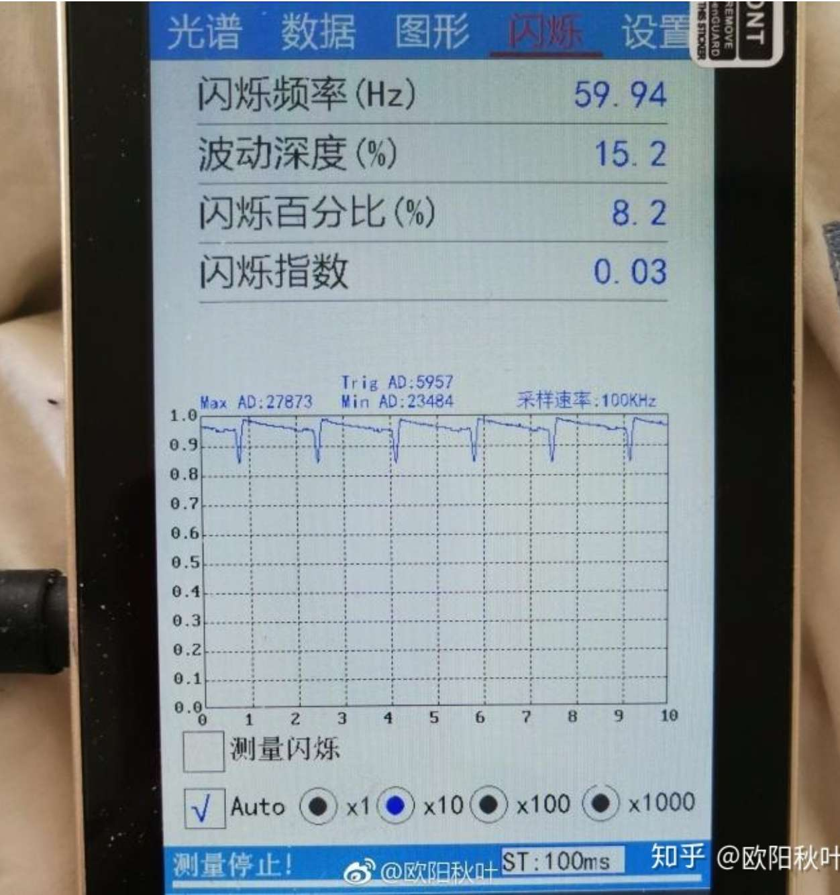
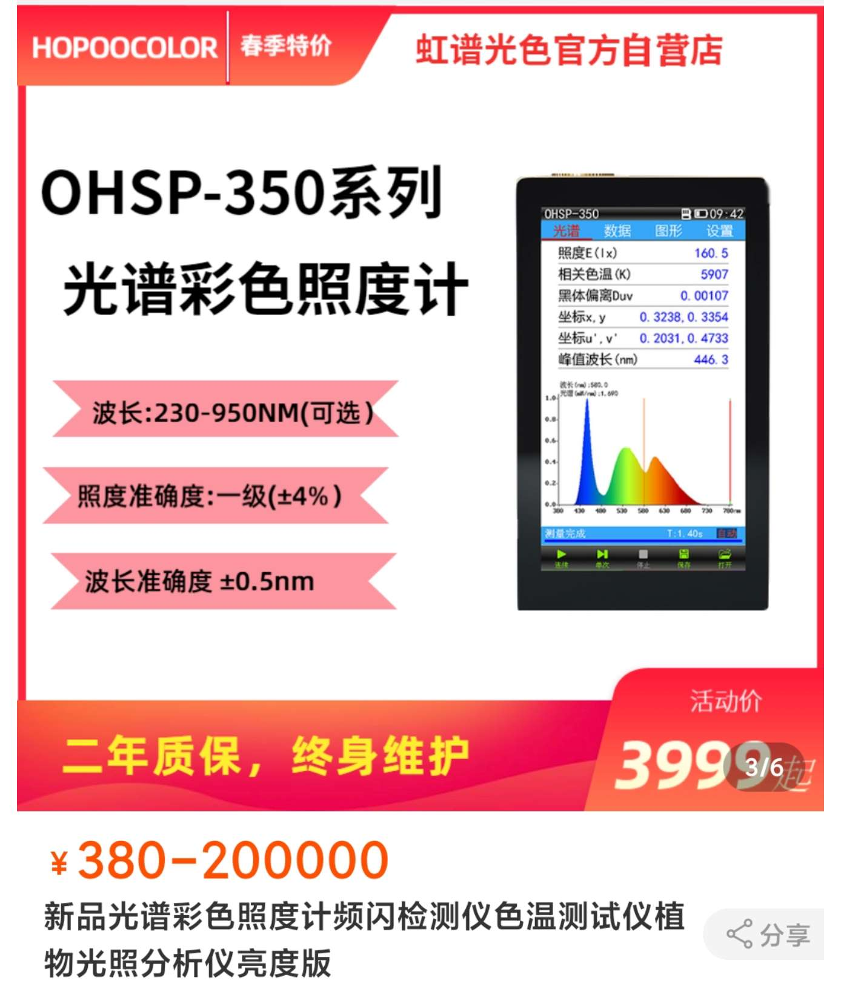
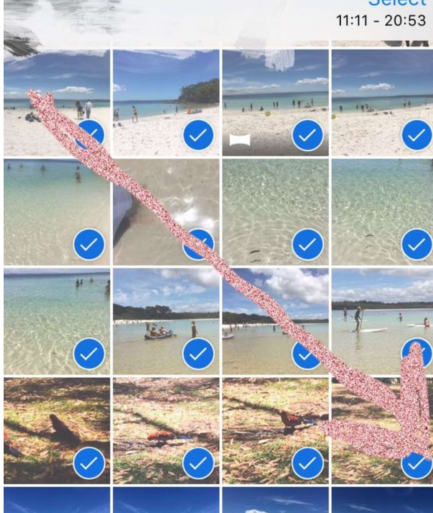
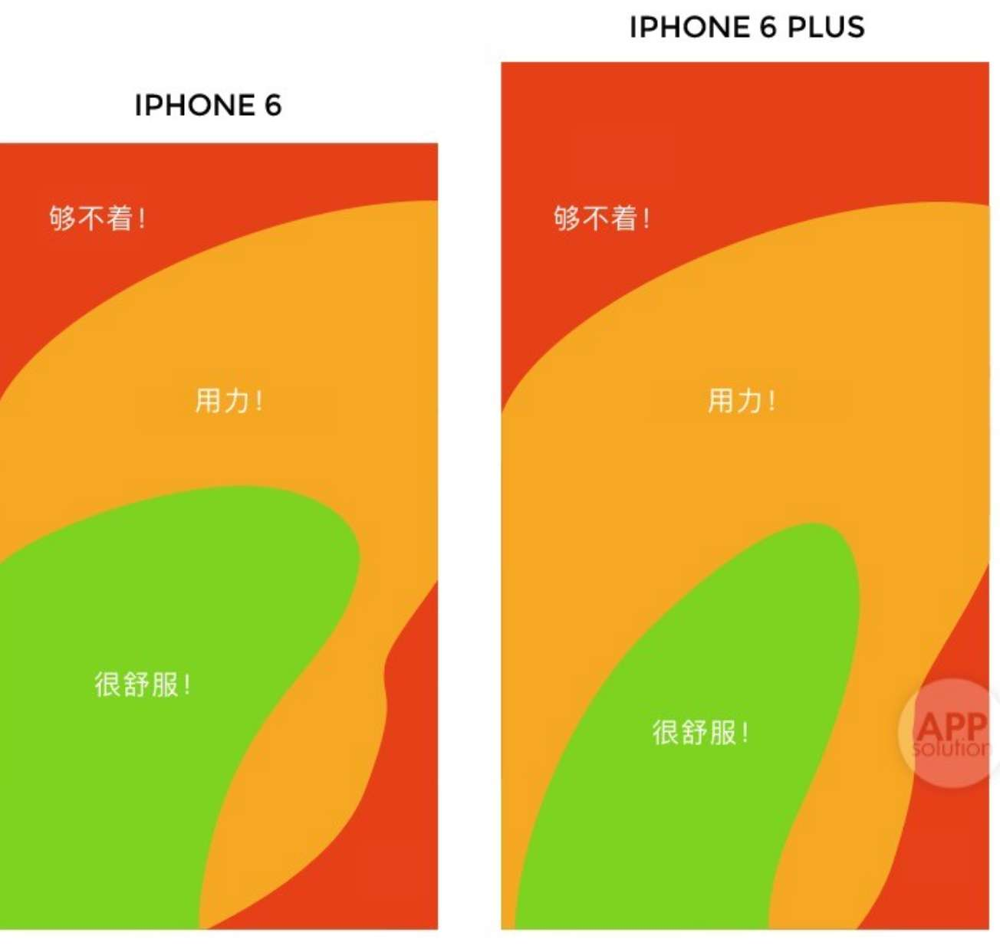

# 硬件

美团外卖也能买电子产品例如手机（用搜索功能），最快半小时送达，不知道售后怎样

低温降低锂电池的电压导致手机可能关机且无法充电，快充技术有效缓解这个问题：[手机为什么会被冻关机？把7台手机塞进冰箱后，我们发现事情没那么简单【柴知道】哔哩哔哩bilibili](https://www.bilibili.com/video/BV1bg4y1c7fH/?spm_id_from=333.1007.0.0&vd_source=568600721e4a7665b71d32bda0302591)

锂离子的电池寿命和充放次数或叫循环次数有关 ，从这个角度上讲 ，一直插上电源适配器使用笔记本是有效延长电池寿命的方法，因为插上电源适配器且电池充满电的情况下，笔记本不从电池取电而是由电源适配器供电，有些品牌的笔记本在电池充满电后即使插上充电器也不会充电，避免电池过充， 然而锂离子电池还有一些其他的问题 ，首先是离子活性， 如果电池长期保持充满状态 ，而没有充放过程，会造成性能降低（也有网友说会造成电池鼓包） ，但是处理起来也很简单 ，定期走一个循环即可，一般一个月进行一到两次充放电循环（电量用到剩 30% 左右再充满电），如果设备自动关机了，如果没有紧急的事情就不要再次唤醒，留点余电，避免电池过度放电

手机壳主要是保护作用，手机壳一般比屏幕凸出一点，这样屏幕正面摔到地上首先砸到手机壳凸出来的那部分保护屏幕，比镜头突出一点保护镜头，手机边角落地摔到地上时手机壳缓震以至于不会震碎屏幕，手机壳四个角都有突出的防摔气囊那种比较好，决色这个手机壳品牌的噱头挺多  
[从入门到秃头：一个18岁计算机系少女的EDC数码配件什么值得买](https://post.smzdm.com/p/aooz47rr/)，看防摔手机壳部分  

远离极端温度。手机在常温温度范围都能有良好表现，在 15℃~30℃是电池体现最佳性能的环境温度。如果手机长时间处于温度高过 35℃的环境温度，会加速电池的老化与寿命衰退。而在非常寒冷的环境下使用设备时，可能会发现电池可使用时间缩短。但电池化学低温特性是暂时性的，只要回到常温温度范围即可正常使用。

荣耀原本是华为的子品牌，2020 年华为把他卖给了深圳的一家公司，完全独立开来，荣耀也有自己的笔记本 路由器 手表 耳机等智能硬件，荣耀手机的系统用的是 magicos ，华为手机用的是鸿蒙系统  

截至 2023-05-28 ，华为被美国制裁，买不到射频芯片和滤波器等器件，华为自己研发的麒麟芯片也需要这些器件，所以华为的手机用不了麒麟芯片，即使 soc 是 5g 的 soc ，缺少射频和滤波器等必要的器件，手机就没法支持 5g，可能是这原因不能用 5g 的芯片，只能用几年前发布的骁龙 778 4g 这种性能很一般的芯片，目前最新款的华为手机没有支持 5g 的，而且性价比不高

[性能天梯，百款手机SoC芯片速查与排名(23.6.5) | 爱搞机](https://www.igao7.com/news/202301/K7G5zwUtTbiUAeez.html)

如果有 root 或 用 google 系列 app 的需求，买手机也要考虑哪个品牌手机能 root 或自带 gms，看“安卓”那个篇章有写

可以以旧换新

手机贴膜 2 年左右换一个因为可能磨损影响清晰度

小米手机， “设置—我的设备—全部参数—内核版本” ，快速点击”内核版本“几次后进入 cit 检测模式，适用于买二手机 或手机送修回来检测手机的各项硬件是否正常

淘宝搜“手机升级/扩容 内存”有帮你升级内存的服务，还有 iphone 单卡改双卡的服务，小米有官方的电池换新、换屏服务，[华为8.8折内存升级活动来了：Mate 40/P40 老机型满血复活手机什么值得买](https://post.smzdm.com/p/arqmdwmg/)，手机存储不够了也可以把照片视频等上传到云服务来缓解  
[别盲目多花钱！2023买手机内存选16GB还是12GB？实测结果告诉你 | 大米评测哔哩哔哩bilibili](https://www.bilibili.com/video/BV1e24y1K7oF)

以前一加用的是自己做的氢 os ，国行版一加 9 开始将弃用氢 os 改为用 oppo 的 color os

有待以后验证科学性：[屏幕光源的蓝光和频闪伤害如何量化，3年测试给你真实的参考 - 知乎](https://zhuanlan.zhihu.com/p/148795359)，从”首先我们讲解一下光谱“开始看，关于蓝光危害的量化  
[屏幕蓝光实验，OLED真的比LCD护眼吗？ - 知乎](https://zhuanlan.zhihu.com/p/59866223) （文章里外链的那篇文章不用看）

[手机上 UFS/eMMC/LPDDR 究竟是什么？科技美学带你一文看懂互联网头条-中关村在线](http://news.zol.com.cn/635/6359414.html) ，  
ufs 的 读写速度相当于 pc 的 ssd 的读写速度，而手机里涉及闪存读写速度的操作有拷贝照片视频、安装/打开 app、加载游戏，  
[小米发布 FBO 焕新存储技术，已被闪存标准 UFS 4.0 正式纳入规范](https://baijiahao.baidu.com/s?id=1737191290059430601&wfr=spider&for=pc)

[一图看懂小米 5G MultiLink 网络加速技术 - Redmi K30,5G - IT之家](https://www.ithome.com/0/460/720.htm)，

红米 note 8pro 是单 wifi 天线 ，而红米 k30 5G 版是双 wifi 天线 ，手机连接的 wifi 的最大带宽和手机支持的 wifi 几代 、路由器发出的 wifi 几代、wifi 的频段带宽、手机有多少天线都有关，看 [【研报】手机有几根Wi-Fi天线？从MIMO参数，看华为/小米/OPPO/VIVO/一加/苹果 - 知乎](https://zhuanlan.zhihu.com/p/105819109)，一些高端手机才支持 160mhz  
单天线指的是 手机各自都有 1 根天线同时接收和发送数据，双天线比单天线的优点表现在速度上有明显提升，并且在卫生间、厨房等远离路由器的区域连接仍旧十分稳定不容易掉线，手机有很多天线，wifi 天线时其中一种

截至 2020-10-08 ，苹果的 a 系列处理器是所有手机里最强的，而安卓机里最强的处理器是骁龙的 8 系列，现在最新的骁龙的 8 系列处理器是骁龙 865，不玩游戏或视频剪辑之类的，感觉不用上骁龙 865 ，普通中端的处理器就行，把钱花在内存和闪存和屏幕上

5g 对于普通用户只是下载速度快很多，其他没什么的了，5g 更多的是应用在物联网等，[用 5G 手机但没开通 5G 套餐，在 5G 信号覆盖的地方用 4G，会比 4G 手机用 4G 快吗？ - 知乎](https://www.zhihu.com/question/354747136/answer/887734084)

[如何看待手机碎屏险？ - 知乎](https://www.zhihu.com/question/24662549/answer/1217626828)

目前支持内存扩展的手机越来越少，除三星与华为仍坚持在旗舰机上加持内存扩展之外，其他品牌通常仅在中低端机型上支持。这里面又只有华为采用自家的 NM 卡，其他品牌则站队 TF 卡主流生态。通常是把 tf 卡（也称 microSD 卡）插到卡槽里，扩展手机的存储空间，  
一些低端的安卓手机例如 800 以下的红米手机一般没有 nfc

OLED 屏幕的类 dc 调光：  
[一己之力征服一众厂商——魔法师蛋小丁谈 他推广OLED屏幕DC调光的这两年安卓手机什么值得买](https://post.smzdm.com/p/a25rxpo2/)  
[DC调光是什么？OLED屏防疲劳就看它手机什么值得买](https://post.smzdm.com/p/a25rd6oq/)  
[营销or技术？一加创始人三度回应DC调光，类DC调光大势所趋。 - 简书](https://www.jianshu.com/p/e351c94d96e3)  

[【手机屏幕伤眼探究】短波蓝光，低频pwm都不存在的oled手机在哪里哔哩哔哩 (゜-゜)つロ 干杯~-bilibili](https://www.bilibili.com/video/BV1Qt411Y7d9?t=377) , 0：32 开始看，视频中用仪器测出 小米 mix3 是低于一定亮度才是 250hz 的 pwn 调光，视频中还测了蓝光， 这篇文章 [Xiaomi Mi Mix 3 Smartphone Review - NotebookCheck.net Reviews](https://www.notebookcheck.net/Xiaomi-Mi-Mix-3-Smartphone-Review.372371.0.html) 的 display 那一节看频闪，这篇文章写出有 250hz 的频闪但没写出低于一定亮度才是 250hz 的频闪  

有网友说之所以 oled 采用这么 hz 低的频闪，因为高 hz 的频闪容易导致 oled 烧屏，以后再搜索”烧屏 amoled “了解更多，[iPhone12 屏幕上有白色残影是怎么回事？ - 知乎](https://www.zhihu.com/question/427056431/answer/1554945351)  

很多人认为亮度越低，PWM 调光的频率就越低，就对眼睛不好，这是错误的。因为对于 PWM 屏来说，影响亮度因素只有“亮屏和灭屏在一个闪烁周期内所占的时长比例”。不管闪烁频率快慢如何，只要保证在一个闪烁周期内的亮、灭时间比例不变，屏幕亮度就不变。举个例子，闪烁频率低的 PWM 屏幕能达到 50 尼特的亮度，闪烁频率高的 PWM 屏幕同样能达到。此时，高频 PWM 就对人眼更健康，只有极少数人会因为高频 PWM 的闪烁而感到视觉不适。屏幕调暗之后，灭屏在一个闪烁周期内所占的时长比例变大，用手机拍摄会看到频闪条纹会变粗变大，要说明的是，并不是所有 LCD 屏幕都采用 100％ DC 调光。有些 LCD 屏幕会在亮度低于一定值时开启 PWM 调光模式。

[PWM Ranking - Notebooks, Smartphones, and Tablets with PWM - NotebookCheck.net Tech](https://www.notebookcheck.net/PWM-Ranking-Notebooks-Smartphones-and-Tablets-with-PWM.163979.0.html) ，这个网址可以看到手机的屏幕类型（lcd 还是 oled），是否有频闪，例如你搜索 xiaomi，点进“Redmi K30 5G” 可以看到具体的 review，在 review 里 display 那一章的 Screen Flickering 可以看到 小于 43% 亮度时有频闪，频率为 2358hz，意味着在 43% 亮度以上是 dc 调光  
看 b 站 up 主”欧阳叶秋“的测评，他一般会用光谱仪测手机屏幕的频闪，蓝光，亮度等  
下图光谱仪，可以测量手机屏幕、灯泡的频闪色温亮度等

截至 2020-10-06 ，同款手机在国内外的命名，国内叫小米 CC9 Pro，海外版命名为：Mi Note10 （注意香港也是海外，在小米的香港官网上这款手机叫 小米 note 10)， xiao 10 lite 在国内叫 小米 10 青春版，redmi k30 ultra 叫红米 k30 至尊纪念版， redmi note 9 pro 这个手机只在海外发售，国内没得卖，小米香港官网可买，但其实这款手机对比国内在售的差不多配置的小米手机性价比不高

新款的 iphone 没有指纹识别，只有人脸识别，高端的安卓机一般有人脸识别和屏下指纹识别

[免押金租手机真的那么划算？我们来帮你 “排排雷” | 爱范儿](https://www.ifanr.com/1019921)

[七台旗舰手机自动亮度调节横评（请不要叫我测评君出品）哔哩哔哩bilibili](https://www.bilibili.com/video/BV1pF411E7EN/)  
[手机的自动亮度为什么不好做？ - 知乎](https://zhuanlan.zhihu.com/p/126591593)  
从亮度变化上说，现在所有手机的调节杆位置和实际亮度也并不是线性的，把亮度「调到一半」的时候，显示的亮度并非是最大亮度的一半，而是远远低于最大亮度。  

打开自动亮度后最好看下是否太亮或太暗来决定是否自己调亮度，自动亮度不好用可以关闭自动亮度自己调亮度，屏幕亮度和周围环境亮度差不多才不伤眼  

之前全新的红米 note8pro 刚买回来自动亮度是没问题，一个月后打开自动亮度会直接调到亮度最低，几十天后莫名其妙又正常了，可能和手机摔地上有关系

之后用小米 6 给我的感觉就是自动亮度调节远远比不上之前用的 iphone 6s，有网友说自动亮度调节是安卓机的通病

[姿势决定结果 AMOLED、LCD屏幕亮度测试方法解析 | 爱搞机](https://www.igao7.com/news/201412/YAl0ifMfxBx5misu.html) 提到

>AMOLED 的基础是有机物发光体，成千上万个只能发出红、绿或蓝色这三者颜色之中的一种的光源被以一种特定的形式安放在屏幕的基板上，这些发光体在被施加电压的时候会发出红、绿或者蓝色，电压的变换同样需要依靠 TFT，在调节三原色的比例之后，才能发出各种颜色。从结构上来说，AMOLED 屏幕要比 LCD 屏幕简单很多，但是在实际上，AMOLED 遇到的问题会比 LCD 屏幕更多。
>
>在测试屏幕亮度的时候，我们必须将平均图像电平（APL，Average Picture Level）加入考量的基准，这一名词主要指已经点亮的像素数量占总像素数量的比例，也就是说一块屏幕在显示纯红色、纯绿色或者纯蓝色的时候，APL 值仅有 33%。
>
>对于 AMOLED 屏幕来说，同样亮度下 APL 值越高，消耗的电能就越多， 因为一整块 AMOLED 屏幕在显示白色的时候，所有像素必须同时发光，而显示黑色的时候对应像素是不发光的，而在手机屏幕上，总的最大功耗是一定的，这也就是说整块屏幕能耗保持不变的情况下，AMOLED 屏幕在显示低 APL 值画面的时候，单个像素所分配到的电能就比较大，这也就意味着已经点亮的像素能够获得更高的亮度。
>
>也就是说手机上的 AMOLED 在显示非全白图像的时候，会有更高的局部亮度，而对于手机上常见的边缘发光 LCD 屏幕来说，由于光源来自后方一整块发光组件，所以不存在某一部分亮度更高的情况（当然这是假定背光是均匀的前提下），也就是说手机 LCD 屏幕的最大亮度基本是固定的，不会随着 APL 值改变太多

手动最高屏幕亮度指的是关掉自动亮度调节以后，手动将亮度条拉满的亮度，需要全屏显示白色图像再测试  

局部激发峰值亮度指的是屏幕上小部分区域能够达到的最大亮度，手机显示部分白色 其余黑色的图像的情况下测试局部激发峰值亮度，看 hdr 视频或照片时为了更真实的阴暗效果，屏幕的某些区域会自动激发局部峰值亮度  

全屏激发峰值亮度指的是自动亮度开启，环境光传感器受到强光刺激时例如白天的大太阳或拿手电筒照射传感器时屏幕能达到的最大峰值亮度，需要全屏显示白色图像再测试  

[多高都没用，手机厂商吹的峰值亮度，你可能这辈子都用不上 - 知乎](https://zhuanlan.zhihu.com/p/364321543)  

市面上常见的家用显示器亮度一般在 250-350 尼特左右，游戏显示器稍微好点，能做到 300-500 尼特。但就算是亮度只有 250 尼特的家用显示器，亮度拉到 100% 之后看半个小时，眼睛也会发酸发干。日常使用的时候，手动最高屏幕亮度有个 300-400 尼特就足够了，太阳底下全屏激发峰值亮度有个 600 多尼特也够了也能看清手机屏幕  

lcd 的屏幕最高亮度一般低于 oled 屏幕  
有个小程序叫“小白测评数据库”，里面有各种手机的包括屏幕亮度在内的参数排行  

阳光下照射本来就热，为了看清屏幕将亮度变高，手机发热也会增加，当散热不足手机发烫，系统会自动降低亮度，所以一般同样的条件下散热好的手机比散热差的手机在户外能获得更高的亮度  
[同样1000nit亮度，差距大到离谱！15台手机户外屏幕亮度测试 | 大米评测哔哩哔哩bilibili](https://www.bilibili.com/video/BV18V4y1x7vC)

以后买手机前可以用类似的关键词搜索：2020 小米手机选购指南，2020 手机排行，2020 安卓手机推荐，1500-2500 价位手机选购指南  

买手机可以用白条/花呗分期免息，分期免息相比于全款购买的优点是例如分了 6 期，还了 1 期后，剩下 5 期的钱可以理财例如放余额宝吃利息，到了还款时间就还钱  

微博 " 魔法师蛋小丁”在 2018 年写出了 oled 屏幕的 类 DC 调光功能的内核，后来 oppo 的 coloros 在 2019 年 4 月参考他的思路推出了类 dc 调光，从此各大厂商还是跟进，他的微博还会推荐一些不同价位里的手机  
小白测评在 618 或双 11 之前都会出一期推荐各个价位手机的视频

[Smartphone Processors - Benchmark List - NotebookCheck.net Tech](https://www.notebookcheck.net/Smartphone-Processors-Benchmark-List.149513.0.html)，可以看手机 cpu 的排名  
https://www.phonearena.com, 可以查询手机的各种参数，进行不同手机之间的参数对比，筛选出符合某种参数的手机，[理性选手机，看这六个网站就够啦！手机什么值得买](https://post.smzdm.com/p/677265/?sendby=9588702870&from=other&invitecode=zdmd4hr49vinv)  
根据一些参数筛选出一些手机：  
[【手机】手机报价_2023最新手机品牌大全-太平洋产品报价](https://product.pconline.com.cn/mobile/) ，  
[【手机大全】手机报价及图片大全-ZOL中关村在线](https://detail.zol.com.cn/cell_phone_index/subcate57_list_1.html)，点击“高级搜索”有更多选项，鼠标悬浮在某个手机图片上面点击“对比”可比较不同手机之间的参数的区别

现在的显示器或手机屏幕大多是 60hz 刷新率，高刷新率手机一般是 90hz 或 120hz 或 144hz，支持高刷新率的手机一般可以在系统调整刷新率例如选择 60hz 或 120hz，120hz 比 60hz 稍微耗电一点，现在的视频一般是 24 fps，所以高刷新率对于看视频没作用，有些手机例如小米 10 至尊纪念版有 memc 动态补偿，可以把 24 fps 的视频插帧至 60 fps 及以上，拖动屏幕时 fps 可以很大，微博 app 在拖动屏幕时会输出超过 60 的 fps，所以刷微博拖动屏幕时高刷新率比 60hz 刷新率会顺滑一点，高刷新率手机让你玩 fps 超过 60 的游戏反应更快，不是所有 app 都会在你拖动屏幕时输出超过 60 的 fps

买手机例如 iphone 一般有裸机和合约机让你选，合约机一般是让你买手机的同时办理一个套餐并使用这个套餐一段时间

目前，智能手机的指纹识别主要在三处：正面屏幕下方、背面中上部、侧面电源键指纹，背面指纹的不方便在于手机放在桌面时要拿起整个手机才能解锁，手机放在汽车手机架时解锁不方便，仅食指方便解锁，其他手指不是很方便

手机钢化膜的疏油层和手机屏幕本身的疏油层的作用是可以不容易留下指纹，清洁更加方便。人体由于正常代谢，手指往往会有油脂和汗水，通过接触屏幕，会留下手指痕迹，影响屏幕的清洁度，也影响屏幕的美观度。疏油涂层由于材料特殊性，手指触控更加顺滑，不会有阻涩、操作不畅的现象，改善了触感体验。需要注意的是，疏油层通过长期使用会被消耗殆尽，手指长期接触，造成疏油层被磨光，不再具备疏油功能，此后的使用过程中会更容易收集指纹，操作也会有顿挫之感

# 软件

## 安卓

 2020-01-27 浏览器用 google 搜索” user agent check” 可查看该浏览器的 ua，用最新版本的安卓 via 浏览器查看可知他是基于 chrome58，夸克/uc 浏览器是基于 chrome57，内核低，最新的 chrome 都去到 79，很明显的区别就是用 via 从 google 搜索结果中打开一个知乎链接不会自动跳转到知乎 app 打开，而 chrome firefox 则会，via/夸克/uc 默认不会显示网址，上了假网站都难第一时间发现，而 chrome firefox 会显示网址

小米，设置>>双卡和移动网络>>一元流量，无需插入电话卡，即可使用数据流量上网。

当我们的通讯录里有成百上千个号码（联系人），拨号时的拼音检索就显得尤为重要。打开电话 app 后我们可以在拨号界面依照数字下面的字母按下相应的数字来快速检索。比如已经提前在联系人那里添加了一个名叫少数派的号码，我们要打电话给少数派时，只需输入 777（ssp），ssp 是少数派的拼音首字母，少数派的号码就会被显示到屏幕上，轻按即可拨号。  
小米的电话 app 的设置 - 高级设置 - 一键拨号  
在拨号界面输入# 然后就可以输入手机号码搜索联系人

先在 b 站 app 下载缓存你要的视频，然后打开你的安卓系统的文件管理器，Android/data/tv.danmaku.bili/download，找到 video.m4s，用 vlc 等播放器打开就可以 2 倍以上的速度播放，或者你可以下个油猴插件，装个加速脚本

[启用MIUI优化 到底是什么? - 知乎](https://www.zhihu.com/question/49668764)，感觉还是开启 miui 优化比较好

2020-10-10， miui 12 ，如果 APP 接入了 mipush，不启动 app 也能收到通知，腾讯的 QQ 和微信都没有做接入 mipush 的版本。所以需要他们设置为”自启动“才能不启动 app 也能收到通知

Android 一些 app 会强制要求开放某些权限，不给就不能用 app，例如“全面屏手势”app 就需要相机，定位，通信录权限，按道理来说他的功能是不需要这些权限也能正常工作的，有网友说有些应用需要 IMEI 信息的，但是 Android 没有把通讯录/电话/IMEI 的权限分开

2020 年 10 月 15 日 ，miui 12，安装新 app 后，新 app 的权限管理里的 “ 读取应用列表 ”和“发送常驻通知”这 2 个权限默认设置为“ 始终允许 “，“读写剪切板”这个权限默认设置为“仅在使用中允许”，通知管理里默认允许 新 app 发送通知，说实话默认允许 新 app 发送通知这点让我很烦，而且通过网上搜索找不到关掉默认允许新 app 发送通知的方法，网上说华为的系统也是默认允许新 app 发送通知，ios 是下载好 app 后第一次进入 app 会问是否开启通知，网友：还不如 一加 5T 的 基于原生的爽，直接默认是降躁通知，无响铃之类的 自己再可以改成 正常通知 或 不通知  

读写剪切板这个权限如果关掉，在 app 里你不能复制粘贴  

定位权限除非明显用到定位例如外卖 地图 app，否则一般关掉，像联通手机营业厅获取你的定位就感觉没必要  

” 读取应用列表 ”这个权限的应用场景：  
1.方便应用间进行唤醒  
例如：装个百度贴吧， 它会主动读取你手机是否有百度家族相关应用，若有，可进行应用间的唤醒。  
2.统计和推送  
例如：你装了什么应用就说明你的爱好，以此为基础，推送你可能感兴趣的应用。  
3.应用市场类，垃圾清理类，杀毒安全类，请求理由是检查应用是否需要升级、清理、杀毒。  

例如你在设置了将淘宝的相机权限设置为拒绝，当用淘宝的扫一扫功能时他会提示你需要开启相机权限  

应用权限里的“ 读写手机存储”，上传下载文件和缓存图片视频会用到，实测没开启这个权限也能看 app 的视频和文章

权限设置里有一个 " 后台弹出界面 ", 应用场景有例如你在用其他 app，微信 qq 有人要和你语音通话会弹出界面，实测 miui12 关闭 qq 的后台弹出界面权限也一样能收到消息提示  

应用权限里的“ 显示悬浮窗 ”，有道的 APP 划词翻译就是这种通过悬浮窗实现。安卓的 qq 音乐在跨 app 识别视频里的歌曲时会用到悬浮窗权限  
应用权限里的“ 常驻通知 ”，指通知是常驻的，即当你在通知栏点一键清除所有通知时该通知不会被清除，一般是一些偏工具类的 通知 例如 qq 音乐在通知栏 / 锁屏页面的控制下一首、播放暂停的控制组件，控制组件相当于一个通知 ，安装新 app 后这个权限会默认允许，不是所有 app 的通知都是常驻通知例如 即使 你把 qq 的这个权限打开，别人发过来的 qq 消息不是常驻通知，一样会被一键清除掉，一般 app 发送的常驻通知都是当你一打开 app 该通知就显示在通知栏，余清感觉这个权限可以开启  
[安卓应用权限都有什么用处？ - 知乎](https://www.zhihu.com/question/263928571)  

当前几乎所有安卓 app 都想要获得用户机型的 IMEI 码（手机设备标识符），通过这个码以及后台运行获取到的用户行为记录，app 们就可以给用户画像，然后进行精准的广告推送。这就导致你或许只是在微信聊天时输入了”路由器“三个字，等你打开淘宝、京东、百度，甚至各种小网站下都可以看到”路由器“的广告推送，所以有”上网就是裸奔“一说。后来中国信通院联合小米、华为、OV 等厂商推出 OAID（匿名设备标识符）来替代 IMEI 码，这个 OAID 就是 MIUI 12 提供的虚拟身份 ID，可以防止应用对用户的行为和喜好进行跟踪，极大地降低第三方应用通知栏 PUSH 及广告信息骚扰。

2020.10.07 ，apkpure 需翻墙访问，apkpure 的网页版有个 downloader 可以把 googleplay 的 app 网页地址复制进去从 googleplay 的服务器上下载该 app，apkpure 上的 app 有可能不是最新版的，而且他不是从 googleplay 服务器上下载的但据说用户上传 app 会校验 sha1 保证与 googleplay 上的 app 是同一个文件，在 miui 12 安装从 googleplay 下载的 Firefox 会安装失败，而小米应用商店的 Firefox 版本是 68 太旧了，最新的 googleplay 的 Firefox 是 81

小米不能像 ios 那样在锁屏/解锁后的弹窗通知直接回复信息

GMS 全称为 GoogleMobile Service，即谷歌移动服务，海外平台严重依赖 GMS，当使用登录海外网站的谷歌商店就必须使用谷歌三件套 Google 服务框架 (Google Services Framework)、Google play 商店 (Google Play Store) 和 Google Play 服务 (Google Play Service)，而这些基于 GMS 来运行，如没有将无法安装海外应用程序，或将被禁止下载，很多 app 没有 GMS 甚至根本无法运行，即使安装成功可以运行也会出现“闪退”，或者是出现”已停止服务”。而没有办法正常使用，但是没有的设备依然可以通过一些方式来获取 GMS 服务  

2021 年 12 月， 更新至 MIUI 12.5.x 后 1.目前大部分还在维护的中高端机型例如红米 k 系列 小米系列已经加回了官方 GMS，无需任何安装器，也不会出现隔几天就用不了的情况，在设置里启用即可，这是社区努力的结果。入门级机型和部分机型依旧没有，所以对 GMS 有需求的话，在买手机时一定要留意，可以问问客服或者自己在小米社区或酷安 查一查。MIUI 国内版出于合规原因，未预置 Google 服务框架的机型，不再支持自行安装 GMS 服务即安装了也用不了，解决方法是 root 后安装 gapps 或刷 miui 国际版但国际版没有本地化服务例如公交卡  

有网友说（待验证）自从 2021 年 2 月,小米之后在国内发布的手机，只要起售价格超过 1500 元，那么都会自带 GMS 的。换而言之，也就是小米的所有系列机型，REDMI 的 K 系列，NOTE 系列里面的 PRO/PRO+ 都是预置 GMS。最典型的就是 REDMI NOTE 10，REDMI NOTE 11，没有内置 GMS。REDMI NOTE 10 PRO 和 REDMI NOTE 11 PRO/PRO+ ，REDMI NOTE11T PRO/PRO+,都是有内置 GMS 的。  

(待验证) 任何手机都可以在这个网址认证自己设备的谷歌服务框架 ID，然后就可以用 GMS 了：[如何看待 MIUI 国行版将不支持自行安装GMS？ - 知乎](https://www.zhihu.com/question/442452833/answer/1977061895)  

GMS 需要收费商业授权，自行安装 GMS 本来就是属于走后门的盗版软件，所谓合规性要求的意思类似于：谷歌授权了米 11 搭载 GMS，你红米 10X 没获得授权，不合规，不能偷偷搭载。

自行安装 gms 的方法是去 appmirror 这个网站分别下载适合你版本的谷歌三件套，或去一些应用市场例如酷安下载谷歌安装器但感觉有风险因为不知道会不会偷偷安装额外的木马病毒，还是去 appmirror 下载安装稳妥一点  
[除了华为，还有哪些国产手机是自带谷歌服务框架的？ - 知乎](https://www.zhihu.com/question/27742824/answer/88411212)  
以前在小米商店搜索安装 google 系列的应用例如 Youtube、gmail 时会 自动安装了 GMS 但现在不行了  
vmos pro 是一个虚拟机应用，安装的虚拟机自带 GMS 和 Xposed 框架  

以下这四个步骤：  
解锁 Bootloader （切记备份手机），root（2017/10/27 小米 6 不 root 直接刷会导致进不去系统）  
刷写诸如 TWRP 等第三方 Recovery  
在 The Open GApps Project 按需下载 Google 应用包并刷入  
登陆 Google 账号  
目前 OPENGAPPS 已经推出了自动匹配设备的 APP，大家可以使用该 APP 进行自动匹配的下载  
通过 opengapp 安装的 google 系列 app 如 YouTube 是不能直接长按删除，他被安装为系统应用，要 root 后用其他方式删除  
 pico 的包，安装完只有一个 google play app，包含了最基础的 Google 服务框架，体积最小，一些依赖完整 Google 框架的应用（如 Google Camera ）将无法运行。  
aroma 版本，这个版本允许在刷入时选择你需要的软件。  
nano ：包含完整的 Google 服务框架但不包含多余的 Google 应用。  
对于那些想要体验完整 Google 服务的朋友，我推荐安装使用 mini 版或是 full 版，这样也可根据具体需求停用系统相关应用或是从 Play Store 中下载其他 Google 应用自行补充；而对于那些依赖 Google 框架玩儿游戏或是运行特定应用的玩家则推荐安装使用 nano 版 GApps 。

Wlan 直连通过 wifi 网络传输、共享文件的一种技术， 具有传输速度快、效率高。作用原理类似于蓝牙，设  
备连接之后就能相互传文件了，WLAN 直连的传输速度是近乎蓝牙速度的 100 倍。  
使用范围：  
1.用此功能可以实现手机不用数据线连接电视，使手机与电视同屏显示，可用于看电视。  
2.WLAN 直连功能也可用于两台手机之间传输文件（如文档、照片等）  
网友：除了三星和华为基本上其他国产品牌全都阉割了这个功能，你连上也没用，没有开放传输的接口。都为了推自家的换机服务。

miui 的辅助功能那里，设置字幕主要是给听力有障碍的人使用，需要搭配谷歌的辅助程序一起使用。指针那几个设置针对 OTG 连鼠标的，[通过“开关控制”功能控制您的 Android 设备 - Android 无障碍功能帮助](https://support.google.com/accessibility/android/answer/6122836)

[玩机必看！带你入坑安卓刷机，小白也能看懂的ROOT基础指南来啦！哔哩哔哩bilibili](https://www.bilibili.com/video/BV1BY4y1H7Mc/)  

1: 如果你准备刷入 TWRP 以进行 root，要注意你刷入的 rec 文件是否支持 data 分区自动解密。Android 从几年前开始将 data 分区加密，如果你的 rec 没有解密功能，则进入 rec 后 data 分区的全部文件夹都是乱码，无法读取与使用，而支持解密的 rec 可以通过输入锁屏密码以查看和使用 data 分区文件。如果你的 rec 不支持解密，也可以通过格式化 data 分区（或许需要刷入一些防加密补丁）以强行解密，但这个过程会导致你的手机数据全部丢失，请注意备份。正是因为 TWRP 的适配加上 data 分区的加密，许多只追求对当前系统进行轻度魔改的玩家开始转向修补 boot 方式来 root；  
2：不管是 TWRP 刷入面具卡刷包还是直接修补 boot 以 root，都要检查你设备的 Android 版本与卡刷包/面具 app 是否兼容，随着 Adnroid 的升级，旧版本的面具开始变得不兼容；不同 Andorid 版本需要不同版本的面具，而 TWRP 自带的 root 脚本，其面具版本往往比较老旧，所以不推荐 TWRP 自带的 root，而更推荐自行准备合适版本的面具卡刷包；  
3: 刷入面具模块时也要仔细检查发布者的说明，确认每个模块的兼容范围，尤其是对系统甚至是底层生效的模块。有的模块只能适用于特定的机型/品牌/系统版本/Android 版本，不兼容的版本轻则导致软件无法使用，总则变砖。如果你在刷入模块之前不确定它是否支持你当前的环境，推荐同时刷入一个救砖模块，其会在设备多次尝试开机失败后禁用所有模块，以达成救砖效果。  

简单地说，BootLoader 就是在操作系统内核运行之前运行的一段小程序。通过这段小程序，我们可以初始化硬件设备、建立内存空间的映射图，从而将系统的软硬件环境带到一个合适的状态，以便为最终调用操作系统内核准备好正确的环境。不严谨的讲，Android 系统中的 Bootloader 和 PC 的 BIOS 有些类似，它可以引导 Android 系统正确启动，如果 bootloader 不能正常加载，手机就是砖头一个，无法正常启动和使用。值得注意的是，Bootloader 被锁的手机必须要破解才能刷第三方 rom。如果不破解 bootloader，就无法初始化手机硬件，手机也就无法使用。Bootloader 锁，主要是在引导过程中对系统签名，内核签名及 Recovery 签名进行检验，如果签名不一致，即终止引导。  

[锁定bootloader意味着什么？ - 知乎](https://www.zhihu.com/question/19692805/answer/81812040)，解锁后部分对系统安全性依赖高的功能和服务，比如：查找手机、增值服务等将失效；  

一般 root 前需要先解锁 BootLoader，miui 的开发版自带 root（即解锁后刷了开发版就不用再 root），一般解锁会清除数据

小米解锁不影响保修，解锁前需绑定账号到手机，然后申请解锁，需要账号登录到手机至少 60 多个小时才能解锁，解锁后可重新上锁  

截止 2022 年，除了小米 一加 ，其他品牌的手机解锁 bootloader 会失去官方的保修，2018 年华为官方关闭了解锁服务也就不能 root 包括荣耀的手机 ，去淘宝可能有些特别的方法解锁，vivo iqoo 没开放解锁  

待验证：例如你只是单纯想体验一下 magisk，不必拿自带的系统去 root 然后觉得 root 不好用又把系统刷回去来回折腾，可以用虚拟机 app 安装一个自带 root 的虚拟机体验  

Root 和刷机是一件颇具风险的事情，其风险性主要体现在以下几个方面：  

1. 首先是在取得根权限或者刷机的过程中（或成功后）常常容易因为操作不当带来损失。例如刷机过程中失误而又忘记备份，Root 后误删了重要系统文件或者卸载了重要的系统程序等等。  
2. 其次是安装的第三方固件也许和系统的硬件并不兼容，加速了硬件老化甚至造成损坏；又或者取得最高权限后误装了恶意 app 并赋予了其最高权限，导致信息被后门程序利用等。  
3. 有些品牌的手机会使手机失去保修服务  
4. 除了大家最熟悉的手机因为通过非官方渠道 Root 或刷机造成的故障不保修，手机丢失后没办法借助锁定 ID 锁限制对方恢复出厂设置、升级系统以及云服务定位找回手机也是 Root 后的一大弊端。 以小米手机为例，正常情况下，手机丢失后我们不仅能够在小米的账号帮助中心冻结自己的小米账号，让手机盗窃者无法恢复出厂设置， 还可以在小米云服务网页中利用「查找设备」一项，找到手机当前所处的位置（前提是对方把手机联网）。 然而上述的两项操作都是建立在对方因不知道我们的小米账号密码而无法退出我们手机上的账号的前提下的。假如我们把手机 Root 或者破解了，情况就会变成下面这样：盗窃者拿到了手机，因为我们已经解除了原本需要用该手机上的小米账号申请才能解除的 BL 锁，所以对方可以轻松地刷入第三方 Recovery （如果是刷过机那么 Recovery 应该也帮对方刷好了），接下来只需再刷入第三方固件，我们通过云服务找回手机就无望了。

通常大家所讨论的 Fastboot，通常都是说安卓手机的 Fastboot 模式。在安卓手机中 fastboot 是一种比 recovery 更底层的刷机模式。简单来说，就是使用 USB 数据线，连接电脑的一种刷机模式。这种刷机方式，我们又通常称为 “线刷” 刷机，卡刷就是就是利用 recovery 的从 SD 卡中更新系统的这个功能，如果你想刷第三方 Rom，必须刷入个第三方 recovery，只有 fastboot 模式才能刷 recovery.img。卡刷有个限制，必须要把想要更新的 ROM（Android 系统）拷贝到 SD 卡上。如果手机已经是砖了。那只能用线刷了。在 recovery 模式下，会加载了部分文件系统，所以才可以读 sdcard 中的 update.zip 进行刷机，当然，也可以清除 cache 和用户数据。

twrp 的 wipe 主界面内的 Format Data（格式化数据）不是 wipe data，而是清空手机所有数据（包括内置存储、锁屏密码等一切一切数据和资料）。作用相当于硬格。一般情况下用不到，点击此项后需要输入 yes 确认后才能继续操作，避免用户误操作。

版区内经常会看到有人只能进 recovery，但内置存储内没有 ROM 包，手头又没有 OTG 线，Rec 下 ADB 推送又总是失败，这些对 TWRP Rec 来说完全不是问题（Philz Rec 不支持内置存储挂载），只要点击 TWRP 主页的 mount（挂载），Rec 下用 USB 连接电脑，点击 Enable MTP 即可把内置存储挂载到电脑上~ 你就可以把 ROM 包拖进内置存储了，如果要挂载外置 OTG 设备，进入 Rec 之前 OTG 线连接外置存储设备，进入 Rec 后就自动加载上 OTG 设备了，进入 Install 内可以选择 OTG 设备内的刷机包刷入。

tWRP 高级功能常用的有 ADB sideload 和 File manager  
ADB sideload 的作用是在 Rec 下 USB 连接电脑，选择 ADB sideload，电脑端使用命令直接推送 ROM 并刷机的方法。置顶帖中救砖思路图中 Tangjun269 有提供 ADB sideload 工具。  
File manager 可以用 TWRP Recovery 管理系统内文件。比如之前 LS980 刷机会有开机 NFC 无限报错无法使用的情况，这时候可以进入 TWRP 的 File manager，直接把 NFC.apk 删除或重命名，即可正常开机不报错。

TWRP ADB Sideload 刷机方法  
如果你的 TWRP 版本是 2.8.1.0 版本以下，不支持 MTP 挂载，手头又没有 OTG 线，手机无法进入系统并且手机内存中并没有刷机包的话，可以用此方法刷机。  
第一步：TWRP Rec 主界面内选择 advanced 中的 ADB Sideload，进入后滑动确认进入 ADB Sideload 模式等待刷机包推入，Rec 下 USB 线连接电脑。  
第二步：电脑端用 ADB 工具命令推送 ROM 进手机。没有 ADB 工具就用刷机精灵工具里的 ADB 命令工具。（切勿用刷机精灵给 G2 刷机）  
第三步：在命令中输入 adb sideload X:\YYYYYYY.zip （X 为电脑盘符名，YYYY 为文件路径，例如刷机包 A 在 D 盘 download 文件夹内，就输入 adb sideload D:\download\A.zip）  
第四步：当电脑端命令指令符中提示 sending YYYYYYY.zip 100% 时，手机端 TWRP 会自动刷入此包，刷完后即可重启至系统了。

进入 TWRP Recovery 后，点击 backup（备份），可以选择你想要备份的分区。如果你想要完整备份系统，即备份现在系统所有信息（现有系统、系统中安装的软件、软件 / 游戏数据和缓存、信息、联系人等），选中 Boot、System、Data、Cache、Modem 即可。备份完整系统可以让你在刷新系统时无后顾之忧，你可以理解为一个手机版的一键 Ghost 备份，恢复备份的系统远比刷新 ROM 要安全方便得多，免去了你重新安装软件的烦恼。之前很多人刷 AOSP 5.0 ROM 后发现刷其他 ROM 怎么都无法刷入了，如果你之前备份了系统，这时就免去了无法刷入 ROM 的焦躁，一键还原备份即可。如果你仅仅是想备份一个纯净的系统，只需要选择 Boot、System、Modem 即可。你还可以根据自己的需要，单独备份 Modem（基带）、EFS 等分区。

fastboot reboot（重启时按住进入 recovery 的组合键，小米是电源键 + 音量上键），观察哪一次出现 mi logo 后 trwp 闪一下就没了，就在那一次前松手，例如重启后我一直按住组合键，先出现 mi logo，后短暂黑屏，再重现 mi logo，后 twrp 的界面闪一下，后不断这样循环，所以我应该在第二次出现 mi logo 不久就松开组合键，这样就能进入 twrp，一旦第一次进入了 twrp，后来就正常了，如果这一次进不去 twrp 直接开机了，那 twrp 没刷进去，要重刷

安装 twrp 之后系统自带的恢复出厂设置就会失效，但可以通过 twrp 进行恢复出厂设置（双清）

小米自带的 recovery 有三个清除数据。  
1：清除缓存  
则清空 / cache 分区  
2：清除用户数据  
则清空 / data 分区  
3：清除所有数据

## IOS

window 和安卓手机之间或安卓手机之间可以通过蓝牙传送文件，iphone 貌似不能和 win 通过蓝牙传送文件  
苹果手机系统的蓝牙不叫蓝牙，叫 airdrop 即隔空投送，如果你的苹果手机要传输照片音乐的也是苹果手机，那么从屏幕下方往上拉，然后两台手机都打开 airdrop 功能，搜索到要传输的苹果手机后点击传输就可以了 ，2023 年 6 月 6 日，苹果公司于 2023 苹果全球开发者大会发布 AirDrop 的功能升级：Name Drop。两部 iPhone 手机，或是 Apple Watch 等设备相互贴近就可轻松分享手机号、邮箱、照片、视频等等，即使离开投送距离，内容也会通过网络继续传送  
[真·探105案丨谁干的？“隔空投送”小照片，打开一看辣眼睛！记者调查：类似问题并非个例](https://baijiahao.baidu.com/s?id=1769134705947233166&wfr=spider&for=pc)  
可以用 QQ 的面对面快传（免流量）或快牙之类的软件

淘宝搜下，有专门的共享账户的，可用来下载 app store 里收费的软件  
注册个美区账号，然后淘宝 9 块钱的兑换码，美滋滋。

苹果官方推出的 ”转移到 iOS”app 能让你把 Android 的数据转移到 ios

针对用户：打开 TB 搜索 App Store，你会发现百余页相关的页面，各种眼花缭乱的服务项目，让我们大开眼界。在翻了 50 多页后，笔者整理出了一下这些“地气”服务。  
iOS 代充值：不仅可以充值中国还可以充值海外账户，主要方面没有信用卡的用户支付。不过由于在 iTunes/App Store 代理充值时，需要提供充值的 Apple 账号 ID 和密码。所以会有一定的安全隐患存在。而一些汇率差的存在更是让 CP 受到了损失。  
iOS 礼品卡：属于代充值的一种。在海外苹果会有一些充值卡销售或是活动促销，在淘宝店也买到这些礼品卡用作充值。  
iOS 退款：CP 和发行深恶痛绝的一种方式。利用苹果用户退款政策牟利，赚取中介费或是退款额。为很多 CP 造成了损失，通淘宝、群等招揽生意， 也会回收一些有过大额消费的苹果账号，除了退款还会利用这些账号刷榜。此外还有一类涉及到 iOS 账号中的余额退款，回收账号和退还账号余额。  
iOS 代购：苹果充值通常都是以 50 元、100 元等为主，而对于一些用户来说为了花 1 元购买一个应用而充值 50 显然不合适，也就催生了 iOS 代购。用户选定好游戏后，店家会进行购买并提供兑换码给用户，用户只需提供账号和在原来基础上多加 2 元钱即可。  
iOS 账号注册、转区：并不是所有的用户都通晓外文，针对对于一些想去海外区注册或转区用户的服务。不同区价格不同，多少数在 5 元上下。  
iOS 账号回收：回收一些不再使用的苹果账号，消费额度越大价格越高；会被用于退款和刷榜。  
iOS 共享号：很好理解，由一个账号付费下载多款应用游戏后，出售账号供给多人使用。用户只需 20 元就可以玩到需要付费千元才可以下载到的游戏。

[有哪些关于iPhone使用的小技巧？ - 知乎](https://www.zhihu.com/question/34640718)  
[iPhone 有哪些鲜为人知的功能？ - 知乎](https://www.zhihu.com/question/21036172)  
[苹果手机里有多少隐藏小功能？ - 知乎](https://www.zhihu.com/question/27343167)  
[有什么让你相见恨晚的 iPhone 使用技巧？ - 知乎](https://www.zhihu.com/question/33734678)  
[有哪些鲜为人知的 iOS 使用技巧？ - 知乎](https://www.zhihu.com/question/20781711)

ios app 的其他安装方式：  
淘宝买盗版软件例如 surge  
安装并运行爱思助手  
手机连接爱思助手  
打开爱思助手右上角的下载中心  
将 surge.ipa(正版的 Ipa 文件） 文件拖入下载中心  
安装 surge 到手机

快速访问邮件草稿箱： 未编写完的邮件会自动存入草稿箱，只需要长按新建邮件的按钮，就可以列出保存在草稿箱内的所有邮件

发信息时在收件人那里输入一个标点符号可以看到下面联想出来最近联系过的联系人了，点击即可选择该联系人

在亮度调到最低的情况下再调低亮度， 适合周围全暗环境下短时间内使用手机，用设置里的“缩放”，“降低白点值”

使用完前置摄像头之后，切换回后置。如果不做这个操作，下次打开摄像头时，会默认使用前置镜头，可能会因此错过一些抓拍的机会

快速选择大量图片：（直接画对角线）

欧路词典：iPhone 上，我会在屏幕顶部下拉调出 Spotlight 系统搜索界面来查词。通常，查询到释义后我会直接按 Home 键返回。当我对一个单词感兴趣，希望进一步学习时，我会通过 3d touch Spotlight 条目来预览，以查看详细释义、了解关联词和将词条加入收藏等，spotlight 输入单词后对于搜狗输入法左滑删除键快速删除候选，直接输入下一个单词  
现在，我有了畅快的查词典体验：一打开欧路词典，虚拟键盘就会自动弹出来，我可以马上开始输入。输入完成后，按下回车，释义即刻呈现。要开始查下一个词句，直接输入就好：虚拟键盘仍然处于激活状态，之前的查询内容在新词句开始输入时自动清除

在 iOS 桌面下滑就可以调出搜索页面，键入 app 的名称就可以出现想要寻找的 app。Spotlight 对于中文输入法进行了优化，即使是处于拼音状态，结果也是会正常显示

[iPhone 哪些功能最耗电？有什么省电技巧？ - 知乎](https://www.zhihu.com/question/22097436/answer/121965502)

拍照时吗默认自动对焦，因为相位对焦，速度太快，以至于看不到对焦过程（黄框），光线够时是秒对焦的 只要拿稳手机拍就可以了 光线暗时自动恢复普通对焦 更加要拿稳手机拍照，点击屏幕出现的黄框是对焦区

相机这个应用非常强大，非常简洁，也非常高效！  
左右滑动切换拍摄模式  
单击取景窗口可以对焦，然后上下滑动可以调节爆光  
如果长压取景窗口，可以锁定曝光和对焦，作用：用于拍摄近景非常棒，如花朵  
如果长按拍摄键，照片模式下是连拍  
两指捏合，可以调节变焦倍数（放大缩小）  
网格,比如 3 分之 1 取景等可能用到。（设置 -- 照片与相机 -- 网格）  
按下音量键即快门

有些消息可以下拉 或 锁屏左滑回复

有些 APP 不用屏幕边缘右滑，随便哪里右滑即可返回如微博，知乎  
1.大多数情况下都可以通过“从屏幕左端边缘向右划动”的方法来实现后退操作  
2.在 1.的方法不奏效的情况下可通过“双触 HOME 键进入单手模式”的方法使得左上角后退键下移从而更方便地后退  
3.点左上角返回按钮  
用左手玩手机会比较方便地使用右滑手势  
有给 ios 加返回键的钢化膜在出售。  
iPhone 小圆点有“回到主屏幕”的功能。  
网友：很多 App 都已经支持手势返回，系统内置的基本都支持，常用 App 诸如微信、QQ、淘宝等也都支持，只需要从屏幕左半部分向右滑动就行，说真的我已经很久没有点过左上角的返回了  
[怎么解决iPhone没有返回键的问题？ - 知乎](https://www.zhihu.com/question/281387188/answer/429890928)

itunes 整机备份将不再备份应用本身，（但是会备份 App 的配置信息和文件，同时 App 本身将会在整机恢复的时候从网络下载）  
连接到 iTunes 和备份： 在电脑上打开 iTunes，然后将设备连接到电脑。点按 iPhone 按钮，然后点按边栏中的“摘要”。若要创建手动备份，请点按“立即备份”。若要打开 iTunes 自动备份，请点按“本电脑”。iPhone 连接到电脑时，iTunes 会自动备份。  
iTunes 备份不包括：  
来自 iTunes Store 和 App Store 的内容，或直接下载到 iBooks 中的 PDF  
从 iTunes 同步的内容，例如导入的 MP3 或 CD、视频、图书和照片（请参阅与 iTunes 同步）  
已储存在云服务中的照片，例如“iCloud 共享流”、“我的照片流”和“iCloud 照片图库”中  
Touch ID 设置  
Apple Pay 信息和设置  
健身记录、健康和钥匙串数据  
若要备份此内容，请在 iTunes 中选择“加密本地备份”。

 在响铃模式中，iPhone 会播放所有声音。在静音模式中（开关显示为橙色），iPhone 不会响铃或播放提醒音及其他声音效果（但 iPhone 仍会振动）。  
【重要事项】即使 iPhone 处于静音模式，“时钟”闹钟、音频应用（如“音乐”）及许多游戏仍会通过内建扬声器播放声音。在某些地区，即使响铃/静音开关已扳到静音位置，“相机”和“语音备忘录”的声音效果也会播放  
使所有通知静音： 前往“设置”>“勿扰模式”。您还可以使用 Siri 来打开或关闭“勿扰模式”。请说“打开勿扰模式”或“关闭勿扰模式”

左右摇晃手机可撤销输入的内容，再摇一摇，又可以恢复

iPhone 锁定时进行响应： 向左轻扫通知。iPhone 锁定时打开应用来响应： 向右轻扫通知。  
不离开当前应用进行响应： 当“通知”出现在屏幕顶部时，将它往下拉。

使用 GSM 时，您可以与多达 5 位联系人建立**电话会**议（取决于您的运营商），使用 VoLTE（Voice over LTE，即语音 LTE）通话时，电话会议功能可能不可用。  
发起电话会议： 在通话过程中，轻点“添加通话”，拨打另一个电话，然后轻点“合并通话”。重复添加其他人到电话会议中。  
添加来电者：轻点“保留通话 + 接听”，然后轻点“合并通话”。

自带词典：选定某生词—词典—什么?!找不到定义?!—左下角“管理”—任性的下载词典吧（其他 app 或系统版本不同可能叫法不同，功能一样）  
自学语言：  
以我自己为例，德语。德语助手没网络不能发音嘤嘤 (也许是我没下载音频？  
通用—键盘—添加德语键盘  
通用—辅助功能—朗读所选项—打开  
这个里面能选嗓音！可下载增强音质！  
然后在各种地方遇到生词，或者想听听力啦，选择文本—朗读—Deutsch

时钟 - 计时器 - 计时结束时启用 - 停止播放（适用于视频，音乐类应用），并不是适用于所有 app，比如有些支持后台播放的音频 app，时间到了只是跳回主界面而已，没有停止播放音频

选中文字后出现的“添加”，文本替换，针对的是系统自带的输入法

计算器横过来是科学计算器

在邮件中，向下拖动新建窗口可以最小化窗口。写邮件的时候，如果想看看邮件里的其他内容，那就最小化咯，不然你还得先保存草稿再打开草稿

系统自带的“ 照片”app 能自动识别图片中的地点和对象，以供搜索，例如你可以搜索“海滩”会海滩相关的图片，点击状态栏回到顶端，照片标签页点击“照片”二字的左边跳到底端  
打开照片后只需要一个手指向下一滑可快速返回（不用点返回的箭头）  
双指缩小手势也可以达到相同的效果  
知乎也支持，看图片的时候按住往下一划 图片就关了，这个技巧在很多国际范的社交应用中也同理，不像微信点一下就退出

spotlight 搜索功能。基本当我想到要搜索什么东西的时候，直接在主屏幕向下滑，然后在 spotlight 里输入进想搜的词语，点击搜索网页就可  
spotlight 还可搜索 appstore,地图，搜索 app 的内容

设置 - 隐私 - 定位服务 - 系统服务 - 常去地点。  
当数据积累到一定程度以后会自动判定哪里是工作地点，哪里是家；  
然后在你早上起床的时候会自动推送从你家到公司的路况和导航，快下班的时候也会推送回家的路线；  
但是会详细的记录每一个地方，精确到分钟，想想其实挺可怕  
拿到妹子的手机之后，打开设置→隐私→定位服务→系统服务→常去地点→点击纪录最多的那个 看到了什么？妹子家庭地址、工作地点你都掌握了

小圆点的锁定屏幕 -- 一直按着不松手就可以不按电源键关机了

清理 iPhone 存储空间  
对于 16G 内存的 iPhone 小伙伴们来说，可能要经常清理存储空间，来避免经常被“存储空间不足”的提示给骚扰到！这个时候，小伙伴们就可以考虑利用 iPhone 自带的清理工具——APP Store 来自动清理存储空间：  
首先，先确认 iPhone 的剩余空间还有多少，打开【设置】-【通用】-【关于本机】，在【可用容量】一栏就能看到剩余空间的大小！  
接下来：  
（1）打开 APP Store，搜索一个比较大的应用。比如，游戏应用 一般都有 3G+ 或 4G+，只要应用 比你手机当前的【可用容量】大就 ok 啦！  
（2）然后，当你的 iPhone 剩余空间小于这个安装包大小的时候，你点击获取，并下载这个游戏，iPhone 就会提示你储存空间不足，无法下载这个 APP。  
（3）接下来你的 iPhone 会自动清理手机缓存，以扩大空间来下载这个应用。  
最后，再去看你手机的可用容量就会发现变大了，是不是很简单！

查看微信撤回的消息（只支持文字形式，不支持图片和视频消息）  
首先，确保开启了微信的【通知显示消息详情】开关，一般此选项默认都是开启状态。进入【微信】-【我】-【设置】-【新消息通知】，即可查看。  
然后，进入 iPhone 的【设置】-【通知】，找到并点击【微信】，接下来打开【在“通知中心”中显示】和【在锁定屏幕上显示】的开关。  
这样设置完就 OK 啦，即便微信好友撤回了消息，在通知中心和锁屏界面都可以看到。

亮屏状态来电话带接通和挂断两个按钮，锁屏来电话只有滑动接，电源键按一下静音，两下挂断，另外还可以点“提醒”,点击之后会显示等一小时回拨或取消，选等一小时回拨就是拒接。

分享菜单对于提醒事项来说，又是一个在 iOS 9 时代使其变得更强大的功能。我可以通过绝大多数支持调用 iOS 标准分享菜单的地方，帮助我设置好在任何时间、任何地点来提醒我做好「这件事」。只要是能在提醒事项应用内设置的内容，它几乎都可以在小弹窗内设置好。

通过分享菜单保存到提醒事项的网页链接，拥有和备忘录一样的统一性。点击右边的缩略图就可访问网页，甚至在锁屏提醒的时候就可以点击直接打开网页，或支持 Universal Links 的应用。我还把地图添加到提醒事项中，这样对自驾外出旅行还是有一定帮助的。把想去的目的地都保存在一个列表中，哪个地方去过了就点击完成，没去过的点击跳转到地图应用，直接导航前往。

另外我很喜欢提醒事项对提醒的处理方式。如果你当时没有对提醒的事项及时处理的话，即使你解锁了，它也会一直显示在下次的锁屏界面，直到你去处理它。不过如果提醒的时间超过 24 小时的话，它又会自动在锁屏消失。这种提醒方式真的深得我心，既不过分打扰，又达到了实时提醒我的效果，反观 一些 todo app 则是只提醒一下，如果不去点稍后提醒的话，很容易被别的事干扰，最后忘记。而我也曾用过一段时间 Due，虽然它可以一直提醒我，直到我把事情完成，其实它更类似于闹钟的功能。但实际情况是有时真的很难马上去完成，因为总有那些突如其来的事情要你去做，虽然可以设置多久后提醒我，但是每隔几分钟的提醒和每次的延时操作，让我很痛苦。最终还是选择了自带的提醒事项。

 把小白点设置成只有主屏幕，返回桌面或者切换和关闭任务时比较方便（点一下就返回主屏幕）

 FaceTime？有两个苹果设备的话，灵活用这个功能，一个放在厨房监视炉子的情况，另一个放自己身上然后去干别的事

 看到限免嫌费流量的话，在 app store 里刚开始下就取消掉，这样你的账号就已经以限免的价格购买了，以后要的时候在“已购买”里用 wifi 下就行

## 通用

去没信号的地方可提前下载好地图 app 的离线地图

如果有些不想让别人看到又不想删了的照片可以这样处理：对图片点击编辑，将曝光，亮度，和阴影都调到最低。照片自动变为黑图～好了～再也不用担心别人拿我手机乱翻相册啦，自己想看的时候再点击图像编辑—复原就可以了，还可以把图片裁剪成照片的一个很小的黑条 自己想看的话可以复原

用录视频功能自拍：  
1.首先自拍之前选好背景，心里要明白自己要位于图片中哪一个地方。  
2.打开相机，点视频录制，开始拍摄。  
3.固定手机。靠着可以，用支架固定也行。  
4.走到摄像头前面，就是刚才取景时想好的地方。姿势想怎么摆就怎么摆。  
5.停止拍摄。打开相册—视频。选取刚刚所拍视频然后点开  
6.点中间的播放符号，然后暂停，慢慢拖动进度条  
7.根据自己喜欢选取图片。拖动进度条的时候，屏幕中间的播放符号会消  
轻点屏幕中间，可以隐藏上下两条边栏。  
8.截屏。

不同品牌手机一般都有的“查找设备/ 共享我的位置 ”的功能，可用来监控某些特定人员的位置也很好用，比如看下自家老人在哪里，自家小孩在哪里，自家男友/老公在哪里，诸如此类，朋友之间或者父母之间都可以推广给他们，而且是设定好分享就可以忘掉有这玩意的存在了，需要的时候打开会及时抓取实时位置，由于曾经遇到过家里老人找不到了而且由于老人耳朵不好使，听不到手机铃声所以不接电话的情况，所以非常需要这样的功能，而朋友之间则是到了约好的碰头时间和地点之后发现对方还在家里什么的，如果是还没出门的话是很严重的问题了，但更严重的问题就是手机忘在家里  
有多台 iPhone/iPad 在同一个 iCloud 帐号之下的话，可以选择分享位置的设备，例如我现在就是用的截图的这台 iPhone 进行分享位置，所以其实要伪造位置信息的话，就只好设定另外的 iPhone/iPad 为分享来源然后把那台 iPhone/iPad 放在想要伪造位置的地

在手机上用百度搜索了一个关键词，想用 google 搜索同一个关键词会很麻烦，不像电脑上装个脚本就能一键跳转，安卓的 firefox、brave、tor for Android、onion browser，ios 的 kiwi 浏览器 能安装扩展

ios，在微信选中文字，点“查询”，搜索网页，直接打开 safari 搜索（不用自己复制到 safari 搜索），在设置 -safari 可更改默认的搜索引擎（默认是没有百度，要在输入法里添加一个原生的简体中文键盘 搜索引擎里就有百度了），其他 app 操作类似

这里还有一个防止密码泄露的小技巧——在输入密码时降低屏幕亮度，身边的人就不容易看到你输入了什么

在 2016 年年底， Chrome Android 上已经率先推出离线阅读功能，而在今天， Chrome Android 把这个功能更进一步改进，让他更适合用来稍后阅读，甚至是离线储存网页。现在我们可以直接按住网页中的任何「超连结」一段时间，弹出选单中点击「下载连结」，就能把这篇文章（或网页）离线储存，然后，打开新版的 Chrome 首页（新分页），会看到在「下载清单」中，有之前离线阅读的网页清单，随时在没有网路的情况，也能打开网页阅读内容。这个功能可以当作类似 Pocket 的稍后阅读来使用，甚至也可以当作某种简单的「网页撷取」功能。例如出国旅游，在有无线网路时先下载一些旅游资讯网页，等到没网路时，也能随时打开来查询。

应用市场 app 如酷安一般都会有专题/应用集之类的，里面会集合各个 app

待验证：接通电话后，点击静音指自己这边的声音不会传给对方，按下“ 电源键 " 或任一音量键 " ，来电铃声会被静音，但仍可以接听电话

觉得指纹解锁不灵敏可以同一个手指再添加几个指纹  

长按 app 图标一般能进行一些快捷操作，常用的可能会出现快捷操作的方式: 长按 左右滑

Dock 栏指的就是屏幕下方那几个不会跟随页面而变动的位置，在这个位置放置的 app 需要符合两个最：  
最常用；最便捷：需要用到时可以最快打开。  
满足了以上两个「最」的 app 才有资格被放置被在 Dock 栏，这样可以在很大程序上减少页面滑动、寻找 app 所浪费的时间。

在安顿好 Dock 栏之后，我们需要关注的是点按 home 键会回到的第一页屏幕 —— 首屏。  
对于安放在「首屏」的 app 主要有以下几个原则：  
放置使用频率仅次于 Dock 栏 app 的其他 app；  
越常用越往下安放；  
不放置文件夹。  
既然系统已经默认将最高的权重分配给了首屏，我们自然不能浪费资源，将经常用到但是却又次于 Dock 栏位置的 app 放在首屏，同样也是需要保证在需要用到的时候不费力气就能找到

同时，我们还要来介绍一个「热区」的概念，在我们以正常的手势握持手机的时候，一般都是使用大拇指来进行导航以及选择的操作，那么在正常的持机姿势下，使用大拇指可以轻松操控的屏幕区域就称之为「热区」。  
在了解自己的热区之后，那么我们要尽量将常用到的 app 放在热区所能覆盖的范围内，如下三排，一触即达。  
由于文件夹本身的逻辑，在打开任何被放置于文件夹之内的 app 在被开启之前都需要先将文件夹的点开，这就已经违背了首屏 app 需要一触即达的目的，所以我们不建议将文件夹放置于首屏上。

在安排完了最重要的 Dock 以及首屏之后，剩余的 app 通通扔到「次屏（第二屏）」中去。当然不是一股脑地全部扔过去，而是根据一定规则进行归类、整理放入不同的文件夹中。我们通常将不同功能类别的 app 分别放入不同的文件夹，比如说「购物」、「游戏」等等。

在妥善安顿所有的 app 之后，下面可能还会有几个空位，我们可以选择将常用的，但是频率次于首屏的 app 放置于此处。

前面说道，将所有剩余的 app 都放到次屏去，那么第三屏还有什么存在的必要吗？它的存在就是为了留有空间给新 app「实习」。  
我们都会偶尔下载一些新鲜的 app 体验，但是绝大多数时候，它们可能在我们的手机上撑不过 1 天，为其安排位置也是浪费时间。  
如果这个 app 在使用中被证明有必要留下，那么我们再对其进行整理也不迟，同时也不会影响我们日常使用的布局。

以下内容很久未更新，可能过时，阅读时注意甄别  
ios 缺点：

1. 很多应用的文件夹不能互通，比如电纸书、mp3，放在一个软件的文件夹下，另一个软件就看不到。

2. 各种各样的声音。短信发送成功、拍照、截图，不能单独关掉，想关掉必须开静音或者把媒体音量调最低。

3. 此前使用苹果手机的用户若想下载超过 200MB 的应用，只能通过 WiFi 进行下载。但近日随着 iOS 13 的正式推送，苹果开放了移动网络无法下载大小超过 200MB 应用的限制。现在，只要用户将系统升级到 iOS 13 版本，便可自行设置移动数据的使用方式。用户在系统升级后打开设置，进到“iTunes 与 App Store“ 选项，再将该选项往下滑，就可看到 iOS13 中新增加的 APP 下载，用户进入“App 下载”项后就能选择“始终允许”“超过 200MB 时请求许可”以及“始终询问”三个选项，便可以按照自己的流量状况来调节 App 的下载限制。

4. 自动关机后 再开机未读短信会不断弹窗

5. 文件管理。下载的东西只能由下载的 APP 才能打开。移动、备份文件太麻烦，只能全量备份，不能选择性备份部分文件。每次换手机都要全量备份，累觉不爱。Android 手机能充当 u 盘而 iphone 不能，我在做作业、社团和实习时经常会收到一些不同案件的文件，用苹果的话几乎无法对他们分类，只能等回宿舍慢慢用微信或者 iTunes 传文件归类，安卓则可以很方便归类整理。
 
6. 没有来电拦截。
7. 没有“清空应用数据”。要么删应用，要么数据和应用一起删。想通过删数据来重置应用？没门

8. 呼吸灯。错过消息，常有的事，呼吸灯并非亮的时候才有用，不亮代表没信息没未接来电，放桌前看一眼就没必要再点亮屏幕去看了

9. 带三方浏览器被限制得很死，跟安卓的很多浏览器比起来功能不全。就说一个功能，用流量打开智能无图的时候，我想看其中某一张图片，Android 版本可以单独加载那一张，iOS 只能把无图关了，加载整个页面的图片。

10. 沙盒机制严重拖累生产力。我在一个 app 里面操作完文件，这个文件还停留在这个 app 中，无法用别的 app 继续修改。比如我批注 pdf 有时同时用到两个 app，notability 和 goodnotes，两者就井水不犯河水。批注一个保存在文件 app 里面的 pdf，如果在 notability 里面修改，退出 app 的时候虽然会自动保存，但是只是保存在 notability 里面，文件 app 和 goodnotes 都无法访问。所以我在开始工作之前必须记住上一次结束的时候把文件保存在哪个 app 里面。如果换成桌面操作系统，这个过程就很简单了，每次退出之前应用会询问是否保存，如果保存了，文件就被修改，下次开始的时候不论用任何 app 打开这个文件，看到的都是最近修改过的版本。

11. 外接键盘不支持第三方输入法：很多中老年人需要五笔、年轻人需要火星文等，第三方输入法才能支持的功能，都无法使用外接键盘，包括官方的外接键盘，太不合理了！要是隐私原因，担心打字信息被窃取，那别家的操作系统（甚至 macOS）为何就支持，也没出现什么安全问题。

12. 管理员权限控制功能不足：目前仅有很有限的权限控制功能，例如哪些 App 可以运行，使用时间等。但这与桌面 OS 还是有很大的距离，例如：家里小孩和老人总是把 iPad 关机，想禁止 iOS 被关机，做不到。但 Windows 上可以通过组策略和注册表实现非常细化的权限管控。

13. 不支持多用户：实在是想不通，能够作为“家庭中枢”并且很多时候在家庭成员之间共享使用的 iPad，为啥和 iPhone 一样被限定为只能单一用户登录，每个人有自己的相册、Apple ID、爱奇艺账号等，非常有必要分开用。Android 和 Windows 早就支持多用户了。

14. “照片”App 最近几天的照片只显示星期，不显示日期，且不不支持查看详细的 EXIF 信息：这些功能只能通过第三方相册管理软件来实现，非常麻烦。
15. 个人热点无法隐藏 ssid，没有通话录音
16. 很多 VIP 收费的视频 APP 费用比安卓 APP 高，例如爱奇艺 VIP 一年就比安卓 APP 贵几十块钱

Android 的缺点：  
因为谷歌被墙的因素，安卓无法使用统一的消息通知推送服务，导致每个应用都使用自己的通知服务。然后需要消息通知的话，就必须保持应用在后台运行中。安卓的运行内存和性能就是这样被消耗的。QQ、微信、邮箱、微博等等那么多必须实时接收消息的应用，我现在感觉，只有 4G 运存才够用，目前国内安卓 UI 普遍锁屏杀后台，自启限制，外加限制悬浮窗，用户会需要主动把这类应用放后台运行的，而用谷歌统一推送就可以不后台运行也能推送通知，我提示一下。iOS 的推送机制有两条线。一条是：应用服务器－苹果推送服务－苹果手机。另外一条是：应用服务器－应用。因此在 iOS 设备上，即使你的应用已经关闭，也能收到推送，也就是走的第一条线路。这个问题可能有改善看 [统一推送联盟成立 2 年，国内离即时省电的 Android 通知还远吗？ - 知乎](https://zhuanlan.zhihu.com/p/100849401)，[2020 年国内 Android 流氓行为终于能得到改善！ - 知乎](https://zhuanlan.zhihu.com/p/108957854)

Android 相对 ios 的优点：

1. 分屏、[Android 和 iOS 你更喜欢哪个系统？为什么？ - 知乎](https://www.zhihu.com/question/46236416/answer/1114859378)，安装各种插件增强功能，短信电话拦截，有网速显示，通话自动录音，一般自带红外遥控（ios 需要买额外的红外遥控器，淘宝搜红外遥控，一般 20 几块），手机一般是 typec 接口，现在很多电子设备都是 typec 接口，可以方便通用，而 iphone 的接口只有 iphone 能用，双卡双待，反向充电 ,游戏内小窗口回复消息

2. 帮答主补充一个：通知灯。我们日常生活中没办法一直守着手机，都有暂时离开的时候，如果是安卓机，回来看一眼通知灯有没有亮，就知道有没有人找过我，甚至不同的消息可以设置成不同的颜色和闪烁方式，扫一眼灯就知道是什么消息，以及是否需要及时查看。但如果是 iPhone，我只能每次回来都点亮屏幕去查看有没有漏过消息或电话。有人可能会说，安卓通知灯动不动就亮，很烦，其实比如 MIUI 的默认设置就只有通讯类消息（电话短信、微信 QQ、日程提醒）会亮灯，其他如大众点评等通通不会亮，其他的 UI 我不太清楚，但你仍然可以只给需要的 app 设置亮灯，而不需要亮的就不亮。

3. 接通震动。实在是不想用手举着手机贴在耳朵上听那没用的嘟嘟声，或者用免提让别人听那没用的嘟嘟声，震动是提醒你电话已接通，而不需要再去肉眼看一眼~ 在一些光线差或者不方便看的场景下，还挺实用的
