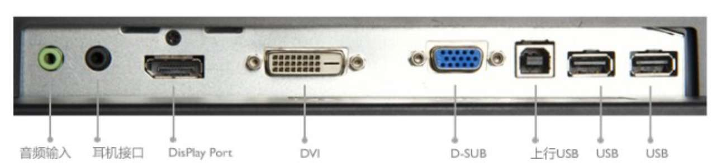

ΔE 能够将色彩还原的准确性量化为一个数值，它能够准确地反映显示器表现色彩的准确性，因此其数值越小越好，分数越高说明色彩越失真。不同显示器显示颜色都各有千秋，有一些可能偏暖，有一些则偏冷，只要在合理范围值内，都属于正常。而ΔE 小于 3，则说明显示器显示的色彩都比较准确。一般来说，ΔE 小于 3 指的是显示器显示的所有颜色都是小于 3，部分黑心厂商可能仅仅以某一颜色的ΔE 小于 3 作为卖点，宣传时避重就轻

ΔE 值在 1.6—3.2 之间，人眼基本上是分辨不出色彩的差异，这里被少数专业级显示器品牌长期占据，如艺卓、NEC、三菱。  
ΔE 值在 3.2—6.5 之间，经过专业训练的人士可以辨別其不同，但普通人是观察不到其中的差异的，通常专业级液晶都能够达到这个标准，而少数优秀的消费级液晶也能进入这个区间。  
ΔE 值大于 6.5，我们正常人眼下就可以非常明显的看出其显示色彩的差异。  
一般情况，我们日常使用的显示ΔE 值都是在 6 左右，ΔE 小于 3 的显示器都要经过校对并选择质量靠谱的材料，因此ΔE 小于 3 的显示器比普通显示器贵，也是有它的道理。除非你是设计师或者出版社的，否则ΔE 小于 3 的显示器没多大用。

不少以 100% 色域覆盖为卖点的台式机显示器，说的是 100%sRGB,也就是 72%NTSC

笔吧评测室说 45%ntsc 的屏幕是垃圾屏幕，72%ntsc 以上才是好屏幕，72%NTSC近似等价于100%sRGB

一、面板（这部分的内容久未更新 可能过时）  
IPS 面板：IPS 面板的优势是可视角度大、响应速度一般比 VA 面板快，色彩还原准确，而且用手轻轻划一下不容易出现水纹样变形，有硬屏之称，是液晶面板里的高端产品。目前市面上常见的 IPS 主要由 LG 生产，在高端产品上，有 H-IPS 面板，H-IPS 主要针对原本 S-IPS 的视角，对比度和大角度下发紫等问题进行了修正，同时大幅度提高响应时间，减小色彩漂移，提升色彩还原度，但是相应的价格也不便宜；中端产品有 S-IPS，这是 LG 把日本的初版 IPS 技术进行改良，提升了响应时间，牺牲了画面得来的；低端产品中也有 E-IPS，这是掉节操的后果，大幅度牺牲画面，精简了广色域、内部控制电路等，换来低成本 + 高产量，这也是目前市场上采用 IPS 面板的显示器价格从几百元至上千元不等的原因之一。另外还有 P-IPS（通过改良 H-IPS 的技术加强色彩方面的表现）、AH-IPS（AH-IPS 是小升级款，LG Display 推出的高分辨率硬屏），目前来看总体显示效果上是 P-IPS ≥H-IPS＞S-IPS＞AH-IPS＞E-IPS。  

1、定位于经济型的 E-IPS 和 e-IPS。

e-IPS：economic IPS，定位于经济型的 ips 面板，用于和 tn 面板争夺市场，原生 6bit，或者通过 6bit+FRC 抖动到 16.2 万色。较为低端的产品。

E-IPS，Enhanced-IPS，虽然挂着 Enhanced 名头，抱有广视角优势，在色域、对比度上比 TN 稍微提升但并没有什么本质的优势。千元显示器首选面板之一。

相同定位的改款有 S-IPS II 和 UH-IPS，基本都是 S-IPS 和 H-IPS 的缩水版。

2、定位于中端的 AH-IPS 和 S-IPS

S-IPS：全称 Super IPS，是 IPS 面板的第一个主要的进化，解决了 IPS 在原先的一些问题，  
降低了生产成本同时也提供了相较传统 IPS 更好的响应时间。后期有 AS-IPS 的改款，也是进一步加强了响应时间。

AH-IPS：Advanced High Performance IPS，是由 LG Display 2011 年推出的高分辨率硬屏。其设计目的是为智能手机、平板电脑、显示器、电视机提供最真实的颜色还原能力和更高的分辨率。高分辨率、精准的色彩还原能力、高透光性和低功耗是 AH-IPS 面板的特点。AH-IPS 的使用率超广，从 6bit 到 8bit，8bit FRC 的色深面板都有，逐渐成为目前主流之一。

3、定位于高端的 H-IPS 和 P-IPS。

H-IPS：Horizontal IPS，一个相对较新的 IPS 面板进化，H-IPS 最大的不同在于他的像素排列和以往的 IPS 面板不相同每个像素都呈笔直排列像素之间连成一条从上到下的直线，同时每个像素之间都拥有较以往更小的电极宽度。原生 8bit，通过 HI-FRC 可以实现 10.7 亿色彩，H-IPS 也是当前最主要的 IPS 面板类型之一。

P-IPS：IPS 由 NEC 在 2010 年年初推出现今 IPS 家族的最高端面板。NEC 称 P-IPS 可以实现和高端 OLED 相当的原生 10bit 色彩，是 H-IPS 的进化。

虽然排序如此，但是具体型号面板也会有 A+，A，A-，B 等级别，生产批次也会有差别，所以仅供大致做参考用。

TN 面板：优点是成本低廉，技术成熟，响应时间容易提高，但是缺陷也很明显，一般的 TN 色彩单薄，可视视角也很窄，对比度也低，而且属于软屏，不过价格便宜，适合囊中羞涩的朋友。tn 屏 可视角度小，体现在换个角度例如站在屏幕的左边看屏幕很可能出现色彩和亮度的不正常，按压屏幕会出现水波纹而 ips 不会

VA 类面板又可分为由富士通主导的 MVA 面板和由三星主导的 PVA 面板，两种面板也在不断的技术改造中适应了当前主流市场需求，与 IPS 面板形成两大主力

MVA 面板：由日本富士通公司开发，现在好像只有明基友达在做这个。MVA 面板是广视角面板，色彩、色域、可视角度还算不错，要比一般的 TN 屏幕好，介于 TN 和 IPS 之间偏向 IPS，而且可以控制较好的漏光，黑色显示的非常纯正，很讨好眼睛，不过响应时间稍差，不喜低端 IPS 的漏光的不妨一试 mva

PVA 面板：技术由三星研发，用透明的 ITO 电极代替 MVA 中的液晶层凸出物，获得更高的开口率，和背光源的利用率，换言之，便是可以获得优于 MVA 的亮度输出和对比度，可以说是 MVA 的改良品、继承者，相应的它也有 C-PVA（阉割版的 PVA，跟 IPS 的低端 E-IPS 一样，只有原生 6bit）、S-PVA（极宽的可视角度和越来越快的响应时间，透光率更高，色彩表现也更鲜艳，还有护眼程度比 IPS 和 MVA 要好些）。

PLS 面板：PLS 是三星搞出来的面板，被认为是跟 IPS 竞争的，其中 S-PLS 这样的高端面板能接近入门级专业显示器效果，这个面板的资料有点少，就某东在售 PLS 面板显示器的情况来看，价格也涵盖了几百到几千，ZDM 中数次推荐的飞利浦 272P4QPJKES 用的就是 PLS 面板。

由于 IPS 面板在市场的成功，三星在开发 PVA 面板的同时，将目光瞄准并成功在 2011 年研发出了与 IPS 结构类似的 PLS 面板。区别在于 IPS 采用共面横向电场加压，而三星利用共面横向纵向双面加压。

PLS 的设计旨在提供与 IPS 相同的广视角，并改进 PVA 一些缺陷如可视角度和亮度，大致推出了早期的 S-PLS 面板和后期的 AD-PLS 面板。其中 S-PLS 面板的直接竞争对手就是 E-IPS 面板，同样的经济型面板的定位，实际使用中也非常非常接近，下图所示三个面板之间的对比。

以上关于面板的资料部分来源于 [Panel Technologies - TFTCentral](https://tftcentral.co.uk/articles/panel_technologies)

四：响应时间

响应时间：响应时间通常以毫秒 ms 为单位，指的是液晶显示器对输入信号的反应速度，即液晶颗粒由暗转亮或由亮转暗的时间（其原理是在液晶分子内施加电压，使液晶分子扭转与回复），简单地说就是液晶变化的速度。分为“上升时间”和“下降时间”两部份，而通常谈到的响应时间是指两者之和。目前市场上的主流 LCD 响应时间都已经达到 8ms 以下，某些产品的响应时间甚至为 2ms，1ms 等等，数字越小代表速度越快。对于一般人来说，只要购买 8ms 以内的产品就已经可以满足日常应用的要求，对于游戏玩家而言，5ms 或更快的产品为较佳的选择。

由于液晶分子的转动，LCD 屏幕上每个点由前一种色彩过渡到后一种色彩的变化，这会有一个时间的过程，也就是我们通常所说的响应时间。

传统响应时间：“黑—白—黑”。

灰阶响应时间：“灰—灰”。也就是 GTG（Grey To Grey）。

这两个概念的转变是由于传统的响应时间是计算从屏幕全黑色到全白色再到全黑色，而实际操作中我们更多是的多彩画面的深浅变化，传统的 On/Off 用黑白转换时间来表示 LCD 响应时间，以偏概全，无法精确地表示 LCD 面板的整体响应时间，G2G 灰阶响应时间应运而生。

响应时间 30ms=1/0.030=每秒约显示 33 帧画面  
响应时间 25ms=1/0.025=每秒约显示 40 帧画面  
响应时间 16ms=1/0.016=每秒约显示 63 帧画面  
响应时间 12ms=1/0.012=每秒约显示 83 帧画面  
响应时间 8ms=1/0.008=每秒约显示 125 帧画面  
响应时间 4ms=1/0.004=每秒约显示 250 帧画面  
响应时间 3ms=1/0.003=每秒约显示 333 帧画面  
响应时间 2ms=1/0.002=每秒约显示 500 帧画面  
响应时间 1ms=1/0.001=每秒约显示 1000 帧画面

响应时间数值越小说明响应时间速度越快，对动态画面的延时影响也就越小。

灰阶响应时间（GTG）：灰阶响应时间可以通过特殊方法提高，因此与黑白响应时间之间并没有明确的对应关系，相当于一个全新的描述响应时间的参数，是指其他灰阶之间进行转换，灰阶比黑白快，而且灰阶实用意义更大，所以厂商都喜欢用灰阶来表示响应时间，但灰阶响应时间应该不是一个数字，而是各个灰阶之间相互转换的一组数字，但厂商往往会将这组数字中最好的一个挑出来作为宣传。  
厂商总喜欢吹嘘灰阶 1ms 很棒，其实 5ms 的响应时间已经很不错了。

灰阶看起来有点坑，但日常使用意义还是有点的，至少号称灰阶 1ms 的显示器比普通显示器反应速度确实更快些，也很适合游戏玩家。但我始终坚持，不应过分追求

4 毫秒的显示器每秒钟最高能支持 250 张画面，甚至还有 500、1000 张画面的，那么为什么有些人会觉得 2ms 的看电影也会有拖影呢？这里有几种原因，一种电影本身压缩后产生的拖影；一种是显示器拖影，这是液晶本身技术的原因，得靠科技进步才可能解决了。不过就现在来说，响应时间在 8ms 内的 LCD，已能满足大部分人的要求了。

五：显示器接口

现在的显示器通常都是这四种接口：VGA（D-Sub）、DVI、HDMI、DP（Display Port）。

VGA 接口：VGA 接口也被称为 D-Sub 接口，上面共有 15 针孔，分成三排，每排五个。VGA 接口是显卡上应用最为广泛的接口类型，多数的显卡都带有此种接口。从 CRT 时代一直被使用，几乎所有主板都支持 VGA 端口，VGA 线理论上支持 2048x1536，60Hz 的模式。由于 VGA 传输的是模拟视频信号，逐渐走向淘汰

DVI 接口：在 Intel 开发者论坛上成立的数字显示工作小组发明的一种高速传输数字信号的技术，有 DVI-A、DVI-D 和 DVI-I 三种不同的接口形式。目前 DVI-A 已经被淘汰，DVI-D 只有数字接口，DVI-I 有数字和模拟接口，另外 DVI 还分双通道和单通道，双通道的针脚更多，带宽更高，目前市面上能够看到的双通道居多。

HDMI 接口：是一种数字化视频/音频接口技术，是适合影像传输的专用型数字化接口，其可同时传送音频和影音信号，最高数据传输速度为 5Gbps。HDMI 接口可以说是高清时代必备的接口，同一条线还能传输音频。从 2003 年第一版到目前最新的 HDMI 2.0 可以支持 4K@60Hz，但是目前大部分市售显卡最高规格为 HDMI 1.4a/b，最高支持 4K@30Hz

DP 接口：DisplayPort 也是一种高清数字显示接口标准，可以连接电脑和显示器，也可以连接电脑和家庭影院。有高带宽、支持音频传输、支持 3D、无版权费等优点，大多用于高分屏上，现在也有很多显示器在采用了，另外还有 Mini Display Port，大家购买的时候要注意，以免线材不通用。

另外还有一个雷电接口，雷电接口是由 Intel 在 2011 年 2 月 24 日发布的一种整合型传输接口，定名为“Thunderbolt”（雷电）接口。已经运用在苹果的设备上，Thunderbolt 连接技术融合了 PCIExpress 数据传输技术和 DisplayPort 显示技术，可以同时对数据和视频信号进行传输，并且每条通道都提供双向 10Gbps 带宽。 Thunderbolt 接口物理外观和原有 Mini DisplayPort 接口相同，Mini DP 接口的显示器以及 Mini DP 至 HDMI/DVI/VGA 等接口的转接头都可在 Thunderbolt 接口上使用。日前已有雷电接口 2，除了苹果的 Mac Pro 有雷电接口 2，此外 Windows PC 平台上也有华擎 Z87 Extreme11/ac 主板可选，因此用户的选择并没有被局限在苹果设备上。接口排序：雷电接口> Display Port > HDMI > DVI > VGA，从接口看显示器，就可以看出一些端倪来，那种便宜又普通的货色基本上都是舍不得加一个高清接口的，当然这话也不是绝对的。选购显示器，DVI 就足够家庭使用了，当然有 HDMI 更好，至于 DP、雷电啥的有钱就上吧，貌似理论上 1080P 以下 DVI、VGA、HDMI 画质上都无太大差别，另外有多屏输出需要的朋友最好选有 HDMI 或者 DP 接口显示器，省的转换起来麻烦。

六：显示器背光、漏光

LCD 不会自主发光，所以都依靠背光源。说到背光就是 CCFL 背光 (冷阴极荧光灯) 与 LED 背光 (发光二极管) 了。从护眼角度来说，CCFL 比 LED 更好。尤其是现在最主流的 WLED，是 LED 背光中最伤眼的，不过 LED 具有低功耗、低发热量、亮度高、寿命长等特点。”。

LED 背光：LED 背光是指用 LED（发光二极管）来作为液晶显示屏的背光源，分为 W-LED（白光）、GB-LED 和 RGB-LED（三基色），目前在大多数显示器中常见的 LED 背光一般是 W-LED，便宜嘛，为啥不用。三种最大的区别就是表现出色域的不同，一般 W-LED，就算用 8BIT 的面板也只能做出标准色域 72%NTSC 的显示器，GB-LED8BIT 用原生 8BIT 面板加上抖动 (A-FRC)，可以达到 103%NTSC，而 RGB-LED 背光用上 8BIT 面板可以达到 130%NTSC，看起来很厉害了。但是他们的短波蓝光还是一样，所以就护眼来说没啥区别。感兴趣的可以看看这篇 LED 光源演变 [The Evolution of LED Backlights | PCMonitors.info](https://pcmonitors.info/articles/the-evolution-of-led-backlights/)

1.W-LED

虽然是 White-LED 的缩写，实际上 W-LED 发出的并不是标准的 D65 白光，而是色温偏高的蓝色光。这会造成使用 W-LED 的显示器色域很难做到很广，并且使用者观看起来会觉得很累。此种背光 LED 制作成本低廉，但技术成熟是目前绝大部分液晶显示器的调光方式。短波蓝光尖刺较为突出，色彩损失严重。

2.GB-LED(GB-r-LED)

改善了 G 和 R 的辐射强度，使其与 B 匹配，色彩还原度比 w-led 更好，色域更广，但依然没有解决短波蓝光的问题。

3.RGB-LED

此种背光源比较少见，RGB LED 使用三基色调和产生白色背光，色彩纯度极高，并且可以独立调整不同颜色 LED 实现色温的迅速变化，不必损失动态。缺点就是电压、电流变化导致的产生的色彩偏移，还需要考虑到 RBG LED 子 led 完全失效或部分失效后的影响等等问题，相比 WLED，其制作成本高而且制作工艺复杂。最典型的如 LG 的 w2420r，虽然色域色彩空间能达到较高的水平但是由于不专业的色彩管理导致色彩偏移的问题，LG 这款型号并不受到追捧。

CCFL 背光：CCFL 对眼睛的刺激较少（短波蓝光远小于 LED 背光），这种背光虽然现在已经由于寿命短、在大尺寸显示器上耗电高、以及在大尺寸上亮度均匀控制成本高等诸多缺点，但由于可达到当时 LED 无法达到的色彩表现，因而在 LED 背光已经普及相当长的时间里，部分专业显示器依然使用 CCFL 背光。

漏光：漏光就是屏幕液晶跟框架吻合不紧密导致灯管光直接透射出来，液晶显示器漏光是常见问题，从某种意义上来说，液晶显示器基本上无法避免漏光的发生，只不过程度的问题。低档显示器可能会比较明显，高档的就经过了严格的工艺挑选，那样很少有明显的漏光。漏光只要不是很严重，都是不影响正常使用的，可以不用过分在意，不过受不了点点漏光的人最好不要选择低端 IPS，可以选择高端 ips 或者 mva 的。

  
七：显示器调光

我们知道显示器是可以调节亮度的，那么这种变化是如何实现的呢？原理是这样的，显示器需要调节 LED 发光的亮度，通过电流来调节亮度太过复杂，为了节约成本，对于屏幕亮度的调节，行业里会采用闪烁的方式来解决。LED 光源的亮度是一定的，让 LED 光源不断的开启和关闭，通过调节开启时间和关闭时间的长短，来调节屏幕的亮度

不闪屏骗人吗? 戳穿护眼液晶的几条谎言

在实际的产品中，LED 背光这种明暗时间的转变速度非常的快，采用 PWM 调光的普通大众显示器其工作频率一般在 200Hz-1000Hz 左右，而人眼在频率达到 100Hz 的时候就已经难以察觉明显的明暗变化了，因为人眼感知亮度的过程是积累的，在闪烁的速度足够快的时候，人眼看到的画面是“常亮”的

同是在 PWM 调制下，LED 显示器在低亮度时闪烁的状况就明显多了，此时 LED 光源关闭的时间比开启的时间长，人眼对于“黑暗”的感知就明显了起来

调光方式分为 PWM（脉冲宽度调制）调光和非 PWM 调光。也有厂家使用非 PWM 和高频 PWM 的混合调光方式（混合调光指低亮度下使用非 PWM 调光，高亮度下使用 PWM 调光），例如 Dell2413 和 2713H，当亮度在 20% 以上时，采用的是非 PWM 调光，20% 以下时，使用的是高频 PWM 调光。

以下测试方法不太科学，仅供参考，要准确测试还是用仪器

可以做一个实验，先把你的显示器的亮度调至 0，然后在屏幕前晃动手指（越快越好），你可以看见明显的残影，当你调高亮度时，残影会逐渐减少，当你把亮度调至 90%-100% 时，此时晃动的手指是一个明显的连续扇形。这种方法也可测试显示器是否为低频 PWM 调光。

推荐用纯白色作为显示器背景色。

1.笔或者手指

用手指或者笔在屏幕前呈扇形晃动，观察屏幕是否有明显的拖影状态。

左边的屏幕呈规则的扇形，而右边闪屏明显有拖影状况。

2.小风扇

左边的屏幕是正常风扇转动的情形，二右边的闪屏则出现了莲花状态的重影。

调光：分为低频 PWM，高频 PWM，DC 调光，PWM+DC 调光这几种。

明基的用户手册中写到“不闪烁的性能可能受到外部因素的影响，包括（但不仅限于）较差的线缆质量、不稳定的电源、信号干扰或接地较差等。（仅适用于不闪烁的型号。）”

PWM 调光的基本原理楼上已经讲得差不多了，其本质就是周期性地开启和关闭 LED 来改变正向电流的导通时间，因为人眼感知的亮度是一个累积过程，即亮的时间在整个周期中所占得比例越大，人眼感觉越亮。如果亮暗的频率超过 100Hz，那么人眼看到的就是平均亮度， 而不是 LED 在闪烁。广泛采用 PWM 调光的原因就是因为这种方法易于实现，可降低生产成本。

采用 PWM 调光的普通大众显示器其工作频率一般在 200Hz-1000Hz 左右，由于 PWM 发光的本质是“亮 - 灭 - 亮 - 灭”的过程，其实就是可见光在对眼睛进行一个有频率的闪烁冲击，从楼上的图可以知道，PWM 频率越高，人眼对冲击的感知越弱；而亮度越高，也可以减少对这种闪烁式冲击的感知。这就是为什么，有些人在使用 PWM 调光的显示器时，会感觉到眼部疲劳，主要是因为这种冲击的频率接近于人的视觉神经系统可以感知闪烁的频率上限。由于个体差异的存在，有些人对这种低频闪烁的感受并不明显，而有些人则很敏感  

CCFL 背光就是阴极荧光灯背光方式，构造类似于日光灯，说白了就是一块紧贴在显示面板后面的灯管发出光线，经过两块偏光滤器（偏光滤器夹在中间的就是玻璃板和液晶）以及一块滤色器后，产生显示效果。LED 背光就是以发光二极管作为背光光源，与 CCFL 的区别在于产生光线的方式和改变光线亮度的方式不同。

有人可能会问为啥在 CCFL 的时候很多显示器也是用的 PWM 调光，为啥没人说低亮度频闪呢，这是因为 CCFL 有余晖效应（又称视觉暂留现象，人眼在观察景物时，光信号传入大脑神经，需经过一段短暂的时间，光的作用结束后，视觉形象并不立即消失，这种残留的视觉称“后像”，视觉的这一现象则被称为“视觉暂留”），CCFL 是电子打在荧光粉上形成光斑有延迟作用，所以视觉上会有停留。同时，CCFL 的低频蓝光成分也要低得多，主要是绿光

为什么现在很少生产 CCFL 背光的显示器了呢？一是因为 CCFL 灯管不是很环保，二是因为 CCFL 的功耗较高（因为能耗等级的要求，这个是国内不能销售 CCFL 背光显示器的主要原因）。另外，CCFL 背光的显示器在色域覆盖和白色显示上都存在一定的问题

DC 调光 (直流调光）：DC 调光成本高，不过在中高亮度的时候效果要比 PWM 好，而且在低亮度的时候可以做到不频闪，但是不乏有一些低成本的垃圾 DC 调光，低亮度情况下可能还不如 PWM。另外，DC 调光在低亮度情况下色彩有 d 损失，DC 调光也只能保证在 60nit 以上才保证色彩不会损失严重，低于这个亮度色彩有失真的情况。

从 PWM 调制入手也有两种办法，都可以达到让屏幕不闪的效果。一种就是彻底不用这种调节的方式，使用线性调光的方式来调制 LED。其实这种方式就是通过改变 LED 电流大小的方式来改变亮度，但是 LED 这种发光材料，在电流大小不同的时候，发出的光线色温会有差异（LED 背光亮度过高时还容易烧坏），因此线性调光存在一定的弊端。改良这种效果的办法就是让屏幕的亮度可调节性变小，这样就可以让屏幕的色温不会有明显的变化。  

上述的办法也叫直流调光，彻底的摒除了闪屏的现象。还有一种办法就是采用高频 PWM 的调制方式，上面我们提到普通的显示器 PWM 工作频率基本保值在 200Hz 到 400Hz。有的不闪屏显示器采用高达 8000Hz 的工作频率，这样人眼其实也是无法感受闪烁的。不过这种做法目前有很大的争议，因为高频闪烁还是闪烁，高频是否真的能让人眼肌肉更舒适，目前并没有定论，只不过这种方式不用担心色温的问题

还有的不闪屏显示器采用混合的方式，在亮度低的时候采用非 PWM 调制，亮度高的时候则采用高频 PWM。目前的显示器市场对于这类参数的公布，还没有统一的规定。市场的护眼显示器也只是单纯的打出口号，对于自己如何实现不闪屏基本都是三缄其口，很少厂商公布自己的产品到底是采用的非 PWM 调制或者高频 PWM  
一般认为 DC>高频 PWM>低频 PWM

现在国家规定强制禁止 CCFL 背光的显示器在国内上市,因为能耗问题（国标限制），ccfl 背光的显示器已经陆续退市了，。要买只能海淘或者代购人肉，淘宝二手，ccfl 一般两三年后就老化发黄

[PWM调光的LED背光液晶显示器，对视力是否有损害？ - 知乎](https://www.zhihu.com/question/20775063/answer/18367060)

八：亮度

对比度是屏幕上同一点最亮时（白色）与最暗时（黑色）的亮度的比值，高的对比度意味着相对较高的亮度和呈现颜色的艳丽程度，所以参数是越高越好，不过你可能经常性的会看到动态对比度这个概念，所谓动态对比度，指的是液晶显示器在某些特定情况下测得的对比度数值，例如逐一测试屏幕的每一个区域，将对比度最大的区域的对比度值，作为该产品的对比度参数。不同厂商对于动态对比度的测量方法可能也不尽相同，但其本质也万变不离其宗。动态对比度与真正的对比度是两个不同的概念，一般同一台液晶显示器的动态对比度是实际对比度的 3-5 倍，去看这个参数还不如看看其他方面更为实在。

对比度一般厂商有三种表示方法，最小对比度，典型对比度，和最大对比度。三者之间可以通俗的理解为，最小值，众数和最大值，而在商品介绍页面给出的对比度一般是典型值

Contrast，对比比率是屏幕上同一点最亮时（白色）与最暗时（黑色）的亮度的比值，高的对比度意味着相对较高的亮度和呈现颜色的艳丽程度。比如显示器标称亮度为 250cd/m2，LCD 面板背光机制不可能做到 OLED 的完全不发光，黑色背景最低亮度为 0.5cd/m2，那么他的静态对比度就为 500:1。

还有一种就是厂商宣传的诸如 200 万：1 的动态对比度，动态对比度指的是液晶显示器在某些特定情况下测得的对比度数值，例如逐一测试屏幕的每一个区域，将其中几块区域的对比度值（有可能是最大值），作为该产品的对比度典型值

亮度是指画面的明亮程度，单位是 nit（尼特）、堪德拉每平米 (cd/m2)，1nit=1cd/m2。需要注意的是，较亮的产品不见得就是较好的产品，显示器画面过亮常常会令人感觉不适，一方面容易引起视觉疲劳，同时也使纯黑与纯白的对比降低，影响色阶和灰阶的表现，所以对显示器的亮度没必要追求过高。

显示器画面过亮常常会令人感觉不适，一方面容易引起视觉疲劳，同时也使纯黑与纯白的对比降低，影响色阶和灰阶的表现。同时，亮度过低也会带来屏幕调光问题，造成屏幕闪烁，伤眼。所以，好的显示器会做到亮度均匀。

九：头戴式 3D 显示器、3D 显示器

头戴式 3D 显示器：ZMD 中推荐过的当数索尼的 HMZ 系列头戴式显示器了，现在已经是 HMZ-T3 了，奇葩物，效果看买过的人评论说还是很不错的，但是玩不了多久就昏天黑地了，买来尝尝鲜可以，实用性不是非常高。

3D 显示器：有快门式 3D 技术和不闪式 3D 技术，不闪式是偏光式的一种，偏光式 3D 技术也叫偏振式 3D 技术，优点是没有闪烁，可视角度广，缺点是 3D 效果一般，因为不闪式显示原理的原因在 3D 模式下，分辨率会有很大损失，大概一半左右。快门式的 3D 效果很好，不过画面会有闪烁（相比不闪式而言），而且亮度在 3D 模式下会有损失。3D 显示器现在一般也就用来看看电影、打打游戏，不过现在 3D 片源是个问题，另外打游戏的话对显卡负担也是加重了的，这个感觉跟头戴式 3D 显示器是一个样，如果不是有这方面的需求，或者想尝鲜的可以考虑，当然如果价廉物美的话也是可以的。

坏点：坏点大概可以分为两类，其中暗坏点是无论屏幕显示内容如何变化也无法显示内容的 " 黑点 "，而最令人讨厌的则是那种只要开机后就一直存在的亮点。这也可以用来衡量一块面板的质量，一般液晶屏幕不超 3 个坏点属合格情况。

曲率，曲率就是距离显示器最佳观赏距离，例如 3000R、1800R。 将曲率除以 1000，所得的数值就是最佳观赏距离，例如 1800R，除以 1000 就是 1.8，那最佳观赏距离就是 1.8m，而 3000R 最佳观赏距离是 3m。桌面上的曲面显示器最佳曲率是 1800R，如果大于该数值，日常使用可能难以获得最佳视觉体验

戴尔：显示器就是 DELL 的冰山一角罢了，都没感觉到过它有多重视显示器这一块。它的显示器外形设计一般偏稳重，没啥科技时尚感，额，p 系列、u 系列的造型还是说的过去的。戴尔的 u 系列对有一定色彩要求或者是摄影、设计的人而言是一个不错的选择，而且售后也不错，

三星：三星是什么都可以做，而且基本上都可以做到不错的地步，像它以前出的 S27B750V、S24B750V，看起来很有设计感，而且三星掌握着多种液晶面板技术，它的高端显示器一般都是用的自家的 pls 面板，综合实力还是很强大的，不过它的显示器低端出了不少坑爹货，参数不好不说，卖的比其他品牌的还要贵，像 18.5 寸的三星 S19C150F、S19B150N，TN 面板 +0.3mm 点距 +1366 x 768+5ms 响应时间，600 多整个 1440*900 的 19 的不好么？

LG：说到三星，我就会想到 LG。LG 与三星一样，是一个韩国品牌，是全球第二大电视企业，其旗下的 LG Display 则是全球第一大液晶面板制造商。LG 实力也是有的，要设计？那也是有的，像它 13 年出的一款 LG 29EA93-P 就曾获得 IF 大奖，不过那蛋疼的一年质保让人不得不吐槽两句，而且部分显示器售价明显偏高嘛。

AOC: 这个牌子在我还没接触 IT 的时候就多少有点了解，现在也算是显示器市场上销量数一数二的品牌了。现在说起它，我想大部分人会把它与性价比这个词联系起来，当然 AOC 也是有渣渣显示器的，在显示器品质上，近几年 AOC 显示器的用料做工都在稳步提高，不像以前性价比是有但做工渣；在外观设计上，AOC 也在努力的提升，其中的刀锋系列就非常不错。

飞利浦：讲了 AOC 就把飞利浦一并讲了得了，飞利浦在 2004 年被冠捷收购了自己的显示器业务，不过即使在被收购了之后，飞利浦的品质还是没有下降，而且现在也是三年质保了，价格也较为低廉，部分型号值得推荐。

华硕：在显示器方面作为不是很大，华硕的部分显示器外观设计都达到了一定的水准，养眼么，至少看上去能给我新意，不过性能么，只能算是中规中矩，谈不上一流，就算是这样，显示器也不怎么便宜，如最近新出的华硕 PA249Q ，将近 4700 块大洋。

优派：ViewSonic(优派) 是全球视讯的领导厂商，于 1987 年在美国加州南部创立。是一个做品牌营销的，没有自己的工厂，产品全部靠 OEM，虽然说是怎么说，但这并不意味这优派的显示器就差，就目前来看，优派还是占有显示器市场一定的份额，在专业显示器领域，也有着很凸出的表现。

明基 ：明基电通成立于 1984 年，于 2001 年推出自创品牌 BenQ，目前 BenQ 已在内地树立强大的品牌影响力，除了生产自己品牌的 BenQ 外，还为其它品牌做 OEM。

宏碁：多数产品都是找别人 OEM 的，而且 OEM 的来路很复杂，哪里的都有，好像主要是主要是 AOC 代工的，也往往定位在中端的家用机型。

EIZO：EIZO 是专注于显示器的厂家，世界领先的高端显示设备制造商，产品大多在日本本土生产。在专业显示器制造界，EIZO 的名字可谓无人不知。

对于专业作图而言，目前市面上的一般显示器，显然是无法满足需求的。只有一些更高端的，准专业甚至是专业显示器，才能够最真实的还原色彩，让最终的图片效果不至于出现偏差。专业级液晶显示器，相对于民用级液晶显示器，给人最大的感觉就是贵！当然，专业级显示器通常具备精准的色彩还原和打印输出能力，这是做设计行业的朋友最看重的，不然你辛辛苦苦做出一个成品来，就因为液晶显示器的色彩问题造成理论实际不一致而挨批，那种摔显示器的冲动都有了

　目前我们常见的液晶屏幕，本身是不会发光的。之所以我们可以看到图像的形成，还是因为液晶面板背后使用了背光系统。这种液晶面板，我们把它叫做透射式液晶面板。因为光是从液晶面板中透过的，经过液晶分子的偏转，形成了最终的图像

反射式液晶面板则是去除了背光的部分，在液晶面板的后面设置一层反光材料。这样在光线充足的时候，它利用经过镜面反射的光线照亮屏幕。可是它到了光线较暗的地方就无法工作了，因为微弱的环境光不足以被反射来照亮屏幕，因此这种反射式液晶面板的优势和劣势都非常明显。优势是反射光护眼节能，劣势则是显示效果不稳定  

早在 iPad 之前，富士通 2001 年的 t1 平板上就开始使用 8 寸全反射液晶屏，2003 年富士通 st4121 上开始使用的 10.4 寸全反射液晶屏。自 2004 年开始到 2009 年止，富士通共发展五代全反射屏幕笔记本。不过这些产品的销量都不高，市场反馈并不好。因此反射式液晶屏由夏普生产到 2008 年底后全部停产  

可在淘宝搜索 " 富士通反射屏显示器 "  
反射式液晶屏幕为何可以护眼呢?这是因为其采用反射光的原因。经过反射后的光过滤掉了大量的高能量穿透性强的光谱，因为能量高穿透性强的光基本上不反射,所以经过反射后的光对眼睛都是无害的。我们的日常看到的真实景物，很多是反射光而在我们的眼睛中成像的，所以反射光的危害很小 透射式液晶屏幕则是不同，其背光的光线透过屏幕在视网膜上成像。光线没有经过反射，因此其中的高能量光线就直接伤害到了眼睛。尤其是目前液晶屏幕使用的 LED 背光

反射式液晶屏幕则是天然的避免了这个劣势。其原理和投影机类似，光线并没有直接进入人眼，和投影画面一样，人眼可以看到的图像的原理是反射，这也是最常见的成像方式。当然如果屏幕可以自发光，比如 OLED 屏幕，其也是可以避免使用 LED 背光的，不过目前来看 OLED 面板的发展还有很多技术阻碍。

所谓带鱼屏，就是 21:9 的显示器。这种显示器尺寸的好处有什么？更宽的显示，更多的显示内容（玩游戏时有些用处），也有用户反映，使用 21:9 显示器要经常左右摇头——因为屏幕有点大。也有用户反映，21:9 显示器分辨率不是所有游戏都支持，部分游戏只能降低分辨率使用 , 带鱼屏的宽度可以用双屏替代

校色  
除了不同品牌型号显示器组多屏还有摄影发烧友，其余的情况校色意义不大。  
我以前也是校色的，还专门买了一个绿蜘蛛，但是坚持了大半年，我就放弃了。原因也简单：家庭环境下校色意义不大。为什么这样说

首先，校色是一件很麻烦的事情，他需要把你认为需要显示标准颜色的设备都校一边，而且这还不是一次性的活，每隔一段时间就要这样来一遍，太麻烦。（具体周期看情况，根据使用时间计算）

其次，也是最重要的一点，校色有什么实际意义？有朋友说为了准确的色彩，但准确的色彩和看的舒服完全是两码事。这点三星等一众手机厂家就是代表，有兴趣的朋友可以查一下手机屏幕偏色的情况。专业环境下，考虑到色彩打印效果和其他屏幕显示效果，通过校色保持色彩的一致性很有必要，但家庭环境中一般就一个显示器，不管是修图还是后期浏览，所见即所得，没有这方面的需求。至于说图片颜色准确便于分享的，说这个之前请把对方的显示器也校色一下再说。

最后，让我放弃校色的最后一点就是，目前哪怕是入门级的专业显示器，色差都不算大，如果不是吹毛求疵的专业需求，对于容错率比较高的家用环境来说，出厂校色的水平已经完全够用了。

但如果真的因为玩摄影之类的需求有校色需求，请务必购买一个和显示器等级对应的校色仪（淘宝上可租用），绿蜘蛛和爱色丽差距还是挺大的。绿蜘蛛可以尝试第三方软件比如 dispcalGUI，HCFR Colormeter 之类的增强功能。

屏幕泛白，校色后能稍微保护眼睛

其实现在的人每个人每天都要面对很多台不同的显示器，家里的 PC，办公室的 PC，手机，平板，投影仪，这些都是不同的显示器。校色的一个用途就是让同一张图片在这一堆显示器上显示出来尽可能的表现一致（还有保证屏幕的色彩和打印出来的色彩一致）。同时，每一台显示器在出厂的时候绝大多数不在最佳状态，总有点偏色（即使按照原厂设定的色温也是有偏色的），经过校色之后可以让每一个色阶上的颜色都能更正常，还有可能更多的还原输入源的细节，也算是挖掘了显示器的潜能。这是校色的第二个用途。而我个人认为的第三个用途，就是把那些色温不是 6500K 的家伙们就算是损失一些图像细节也要调整到 6500K，例如 LED 背光的液晶电视（那个色温高的哟，直逼 10000K，蓝挖挖的一片，神仙也受不了啊）。  
面对大部分显示器，基本上有三个主要的原因：

1、不同厂家的调校技术水平不同，不同的工作流程对于显示色彩的要求也是不同的，所以出厂默认的通用设置难以满足专业化的要求。

2、显示器经过一定的时间使用后会发生色彩偏移和自身性能下降的缺陷，造成显示的色彩和亮度也会发生变化。

3、系统显示的最终色彩，不仅因显示器而异，还会受到显示卡、电脑硬件、操作系统，甚至应用软件的影响。其中任何一个因素的变化都会导致显示色彩的变化

第三方的显示器支架一般要求显示器有 VESA 标准壁挂接口

屏库网有很多显示器，可根据参数筛选

请勿将显示器面朝下直接放置在地板或桌面上。否则面板可能会被刮花。

当屏幕上灰尘较多时，用干的清洁布将灰尘弹去，因为直接擦容易被小颗粒刮伤屏幕，不要刮污垢，让清洁剂慢慢溶解它。如果你不想使用清洁剂和清洗布，那么你可以考虑购买一次性的专用清洁屏幕的清洁湿巾。  
首先，断开显示器与电源、电脑以及所有外部设备的连接。避免开口处受潮。不要使用窗户清洁剂、酒精、家用清洁剂、氨水、研磨剂或含有过氧化氢或含有丙酮的清洁剂的清洁剂来清洁显示器，要清洁难以清除的污迹，你可以用 70% 的异丙醇 (IPA) 溶液打湿擦拭布。  
许多消费者购买笔记本电脑后，都面临着清洁问题。联想拯救者近日通过微博推送消息称，笔记本电脑的屏幕不能使用酒精进行清洁。官方表示，为了更好的显示效果，所有电脑屏幕上都有一层特殊的涂层，用酒精直接擦拭会导致涂层被溶解破坏。

有些显示器有上行 usb 接口，一般会附带 usb 上行电缆，用那根电缆连接电脑和显示器之后，显示器上的 usb 接口就能用了

有些显示器有 dp 输出和输入接口，输出接口用于菊链式连接，我的就是显卡连接到 u2715h 的 dp 输入然后 2715 的 dp 输出连接到 u3415h 的输入，效果等同于两台显示器都连接到显卡上。不用软件设置。
