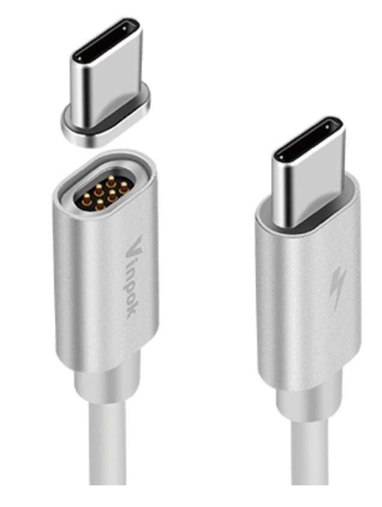
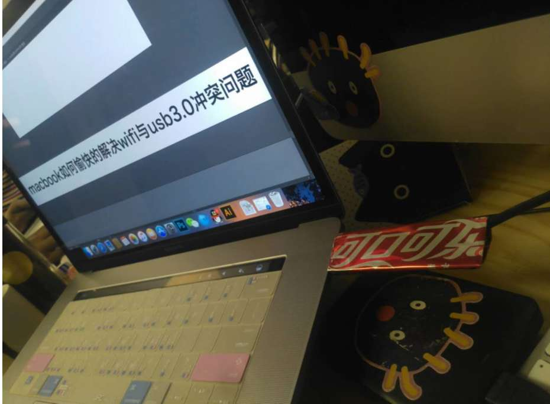
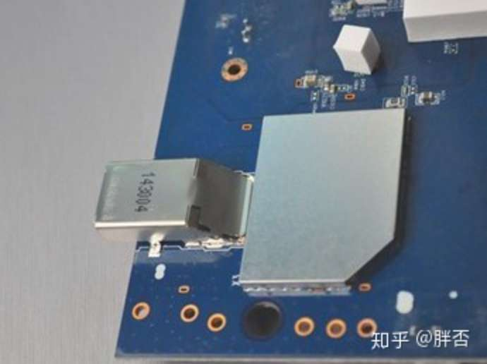

游戏本中联想拯救者配置很高而且性价比很高，游戏本很少带指纹识别或人脸识别的，游戏本一般 2kg 以上，一般带独显，轻薄本 14 寸一般 1.4 kg ，16 寸 一般 1.8kg，大多不带独显，rog 微星 神舟 雷蛇 未来人类 技嘉 雷神 基本全是游戏本，轻薄本极少且做得很垃圾，lg gram 主打的是超轻和续航（同样尺寸和配置比其他的轻薄本轻 300-500g 但比较贵，还有 17 寸大屏的版本，lg gram 的电池大且轻，有网友说电池来自于同集团的 lg 化学），机械革命的多数轻薄本都是可以扩展内存（有内存插槽）和 2 个硬盘位  

可以搜索例如“ 2021 年 618 轻薄本购买指南” "2021 双 11 笔记本选购指南 "，可能有人整理下目前的产品  
买笔记本前可以看下笔吧评测室公众号和 b 站，中正评测等，可去贴吧、官方论坛或搜索看下笔记本有什么小问题例如之前战 x 的 ssd 频繁断电，可以去知乎的付费咨询说明你的需求和预算让别人推荐笔记本

[【2021 笔记本电脑品牌排行榜】笔记本电脑哪个牌子好笔记本电脑品牌排名-ZOL排行榜](https://top.zol.com.cn/compositor/16/manuattention.html)，排名看看就行，主要是知道有哪些品牌的笔记本

联想香港有教育优惠（学生教师），售后的话可能要去香港那边 ，微软苹果有教育优惠  
联想也有官翻机  
[戴尔翻新机官网销售官方翻新的笔记本电脑、台式计算机和显示器](https://www.dell.com/zh-cn/outlet)  
苹果的 mac 、iPad、wathc、配件也有官翻机，[认证的翻新产品 - Apple (中国大陆)](https://www.apple.com.cn/shop/refurbished)  
笔吧评测室的淘宝店有二手的笔记本卖

联想美国的电脑一般比国内便宜不少，而且有些选配国内不提供，[为什么联想会被称为「美帝良心」企业？有依据吗，实际情况到底如何？ - 知乎](https://www.zhihu.com/question/276708894)

总结一下挑选笔记本的步骤：  
第一步 是想清楚自己对于便携轻薄和强大性能之间的取舍。  
第二步 是通过厂商页面描述，重点关注 CPU、GPU 以及内存、硬盘等参数，对参照天梯表进行性能方面理论上的推测。  
第三步 则是通过第三方独立评测机构来了解产品的散热等情况，看会不会有温度过高而降频减损性能的情况发生。

根据某些参数筛选出一些笔记本（数据库的更新不一定很及时）：  
[【笔记本电脑】笔记本电脑报价及图片大全-ZOL中关村在线](https://detail.zol.com.cn/notebookindex/subcate16list1.html)，点击“高级搜索”有更多选项，点击某个笔记本图片下面的“对比”可比较不同笔记本之间的参数的区别  
[笔记本电脑2023热门笔记本电脑价格|品牌大全-太平洋产品报价](https://product.pconline.com.cn/notebook/)  
[最大支持64GB笔记本电脑价格最大支持64GB笔记本推荐【哪个好】-太平洋产品报价](https://product.pconline.com.cn/so/s68043/)

金属 cnc 与 金属冲压的对比看 [2021 年 6 月 30 日发布的小米笔记本 Pro X15，售价 7999 元起，值得购买吗？ - 知乎](https://www.zhihu.com/question/469004337/answer/1971048341) 的”成也 CNC，尴也 CNC“ 那一节，cnc 即，一体成型机身工艺，把铝合金挤压成板材，然后通过数控机床琢磨成型。

xps 13 9310 4k 触控板 虽然淘宝商品介绍里没写亮度自动调节，但我看一些评测，win 系统设置里有” 当光线变化时自动调节亮度“ 这个选项，说明实际上是支持的

小米笔记本 pro 14 2021 屏幕亮度自动调节时亮度条会动，好像也有记忆亮度功能，像 MacBook 那样，之前京东买了台 14 寸的 战 x 锐龙 2021 屏幕偏黄，未连接网络使用测试，打开和关闭房间天花板上的灯，屏幕不会自动调节亮度，只有当你拿着手机闪光灯贴近屏幕的光传感器时屏幕才会自动调节亮度且没有记忆亮度功能，而且自动调节亮度时亮度条不会动，因为这个原因我退货了，不知道战 x 锐龙本身的亮度调节机制就是这样，还是说我那台笔记本有问题，因为连接网络就会激活 windows 就不能退货，所以没有连接网络更新 bios 和驱动

2021-08-30 ，支持屏幕亮度自动调节的笔记本很少，一般轻薄本才有，支持的笔记本有小米 pro14，战 x，小新 pro14，yoga14s，MacBook 在 2012 年就有屏幕亮度自动调节，屏幕亮度自动调节需要算法支持，一般笔记本厂商懒得搞，可能是因为搞得不好影响用户体验  
为什么很多笔记本或显示器不做亮度自动调节，个人感觉是因为软件算法的原因，屏幕装个传感器很简单，但难在软件算法，各品牌的软件算法一般不公开，苹果手机的软件算法挺好的，移植到 MacBook 上也挺简单，但其他笔记本或显示器厂商没必要花这么大成本研究软件算法

有网友说（待验证）新机器即使联网激活了，恢复出厂设置后会变得像首次开机那样需要设置一大圈东西，再次联网也会自动激活，所以恢复出厂设置后一样可以无理由退货，因为 win 激活信息绑定在机器上，退货后其他人也一样可以激活 win，而 office 激活信息绑定在微软账号上，一旦你激活了 office ，就不能退了因为其他人不能再激活 office，

[“这台笔记本才16G内存，够用吗？”哔哩哔哩bilibili](https://www.bilibili.com/video/BV1Cd4y1s73m/?spm_id_from=333.1007.top_right_bar_window_history.content.click&vd_source=568600721e4a7665b71d32bda0302591)

轻薄本有 32g 内存或可扩展内存的很少，战 x，战 66，机械革命，thinkbook，y9000x/r9000x，xps，游戏本或工作站一般有 32g 以上或扩展内存

MacBook 只有在苹果官网才能买到 32 或 64g 的版本，京东淘宝等只能买到 16g ，例如你买战 x，惠普英文官网能自由定制配置，例如屏幕内存硬盘、有没有指纹识别或红外摄像头、防窥的屏幕，而且能买到中文官网买不到的配置例如 1000nit 的屏幕或触控屏或 nfc，惠普中文官网不能定制，配置都是捆绑在一起的，联想的官网可以定制配置

苹果笔记本只有在官网才可以自由选择内存，硬盘等配置，在京东淘宝等不可以自由选择，其他品牌可能也类似

一般新笔记本买来，进 bios 看有什么选项，最好在 bios 里打开” 联网时自动更新 bios“， 惠普的 bios 能对笔记本的硬件是否正常工作进行检测，有网友说二手笔记本买回来用 MemTest Pro 检测下内存是否发生错误

准系统一般能自己升级 cpu ，买便宜的笔记本可以买老旧的准系统然后自己升级 cpu，升级 cpu 考虑散热 功耗墙 电源能否供电充足 bios 的支持 等问题，一般更换成同样功耗的 cpu 都没啥问题 ，之前的蓝天准系统 w355ssq （神舟 k660e ）自己换了 cpu ，很简单，cpu 是用螺丝固定的，拆下螺丝换上新 cpu 就行， 原来的 cpu 是 4310m 换成同样 37w 功耗的 4702mq ，4702mq 在淘宝买的，卖家还能回收拆下来的 4310m，笔记本的网络不稳定或许是网卡的原因，笔记本搜不到 5g wifi 是因为网卡不支持 5g wifi

2021-07-13 ，余清实测战 x 锐龙版，即使电源计划使用 Win10 内置的平衡，睡眠过程中硬盘通电次数持续增加，用 CrystalDiskInfo 查看通电次数，1 小时增加 10 次（正常来说应该只增加 1 次），把睡眠改成休眠就没这问题，但休眠比睡眠唤醒时间要长一些，或者等惠普更新 bios，有网友说在 bios 的电源管理解锁 " 当前不可用的选项 " 后关闭快速启动就没问题，网友说 thinkpad t40s 和 小新 Pro16 也有睡眠过程中硬盘通电次数持续增加的问题，应该是 微软 modern standby （现代待机）的问题， 睡眠时还去访问硬盘，网友说因为 ssd 盘 休眠更伤寿命，休眠时大量数据写入， 唤醒时大量数据读取。占用内存越大硬盘寿命损耗越厉害。

[我这新买的硬盘是不是要挂了？ hp 战x 锐龙版现代待机模式有毒【笔记本吧】百度贴吧](https://tieba.baidu.com/p/6937351535?pid=134760723646&redtag=2027872594#134841695733l)，这个链接说通电数对寿命无影响，unsafe power shutdown 才是关键指标

[什么是Win10的“现代待机”？为什么它未来会越来越重要？ - 知乎](https://zhuanlan.zhihu.com/p/114448236)

[【投票帖】你需要Modern Standby“现代待机”功能吗？小新笔记本-联想社区](https://bbs.thinkpad.com/thread-5953188-1-1.html)

网友：只改电源计划并不能关闭 modern standby ，可以通过 powercfg -a 命令验证。MS 和 s3 都需要对应固件支持，我特意刷回 win10 1909 试过注册表强关 MS，此时睡眠失效，powercfg -a 显示不支持 s3，可以说明 hp 在设计之初就没有给战 x 做 s3 睡眠固件。问题就在睡眠上，S0i 所谓睡眠硬件仍然通电， 部分软件还能后台运行，所以存在各种唤醒硬盘的可能，休眠是内存数据写入硬盘，然后全机断电和关机差不多，所以软件没有机会唤醒硬盘。这几天仔细想下来这和厂商对 S0 睡眠的实现有非常大关系，如果每次睡眠都断电硬盘这个计数增加肯定会快，如果只是让硬盘进入低功耗模式不断电应该就会好很多。

ssd 的 unsafe power shutdown， [ 频繁通电断电（万次量级下）对SSD是否有损害？ - 知乎](https://www.zhihu.com/question/420456637/answer/1474853412) ，包括看评论

性能释放（烤机时的功耗）、pcmark 的日常办公性能，看 [ 为什么惠普战66四代性能释放如此一般，还是会有很多知乎博主推荐? - 知乎](https://www.zhihu.com/question/440720847/answer/1825744684)

[为什么惠普战66四代性能释放如此一般，还是会有很多知乎博主推荐? - 知乎](https://www.zhihu.com/question/440720847/answer/1828472914) 提到

>我再多说几句，我们平时说的 CPU 性能释放，说的是 PL1。因为现在 CPU 都有睿频，其实还有个 PL2。
>
>PL2（Power Limit 2），即 Turbo Boost Short Power Max（短时睿频功耗值），在瞬间负载下 CPU 的功耗上限值，不能长期维持，一般也可以认为是那些不带超频功能的移动端 CPU 性能上限，一般标得比较高。
>
>Turbo Boost Power Time Window（睿频加速时间）， PL2 状态存在的时间，以 S（秒）为量度单位，理论上越长越好，对于轻薄本来说 PL2 和睿频加速时间可能影响更大一些，因为轻薄本不需要长时间高负载，有些场景鸡血时间已经足够。
>
>也因为这个 PL2 存在，会造成一定程度上的跑分水分，R15 和 R20 需要多轮循环，烤机需要一定时长，才能检测机器长时负载时的实际性能。  
>
>PL1（Power Limit 1），即 Turbo Boost Power Max（长时睿频功耗值），鸡血打完后，PL2 状态结束，CPU 的功耗上限值下降到 PL1。CPU 在长时间负载时，基本最后都会停留到这个功耗，可以说是一台笔记本 CPU 实际上的 TDP，一般数值与 TDP 相同。
>
>战 66 四代锐龙的大约可以维持 2s 的 30W，120s 的 25W，之后是 15W 的 PL1 。  
>轻度使用如打开网页/应用时，以及简单的 PS，一般也就短时高负载，鸡血时间完全够用。
>
>那么什么项目需要长时功耗值高呢？  
>对于大多数普通用户来说————游戏。  
>毕竟很多年轻消费者，应该不会愿意买一台“不能打游戏”的笔记本电脑吧。  
>
>游戏时长都是按小时计的，长时功耗高且稳定，对核显轻薄本来说，就意味着 CPU 和核显性能都得到充分释放，游戏帧数更高更稳。  
>
>独显轻薄本就更不用说了，15W 都不够独显吃的。  
>玩游戏，15W 确实有点保守了，打 LOL 估计还行，打 DOTA2 就吃力了。  
>当然视频剪辑和渲染相对来说，也比较吃长时功耗。  
>轻薄本稍微高一点的性能释放也绝对不是伪需求。

5800u 的最大设计功耗是 25w，而战 66 四代 5800u ，前三分钟维持 25W，之后降至 15W 并维持这一功耗，是因为功耗墙设定的原因，可能有某些方法可以设置功耗墙。战 x 2021 5800u 14 寸 15.6 寸 则默认可以长期维持在 25w

爱否科技说 cpu 和 gpu 涉及到计算，其中 gpu 重点的是图形方面的计算，比如说做 3d 设计，建模部分用到 gpu，渲染的时候用到 cpu，此时笔记本双 u 的性能越高越好，速度会更快，所用的时间会更短，如果用 ps 做广告设计，或用 pr 做视频剪辑，常常面对的是大量的素材要实时预览和处理，此时大内存和超快的硬盘比较重要，而在最后视频生成和编码的时候，又需要 cpu 强大的算力，打开和修改超大的 excel 和花俏的 ppt 需要 cpu 的性能

由于笔记本内部空间有限，内部的各列元件都排列的十分紧密，而当笔记本电脑受到冲撞、摔落时，笔记本的内部配件的损伤对笔记本会造成伤害。而防滚架的设计恰恰就解决这一难题，它这一参考赛车防滚架的设计理念，它采用一体化成型，将内部关键部件牢牢稳固，从而减少意外跌落和震荡对笔记本的损伤，保护数据安全。[ 笔记本的防滚架是什么？图片长什么样? - 知乎](https://www.zhihu.com/question/410703438)

以前还是独立机械硬盘的时候 ThinkPad 的硬盘是悬挂式，且在四个角各有一垫片，当笔记本电脑意外摔落时，垫片可吸收防震力，Accelerometer(加速度感应芯片) 也是 ThinkPad 带来更安全可靠体验的技术创新，它的功能是电脑保护，例如当笔记本掉落时，可以被自动检测到，此时会自动关闭硬盘操作以保护数据不在强烈冲击时丢失 ，APS 硬盘保护技术（安全气囊）和橡胶防震垫设计。该系统可以自动分辨笔记本的震动是规律性的还是有害的，当笔记本突然发生震动、快速移动或者是失重的情况，感应器可自动监控并向硬盘发出瞬时信号，使硬盘磁头停止工作，而震动消失后感应器又自动通知硬盘恢复正常工作，在保证垂直方向抗震性的同时，在硬盘两侧加入减震导轨，可以同时抵抗来自水平方向的冲击，键盘四周分布着防水凹槽，有效防止液体进入机器内部，全面保护笔记本电脑。 合上电脑时，边框与底座紧密结合，即使不小心摔落，也不会使其分开而造成屏幕的损坏。 TrackPoint（小红点） 以前是 ThinkPad 笔记本的象征，除了支持移动光标的功能外，向下按压还能实现普通鼠标左键的单击或双击功能

开启人脸识别后的正确用法是当你想锁屏时不要主动按 win + L 锁屏因为会立刻启动人脸识别然后解锁，提前设置人脸离开笔记本超过多少秒就自动锁屏，锁屏后重新回到电脑面前就自动解锁

感觉一台笔记本顶级的配置是屏幕分辨率 2k 以上 ，16:10 或 3:2 ，这样能比 1080p 的 16：9 显示多几行文字，自动调节亮度，雾面屏，dc 调光，硬件防蓝光，有没有高刷新率无所谓因为不玩游戏的话不是很重要，内存可扩展到 32g，或 32g 的板载内存，硬盘容量多少无所谓因为可以自己更换或扩展硬盘或外接硬盘（只有一个硬盘接口只能更换更大容量硬盘，但转移硬盘的数据比较麻烦,还是有两个硬盘接口的比较爽，直接在另一个硬盘接口插新硬盘）， 有指纹解锁但其实没有也无所谓因为可以用第三方的 usb 登录器实现指纹解锁功能但可能不耐用，windowhello 的话买个支持 ir ( Infrared camera，红外摄像头）人脸识别的摄像头即可，联想就有卖 [(如何评价联想 5 月 7 日发布的支持人脸识别的摄像头？ - 知乎](https://www.zhihu.com/question/393322304) ，不是太重，对于经常出差或每年寒暑假往返宿舍和家的学生，轻薄挺重要的，cpu 性能够不够用看你平时用电脑干什么（cpu 的性能除了设计上的性能还要考虑到安装在笔记本上因为散热或功耗的限制而实际发挥出来的性能，看评测就能看出来），续航长短无所谓除非经常在外面没充电的地方，14 寸或 16 寸，感觉 13 寸屏幕小一点除非你平时外接显示器，接口齐不齐全无所谓因为可以用扩展坞但笔记本最好有个能 pd 快充的 typcc 口这样出门可以带轻一点的氮化镓充电器（90w 的氮化镓充电器一般重 160g，而一般笔记本自带的充电器重 300-500g）和如果你要外接 4k 显示器最好有个能输出 4k 60 帧的接口，感觉指点杆例如小红点不好用，不玩大型单机游戏或专业的例如 3d 建模的话显卡不用太好，玩 lol 无需独立显卡只需 cpu 的单核性能足够强，像剪视频需要打开很多素材的话内存硬盘的容量要足够大和硬盘的读取速度也要快，散热孔在右侧的笔记本容易热风吹得用鼠标的手很难受，网线接口或充电口在电脑右侧的话可能右手使用鼠标时碰到线不方便，屏幕是否能翻转成平板模式并能触控无所谓，笔记本能否插 sim 卡上网无所谓，oled 的屏幕现阶段最好不要买因为难免有烧屏和频闪的问题，上面我提到的配置基本是一台笔记本所有可能拥有的配置

可以自己买单独的笔记本屏幕更换掉原装的屏幕，硬盘一般是用插槽，所以可以把笔记本原装的硬盘拔出来换成更大的硬盘，内存有插槽和焊死在主板两种，焊死在主板不是光需要把内存拆出来然后新内存焊上去这么简单，要注意很多事情最好看网上教程，但要注意，先查询笔记本的主板支不支持更高容量的内存和硬盘（例如 MacBook pro 2018 当初购买时可以选配 32g 内存的版本，所以 16g 可以升级到 32g），内置锂电池用久了容量下降也可以自己更换，或你嫌电池容量小续航差换成容量大的，硬核的可以自己换 cpu 或加装散热管，改水冷，淘宝搜“笔记本升级 屏幕/内存/cpu/散热/显卡等”或去 B 站找笔记本维修厮或靓仔搞机，笔吧评测室淘宝店也有升级屏幕的服务，注意自己换了屏幕或升级内存后可能会失去保修，笔吧评测室有换屏的服务，可以给你的笔记本换素质更好的屏幕，笔吧评测室的淘宝店有升级内存、升级硬盘的服务

现在没有外接的内存，因为现在的接口的速度不够快

网友说联想的人走自动锁屏应该用的是 tof 传感器，跟手机接听电话时靠近面部自动息屏差不多原理的传感器，也就是激光测距仪。一般只能获得距离信息而不能获得图像。至于说摄像头的，有考虑过摄像头的待机/图像识别需要的功耗有多高吗

屏幕分辨率和刷新率设置得越高一般越耗电

接口能不能外接 4k 60 帧 hdr 的显示器和接口支持的最大带宽有关, [HDMI 2.1和DP1.4区别：HDMI 2.0真落后了吗 - 知乎](https://zhuanlan.zhihu.com/p/267014309) ，[HDMI1.4不支持4K 60hz？ - 知乎](https://www.zhihu.com/question/23740269)

雷电 3 接口因为超高速率，满足了一块高端显卡与 cpu 之间的速率传输要求，所以可以利用他外接显卡坞（egpu）

当笔记本只能使用 dc 圆口充电，怎么用小巧的氮化镓充电器充电而不是用笔记本自带的充电器？淘宝搜索“pd 诱骗”买一条 typc-c 母口转 dc 圆口的 pd 诱骗线，typc-c 线插在氮化镓充电头上，typc 线接 pd 诱骗线

USB 接口形态与其传输速度之间是没有绝对的绑定关系的。只有把 DP（DisplayPort 视频总线）显示输出功能和 PD（ Power Delivery）充电功能进行整合的才能成为「全功能 Type-C 接口」。即该 USB Type-C 接口整合了数据传输 + DP 显示输出 + PD 充电输入三大功能。在购买笔记本的时候需要分辨清楚上面的 Type-C 接口有什么功能再考虑需不需要购买全能扩展坞。（一个简单有效的判断方法：产品详情里面没提到的功能默认没有。），全功能 USB-C 接口的传输能力要弱于雷电 3（和雷电 4），但也支持 PD 快充、DP 视频输出和数据传输，但其使用成本（包括线缆、扩展坞等等）要远低于雷电。不是所有雷电 3 接口都支持 pd 充电，[为什么（轻薄）游戏本的雷电3接口一般都不支持pd充电？ - 知乎](https://www.zhihu.com/question/323603087)

如果电脑只有一个 Type-C 接口而且只能用 typc-c PD 电源充电，充电就占用一个 Type-C 口，充电时就不能用 typc-c 接口外接显示器

台式机移动性较差，适合比较固定的场所，同样的性能，价格一般比笔记本便宜

显卡太辣鸡的话会带不动 4k，会出现卡顿，所以为什么很多轻薄本只有 2k 很少 4k

华为的笔记本基本都是 3:2 的屏幕比例，3:2 相当于 15:10 ，屏幕比例指的是分辨率的比例，例如 1920X1080 的分辨率 就是 16:9，15:10 和 16:10 比 16:9 在纵向上多显示一些内容，[请问 16:10 的屏幕玩游戏会比 16:9 的屏幕有优势吗？ - 知乎](https://www.zhihu.com/question/472495619/answer/2000975269)

余清实测过 ，MacBook pro 2018 15.6 寸的屏幕分辨率是 2880 X1800 ，比例是 16:10 ，用虚拟机进 win10，需要在系统设置里调整缩放到 150% 才容易看清桌面、任务栏，缩放到 150% 后屏幕分辨率相当于 （2880 X1800 )/除以 1.5 =1920 X 1200， 而那台准系统 是 1920 X1080 16:9 15.6 寸，不用缩放也能看清桌面、任务栏，纵向分辨率 1200 比 1080 多了 120 ，在浏览器设置的网页缩放比例和浏览器设置的字号相同的情况下，这 120 的纵向分辨率 能 多显示 4-6 行文字，但 同时字体变小了，个人觉得太小看不清需要多放大 10% 的网页缩放比例，但这样的话只是多显示约 1 行文字，但即使这样 2880 X1800 的屏幕 比 1920 X1080 看起来更清晰，适合网页浏览，如果一台笔记本的屏幕是把 2880 X1800 ，设置分辨率为 1920 X 1200 缩放 100%，和设置分辨率 2880 X1800 缩放 150%，后者会更清晰

同样是 16：9 的 1920 X 1080 的 24 寸 和 15.6 寸 屏幕 ，同样的 100% 系统缩放和 110% 网页缩放比例，同样的浏览器设置的字号，两者的显示范围相同即不会说谁比谁多显示几行文字因为两者的分辨率一样，但 24 寸的文字看起来更大因为屏幕尺寸变大了每个像素的面积变大了，24 寸把网页缩放比例调成 90% -100% 也一样能看清（在正常使用电脑的那种眼睛离屏幕约 70cm 的视距下），此时会比 110% 网页缩放比例 的 15.6 寸屏幕 多显示 3-8 行文字，类似的，同样是 1920 X 1080 的 16 寸比 14 寸多显示约 2 行文字

双手放在笔记本键盘上的同时也可以用大拇指使用触摸板

待验证：我最不喜欢的屏幕颜色问题，在网上也有很多人反映，比如用第三方软件看到屏幕只有 45%NTSC 色域，韩国消费者对这块 AUOA08B 屏幕也有非常多的差评，我也做了相当多的挣扎。首先我给 hp 官方发了邮件质疑屏幕质量，结果 hp 官方把质检报告发来，告诉我这确实是一块高色域屏幕；然后我还不死心，花 68 元租了爱色丽的 i1 Display Pro 来测试，结果显示这是 99%sRGB，硬件没有问题，我只好悻悻地接受事实，然而屏幕颜色还是泛白啊。直到 2021 年 5 月 8 日晚，我装上 AMD Radeon Software，禁用 Vari-Bright 以后，屏幕颜色变得鲜艳了，我非常满意，也算是还了 hp 官方清白。

2021-07-07 ，战 x 有 4g 版可选，4g 版可以插手机卡上网，也能 wifi 网线上网，插手机卡就不用手机开热点给笔记本上网，战 x 的非 4g 版预留了手机卡的插槽，有网友自己买通讯模块、天线加装成 4g 版的功能，目前 13.314 英寸机型，还增加了携带 4G LTE 模块的机型配置可选，上一代则只有海外版或者自己加装

战 x 2021 只有一个硬盘位，但可以加装一块儿 2242 的 ssd 到 wwan 模块那里，要求比较苛刻，同时有些后遗症，wwan 模块是 m.2 接口，wwan 模块是预留的安装 4g 版功能的模块，1.ssd 必须使用同时兼容 m key 和 b key 的 nvme 协议 ssd，比如 sn520（sn530 就不行），该类 ssd 基本都是 oem 产品来路难测无质保售后，2. HP 官方明确表示未对 wwan 口加装 ssd 做支持，实际使用中也确实有一些问题。

战 x 在国外叫 ELITEBOOK

和 AMD 锐龙 5000 系列移动处理器不同，AMD 锐龙 PRO 5000 系列移动处理器中依然加入了诸多先进的 AMD PRO 技术。主要针对企业用户，AMD PRO 技术主要可分为三大块：AMD PRO 安全性、AMD PRO 可管理性、AMD PRO 商业稳定性。对于 AMD PRO 安全性而言，AMD 采用了多层部署的方式将防御能力嵌入到从硅片到操作系统的各个层次，以提供系统级的安全性。AMD 在锐龙 PRO 5000 系列移动处理器上还新推出了一些安全方面的功能，比如 AMD Shadow Stack 影子堆栈，它能够从芯片层去做好硬件的安防支持，减少恶意软件带来的系统攻击造成的影响；再比如全新处理器还加入了 FIPS （联邦信息处理标准），以保障数据安全。而之前锐龙 PRO 处理器的专属 AMD Memory Guard 等技术也一个不少。在 AMD PRO 可管理性中，AMD 可提供与现代 IT 基础架构相兼容的完整的可管理功能集来简化部署、映像和管理工作。其中，AMD 锐龙 PRO 5000 系列移动处理器提供对 Microsoft Endpoint Manager 的完整支持，可带来灵活的集成式云管理解决方案。

惠普自家功能软件部分比较值得关注的就是 HP Programmable Key 跟 Quickdrop 闪传功能。  
HP Programmable Key 其实就是前面说过自定义的快捷组合按键。战 X 的键盘上的 F12 按键，默认是“HPProgrammable Key”，通过自带软件，你可以自定义设计这个快捷键一键唤起不同的软件应用或者文件，“一键多开” ，可以理解为办公版的“宏按键”。  
Quickdrop 闪传功能：其实就是 PC 版的“隔空投送”。目前 PC 跟安卓厂商也在努力打通跨设备的协同功能，最常用的莫过于文件互传，相比即时通信软件的各种限制及 bug，Quickdrop 闪传也算增加了跨设备的便利性

苹果小米华为的笔记本也能与自家手机协同

看京东惠普笔记本介绍页面的保修服务介绍，感觉保修服务挺好的，1 年内意外进水都能保修，2 年电池保修，1 年意外跟 2 年电池一般这价位机型的售后是很少包含这两项。网友说机械革命的保修很垃圾且品控差容易各种小问题  
可靠性部分，战 x 也过了 MIL-STD-810H 认证，这个除了保证机子本身的稳定可靠性，另外也保证了机子在部分特殊环境下可以使用，喜欢户外旅游，特别是特殊环境的用户就要这些认证了。惠普的笔记本一般都有这么认证

笔记本带有电池，比台式机舒服之处在于可以防止突发停电关机丢数据。台式机防断电丢失数据可以弄个 ups

所谓的 14 寸笔记本，这里的 14 寸 指的是 显示面积，不包含屏幕外壳，各尺寸和比例下的长宽是多少看 [屏幕长宽计算，屏幕面积计算](https://www.sioe.cn/xinqing/pingmuchangkuan.php)

新笔记本买回来测试下硬盘的读写速度，以前神舟为了性价比经常用的比较垃圾的硬盘

键盘膜可以防止意外的水、饮料、头发指甲等洒到键盘上，但一些笔记本电脑为了纤薄设计，显示屏（屏幕）和上壳之间的间隙经过了工程处理，达到紧密贴合的效果。如果笔记本电脑上使用了摄像头护贴、掌托护贴或键盘护贴，当显示屏合上时，留在显示屏、键盘或掌托上的任何物材都可能会导致显示屏无法紧密贴合上壳，并可能损坏显示屏。感觉当你打开笔记本时用键盘膜防止意外情况，合上笔记本时把键盘膜拿掉就可以了  
其他的笔记本配件包括屏幕膜、保护壳、内胆包、笔记本背包、防盗锁链，incase、tomtoc 的背包对笔记本有特别的防护

其实这个问题苹果很多年前已经解决了，而且解决的十分优雅：电源线插到机身采用一种叫做“MagSafe”的接口，其原理是利用磁力吸附在插槽里，而非深深的插进去，这样一旦遇到外力拉扯，就会自动脱离，而不致于连带着电脑也摔到地上。MagSafe 接口只依靠磁力浅浅的吸附，而非深深的插入可惜这个极具创意的设计，由于某些原因，已经在 2016 年被取消。现在的 MacBook，全部改成了需要深深插入的雷雳 3 (USB-C) 接口，但新的设计在安全角度，却开了历史的倒车：如果不小心绊到电源线，就很容易让你的笔记本飞起来，再砸到地上。

假如你想找回 MagSafe 的安全感，可以试试这两个产品：

1. BreakSafe Magnetic USB-C Power Cable 价格：$39.99
2. Vinpok Bolt USB-C Magnetic Charging Cable for MacBook Pro/Air 价格：$30.00  

雾面屏不容易反射灯光或户外的阳光，面对办公室各种灯光或当你的人背对高亮窗户办公时有用，镜面屏看起来更通透鲜艳，MacBook 是镜面屏，镜面屏可以贴膜减少反光

[解决由无线干扰引起的无线局域网和蓝牙问题 - 官方 Apple 支持 (中国)](https://support.apple.com/zh-cn/HT201542)  
2.4g Wi-Fi 和 USB 3.0 会互相干扰，干扰的特征是例如 wifi 信号弱，wifi 网速慢，甚至 wifi 直接断开  
参考解决方法：5gwifi、铜箔胶带包裹插入 usb3.0 的设备、使用 USB2.0 的转换器（传输速度慢，但感觉只是使用鼠标也可以 2.0 ）, 待验证：威迅（VENTION）滤波磁环 ，把转接口插在另外一侧的 usb 口就好了  
如下图，步骤一：买一罐可乐喝掉 ，步骤二：剪掉两头，处理毛边 ，步骤三：卷成筒状套上去  
  
第二个办法，屏蔽。给 USB 3.0 增加屏蔽罩等屏蔽手段，也会比较有效降低 USB 3.0 的干扰强度。 网上找了一个华硕的路由器拆机图如下图，USB 3.0 接口就被屏蔽起来了，好像连 USB 的差分线也加了屏蔽罩，用料还是很良心的。  
  
最直接的办法，拉远 USB 3.0 的距离。干扰强度会随着距离的加大明显降低，使用 1m 以上的高质量 USB3.0 延长线。将 USB3.0 设备远离电脑主机  
网友说用 Apple 官方的那个带一点延长线的 138 块钱的那个转接器不会干扰 wifi  
有网友说 USB 3.0 ，蓝牙，2.4 GHz Wi-Fi 都会互相干扰。USB 3.1 Gen 2 会和 5G Hz Wi-Fi 互相干扰。  
[WiFi 和 Bluetooth 都在 2.4GHz 频段下使用时如何解决信号干扰问题？ - 知乎](https://www.zhihu.com/question/36819077/answer/69157940)

[PWM Ranking - Notebooks, Smartphones, and Tablets with PWM - NotebookCheck.net Tech](https://www.notebookcheck.net/PWM-Ranking-Notebooks-Smartphones-and-Tablets-with-PWM.163979.0.html?)，这个网址可以看到手机的屏幕类型（lcd 还是 oled），是否有频闪，例如你搜索 xiaomi，点进“Redmi K30 5G” 可以看到具体的 review，在 review 里 display 那一章的 Screen Flickering 可以看到 小于 43% 亮度时有频闪，频率为 2358hz，意味着在 43% 亮度以上是 dc 调光，笔记本平板同理，用手机相机的专业模式调整快门速度为快，对着屏幕，可以知道是否有频闪，有网友说只是手机摄像头的频率和灯的频率不一样才会看到频闪，当灯的闪烁频率和手机摄像头的采样率一致或者存在倍频关系就不会看到，这种检测频闪的手段不严谨（角度、距离等因素影响)，up 主”欧阳叶秋“偶尔也会测评笔记本，如果比较在意屏幕的频闪蓝光可以看下他的评测

二合一笔记本如 yoga duet、surface book 的屏幕可与键盘分离，平板例如 surface pro、 ipad 连上键盘一定程度上相当于笔记本，surface pro 装的是 win 系统，嫌屏幕小可以外接显示器，一体机如 surface studio 、imac 和可旋转屏幕 4k 屏的 yoga27，台式机，迷你主机例如 nuc ，华硕灵耀 x 有双屏的版本，笔记本一般分为游戏本、轻薄本 ( 超极本) 和使用专业显卡的移动工作站

yoga 系列和 三星 flex 930 可以 360 度旋转带触控屏，折叠起来可以当平板使用，thinkpad x1 yoga 还带有小红点， 但感觉还不如直接买 surface 平板，因为平板的话键盘和屏幕能分离使用，而 yoga 折叠起来当平板的话键盘不能分离

surface pro、翻转本、二合一笔记本一般屏幕带触控，使用场景之一是坐汽车时使用笔记本，此时很难用鼠标，用触控板需要滑动，车上一震就容易错位，而在屏幕上触控点按更加高效精准，这类设备一般重量轻、屏幕小、性能较弱，在办公室可以外接大的显示器使用，开会时可以当成平板利用触控笔手写笔记，出差带着也挺轻，普通的笔记本也可以屏幕带触控例如 surface laptop 5，二合一笔记本当成平板拿到客户面前站着给客户展示内容时比普通笔记本方便

关于像 surface book 的分离式设计的体验，看 [【笔吧评测室】笔记本电脑的终极形态？微软Sufacebook评测哔哩哔哩bilibili](https://www.bilibili.com/video/av4574502/?vdsource=568600721e4a7665b71d32bda0302591) 24:56 开始看

笔记本的的电源适配器连接拓展坞的 typec 充电口，然后拓展坞连接电脑，这样就能给电脑充电，用拓展坞 的 typc-c 充电口给电脑充电可能会因为他的电压电流不稳定对电脑内部部件或连接电脑的外设如硬盘等造成损坏

买 type c -hdmi 的转换器（hdmi 是 2.0 ，79 块）比起直接买 type c -hdmi 的转换线（1.5 米，hdmi 是 2.0 ，99 块）的好处是可以自由选购 hdmi-hdmi 的线的长度，因为一般 type c -hdmi 的转换线是 1.5/1.8 米，很少有其他选择，而 hdmi-hdmi 的线可以选择 5 米以上，而且一般比较便宜，最便宜的 1 米的才 10 块左右，但貌似是因为信号衰减的原因，3 米以内的 hdmi-hdmi 的线才能传输 4k 60hz ，而且如果出租屋和公司都要连接显示器，买 2 条 type c -hdmi 的转换线（约 200 块）分别放出租屋和公司，好处是上下班不用带转换器，现在的方案是直接买 2 条 hdmi-hdmi 的线放出租屋和公司然后上下班带着 type c -hdmi 的转换器，好处是如果出去见客户或开会连接投影什么的，一般人家是没有 type c -hdmi 的转换线，只有 hdmi-hdmi 的线，type c -hdmi 的转换器的话就可以直接连上

除了和接口有关，显卡的支持也是关键，有些显卡不支持输出 4k 60hz

用 aida64 查出你显示屏型号，在屏库网搜索，找到对应的出厂规格说明书（要 30 块下载），里面有写 pwm 调光的频率，或根据面板型号，去 notebookcheck 上搜。有网友发现 HP PROBOOK 430G G5 3KX72ES 这款对应屏幕型号 LP133WF2-SPL6 (LGD052D)，在 notebookcheck 评测上测出 20000+ 的 pwm，但是对应规格书上写着频率只有 20-2000，不知道如何测出。

有些屏幕使用混合调光，在多少亮度以上是 dc 调光，以下是 pwm 调光

待验证：即使你买到了一款低频 pwm 调光的笔记本，但你绝不是因此就无计可施，只能默默承受了。如果你的电脑使用的是 intel 处理器，那么 PWM 调光频率是可以通过软件修改的。你可以使用 pwmctl 软件修改屏幕的调光频率，但这玩意儿就像黑域一样，每次重启都会失效，因此把它添加到开机自启项是一个不错的主意。但要注意的是，软件修改可能对笔记本屏幕的寿命和其他方面产生不可预料的影响，请诸位谨慎使用。更可靠的方法，是由笔记本厂商直接在 bios 底层对屏幕的调光频率做修改。例如，联想 Y7000P 2018（1080p 屏版本）是低频 pwm 调光，但据吧友反映，联想后续发布了一个新的 bios，将屏幕的调光频率修改成 1000hz。在各位厂商跟进之前，眼睛敏感的朋友还是建议购买原生高频 pwm 或 dc 调光的笔记本，毕竟多一事不如少一事嘛。

键程，就是在正常使用过程中，键帽可以下沉的最大高度。键程长短主要由按键支架的高度和回弹垫片的厚度决定。目前，大多数笔记本电脑键盘的键程都在 1.5 mm-2.5mm 之间。 键程长短或多或少会影响到笔记本电脑的厚度。经常有人抱怨轻薄笔记本的键盘手感不好，就是因为这些轻薄笔记本为了机身更薄而缩短了键程。MacBook pro 15 寸 2016 的键程很短不到 1 mm ，有人说就像敲一块铁板

重量和厚度是相关的，如果机器比较轻，其厚度通常也不会很大。重量也和续航间接关系，配置高的机器需要散热多，厚度加大，重量上升，高配吃功耗，自然续航就下来了。

thunderbolt 同时拥有了 pci express 和 displayport 两种技术的作用，即可以传输视频、音频，亦可以传输文件数据、网络等，甚至还能传输电量；所以 thunderbolt 既可以连接显示器，也可以连接存储设备，一条 thunderbolt 实现多种功能，使用 thunderbolt 可以实现最多 6 个设备的串联连接，这样说可能不够通俗，更直观的说，就是：你的 MacBook 上只有一个 thunderbolt 接口，那用一根 thunderbolt 数据线连接一个支持 thunderbolt 接口的硬盘，如果这个硬盘有 2 个 thunderbolt 接口，那从硬盘的第二个 thunderbolt 接口再插上一个 thunderbolt 数据线，这条数据线外可以再接一个支持 thunderbolt 接口的显示器，这样一直下去可以最多接 6 个外围设备，看起来就像电路中的串联；也就是说，这 6 个外围设备不需要都直接连接到 MacBook 上，目前 Thunderbolt 采用的是铜芯连接的方式而不是早前演示的光纤链接，理论上最高传输速率可达 50Gbps，现在仅设定在 10Gbps，thunderbolt 接口广泛出现在苹果电脑上，有一个闪电图标作为其 logo，所以如果设备上显示有这样的一个闪电 logo，那这个设备就是 thunderbolt 设备，这个接口就是 thunderbolt 接口，使用 Thunderbolt 扩展底座，你可轻松插入你的 PCI Express 卡。你还能连接多个扩展底座以便插入更多卡，其数量远多于扩展插槽有限的电脑。有了 PCI Express 技术，你只需简单的适配器便可使用 USB 和 FireWire 外设，甚至可以连接至千兆位以太网和光纤通道网络

A 面、B 面、C 面、D 面是人们为了更便捷的分清笔记本的各个面而起得一个名字。四个面分别是的是笔记本的顶盖，屏幕，键盘和底面

拆机时先关机、拔掉电源适配器，为了避免手上有静电，在例如更换内存条前先摸一下金属物，以免不小心让静电击穿主板。进行某些操作前最好先断开电池排线

用**AIDA64**这个软件可以查到自己的屏幕型号  
看屏幕面板的各种参数，[【全球液晶屏交易中心 - 屏库】](https://www.panelook.cn/indexcn.php)  
[如何知道一台笔记本的屏幕素质？ - 知乎](https://www.zhihu.com/question/63374877/answer/210180363)

不建议屏幕贴膜，笔记本的屏幕很少有能够接触到划花的东西，劣质的贴膜可能会降低屏幕的亮度，阻滞屏幕散热，特别是还会反光，影响屏幕的清晰度，特殊用途除外，如防窥膜

我们收件的时候，可以要求开箱验货，首先要看外包装有无损坏，屏幕有没有摔坏，外壳刮伤等，最好带有手机或相机对开箱过程进行拍照，以防万一出现纠纷，可做为证据追责。

出现问题可以去官网看下有哪些技术支持，有哪些服务网点（售后网点），打人工客服电话咨询或去公众号例如“惠普服务”联系客服或售后

打开已经盒上盖的笔记本时，最好手指抓着屏幕上边缘的中间打开，而不是抓着屏幕上边缘的边侧，因为后者在打开笔记本时明显增加某一侧转轴的压力

锂离子的电池寿命和充放次数或叫循环次数有关 ，从这个角度上讲 ，一直插上电源适配器使用笔记本是有效延长电池寿命的方法，因为插上电源适配器且电池充满电的情况下，笔记本不从电池取电而是由电源适配器供电，有些品牌的笔记本在电池充满电后即使插上充电器也不会充电，避免电池过充， 然而锂离子电池还有一些其他的问题 ，首先是离子活性， 如果电池长期保持充满状态 ，而没有充放过程，会造成性能降低（也有网友说会造成电池鼓包） ，但是处理起来也很简单 ，定期走一个循环即可，一般一个月进行一到两次充放电循环（电量用到剩 30% 左右再充满电），如果设备自动关机了，如果没有紧急的事情就不要再次唤醒，留点余电，避免电池过度放电

有时候不插电源适配器使用电池供电时性能会下降，可能是因为电池给不了所需要的的功率，例如电脑运行很多软件功耗在 120W，电池最多给 100W，所以 cpu 频率降低

不要长时间让锂电池低于较低电量，长期闲置电脑时例如闲置半年，最好定期三个月充满一次电

锂电池每次充放电周期后，电量会减少一点，大约 400 次充放电周期后会减少到总容量的 80%。而我们所说的一次充放电周期是指彻底充满和放光，也就是说如果你用了 20% 的电就充满，要反复 5 次才算一次充放电周期；

如果电脑长时间不开机使用（7 天以上），建议拔掉电源适配器。考虑到不同地区的防雷击措施不同，突发的雷电高电压可能会损坏电源适配器或笔记本电脑，特别是电脑放家里而人不在家的情况。

# CPU  

用 xtu 调 PL1，PL2 和 电压 使 cpu 发挥更大性能，看：[【科普】8代低压4核CPU性能探索 - 知乎](https://zhuanlan.zhihu.com/p/29863798)  

因为测试 cpu 性能时 cpu 频率反复横跳所以用 xtu 锁定功耗，[2018款Macbook Pro降频背后的元凶，原来是…… - 知乎](https://zhuanlan.zhihu.com/p/40246759)

[利用未锁频的英特尔® 处理器为您的 CPU 超频 - 英特尔](https://www.intel.cn/content/www/cn/zh/gaming/overclocking-intel-processors.html)

制作工艺以纳米（nm）为单位，制作工艺粗略的说就是 CPU 内部晶体管之间的距离，也就是通常说的制程。制程越小，在同样的材料中可以制造更多的电子元件，连接线也越细，提高 CPU 的集成度，CPU 的功耗也越小。

CPU 微架构就是 CPU 内部结构，换句话说就是内部晶体管的排列方式，不同的微架构有不同的排列方式。

核心（Die）又称为内核，是 CPU 最重要的组成部分，CPU 所有的计算、接受/存储命令、处理数据都由核心执行。核心数量越多，一般来说代表着处理器所能处理的数据和任务越多，不同处理器的单核心性能也是有高低的。

开核就是 AMD 公司在生产四核的工程中，生产出来的核心不是每个都达到技术要求，为了降低成本和 CPU 的功耗，于是厂家将没有达到要求的核心屏蔽掉，就有了原生四核架构的双核和三核 CPU。开核的意思就是把被屏蔽掉的核心打开。

在奇数年，英特尔将会推出新的制造工艺 (tick)；而在偶数年，英特尔则会推出新的架构 (tock)，称为 tick-tock，也叫钟摆理论, 一代进行架构升级（tock），另一代进行制程的进步（tick），如果是架构升级，那么单核性能会有一定的提升，对改善能耗比有较大帮助，但如果是制程的进步，那么大多数提升集中在功耗的降低上，虽然功耗降低能带来主频的提升，但这种升级就不如像架构升级产生特别明显的效果了，我们本应该在 7 代酷睿上体验到跨时代的 10nm 工艺制程。但是在 2016 年，估计是 Intel 自己也觉得 10nm 工艺不好搞，再加上竞争对手实在是不给力（很久了），于是决定把 Tick-Tock 策略废除。新的策略，不再是左右摇摆的钟摆，而是一个往复循环的三角，从此之后，Intel 将采取“制程 - 架构 - 优化”的迭代策略。

为了便于 CPU 设计、生产、销售的管理，CPU 制造商会对各种 CPU 核心给出相应的代号，这也就是所谓的 CPU 核心类型，intel 第 2 代酷睿 i 是架构升级，Sandy Bridge 的核心代号（架构也是 Sandy Bridge），第 3 代酷睿 i 系列是制程升级，lvy Bridege 的核心代号，核心代号不同，但是架构没变 ，各代的代号和架构，制程具体可以看 https://en.wikipedia.org/wiki/IntelTick-Tock ，Codenames 指代号，Microarchitecture 指微架构

品牌上酷睿高于奔腾，奔腾高于赛扬，低 tdp 的 cpu 性能很难与高一档的 cpu 比肩，除非隔了好几代内核

i9-12900K 的 12 代表第 12 代酷睿 CPU，i9-9900K 代表第九代酷睿 CPU，每代的 CPU 核心架构和制造工艺也有所不同，其余的数字代表产品 SKU 数值，一般数值越高代表产品在**同系列**CPU 里面越强，不同系列的 CPU 不应直接进行比较，如 i7-11800H 的 800 代表 SKU 数值，一般 i7-11850H 比 i7-11800H 要强，并不是 i9 的性能高于 i7 ，i7 的性能高于 i5，并且高于 i3。具体还是要看 cpu 的核心线程 频率等来比较性能或者直接看 cpu 排名  
F，指不带核显的 CPU，需要搭配独立显卡来使用，如 i5-12400F。一般是桌面级处理器  
H，通常指移动端 (笔记本电脑) 的标压 (标准电压)CPU，属于移动端高性能处理器的一种，如 i7-11800H  
K，代表未锁频的 CPU，可进行 CPU 超频，如 i9-12900K。  
M，泛指移动端低性能 CPU，采用 fcpga 封装，目前已停产，如 i3-4000M。  
S，代表超级版 CPU，一般指具旗舰酷睿 CPU，如 i9-9900KS、i9-12900KS，但“S”也有另一种意思，代表低功耗 CPU，如 i7-4770S。  
T，代表低功耗桌面端 CPU，如 i9-10900T。  
U，泛指移动端低功耗 CPU，如 i7-8500U。  
X，代表高端旗舰可超频，如 i9-10900X。  
Y，是超低功耗 CPU，比 U 系列 CPU 的功耗还低，如 i7-4610Y。  
12 酷睿开始移动处理器新出 P 系列，性能介于 H 和 U 之间  
无后缀的 CPU 是普通版 CPU，带核显，不能超频，如 i9-12900。  
XE，比后缀 X 的更高端，如 i9-10980XE。  
其他后缀如 KF、KS、HK 就是两个单后缀叠加到一起的意思，如 KF 就是可超频且不带核显。  
并不是所有 intel 的 cpu 都遵循以上命名规则

[Mobile Processors - Benchmark List - NotebookCheck.net Tech](https://www.notebookcheck.net/Mobile-Processors-Benchmark-List.2436.0.html)，可以看 cpu 的 排名、TDP 功耗、核心数， 单核跑分 、多核跑分等  
[CPU天梯榜 v2.20 - 超能网](https://topic.expreview.com/CPU/#)，还可以比较两个 cpu  
[英特尔® 产品规范](https://ark.intel.com/content/www/cn/zh/ark.html?ga=2.145561267.681977907.1514375355-613849114.1514095143) 可看到英特尔产品（如 cpu、ssd）的各种详细信息

桌面级处理器也就是台式机的处理器，移动处理器指笔记本电脑的 CPU

CPU 缓存（Cache Memory）是位于 CPU 与内存之间的临时存储器，它的容量比内存小的多但是交换速度却比内存要快得多。高速缓存的出现主要是为了解决 CPU 运算速度与内存读写速度不匹配的矛盾，因为 CPU 运算速度要比内存读写速度快很多，这样会使 CPU 花费很长时间等待数据到来或把数据写入内存。在缓存中的数据是内存中的一小部分，但这一小部分是短时间内 CPU 即将访问的，当 CPU 调用大量数据时，就可避开内存直接从缓存中调用，从而加快读取速度，在其他参数相同的情况下，三级缓存（L3 缓存）容量越大，则性能更好，如果其他参数不相同的话，这时三级缓存的作用就不明显了。缓存越大，处理器访问内存所需平均时间越短，速度越快。

最高睿频，就是 CPU 帮你自动超频到的最高程度。理论上当然越高越好了。英特尔睿频加速技术。是英特尔酷睿 i7/i5 处理器的独有特性，也是英特尔新宣布的一项技术。这项技术可以理解为自动超频。当开启睿频加速之后，CPU 会根据当前的任务量自动调整 CPU 主频，从而重任务时发挥最大的性能，轻任务时发挥最大节能优势 ，Turbo Boost 指睿频加速技术  

CPU 温度一旦超过某个值，可能会强制开启风扇高速模式降温。如果再高温下去，处理器会开始降频，功耗会降低，温度自然也低了。这时可能会发现机器速度变慢变卡。温度再高下去，机器会自动关机

# 内存  

类似于 DDR2 800 这里的 800 指的就是内存总线频率

DDR3 标准工作电压时 1.5V，这电压已经算低了。但好事的厂家搞了一个低电压版，工作电压仅有 1.35V。为了便于区分，将其命名为 DDR3L！选购时，只要细心就可以发现，厂商在售卖本本内存条时都会注明出售的内存是否属于低电压版。我们没必要过分追求 DDR3L，在相同价格前提下，可以选择 DDR3L。如 DDR3L 比 DDR3 还要贵，果断放弃！

[内存条低压和标压可以混装吗？ - 知乎](https://www.zhihu.com/question/27327665/answer/706889369)

笔记本的最大内存容量意思是支持最大内存的容量，比如你现在的内存容量是 4G，最大内存容量是 8G，那么你还可以插一根 4G 的条子上去，而你如果再插根 8G 的上去，那么也只会识别 4G 出来或是不识别。

DDR3 和 DDR4 可不能一起用（主板的兼容都不一样）

升级内存时还要弄清主板本身支持多大的内存，支持的最大频率，单根插槽支付的最大容量，板载内存也能升级

加装额外内存条时注意频率的区别，如果一条 1333MHZ 的和一条 1600MHZ 的组成双通道，那么 1600 会自动降频为 1333

更换更高频率的内存有注意电脑是否支持更高频率，32 位的操作系统最多只能识别 4g 内存  
双通道内存对核显性能有所提升

加装额外的内存条后，可能会出现兼容性问题， 出现无法进入系统、突然蓝屏、死机和无故重启 ，一进入软件程序就死机、蓝屏或无故重启 ，启动电脑时间过长等情况，以上的状况如果是插上新内存后出现的问题，就极有可能是兼容性问题。可以用 MemTest 软件 检测一下  
[除了 MemTest，还有哪些更好的内存错误检测工具和方法？ - 知乎](https://www.zhihu.com/question/305446996)

# 显卡

这部分的有些内容是在 2015 年左右搜集的所以现在看来可能过时

AMD（把 ATI 收购了）和 nvidia。所有的显卡采用的芯片都是他们生产的，公版就是指这两家厂商生产的显卡。非公版自然则是其他厂商采用他们的芯片，在其他方面进行其他设计（比如显存大小、频率，散热方式、电路设计等），有缩水版和超公版，刀版就是超级缩水版，整个短了一大截，性能也要差得多！一般是垃圾厂商和杂牌才做.

Quadro 是由 NVIDIA（英伟达）设计的专业显卡，定位于专业图形设计、视频渲染、工作站专业领域。

显存容量指可缓冲存储数据的容量，是一个类似仓库的空间，当核心将数据处理完毕后，会将数据存储至显存以便后续输出。至于显存的大小比如 2G 显存 3G 显存，这个主要是满足你显示器分辨率（主要是一些大型单机游戏），同游戏同画质，分辨率越高需要显存越大，不够就会爆显存，这个就是真正的够用即可，因为在显存能够满足的情况下，再怎么大的显存也对性能也是没有影响的。低端的显卡即使配个 2G，3G 显存因为显卡的其他参数跟不上要求也跑不起大型单机，譬如这里有两张显卡，分别为 A 和 B，A 拥有 1G 显存空间，B 则为 2G 显存空间。当 AB 在运行对 GPU 要求低的游戏时，GPU 的负载低，因此可能只占用了 100-200M 的显存空间，此时 A 与 B 的显存空间都有极大剩余，那么它们在游戏性能上没有区别。反之，当 AB 在运行对 GPU 要求较高得游戏时，因为需要传输的数据量较大，可能会出现超过 1G 显存，那么此时 AB 的差别可以非常明显的体现出来。A 因为显存不够，会出现帧数瞬间暴跌的情况，而 B 则不会。（此时要甄别是否是因为计算能力不足所引起的）有一点需要说明的是，一张显卡并非显存大就可以，是否能使用到这些空间还需要看 GPU 处理数据的能力。如若一张显卡只能计算出不超过 500M 的数据，你给它 5G 显存空间也毫无意义，一般说来，够用足矣，没必要追求显存大。1920X1080 分辨率，至少 1.5G 显存。对于某些极端游戏来说，2G 显存可能都在 1080P 下不够用，但普遍游戏来说不会出现问题。

能够识别 GPU 芯片参数的软件 GPU-Z

独立显卡就是单独购买的一块显卡，而集成显卡就是 cpu 上集成了显卡。独立显卡与集成显卡在于后者需要共享系统的内存作为显存，前者则单独配置显存，所以单独配核显的机子的内存最好大一些，独立显卡的图形计算能力要比集成显卡的强很多，因为在进行 3d 游戏的时候，需要大量复杂的计算，集成显卡可能力不从心了，为了换取流畅的游戏速度，只有牺牲画面质量。独立显卡一般相对于集显发热量和功耗比较高，核显的显存会占用一部分内存，占用的具体容量一般可以在 bios 手动调整或一般机器自动分配

金手指是硬件与插槽之间的连接部件，所有的信号都是通过金手指进行传送的。金手指由众多金黄色的导电触片组成，因其表面镀金而且导电触片排列如手指状，所以称为“金手指”

NVIDIA 的显卡，简称 N 卡，名称一般为 GT XXXM 或者 GTX XXXM。有 G XXXM 的显卡，这种是超低端，强烈不推荐购买（例如 G610M，性能很差，和集显差不多），例如芯片命名为 GT XXXM。后面三位数字代表性能。第一位表示第几代产品。第二位代表这个芯片在这代产品中的定位。一般第二位是 2 表示入门级，4 和 5 表示中端游戏卡，比如常见的 GT 540 就是第五代中端游戏卡，一般能轻松对付 WOW 之类的游戏。6、7 往上表示发烧游戏卡。第三位一般是 0 或 5。基本没什么用。最后的 M 表示 Mobile 也就是笔记本平台显卡。有时后面有个 TI，有 TI 的频率比不带 TI 的高 30% ，流处理器多几十个 ，实际性能领先不带 TI 的 20% 左右，在第一位数字相同下，第二位越大越好；第二位数字相同，第一位数字越大越好，不过这规律对低端显卡往往不管用例如 GT440<GT240，GT520<GT220，如果 GT 放在最后，那个系列的显卡比放在前面的显卡还老，例如 9600GT 比 GT240 老），

SLI 和 CrossFire 分别是 Nvidia 和 AMD 两家的双卡或多卡互连工作组模式（混合交火）

[为什么要用显卡挖虚拟货币？看完你就懂了 - IT之家](https://www.ithome.com/html/it/308550.htm)

独立显卡的解码信息都是通过核心显卡输出的，如果强行在系统下禁用掉核心显卡计算机将会黑屏，此时开机进入安全模式，在设备管理器里重新启用就行，有些独立显卡支持显卡直连技术， NVIDIA 开发的 optimus 技术，不需要用户自己干预，系统会自动判断当前任务，然后选择显卡执行任务。当然如果驱动无法正确识别，或者有些程序不需要使用独立显卡，但是用户想用独立显卡运行也可以手动设置该程序强行使用独立显卡运行，可以手动设置切换独显和集成显卡

显卡的工作是完成把数据转换成信号供输出设备显示的任务，具体来讲就是处理器将数据传输到显卡中，显卡在显存中对于数据进行处理，最后经过数模转换生成输出的信号，显卡的性能主要决定于其显示芯片的运行速度，而我们这里要提到的架构，就是其核心内部的构造，更新更合理的架构可以获得更快的运算效率  
N 卡历代架构，早期的特斯拉（Tesla，这个不是架构，是系列），费米（Fermi，从此开始叫架构），普勒（Kepler），麦克斯韦（Maxwell），之后还计划帕斯卡（Pascal）。N 卡架构命名全都是出名的科学家。A 卡的架构以岛来命名，如北方群岛，南方群岛，架构自然是越新越好。但是最新架构的显卡一定会比上一版本架构的显卡性能强吗？不一定，这里面有个等级。每个核心架构都有自己内部的等级，在没有革命性技术出现之前，最新架构的最低型号在性能上肯定不及之前架构的旗舰型号。当每个架构的全部版本型号都发布之后，新的架构优势就体现出来了，它的中端型号没准可以媲美上一版本架构的旗舰型号 ，在参数相同的情况下，架构越先进，效率就越高，性能也就越强。  
核心代号。相同芯片架构的前提下，核心代号越高，性能越强劲。N 卡一般的代号是 G* 1，其中，第一个是指架构名称，费米的是 F，开普勒是 K，麦克斯韦是 M，其实就是首字母。1 中，第一个越高越厉害，第二个 * 越低越厉害。A 卡比较容易，由高到低分别是 Hawaii、New Zealand、Tahiti、Pitcairn、Cape Verde。

不同架构的显卡比较参数没意义

SP 也叫流处理器单元，流处理器数量只能用于判断同一个 GPU 架构内的性能，越多的流处理器就意味着越高的处理能力，对于不同的架构不能直接通过流处理器数量判断性能，所以这也就是为什么不建议拿 N 卡和 A 卡直接比较流处理器数量判断性能的原因，由于 NV 和 AMD 的显卡流处理器架构不同，一般情况下看起来 NV 的显卡流处理器要少于 AMD 的，不过有等效公式 1 个 NV 显卡流处理器等效于 4 到 5 个 AMD 显卡的流处理器，可以通过等效方式进行大约的估算对比两家之间的显卡。  

核心频率代表显卡的工作频率，通常工作频率越高得到的性能也就越多，功耗越高，流处理器少，频率低的卡性能低，功耗也低

1.显存位宽是显存对显示芯片的通道，决定显存在一个运算周期瞬间的吞吐量； 位宽不足会引起高分辨率下画面不流畅，或帧数不稳定现象，原因是显卡芯片没有充足的数据来计算。 基本上 128 Bit 可以应付主流的高分辨率。  
2.显存带宽是显存与显卡芯片之间的的数据传输量  
3.显存频率是显存的数据传输速度

显存带宽=显存位宽×显存频率/8。显存带宽可以看做是显存位宽和显存频率的综合指标，指的是单位时间内数据的吞吐量。有的人告诉你这个显存位宽有多高多高，但总带宽很低。打个比方，显存位宽就是一条马路的宽度，越宽表示可以并排行驶的车辆就越多；显存频率就是汽车速度，越高就表示车越快。那么带宽就是单位时间内这条街道所通过汽车的总数量。

在都支持到同一个版本的 directx 前提下，90% 的情况你只要看一个参数就够了，无论 amd 还是 nvidia，那就是显存带宽。如果 gpu 支持的 directx 版本不同，带宽就没有可比性了

显存从 GDDR3 升级为 GDDR5 之后，显存的实际工作频率成倍上升，所以会出现 DDR5 只需要 128bit 的位宽即可达到 DDR3 的 256bit 的效果的情况

显存位宽，64 Bit 的基本可以考虑只用来学习或看电影， 128 Bit 能玩起大部分网游，越高的分辨率，特效开得越多，需要的显存越大，一般 1G 能玩起大部分网游， 核芯显卡已经可以运行起大部分网络游戏如 DNF,LOL，所以只是打打网游的话还真没什么必要上独立显卡（和开的特效与分辨率有关，一般中等特效和分辨率能流畅运行）。但是如果你想体验大型单机游戏的话，一款好的独立显卡还是有必要的，具体情况可搜索 相应游戏官方配置要求和相关信息

[显卡天梯榜 v2.20 - 超能网](https://topic.expreview.com/GPU/)

低端的独显不用买， 跟核显差不多甚至比不上核显， 一般的，中端独显（主流）能玩网游，中高端玩大型单机 ，市场上入门级显卡往往会出现马甲产品，所谓马甲产品，是指名字上是根据最新系列，但芯片却使用旧一代的核心，性能并没有改进。就例如 GT630（其实就是 GT440）、GT620、GT610（其实就是 GT520）等等（400 元以下的很多都是），入门级显卡还有一个非常失败的技术，就是 TC 技术，所谓的 TC 技术就是通过共享系统内存达到显存的功能，但是实际转换效果能有 1 成就不错了，但是它会耗光用户的内存，从而一样拖累游戏，所以尽量不要使用这类显卡进行游戏，有一句笑话是这样讲的：“拔掉独显提升性能”就是针对此类显卡  
动态共享显存技术，是将内存划分为显存，以便当显卡独立显存不够用时临时占用。N 卡将此技术成为 TC，A 卡为 HM，这也就是市面上经常听见显卡是 TC1024M 或者 HM1024M 的，这时候所谓的显存大小就是共享后独立显存和共享显存容量之和，买显卡的时候需要注意

在当年出的大型单机游戏，配备中端显卡的中端笔记本，可能可以在中等特效下顺利的完成游戏，有比较不错的体验。但是现在的游戏对于显卡的要求越来越高，等到过了 2 年，出了新的游戏，那么想要玩儿新游戏的话，可能需要降低特效然后才能顺利的完成游戏。如果是台式机的话，还可以通过更换最新的独立显卡来提升游戏效果，但是对于笔记本来说，是没有办法独立更换显卡的，所以只有更换整机。这样的玩儿游戏的成本还是比较大的。所以，我想对于狂热的游戏玩儿家来说，笔记本永远不是最优选择，台式机和家用游戏主机 PS、XBOX 才是最佳选择

不是所有游戏都吃显卡，像 lol 很吃 cpu 但不怎么吃显卡，核显都能很好支持

笔记本的独立显卡虽然几乎不可更换 ，焊死在主板上的，但有一些独立显卡还是可以换的。这种显卡的接口一般是 MXM，以前准系统可以更换显卡

# 准系统与模具

[未来人类“叛变”！最大的准系统厂商求变，DIY时代结束了！|笔记本|笔记本电脑|处理器|显卡网易订阅](https://www.163.com/dy/article/GOKF2MTU051100B9.html)

[为什么都没有人推荐准系统笔记本？ - 知乎](https://www.zhihu.com/question/432305670)

准系统笔记本指使用由工厂采购的标准化笔记本模具，再通过商家或懂技术的玩家安装相兼容的配件（如 CPU，显卡，内存，硬盘，光驱，无线网卡，屏幕等）组成的完整笔记本产品，没有厂牌，没有 LOGO。

以前准系统最大的优势在于能够灵活的搭配硬件，可以像台式机那样根据自己的需要来组合选择 CPU 显卡 内存 屏幕等。以前准系统可以自己更换 CPU、内存、显卡、硬盘，不像板载的很难换，顶级的蓝天 P570WM 甚至可以安装顶级台式机桌面级处理器和双独立显卡。2023 年蓝天最顶级的旗舰级的模具 x370sn 已不支持更换 cpu 显卡，灵活的配件搭配可以带来更低的价格，这就是其受欢迎的原因。接口丰富，还有一点很重要，高端的准系统模具拥有者普通品牌机无法比拟的强大散热性能，往往拥有五根以上的热管和大尺寸风扇，这也是它们能够使用高端独立显卡的原因。 以前准系统性价比高，主力用户是喜欢折腾懂配置并且是玩机为主，跑分或者跑大型游戏。配置一般比较高 ，一般走淘宝，一年质保，小问题换新，大问题返厂保修，过保按成本价格付费维修，客服一般都会提供技术支持，有什么问题可以问他们，一般会把配件装好整机发货，有单独的显卡等配件出售

准系统本质上是组装笔记本，并不具有品牌，所以也没有官方质保，但一些店家会给予有限店保。所以一旦出问题，往往要由买家自行解决，尤其要提的是选配的 QS、ES 处理器毕竟不是正式版，有几率出现问题

除了正规的准系统以外，还有一部分是厂货，或者拼装机，这类机器，有时候也会冒充说是准系统，而且拼装机一般容易坏，一定程度上损坏了准系统的声誉吗、，工厂生产完又后剩下的一堆配件，就会打包卖掉，买到这些配件的商家，就会把能用东西的进行拼装，完成又后，就是这拼装机。都是原厂配件拼装的质量也还 Ok，但是拼装机往往存在缺少小配件或使用类似机型配件拼装的情况。不过拼装机的质量不稳定，使用好的配件拼出来的就好些。也有一些是工厂的返修件，这种拼装起来的，风险就比较大

网友（待验证）说神舟的售后可接受范围大。可接受范围指是售后判定保修的范围。神舟允许用户拆后盖更换各种硬件，只要是原厂的硬件，都可以保修，只要不撕掉每个配件上的神舟标贴，甚至自己换了 CPU 后，整机除了自己换的 CPU 外扔算作保修范围。某些品牌机，拆后盖都算是保修失效，大部分是不允许动散热模块，仅允许拆后盖换内存和硬盘，其他一旦发现有拆过的痕迹，立刻判定保修失效。这样做也不是不对，防止用户自己拆卸导致的机器故障率上升。

余清没必要看 ，[笔记本小白必看系列！笔记本模具是啥？为什么不同品牌外观都一样？准系统笔记本你真的了解了吗？哔哩哔哩bilibili](https://www.bilibili.com/video/BV1pY411c7DB/)

在相同配置下，一台采用了公模模具的笔记本产品在价格上一定会便宜几百、甚至上千。公模指的是模具厂供给多个品牌笔记本厂商的模具，相对的，私模是笔记本厂商自行开发或者模具厂专供一个品牌的模具，通常私模都有独到之处，而公模则主打性价比。

代工厂（模具厂商）有广达、仁宝、纬创、英业达、和硕、精英、大众、华宇、神基、蓝天，微星、夏新、顶星等

广达（Quanta）是全球最大的 IT 产品代工厂商之一，包揽了所有 OEM 与 ODM 代工业务，据不完全统计目前全球有至少 1/3 的笔记本电脑均出自于广达之手，。事实上广达也是全球最大的笔记本代工厂，与戴尔、惠普、联想、神舟、苹果等国内外知名品牌建立了长期的合作关系。

仁宝（Compal）目前是全球第二大笔记本代工厂，规模和实力仅次于广达，主要经营笔记本电脑、显示器、数码消费类产品等代工业务。而对于笔记本电脑代工，基本上囊括了全线尺寸和类型的产品

纬创（Wistron）的前身是宏碁电脑在 1981 年成立的 DMS（设计、生产、服务）部门，在 2001 年 5 月份独立出来专做代工业务，当然目前仍由宏碁控股。作为泛宏碁集团的三大支柱之一，纬创也是全球数一数二的代工大厂

华硕在 2008 年初正式完成了品牌与代工的分家，被分出来的代工子公司叫和硕，主力负责各种 IT 产品的代工业务，当然笔记本仍然是主力产品。分家后和硕全面接替了华硕代工的实力和根基，不仅在台湾、上海、江苏等地有代工厂，在国外如捷克等地也有子公司代工厂，分家之后，和硕大举进军代工市场，最大的客户当然是自家的华硕产品

准系统厂商的产品介绍里往往会提及可以使用的处理器的热设计功耗（TDP）范围或者可更换的处理器的型号

国内经常使用蓝天模具的有神舟、未来人类

[ODM 和 OEM 分别是什么？两者有什么本质区别？ - 知乎](https://www.zhihu.com/question/20323695)

看中一款笔记本后再看是什么厂商的模具，型号多少，看一下对应的准系统和电商平台卖的配置，若觉得电商平台卖的配置不是你想要的可以考虑对应的准系统，可比较下准系统和电商平台的价格
