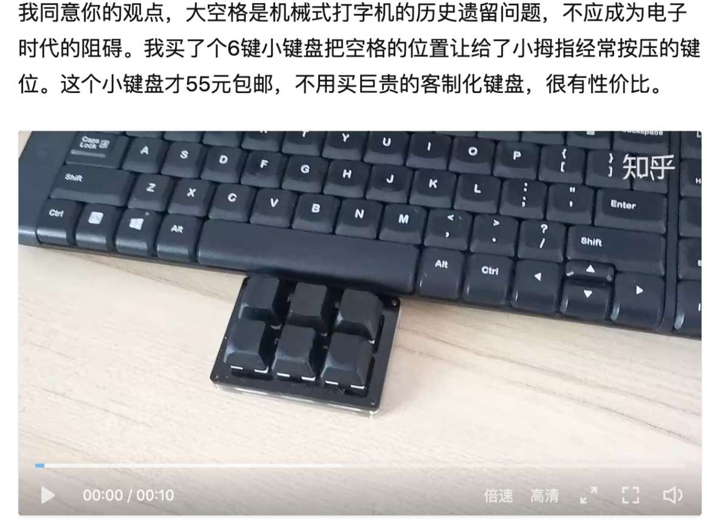
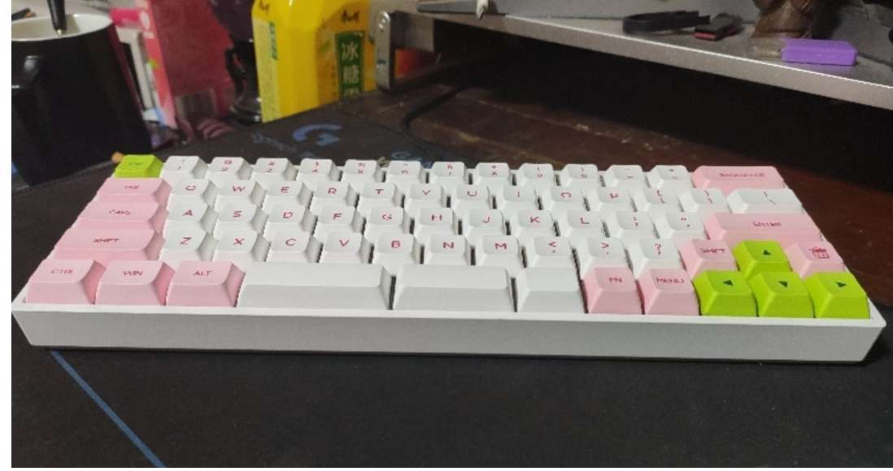
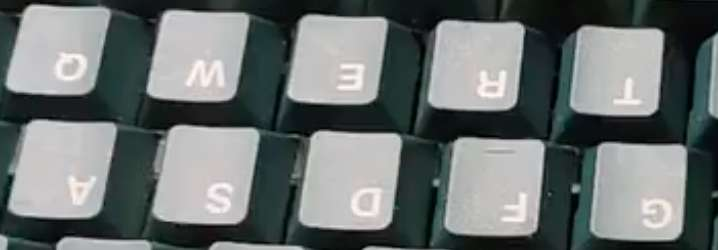
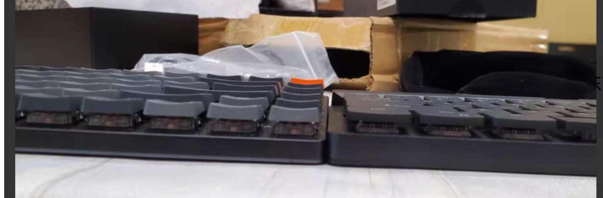
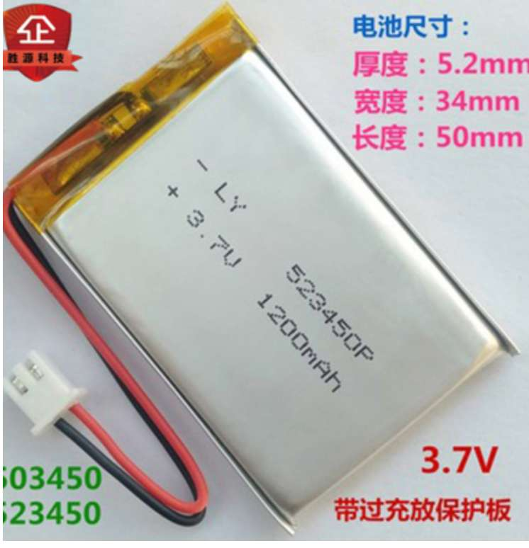
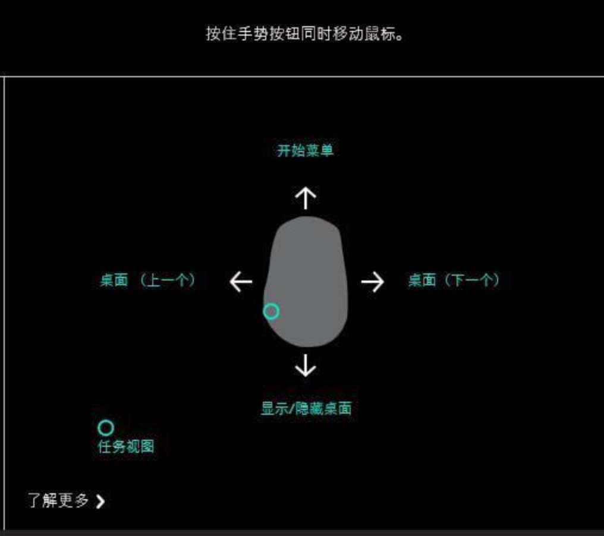
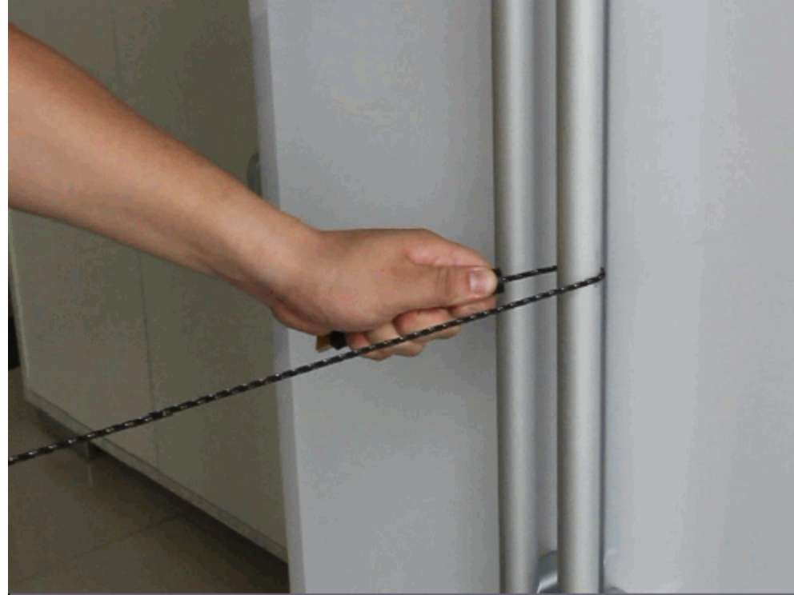
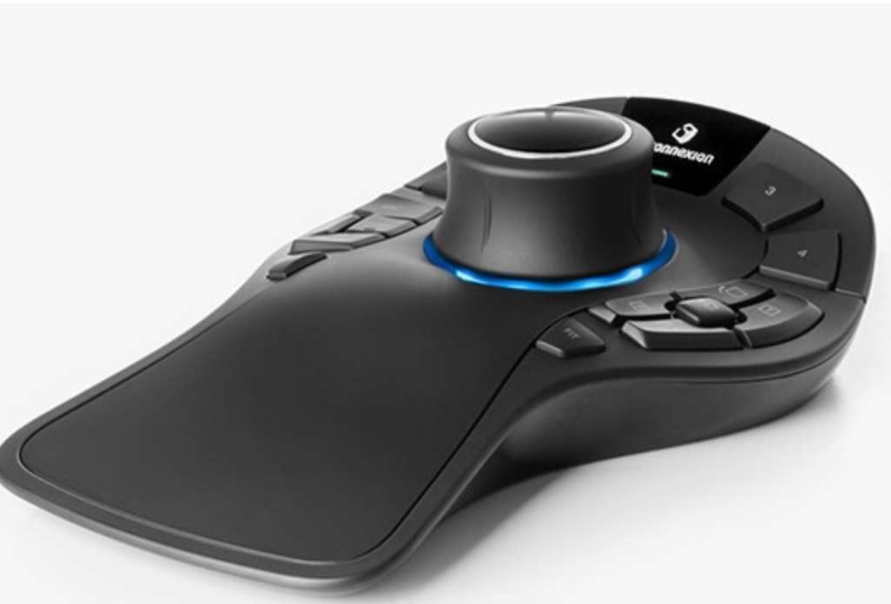

# 键盘

用例如 ahk 、sharpkeys、 powertoys 可以设置键盘和鼠标按键映射的快捷键，这样一些没有自带驱动的键盘鼠标也能设置快捷键，powertoys 是微软自己做的

键盘鼠标可以闲鱼买二手，因为如果买了回来用了一段时间不想用想卖掉可以用接近买入价的价格卖掉，如果是全新的，当二手卖掉要亏更多钱，例如全新 200，二手一般只能卖 120 左右，还可以买剪线鼠标键盘回来自己修好，余清之前在闲鱼看 二手 gpw 一般 400 块， 而在 京东买二手 gpw 一般 499，支持 7 天无理由，180 天质保，闲鱼买的也没有质保 2021-10-18 买了京东的二手 gpw，看 sn 码，出厂时间是 21 年 6 月，罗技的鼠标一般有两年质保

例如看中一个键盘但知道可能不喜欢用，所以想买回来试用，短时间试用可以买全新的键盘，7 天内觉得不好用就然后 7 天无理由退货或者你觉得好用但二手的更便宜也可以退货了买二手，因为你用过全新的所以以后即使买二手也知道全新的是怎样，对比二手买回来的就有可能知道二手的是不是假货，长时间试用可以买二手然后觉得不好用再卖掉。 7 天无理由退货只需退货而且亏个十几块运费就行，而买了二手觉得不好用再卖掉还要考虑能否卖掉 、拍照发闲鱼 、自己发货 、和买家沟通 、 亏几十块、 买家收到货有可能作妖说有质量问题或不好用想退货等 ，显示前者更少麻烦

一种方法：连接两个键盘，一个键盘专门设置成各种单键的快捷键，例如 按 s 就是 ctrl s，而另一个键盘则 正常打字

网上搜 “在线键盘测试”有很多在线网站可测试键盘某个按键对应的键值是什么

下图的键盘和小键盘之间用磁吸固定，下图这种方式是为了增加左右拇指所能控制的按键，因为左右拇指在传统情况下只能控制一个空格键  

有那种电池槽的额外装电池的无线鼠标键盘，相比于内置锂电池的无线鼠标键盘，更换电池更方便，内置锂电池用久了容量下降，更换需要拆开鼠标键盘，而且放太久不使用设备的话内置锂电池不能拆出来，自放电会快一些

[HHKB 键盘布局配置方案 | Ming's Blog](https://bitmingw.com/2017/07/29/hhkb-keyboard-layout-configuration/)

网友：我选择了 niz 而非 HHKB，为什么呢？因为我希望自己的外接键盘和其他键盘有一定的一致性。我不可能在每一台我用过的电脑上都用 HHKB，我也会需要偶尔用一下笔记本键盘。而当你习惯了 HHKB 的键位之后，使用标准键盘会变成一件痛苦的事儿。我个人并不推荐。

常见的静电容品牌有日本的 hhkb 、realforce、 国产的 niz

niz 的官网：[NIZ](https://niztech.cn/)，官网上有说明有哪些经销商的淘宝店

## 机械键盘

2022-03-26 ，之前买的那个闲鱼二手买的 大拇指键盘，在官网下的驱动程序 （版本是 5.3），当例如 左手键盘设为主键盘，即 usb 线直接插在左手键盘，左手键盘再拿连接线连接右手键盘，此时按住左手键盘的 fn1 键，只能映射左手键盘的对应设置好的键值，不能映射右手键盘的，例如左手键盘 设置了 fn1+s =1 ，右手键盘设置了 fn1 +j =2，按住左手键盘的 fn1 时 按 s 出来 1 按 j 没反应，反而是如果右手键盘设置了一个 fn1，按住右手键盘 的 fn1 键 ，按 s 出来 1 按 j 出来 2，所以最好将右手键盘设为主键盘，这样按左手键盘的 fn1 键，左右手键盘的 fn1 对应的键值都能用，左手键盘为主键盘时 右手键盘的除了缺省配置外的配置都不能用  

keychron q11 分体键盘

待验证：分体键盘基本都是机械键盘，注意分体键盘的空格键的位置和长度，n 下面的空格要加长突出超过 n，因为右手自然放上键盘时，大拇指的位置就是在那附近，而左手的大拇指在 v 下面

在闲鱼搜分体键盘 或 ergodox 或 dactyl ，有人专门定制的，ergodone 也叫二狗蛋

网友：dactyl 我没考虑过，因为很多键位从向下按变成了斜按，连有的作者自己都说适应期比较长，他自己都适应了很久。有个键友买了就适应不过来要卖掉

ergodox 的键位是平行的，而常见的的键盘一般都是错位的像 qaz 这三个键是错开的，所以感觉要重新建立我的打字时的手指肌肉记忆，一旦习惯了 ergodox ，切换到常见的键盘可能就打字容易出错，ergodox 支持 qmk 固件

Ergodox 本身是一个开源的 DIY 键盘项目，包括硬件，软件部分全部开源。你可以自己找各种配件组装，也可以购买成套的 DIY Kit，还有一些商业化可购买的版本，包括 Ergodox EZ 和 Infinite Ergodox 等等

2022-01，简单刷 b 站 三搜 知乎 闲鱼 淘宝 “分体键盘 ” “ 人体工学键盘”

其他的人体工学键盘：Kinesis 、微软 、肯辛通、 罗技、Alice 布局的键盘、 X-Bows 、Truly Ergonomic Keyboard ，余清都简单看了下，感觉不如我现在用的那个分体键盘

分体键盘相比于非分体键盘的优点是左右键盘分开的距离和左右键盘的角度可自由调节

分体键盘 搞个键盘脚撑装在键盘的左右底面 也能调整键盘的垂直角度

orbiTouch 键盘用手腕拨动 来触发按键，应该是 给手指受伤导致手指不灵活的人使用的，打字起来速度比正常键盘慢，类似的有 DataHand Keyboard 靠手指头的拨动触发按键， 输入时靠指头向各个方向拨过去，完全不需要像传统键盘那样大范围的移动敲击了。

[如何评价李楠怒喵科技（AngryMiao）4 月 29 日发布的机械键盘 AM HATSU？ - 知乎](https://www.zhihu.com/question/457163306/answer/1861581699)

[【杜比】「我的宇宙」花了钱也不一定能够驾驭它 —— AM HATSU 一周学习体验哔哩哔哩bilibili](https://www.bilibili.com/video/BV1JF411q7Hm?)

有些键盘会在键盘加上小红点模块 、轨迹球模块、 旋钮、 摇杆 、触控板

Kinesis Freestyle2 调节垂直角度的脚撑支架要单独购买的而且不便宜

[真正的模组化键盘 毒蟒 DUMANG 哔哩哔哩](https://www.bilibili.com/read/cv4035821)

分体键盘汇总，[GitHub - diimdeep/awesome-split-keyboards: A collection of ergonomic split keyboards ⌨](https://github.com/diimdeep/awesome-split-keyboards)

待验证：原来有个叫 ergo 的布局和我的想法相同，省去了我定制的麻烦，键位最多的是毒蟒 dk6 ergo，然后到 ergodone，ergodox，redox，ergodash，ergotravel 等。

自己动手做一个 无线 ergodone 带 trackball 的教程：[魔改二狗蛋ergodone机械键盘——真无线二狗蛋哔哩哔哩](https://www.bilibili.com/video/BV1qv411y7vA)

各种分体键盘：[这些年我折腾过的那些键盘哔哩哔哩bilibili](https://www.bilibili.com/video/BV1su411S7FM?)

用分体键盘的一些优点：[天下苦键盘久矣！密斯特MISTEL md770 分体式机械键盘，解放双手的神器！哔哩哔哩bilibili](https://www.bilibili.com/video/BV1yh41187xi?)

热插拔键盘支持断电后快速插拔更换坏掉的轴体，机械键盘的轴如果是焊死的，坏键维修麻烦，耽误干活。

[ 机械键盘的轴座和套筒有什么区别？ - 知乎](https://www.zhihu.com/question/375616788)

[写一篇关于插拔轴/热插拔机械键盘的科普 - 哔哩哔哩](https://www.bilibili.com/read/cv1752323)，轴座热插拔的那两张图，一张是 pcb 的背面图，一张是 pcb 的正面图，轴座装在 pcb 的背面，凯华轴座、佳达隆轴座大概长那样

淘宝有单独的凯华、佳达隆轴座卖

rk 用的是自己设计的夹片式端子座，兼容市面上大多数 3 脚/5 脚轴体，轴体插进去后有点轻微的晃动，感觉还可以，有网友说拔键帽容易连轴体一起拔出来

led 正贴灯，卫星轴调教，rk 的端子座长啥样，看 [配置拉满 229元 能给的我都给了 RK68三模热插拔机械键盘哔哩哔哩bilibili](https://www.bilibili.com/video/BV1kh411k7FS?t=233) 02:27，后续版本的 rk 84 rk 100 改成了 led 反贴灯，没有 led 正贴灯的轴体的兼容性问题  
热插拔轴座有最大的插拔次数，超过次数可能接触不良或失效等问题，[TTC隆重发布防呆型2000次寿命热插拔轴座电脑外设什么值得买](https://post.smzdm.com/p/akxdok2k/) ，[TTC电竞轴座——防呆、更稳、更耐用哔哩哔哩bilibili](https://www.bilibili.com/video/BV1jb4y1f7HJ)， 凯华淘宝官方店卖的轴座写着寿命是 100 次插拔

一些套件例如 gmmk pro 支持 qmk 或 via 的开源固件，能自定义改键，宏，长按短按实现按键不同功能，其实 niz 的键盘也有自带的软件实现类似功能， qmk 还可以实现 按下 ctrl 激活一个层，这个层里面，每个按键都是对应 Ctrl+ 该按键。每次输完一个按键之后就自动回到默认状态。例如使用 Word 场景，需要给一段文字下划线，加粗体，通常右手拿着鼠标选中文字，然后右手移动回到键盘，去配合 Ctrl 按 U 和 B。现在右手在鼠标上不用动，选中文字后，左手依次按下 ctrl 、u、ctrl 、b，就实现目标，虽然左手手腕要抬起，但是比起來拿鼠标，方便得多。自定义改键最好支持板载内存记忆，这样换电脑不用重新设置

[使用Ergodox人体工学键盘是什么样的体验？ - 知乎](https://www.zhihu.com/question/52088337/answer/2041893064) 提到

>固件是 QMK，但 ergodox ez 把设置界面做得非常赞  
>几乎概括了所有 QMK 的功能，包括几个月改的改版 Tap Dance。  
>QMK 的 Tap Dance 界面设置，ergodox ez 是第一个弄出来的  
>Tap Dance 可以让一个按键在四种按下方式时，为其设置对应的键。  
>按下并松开、按下并按住、连按两下松开、连按两下并按住。  
>另外有个简化版的 Tap 功能也是同理，可以改成按下放开是 esc，按住是 control。  
>但这些功能都对按键时间有要求，如上述的修改，设置成 200 毫秒后：  
>那就得按住 200 毫秒后才会变成 control 键。

热插拔的量产键盘有 fl980 、达尔优 a87，rk 100 ， rk 84 ，akko 3098 等 ，rk 的键盘也有驱动可以改键，爱外设的套件就是 rk 84 、 rk 100 拆掉键盘轴体剩下的套件，rk 的键盘很便宜

黑峡谷是凯华旗下的品牌，[黑峡谷果然就是凯华的马甲【机械键盘吧】百度贴吧](https://tieba.baidu.com/p/6161966666)，黑峡谷 gk715 这个键盘热插拔设计，搭配 box 轴，活动价可到 180 左右，而零售的 100 颗 box 轴 平均要 100 块，性价比还是可以的的，普通的不包含键帽轴体的热插拔套件都要 200 块左右，咸鱼有卖 黑峡谷 gk 715 的新套件 80 左右吧。她们就是买带轴的黑峡谷 gk 715 然后把轴拆掉卖套件

有网友说活动价 392 买了一个 ttc 快银轴的 rk 860，把套件卖了 170 包邮，相当于 100 颗快银仅 230 元，而零售的 100 颗 快银轴均价 380 元

把机械轴的轴体的弹簧换成不同压力克数的弹簧可改变轴体的压力克数

各种配列：87 键就是简单粗暴的砍掉了 104 键的数字区域，如果数字录入不多的话，87 键日常办公足够用了，在 87 键基础上还有 84/82 键的进一步精简变形，更精简的还有去掉 F1-F12 那排的 66/68 键键位的键盘，用 87/84 键的话可把常用的数字组合用输入法或 AHK 自定义缩写，或另购数字小键盘，96/98 键感觉也不错，保留了数字小键盘但比传统的 104/108 键小一点  
感觉 84 键就很不错，保留了方向键和 f 键，比 传统 104 键在长度上短很多，方便打字时双手放在扶手上，占用空间小一点，重量轻一点，价格便宜一点，如果需要经常录入数字，可以额外买数字小键盘  
[玩电脑用哪种尺寸的键盘最舒服？哔哩哔哩bilibili](https://www.bilibili.com/video/BV1ZR4y1M7Xt), 视频中的 63 键键盘其实是 64 键  
75 配列一般是 84 键，65 配列一般是 68 键，有些 63 键比 64 键少了个问号键，，淘宝搜索“75 键盘”或“84 键 键盘”都可以  
87 键盘常见的长度是 36cm，84 键盘常见的长度是 32cm  
有些键盘把数字小键盘在键盘字母区的左边  
有些键盘的空格变成 3 个按键，下图  

键盘上的 f 键用得不多而且可以用其他组合键替代例如 f5 在浏览器中是刷新，ctrl+r 也能做到 f5 的效果，但不是所有 f 键都有替代例如 win 的 alt+f4 就没替代，除非你用软件重映射例如将 ctrl+h 重映射为 ctrl+f4

[「键盘自习室第五期」换了套新键帽，高度不一样是怎么回事？哔哩哔哩bilibili](https://www.bilibili.com/video/BV1uf4y1m7N6?t=101)  
[「科普向」不同高度的键帽区别到底在哪？7种键帽高度大横评！【原厂 OEM XDA MDA KCA FA SA】哔哩哔哩bilibili](https://www.bilibili.com/video/BV1BM41157xt)  
[键圈新手入坑指南——常见键帽购买渠道_哔哩哔哩_bilibili](https://www.bilibili.com/video/BV1kg411Y7G2/?vd_source=568600721e4a7665b71d32bda0302591)  
[键帽居然有这么多门道？B站最全键帽选购指南（科普篇）哔哩哔哩_bilibili](https://www.bilibili.com/video/BV18q4y1i7Vd)  
不同配列的 shift 空格键等大健的长度有所区别，宽度最小的键帽例如 a 键宽度为 1 U，如果 ALT 键 的宽度是 a 键宽度的 1.5 倍就是 1.5 U，以此类推。你的键盘是 84 配列，如果你买的是标准 104 的整套键帽，可能需要另购 shift 键帽，因为 84 配列的右 shift 键的长度比标准的短一些，有些键帽套装是包含各种不同配列的长度的键帽

xda 和 dsa 都是平胸键帽，sa、 oem 、原厂键帽都是有一定倾斜角度的，关于有倾斜角度的原因，有一种说法是人体工学设计，因为如果你手指比较短，这样的设计让你更容易按到 f 区那排键

g20 键帽貌似是国外 sp 公司的产品，国内淘宝等很难买到，闲鱼那些一般是玩家自制的无刻的且很贵，[【瞎打】G20高度键帽 完美解决XDA太高 DSA按键面积太小 键帽边缘割手等问题。我最喜欢的键帽手感 个人优化定制键帽 3D打印键帽哔哩哔哩bilibili](https://www.bilibili.com/video/BV1cr4y1F7CU?t=15)  

有些键帽 f 和 j 键 不会有小凸起，这样盲打时不能快速定位打字姿势  

xda 约 9mm 的高度，dsa 约 7mm，g20 约 7mm，现在用的光头哥的类 xda 的微光键帽的高度是 7.5mm  

像 oem 那种键帽的按键平面有一定的倾斜，有时候把某些键例如空格键的键帽反装能获得不一样的按键体验如下图 ，空格键反装后可能不那么磕手，把 uiop 那排键反装倒是会感觉压力克数变大了  

底棉和夹心棉的作用是消音，底棉就是装在键盘最底下的绵，夹心棉就是装在定位板和 pcb 之间的绵，如果你用静音轴感觉足够静音也不用加，网友说非静音轴即使怎么装绵或润滑，噪音还是比静音轴大的

[键盘所谓的卫星轴是指什么呀？ - 知乎](https://www.zhihu.com/question/29130257/answer/1952915058)

可以用叠好的毛巾代替键盘托，机械键盘比较高，长时间打字手腕向上弯曲比较累，加个键盘托能缓解一下，可选用矮一点的键帽，薄膜键盘可以做到很薄，打字时让其手腕与手臂平直舒展。

是不是试轴器和键盘的手感完全一样？答案是否定的。键盘有不同的设计，带不带钢板，键帽的材质，PCB 的厚度都会影响到最终的手感。试轴器只能测试轴本身的特点，其他还有很多的因素，但是至少是一个很好的基础。有条件可以把试轴器放在一块钢板上，并且多换换键帽，体会不同的感觉

所谓钢板就是轴体定位板，钢板的有无对手感有一定影响。有钢板的键盘，键帽会打在钢板上，噪音会比没有钢板的键盘大，但手感会更加干脆，键盘使用的时候也会更加稳定，同时也在一定程度上提高了键盘的坚固度。 而没有钢板的键盘，键帽直接打在 PCB 板上，导致 PCB 板发生微小的形变，键盘会有震动的感觉，手感变软

网友：如果你喜欢复古类型的键盘，又需要 104 键全配列，可能会筛选到著名的 Cherry G80-3000/3494。这把键盘是 Cherry 的亲儿子，从 1989 年开始一直到现在还依然在售。它经常被人提起的是「经典」和「无钢板」两个特点，经典自然不用解释，无钢板的意思是轴体直接固定在电路板上，没有像一般键盘一样用一块钢板来辅助轴体定位。Cherry 的这把键盘由于老式的空旷设计，电路板会随着你的按压发生形变，从而提供了十分特别的、绵软的按压手感，几乎是独一无二。听起来不错，对吧？但是上面这段话换个意思就是，这把键盘从 1989 年卖到现在，一点都没变过，以至于在功能性上已经有了明显的短板。就不说什么 Fn 组合快捷键了，G80-3000 系列并不能做到 USB 下全键无冲，甚至只有 3494 可以任意六键无冲，3000 只能保证至少两键无冲。我知道它很好看，我自己也曾经有一把，无钢黑轴的手感真的很不错，但它绝对不应该成为你的第一把键盘——或者你也可以从二手市场淘一把，它的翻修品真的很多，而且真的很便宜。

平时使用机械键盘的时候，避免吃东西时零碎的渣渣或是液体进入键盘，当键盘长期不使用或闲置的时候可以找一些布料等遮盖物遮盖上，或者是购买键盘罩一类的来避免灰尘或其他杂物的落入。为了防止用拔键器拔键帽后键帽安装出现错误，可以提前对键盘拍照以便装回时的参考。首先用气囊和毛刷将键盘缝隙中的杂物清理出来。如果不是很脏，可以不用插拔键帽，只需要对按键等部分进行擦拭即可

所谓的键帽的“打油”，其实是长期使用后的磨损。正常来说，键盘的键帽应该是有一定的磨砂质感、摸起来挺干爽的一种状态。但是随着长期的使用，键帽会不可避免地在和手指的长期接触中被磨损，最后从磨砂质感变成部分区域被抛光、平时接触不多的地方还是磨砂的状态，常见的键帽材质有 ABS 、PBT 、POM ，如果你非常在意打油问题，建议选择 PBT 材质。

雷蛇的”塔洛斯魔蝎“系列的左手单手键盘有 32 个可编程按键，有一个拇指 8 向方向键和一个滚轮，在某些场景可能有点用

当你一开始长时间用重压力的轴，手指形成肌肉记忆，用其他轻压力轴时手指也容易出那么大力去按，长期以往容易腱鞘炎

[机械轴体的经历分享 - 知乎](https://zhuanlan.zhihu.com/p/413732011)

轴体主要有段落轴和线性轴两种，段落轴的噪音一般比线性轴大，阿米洛自主研发的静电容机械轴

润轴之后声音变小一点，更加顺滑一点，但个人感觉应该差别不大 感知不强，而且有些轴体出厂自润，所以懒得折腾 ，[【AKS】客制化键盘之路——从润轴到暴走哔哩哔哩bilibili](https://www.bilibili.com/video/BV1F64y1u7Xf?t=28)

键盘的本质是打字工具，网上有很多网友用各种方法让按键的声音更好听或喜欢听段落轴那种声音，我觉得都没什么必要，静音舒适、适中的压力克数的线性轴是我追求的，打字时大脑思考，专注于屏幕上的内容，哪有心思去仔细听按键声音

圣熊猫轴（Holy Panda ， hp 轴）是 一种提前段落轴，特殊之处在于它的段落感相较一般段落轴是提前的。稍微按下去一点点，还没开始按的时候，阻力感就上来了；按过这一段阻力之后，就是类似线性轴的手感。 2016 年 10 月，国外玩家 Invyr 和 Mech27 众筹了一款熊猫轴（Panda），这是一款线性轴。宣传的时候说是非常顺滑，手感很好，然而在 2017 年生产出来之后表现拉垮，润滑不完全，手感不一致。熊猫轴生产出来之后，有玩家无聊拆自己手里的轴玩，无意中把段落轴 zealio V1 的轴心装到了熊猫轴的外壳里，创造出来 Zenda 轴。这是一种段落轴，手感据说比较奇妙。受到 Zenda 轴的启发，玩家 Quakemz 尝试把当时刚出来的 Halo 轴的轴心装到 Panda 轴的外壳里，圣熊猫轴, Holy Panda, 就此诞生，[【AKS】10块钱一颗的机械键盘轴体到底好在哪里？哔哩哔哩bilibili](https://www.bilibili.com/video/BV1ca4y1Y7gF?t=116)

凯华等品牌都有类似 hp 轴手感的轴体

轴心稳定指的是轴体不容易晃动，个人感觉对打字体验来说差别不大，轴心指的是与键帽接触的那个结构，[【SH】极星轴二代、一代、蒂芙尼三种轴体的轴心晃动比较，机械键盘轴体晃动比较哔哩哔哩bilibili](https://www.bilibili.com/video/BV1Dg4y1i76y?t=176)

把 5 脚轴剪掉 2 个脚就变成 3 脚轴，一样可以插进三孔的轴座

佳达隆淘宝客服说 ks-3、ks-8、ks-9 三款轴体区别：  
一：三款轴体相同轴心颜色参数是一样的、  
二：支持的灯位不一样 ks-3 只支持二针脚 3mm 圆灯，  
ks-8 支持二针脚 3mm 圆灯/四针脚 rgb 灯、  
ks-9 支持二针脚 3mm 圆灯/四针脚 rgb 灯/贴片灯（贴在 pcb 板上的灯）。  
四：ks-3 系列默认都是 5 脚  
ks-8 有三脚跟五脚  
ks-9 是默认三脚

矮轴，半高轴，矮轴的总行程和触发行程都短一点，矮轴触发行程一般 1.2 - 1.5mm ，比得上银轴一般的 1.2mm ，矮轴键盘相对轻薄一些，矮轴暂时没有静音轴但有人说矮轴键程短一般是比较静音的，keychron 的光轴 (矮轴) 触发行程 1.1mm 而且很便宜，键程短的话可能打字速度能快一些

京东的京东京造 k 系列键盘也就是 keychron 的 k 系列键盘，应该是贴牌的关系

出门在外可以用体积小、重量轻的无线可折叠的蓝牙键盘或小尺寸便携的机械键盘或超薄键盘，小尺寸便携的矮轴键盘例如 keychron k7  、rk 925 ，rk 925 可折叠而且是平胸键帽而且整个键盘是像笔记本上的键盘那样是平的如下图右边  

keychron k7 的键帽是有上斜梯度的如下图左边，有人说有梯度的话如果你手指去敲打例如 123 这种键需要将手指抬高一点因为直接手指平移的话会被卡住，看 [keychron K3矮光轴（红轴）版本主观体验式深度评测_哔哩哔哩_bilibili](https://www.bilibili.com/video/BV1wa411k7L9) ，手指不用抬高可能省力一点  

超薄键盘不需要键盘托 ，更加便携，不像比较厚的机械键盘，不用键盘托就用得很难受，如果携带键盘托就更重了，矮轴键盘可能也需要键盘托

之前选了 keychron k 7 然后换成白轴的原因是因为 keychron  白轴的轻压力（30gf）和超快触发（1.1mm）

到了机械键盘这边，你有两种选择，一种是购买一把搭载了静音轴体的键盘，一种是购买一把支持轴体热插拔的键盘，然后选择静音轴体自行更换。如果你不愿意尝试热插拔轴体，也可以购买出厂预装静音轴的键盘例如悦米 pro 静音版、AKKO 3098B/N ，至于薄膜键盘，挑选时尽可能选择剪刀脚结构（比如微软 Sculpt）或者较矮键帽的火山口结构（比如联想 SK8825），这些结构基本能保证在轻轻敲击时提供一个较低的音量。键帽越高越容易不稳定，产生碰撞和晃动杂音的可能越高。  

ttc 轴体很贵，普遍 3-4 块一颗，佳达隆和高特的轴体普遍 1-2 块一颗

网友：圈子里面以前有一些乱七八糟的做法，比如大家知道轴体生产会有一定的报废率对吧，报废了的话怎么办呢？一般是出到货场（比如广东汕头等地），这些货厂正常应该是把它卖塑料和五金件当废品回收掉，我们圈子里面就有一些人会搭桥把这些报废轴拿回来卖，这类事情以前闹得还挺大的，现在咸鱼转转上也还有少量在流通。

键盘可以用不同的轴， 例如小拇指负责的区域用压力克数小的轴因为一般小拇指力气比较小，容易误触的键换成压力克数大的轴，其他键用线性轴然后一些快捷键可以用段落轴以此来确保自己按对键

keychron 的很多键盘支持热插拔，支持 qmk/via，q 系列有旋钮、gasket 结构

如果键帽的接触面积大，键与键之间的距离通常变小，理论上会增加误触的概率

如果周围环境经常有很多灰尘，可以使用光轴或有防尘装置的轴体（比如凯华 BOX 轴系列），或者用薄膜键盘。或者静电容键盘，相对来说不容易坏

# 鼠标

[聊聊G304电池选择方案鼠标什么值得买](https://post.smzdm.com/p/awxqm2m4/)，各种电池的重量

那些扁平的办公鼠标的应用场景之一是放进包里不会突出来一块

1.ttc 绿轮。细腻且清晰的刻度感，滚动轻松，更适合日常和快节奏游戏使用  
2.日产 alps。xm1、冰豹泰坦同款手感很好，刻度感强的同时滚动比金轮轻松一些，确认感和阻力比较平衡，日常可用，更偏向游戏用。  
3.ttc 金轮。强刻度感，震感强，寿命最高，滚动回馈感强，适合需要强烈确认感回馈感，游戏专用，日常一直用可能会累，震感强会导致有部分噪音。

3d 打印的外壳：  
树脂白色，热变形温度 45℃，精度高，表面光滑，比较舒服的手感，性价比高。  
尼龙黑色，热变形温度 175℃，精度差些，表面颗粒感。粗糙手感，略防滑，强度，韧性，都是最强的，更适合长期使用，最多人选择使用的材料  
网友说白色尼龙偏软容易受力变形，树脂材质不抗摔，落地可能损坏

自制鼠标线夹： [鼠标线夹有什么用？ 那么贵！【csgo吧】百度贴吧](https://tieba.baidu.com/p/5739987108?redtag=1432257348)

克力表示一克的物体所受的重力，由 G=mg，g=9.8 牛/千克，所以 1000 克力=9.81 牛顿,即 1000gf=9.81N ，它与千克力（一千克的物体所受的重力）关系是千分之一，克力近似我们常说的厘牛 (cN)。1 克力（gf）≈0.0098 牛（N）≈0.98 厘牛（CN），1N=0.102kgf=102gf=100cN

 市面上能买到的大部分微动的按键力度都是 0.74n， 最小的可以去到 0.6n 、0.65n （一般用在需要快速连点的左右键上，特别是你玩 lol 需要快速连点），按键力度小的微动用久了不容易手指累，大一点的去到 1.47n，一般用在防止误触的侧键上

dg4 0.6n、 dg2 0.6n 貌似停产了, 除了这两个，基本上都把市面上力度小的微动买回来试了遍

可以把微动装进鼠标里别焊死试下手感

曾经 b 站 春茶君的闲鱼有卖 0.65n 和 0.6n 的微动，他说用仪器测出的压力克数，网友问他用什么仪器也没说，淘宝有卖 0.65n 的欧姆龙蓝点微动但经常缺货，余清买过一个横向张力计，能测出微动的按压力度，大部分标 0.74n 的微动用张力计测都是在 0.5-0.65n 之间，可能微动的按键力度会有误差，也可能是张力计的问题  
春茶君的闲鱼有各种改装服务，改静音，减重，热插拔，滚轮阻力/静音滚轮，0.5n 左右的微动，静音微动，也有改好的成品卖，这个 b 也改装键盘（改成声音小一点等等）

有专门的静音微动或静音鼠标，静音鼠标其实也只是用了静音微动

待验证：如果你拿不准自己相中的型号到底是不是真正的静音鼠标，直接搜索「型号 + 拆解」或者「型号 + 微动」。只有采用了方形静音微动的鼠标才是你想要的「静音鼠标」，其他的要么是挂羊头卖狗肉，要么是选了绵软差劲、但是不够静音的微动，靠关键词准备忽悠一波。罗技和小米都有静音微动的鼠标，值得一提的是，ROG 这样具有微动热插拔功能的鼠标并不能兼容方形微动（例如凯华的静音微动），两者虽然针脚定义通用，但宽度尺寸上还是差别很大的。所以如果你打算购买鼠标自行更换微动，还是选择原生焊接机械微动的型号比较合适，就别想着靠热插拔省事儿了——除非你自己焊接热插拔铜鸡眼，那就是更大的工程了。静音微动由于弹片的性质和对音量的平衡要求，手感会非常绵软，点击确认感会大打折扣。市面上售卖的静音微动中，普遍评价比较好的就是凯华的静音微动。在购买前最好查一下自己手上的鼠标所用的微动型号以及尺寸，看看是否有人出过该型号更换微动的教程或视频。比如罗技的游戏鼠标由于采用微动主动张力系统，拆解上可能更为复杂。

雷蛇的光学微动 ，看 [【拆解】雷蛇光学微动开关结构与原理-毒蝰鼠标详细拆解哔哩哔哩 (゜-゜)つロ 干杯~-bilibili](https://www.bilibili.com/video/BV1fJ411N7xz) 的 08:06

余清感觉连点最好用的是 D2F-01F ，力度小，键程短，其次是 D2F-01 FL， D2F-01 FL 和 D2F-01F 的区别是前者有个横杠但好像没什么用且按起来要硬脆一些，雷蛇绿点相比于 D2F-01Fl 感觉力度要大一些，但比 gm8.0、zf 金点小，gm8.0、zf 金点比较硬，防尘金 60m 的力度位于雷蛇绿点和 gm8.0 之间，f37 回弹感强，力度和绿点差不多，df3 的力度和防尘金差不多，普通力度的欧姆龙蓝点的力度在防尘金和绿点之间，冰豹定制的欧姆龙蓝点（型号带 rt 尾缀）的力度和 gm8.0 差不多，但只是各自测试过一个微动，因为即使同一型号的微动可能也有点误差

洞洞鼠标，在鼠标旁边喝水时水滴可能不小心滴进 pcb 板导致可能短路，感觉可以弄个防滑贴遮住洞洞的地方，一般防滑贴重不了多少，也可以用电路板防水漆，鼠标底部打洞不用怕因为使用鼠标时很难从底部进水，洞洞鼠标容易进灰导致微动双击，有些洞洞鼠标自带防水设计， 看 [洞洞鼠标防水大作战哔哩哔哩bilibili](https://www.bilibili.com/video/BV1J4411B7GK)

余清手长 21cm，小手鼠标和大手鼠标的区别通常是长度和高度，小手鼠标的长度通常是 115cm 以内，大手鼠标的长度通常是 123cm 以上，长度高度影响是的趴握和抓握，指握不影响，我很少用趴握因为习惯指握时前臂右旋而且用手指移动鼠标，小手鼠标抓握可能不稳容易飘而且容易累，小手鼠标一般也比大手鼠标轻一点，感觉低背比高背好（鼠标高度低一点），因为高背会让手腕抬得更高，手腕压力较大，鼠标左右键那里的高度也影响手腕抬的高度

余清之前试过 304 改 ul2 的小手鼠标，长度和高度都小 (长度 110mm，高度 28mm)，用得比较难受，打游戏一般抓握，因为指握对鼠标的操控稳定性比不上抓握，小手鼠标抓握比较累因为我手比较大，抓握起来手指手腕都要更加弯曲且手掌的掌心不能完全握住鼠标导致容易控制鼠标不稳，指握也类似，感觉顺滑度主要和脚贴鼠标垫有关，鼠标重量影响不大，重量主要影响的是移动时感觉到的那种惯性，特别是打 lol 频繁改变鼠标移动的方向，改变方向时要克服鼠标移动的惯性，鼠标越重惯性越大，有人说重的鼠标不容易飘特别是紧张时手抖

重量轻的鼠标不一定移动起来就不费劲，主要和脚贴鼠标垫的顺滑度有关

有线鼠标的缺点：余清习惯右手拿鼠标久了换左手，放在键盘右边的鼠标拿到键盘左边时鼠标线是个累赘特别是当你桌面上堆了很多东西时，当你经常带电脑外出时，需要经常收起鼠标线然后到了目的地又要展开鼠标线，当站立使用电脑时，下坠的鼠标线会让鼠标感觉很难用  
有线鼠标一般比无线鼠标轻，如果你只是专门用有线鼠标玩游戏，其实也可以考虑有线鼠标，网友说伞绳线相对用起来没什么拖拽感

有线鼠标打游戏可能更好因为无线鼠标可能因为干扰导致突然的没明显观察到或明显观察到的鼠标漂移或丢帧但现在罗技雷蛇的无线技术都做得挺好应该比较少几率出现这问题，三模的鼠标可以有线或接收器或蓝牙连接，这样不打游戏时就无线连接，打游戏就有线，无线鼠标靠接收器或蓝牙连接，两者都是 2.4g 的频率，连接 2.4g wifi 时 可能会相互影响

职业比赛里，有线鼠标居多，因为比赛的现场环境比较复杂，用无线鼠标可能会被干扰导致鼠标丢帧等问题，罗技的 lightspeed 和雷蛇的 Hyperspeed 无线技术是 T1 级别的，可以上职业比赛的那种，其他小厂品牌的无线技术可能在日常使用中容易丢帧等问题

对于有线鼠标，鼠标线也是一个点，线材不好，使用时会感觉到线材对手腕的作用力，见  
http://www.bilibili.com/video/av15489383/ 3:50-4:15  
http://www.bilibili.com/video/av13187591/ 4:20-5:00

有网友说有公司为了安全问题可能会禁止无线键盘鼠标，怕无线信号传输键盘数据泄密

2021-03-29 ，rog 的很多款鼠标都是插拔式微动而非焊接的微动（左右键，非侧键），例如战刃 2，影刃 2，钛度有一款鼠标也是插拔式微动， 市面上除了这两个品牌没有其他品牌有插拔微动鼠标好像是专利的问题，网上有普通鼠标改装成热插拔微动的教程

普通鼠标改装成热插拔微动是通过在 pcb 板上安装铜穿孔钉（鸡眼钉），改装成热插拔之后安装新微动和拆除旧微动要注意的东西看 [鼠标微动热插拔之一，微动的拆除和安装 哔哩哔哩bilibili](https://www.bilibili.com/video/BV16t411N7VX/?t=75&vd_source=568600721e4a7665b71d32bda0302591)，[鼠标微动热插拔之三，微动安装的通用做法_哔哩哔哩_bilibili](https://www.bilibili.com/video/BV1ft411N7Py/?t=553&vd_source=568600721e4a7665b71d32bda0302591)，安装微动可能要磨针脚  
怎么安装鸡眼钉看 [【 捡垃圾系列】动热插拔鼠标，剪线鼠标修复大法，这套鼠标抽了吧！哔哩哔哩bilibili](https://www.bilibili.com/video/BV1Tv411Y71M/?t=262&vd_source=568600721e4a7665b71d32bda0302591) 或 [鼠标微动无损热插拔改造_哔哩哔哩_bilibili](https://www.bilibili.com/video/BV1aK4y1T7fj/?t=1096&vd_source=568600721e4a7665b71d32bda0302591)，感觉自己弄的话途中可能会遇到某些问题例如把焊盘弄脱落，直接淘宝找人帮忙弄更好

热插拔用爪簧铜柱而非鸡眼钉，这样不用磨微动针脚， 看 [动手改个热插拔吧，让你的鼠标能传家！最新“微动热插拔技术”？狗头保命【剪线鼠番外篇】哔哩哔哩bilibili](https://www.bilibili.com/video/BV1Yg411u7iq?t=368)

或者直接买别人已经改成热插拔的按键板/微动板，要对应鼠标型号，买回来自己组装，例如闲鱼搜“gpw 热插拔按键板”

罗技，雷蛇，赛睿，冰豹，雷柏，rog，卓威，微软，戴尔，小米 （游戏鼠标），轻量化洞洞鼠标包括 finalmouse （很贵 ，一千多块一个鼠标），glorious , 游狼 ，酷冷至尊，因科特，endgamegear，btl ，xtrfy ，大部分的鼠标都简单看了下，微软，戴尔，小米的鼠标都挺一般的，游戏鼠标都差不多，如果以后需要用到很多快捷键或极速滚轮，感觉可以买支持罗技手势操作的办公鼠标但那些鼠标通常比较小可能握着难受

2021-05-29， 在 [Top Mice | Rocket Jump Ninja](https://www.rocketjumpninja.com/top-mice) 可看到一些轻量化鼠标，现在最轻的有线游戏鼠标是 49g 的酷冷至尊 mm720 和游狼的 hts （49g 是商家宣称的重量，上面这个链接写的重量可能是自己测的），最轻的无线鼠标是 41g 的 Finalmouse Starlight-12 S ，个人觉得已经接近鼠标的极限重量，以后都很难突破这个重量太多，网上的 g304 改装 ul2 最轻可以去到 48g

国外在鼠标领域的 kol 的 zy 哥在 youtube 的频道叫 rocket jump ninja

[【2023 鼠标品牌排行榜】鼠标哪个牌子好_鼠标品牌排名-ZOL排行榜](https://top.zol.com.cn/compositor/32/manu_attention.html)

罗技有办公鼠标，游戏鼠标，轨迹球和垂直鼠标

罗技的办公鼠标 [电脑鼠标- 无线鼠标，蓝牙，有线 | 罗技](https://www.logitech.com.cn/zh-cn/products/mice.html)(有单独的优联接收器卖）

[Mouse Search | Rocket Jump Ninja](https://www.rocketjumpninja.com/mouse-search) ，根据某些选项筛选出各种鼠标

罗技鼠标的 sn 码，前 4 位都是例如 1731，表示 17 年第 31 周出厂，计算保修日期时可以此参考，鼠标包装和鼠标本身的 sn 码的后面几位是不一样的，而 sn 码前 4 位是一样，罗技的保修有发票按照发票时间保修 ，没发票按照出厂日期保修，买二手时如果还在保可以问下卖家有没发票

有些鼠标有超多的侧键例如雷蛇那伽梵蛇进化版

一款鼠标，可在闲鱼淘宝 b 站搜下相应的减重方案，常见的是去掉侧键（比如 gpw 两侧都有两个按键，去掉右侧的两个按键），内部打孔，外壳打孔，打孔可以用电钻或直接用网上 3d 打印的洞洞壳，改用容量更小重量更轻的电池（续航变短），采用轻量化的 3d 打印的滚轮，去掉 rgb 灯，把内部电路板搬到其他更轻的 3d 打印的鼠标外壳，例如把 g304 的电路板搬到 ul2 的外壳，一般是把 g304 电路板整个拿出来然后装进其他鼠标外壳就行，而例如把 g304 内部电路板放在毒蝰 Mini 外壳时有些人会把 g304 原装电路板上的所有零件拆下来然后移植到自制的适配毒蝰 mini 的一个电路板上（俗称搬板）因为好像说是 g304 原装电路板放不下毒蝰 mini 的外壳里

罗技 g304 在国外叫 g305

卓威的鼠标没驱动，DPI 只有默认几档， dpi 不高，有高低背的不同鼠标，同一款鼠标有大中小三种鼠标尺寸让你选

余清称量过下图，重 20 g ，容量越大一般越重且尺寸越大（有些淘宝商家支持定制尺寸），据此可以推断出 200 mah 多重，也可以把 usb 充电电池的电芯拆出来用  

 锂电池的电压会随着电量的下降而下降，大多数 1.5v usb 充电锂电池不会电压随电量变化，因为它里面的电芯用的是 3.7v 的锂电池然后用降压电路将 电压降为 1.5v ， 里面 3.7v 的锂电池 的电压会随着电量的下降而下降，但不管是多少都会经过降压电路转为 1.5v ，所以 1.5v usb 充电锂电池全程都是 1.5v 恒压输出，而常见的 1.5v 碱性电池和 1.2v 镍氢充电电池都是电压会随着电量的下降而下降，碱性电池不能充电用完就扔，g304 如果用 1.5v usb 充电锂电池 ，因为全程都是 1.5v 恒压输出，所以罗技驱动显示的电量一直是满的，电量提示灯也工作不了，这样不知道什么时候电池没电需要充电，不过其实还好，定期充下电就行，g304 又不能直接用 3.7v 的锂电池因为设计就是这样除非自己改主板，锂铁电池也是全程恒压，京东京造和紫米的一款 5 号可充电锂电池有低电量提醒功能，低电量时输出电压降为 1.1v，应该是有特别的技术，一个 3.7 v 180 mah 的锂电池如果降压到 1.5 v 输出，对应的 mah 应该是 3.7 X 180 ➗1.5 = 444 mah

[外设小百科 篇二：这三款测试软件能帮你丰富你的鼠标测评服务软件什么值得买](https://post.smzdm.com/p/673756/)

[【火云汉化】如何像职业选手一样测试鼠标传感器（By Rocket Jump Ninja)哔哩哔哩bilibili](https://www.bilibili.com/video/BV1mt411U7za)

[外设小百科 篇一：游戏鼠标引擎全解析（2018版）鼠标什么值得买](https://post.smzdm.com/p/672408/)

罗技的几款办公鼠标都有滚轮侧键（滚轮可以向左或向右按键）和极速滚轮例如 m720 、m590、 anywhere 2s

办公鼠标普遍才 1000dpi，如果不在系统里把”指针移动速度“调快的话移动得费力，调快了之后可能精确性有所下降，打游戏的话不合适，办公还行

像 mx master 雷柏 MT750L 有额外的滚轮（拇指滚轮）进行左右滚动，剪辑等需要频繁左右滚动的鼠标可以考虑，madcatz 旗下的一些鼠标也有拇指滚轮，，苹果的 magic mouse 也可以很方便进行左右滚动，罗技的 ghub 也可以将某个按键设为向左滚动或向右滚动

mx master 可以在 罗技的 Logitech Options 软件设置 拇指滚动在不同软件设置成不同功能，例如在 chrome 设置成左右标签切换，在 word 设置成放大缩小

罗技鼠标的手势操作指的是按住鼠标上的一个可自定义的按键（手势按钮）然后移动鼠标视为一个手势，对应一个操作，下图，有了手势操作，一个按键可以当成 5 个按键使用（如果鼠标上有 5 个自定义按键，5x5=25 个快捷键，需要使用很多快捷键的人士可以尝试），同一个按键在不同的软件还能设置成不同的功能，看 [最完美的办公鼠标？罗技MX master 2s和M720使用体验【云上于天】哔哩哔哩bilibili](https://www.bilibili.com/video/BV1T4411U71o?t=495) 05：15

鼠标支不支持手势操作 、flow 和键盘支持 flow duolink 等 看 [下载 Logitech Options 来提高工作效率](https://www.logitech.com.cn/zh-cn/product/options), DuoLink 模式，即键鼠基友模式，当按住键盘 Fn 时，鼠标的自定义按键 +4 个手势操作全部可以二次定义。比如默认模式下，M720 的左侧键为前进/后退，按下 Fn 后 DuoLink 模式下，它们就变成音量 +/音量 -。简而言之，Fn 不再是键盘的 Fn，而是延伸到鼠标上！ 2019 年 时 遗憾的是，罗技支持 DuoLink 的键鼠屈指可数，键盘仅限 K850、K780 与 Craft，鼠标仅限 M720，泪奔，就连当家花旦 MX Master 2S 与 MX Anywhere 2S 都不支持！

罗技的 flow 通过 Logitech Options 软件实现，支持罗技的游戏鼠标，只支持罗技的办公鼠标，罗技鼠标的 flow 可以两台计算机之间用同一个鼠标，并且在一台计算机复制文字或文件，在另一台计算机粘贴，其中 两台计算机之间用同一个鼠标 这个功能 用其他软件例如 Synergy 也能实现，罗技键盘的 flow 貌似需要配合支持 flow 的鼠标一起使用，功能就是鼠标移动到另一台计算机，键盘就自动切换到对应的计算机打字

MX MASTER 2S 握在手里的感觉是 “高”！MX 的屁股真的是太高了，对于一个长期使用 G903，习惯了的人来说，刚上手 MX 还是有点不习惯的。重，150g 左右，这样的设计，直接效果就是在使用 MX Master 时，如果要完全握住鼠标，你很难将手腕靠在鼠标垫或桌面上，手腕会一直抬着。有人会说那就试试别完全握住鼠标，手往后退点不就行了？好吧，我的手从指尖到手腕大约是 20cm 的长度，不知道算不算大手，但肯定不小。而我要想以上述方式使用 MX Master，却发现依然很不舒服：首先是使用滚轮时，手指需要刻意往前够，动作不自然，二是手心是空的，用久了也挺累。既然这样，为什么不选一款非人体工学鼠标来用呢？侧键需要吐槽。以往的罗技鼠标，侧键无论位置还是面积都很合理很顺手，但 MX Master 的侧键改为两个小三角形，并且位置非常靠后。要操作侧键，就又需要用异常别扭的动作去点击。

汗手可以用防滑贴

高 DPI 鼠标是为了适应高分辨率屏幕。很多人现在是双屏或三屏，如果只有 1000 DPI 的话得多大鼠标垫才能从屏幕左侧移动光标到右侧

回报率（报告率）：回报率为 125Hz 的鼠标每 8ms 与电脑通讯一次，1000hz 的回报率则是 1ms 与电脑通讯一次。在使用 125HZ 回报率的鼠标时，如果上次通讯过后 1ms 进行了一次鼠标操作，因为距下次通讯还有 7ms 的时间，所以这次操作并没有被电脑记录下来，出现丢帧，目前来看 500Hz 已经够用。报告率越高，对 CPU 的负载越大，但是现在 CPU 性能普遍较强，问题不是很大，性能比较差的电脑可以考虑适当降低报告率。回报率越高，鼠标越顺滑跟手，回报率太低例如 125hz，鼠标比较飘

每秒移动的英寸数（IPS）：一般来说光电或者激光鼠标的传感器有一个最大的识别速度值，一般和引擎内集成的主控性能有关。如果玩家移动鼠标的速度超过这个速度，传感器将不能识别，最直接的例子微软的新蓝影增强版 IE3.0 的 40IPS 在游戏中快速转身“看天地”现象，一般来说 60IPS 是一款游戏引擎能接受的 IPS 下限。

最大加速度（G 值）：指鼠标所能承受的最大加速度，加速度越大，鼠标在高速移动中移动同样的距离用的时间越少 ，或者说是移动同样鼠标的时间，鼠标在屏幕上移动的距离就越大，这性能对于操作过程有快速变化，且要求定位精准的 RPG 以及 FPS 类游戏比较有用。

顺便可以聊聊 DPI 与 CPI 的不同，简单的讲的话可以理解为两者是同样的东西，但是要是深挖的话，DPI 指鼠标每移动一英寸屏幕上移动 XXX 个像素点；而 CPI 指鼠标每移动一英寸传感器能记录 XXX 次位移。严格来说只要在计算机的鼠标指针速度设置为 1：1 时，DPI 与 CPI 是完全对应的。只是 DPI 容易收到计算器系统设置的影响产生变化，所以并不如 CPI 严谨。

现在一般主流的游戏鼠标在 100g 以下，太重的鼠标长期频繁使用容易手腕累得腱鞘炎特别是你玩 fps 需要频繁大幅度移动鼠标（很多人吐槽 g502 是健身鼠），这时候用很滑的脚贴和鼠标垫减少移动鼠标的摩擦力，没那么累，

其实普通的办公不是非常频繁移动鼠标，用 100g 左右的鼠标也问题不大

一般来说，脚贴越小，与鼠标垫的接触面积越小，摩擦力更小，使用起来会更滑

鼠标脚贴的材质有聚四氟乙烯，虎符的脚贴就是聚四氟乙烯，其他的材质有不锈钢、陶瓷、火线竞技（一个品牌）的聚阵高纤、火线竞技的 f4 混合闪银素，网友说表面光滑且没毛刺的不锈钢和 mo42 那款陶瓷脚贴的顺滑度比虎符火线竞技都要大，而且硬度非常高，因此不容易出现用久了脚贴磨损然后顺滑度下降的情况，相对的，虎符火线竞技的脚贴的硬度低一点，不锈钢和陶瓷脚贴不能太厚因为加了脚贴后鼠标传感器距离鼠标垫的高度变大，或者在鼠标底壳打磨出一定深度的脚贴槽，因为要顾及 鼠标 lod ，不锈钢脚贴很小众，在闲鱼搜不锈钢脚贴，有一家专门卖，不过感觉应该和我之前买的镀锌圆片差不多，网友测试过 4 颗 mo42 的陶瓷脚贴共重 2.2g 而 5 颗特氟龙脚贴重 1.3g（大概感受下重量就行），陶瓷脚贴貌似目前只有 mo42 这款，在淘宝约 100 块，在闲鱼约 50，而且有 1.2mm 那么厚，，在 gpw 上自带的脚贴槽装不下因为 mo42 直径比较大，网友说 gpw 用不了因为 lod 本身比较低而且不能在驱动调整 lod 的原因，需要在 gpw 上打磨出适配 mo42 的脚贴槽（用砂纸、锉刀？），一般用专门的 3d 打印的底壳，m042 的直径很大，很多鼠标的脚贴槽都放不下

覆盖型脚贴一般比较薄，直接覆盖在原来的旧脚贴上，而替换型脚贴是把鼠标原来的脚贴撕下来贴新的脚贴

维基百科说聚四氟乙烯在室温下为白色固体，它的摩擦系数为小于或等于 0.1，是已知摩擦系数最小的固体物质，聚四氟乙烯（英语：Polytetrafluoroethylene，缩写为 PTFE），俗称“塑胶王”，商标名 Teflon（中文译名各地相异：中国大陆译为特富龙，香港译为特氟龙，台湾民间一般译为铁氟龙、教科书则译为特夫纶），这种材料的产品一般统称作“不粘涂层”/“易洁镬物料”。这种材料具有抗酸抗碱、抗各种有机溶剂的特点，几乎不溶于所有溶剂。同时，聚四氟乙烯具有耐高温的特点，它的摩擦系数极低，所以可作润滑作用之余，亦成为了不沾锅和水管内层的理想涂料。

响应高度、工作高度 (又名静默距离、LOD、光头高度），顾名思义就是鼠标从追踪表面 (鼠标垫、桌面等) 抬离直到指针传感器不工作的高度。当鼠标离开追踪表面达到响应高度时，摆动鼠标光标不会有任何移动，，鼠标抬离到接近 lod 可能会导致 偶尔丢帧，操控不稳，稍加速即丢帧，雷蛇鼠标能手动调 lod（驱动里的追踪距离），罗技鼠标不能手动调，网友说罗技中使用原相 33 系列传感器的鼠标可以驱动里的表面校准自动调整 lod，hero 传感器没有表面校准功能，同一款鼠标的响应高度并不是一个固定的数值，由于不同的追踪表面 (或不同材质的鼠标垫表面) 反光度存在高低差异，所以会出现有同样一款鼠标，有的用户感觉响应距离正好，有的用户感觉响应距离过高的现象。通常情况下同一款鼠标使用树脂鼠标垫时的响应距离要大于粗面布垫，而粗面布垫的响应距离，又要大于细面布垫。  
网友：一般来说是 lod 低好点，你抬起时，鼠标指针就不会晃动，但是有些人基本不抬鼠标，LOD 高几乎无影响，更不排除些人需要鼠标抬起后可以继续工作。大部分会注意到这个参数的人，会要求低点，因为基本是 FPS 游戏玩家，低 DPI，甩动鼠标幅度很大，需要抬鼠以快速调整，而抬鼠放下的过程，LOD 高，就会有很多抖动，你想想，这怎么可能好，像 g403，gpw，都是非常低的 LOD，如果鼠标 lod 很高抬鼠时指针很飘，除了软件里调低 lod 也可以加厚脚贴

[【黯沙外设】鼠标上的脚贴，真的该换了吗？覆盖几乎所有品牌脚贴的使用体验哔哩哔哩 (゜-゜)つロ 干杯~-bilibili](https://www.bilibili.com/video/BV1LX4y1N7Zx?t=86)

虎符的脚贴就是聚四氟乙烯加 3m9795 双面胶，可以分别买原材料回来自己裁剪,比直接买虎符脚贴便宜，用撕下来不留残胶的双面胶都行，有网友说布基双面胶和 pet 双面胶不会有残胶, 注意胶带不要太厚，9795 时 0.15mm 的厚度，但自己裁剪注意搞个弧边否则移动鼠标可能会出现刮蹭感（脚贴刮蹭到鼠标垫）而且容易刮得响，看 [【黯沙外设】鼠标上的脚贴，真的该换了吗？覆盖几乎所有品牌脚贴的使用体验哔哩哔哩 (゜-゜)つロ 干杯~-bilibili](https://www.bilibili.com/video/BV1LX4y1N7Zx?t=86) 的 01:07

网友：脚贴用特氟龙胶带直接粘在鼠标上，效果最好的是日东 903ul，0.08mm，不滑了就撕了重新贴，比你换什么脚垫容易多了，可能贴很多层才有效果因为现在的脚贴一般是 0.6mm 以上的厚度，脚贴太薄撑不起鼠标

余清试用过 mo42 陶瓷脚贴加树脂传说 2 代树脂垫，太滑了，不管什么握姿，点鼠标时容易鼠标会微小滑动除非死死把鼠标握住，影响指针精确性而 lol 恰恰需要精细操控，导致用鼠标有时候会出现单击左键同时滑动变成左键拖动的操作而不是单击左键，55g ul2 和 110g g900 都一样，在雷蛇布垫上用陶瓷脚贴比用普通脚贴顺滑一点点，陶瓷脚贴在家里那白色木桌上用也很滑，和在树脂垫用上差不多，普通的脚贴配树脂传说 2 代鼠标垫也是很滑容易出现点鼠标微小滑动

余清用 g900 测试，闲鱼买的 7x0.7mm 的镀锌铁片在树脂传说树脂垫、雷蛇布垫、白色木桌上的顺滑度比原装的脚贴还要差一点点 (已经确认过不是铁片不够厚导致脚贴槽剐蹭鼠标垫的问题)，原装的脚贴还是用了很久磨损得比较厉害，而且在树脂传说树脂垫、白色木桌上的摩擦声音比 mo42 陶瓷脚贴大，不管用什么脚贴，在树脂垫上的摩擦声音比在雷蛇布垫上大很多，原装的脚贴应该是特氟龙

余清试过电工胶带或双面胶在布垫和树脂垫的顺滑度都不如特氟龙，且电工胶带很薄要贴很多层才行

例如 gpw 专用的特氟龙脚贴而非小圆点脚贴，在因为你要拆开鼠标所以把脚贴撕下来后，可能很难再把脚贴弄平贴

余清测试过，买树脂传说附赠的小圆点脚贴比 gpw 自带的脚贴要顺滑

脚贴加鼠标垫导致太顺滑就容易点击鼠标微小滑动

网友：雷蛇鼠标垫的操控版和速度版，玩 FPS 需要精确的定位，目前普遍认为，定位操控版的更精准，这个从名字可以看出来。至于两个垫子的区别，操控版是粗面的，速度版是细面的。形象的比喻就是说操控像棉布，速度像丝绸。速度表面细腻，比较滑；操控表面比较粗，定位好。我在进行使命召唤 OL 和 CSGO 竞技的时候会换上速度版，而在 LOL 的时候会换上粗面的控制板。我在 CSGO 的时候，如果用粗面就会阻力比较大，适合于突然急停时的瞬间的拉枪定位，但是缺点就是一些大范围的移动就会有一点卡顿。但是在 LOL 的时候，这个就会让你的鼠标控制得十分精准。而在速度版的使用中，可以让甩枪的角度稍微更大一点。在 LOL 中不是很推荐速度版，补刀的时候有一点滑,

鼠标垫的材质主要有布垫 金属（一般是铝合金） 树脂 玻璃，布垫属于软垫，金属树脂玻璃都是硬质的鼠标垫，硬质鼠标垫更耐脏，金属和玻璃鼠标垫在冬天很冷而且不方便携带，像 qck 和 qck heavy，两者材质相同，只是后者比前者厚一点，相对来说厚一点的鼠标垫更容易受到向下作用力的影响，影响到摩擦力，

网友：玻璃鼠标垫容易丢帧和费脚贴，特氟龙脚贴在硬质的树脂垫上比较容易磨损，在金属或玻璃垫子上不要用不锈钢或陶瓷脚贴因为容易刮花垫子或脚贴, 陶瓷脚贴在像 qck 这样软的布垫上会下陷导致没那么顺滑，建议搭配硬质的树脂垫或像 cd35 那样尼龙的布垫（尼龙布垫相对树脂垫没那么滑），mo42 那款陶瓷脚贴配上树脂传说的树脂鼠标垫就是极致的顺滑感，一般来说尼龙鼠标垫相对普通的布垫会滑一些而且可以卷起来，相对的树脂垫虽然更滑但很难卷起来不方便携带，即使用蛮力卷起来但之后铺不平

网友说在树脂垫上喷些碧丽珠会更滑，还有网友说可以涂凡士林

[【SPlusTech】鼠标垫到底有什么不同：走进玄学~哔哩哔哩 (゜-゜)つロ 干杯~-bilibili](https://www.bilibili.com/video/BV1MJ4116781?t=4)

[【桌面】选对这几种材质的鼠标垫，游戏体验暴涨200%！哔哩哔哩 (゜-゜)つロ 干杯~-bilibili](https://www.bilibili.com/video/BV1up4y1b7iL?t=210)

[Aim Lab小帖士：如何快速提升FPS技能——硬鼠标垫和软鼠标垫的优劣势哔哩哔哩bilibili](https://www.bilibili.com/video/BV1PU4y1t7iG)  

丢帧 ，一些廉价鼠标垫因为表面处理的不均匀 导致有些地方无法有效的反射光信号 或反射错误的不全的信号.从而导致 鼠标在这种垫子上移动 1cm 时 屏幕每次光标移动的距离都不一样 甚至瞬间飞到屏幕边缘.

有些高级的鼠标垫在 xy 轴移动时的摩擦力是不同的，CSGO 选手偏爱的 zowie G-SR 鼠标垫，G-SR 并不均衡，而是凭借布垫的编制原理，鼠标垫 Y 轴方向的滑动阻力大于 X 轴，也就是说，G-SR 非常适合 CS GO 这类需要快速转身和横向瞄准的游戏。他能帮助 CS 选手减少横向移动时 Y 轴范围的抖动，让瞄头这个操作更可控，对于 X 轴方向也能增加鼠标的滑动速度，更快的转身，早 0.1S 开枪就能决定生死。

鼠标垫的底部通常使用橡胶防滑

fps 游戏对鼠标脚贴和鼠标垫的要求比较高（耐用度、操控性、顺滑度），因为通常她们的 edpi 都比较低 去到 900 左右，拉枪需要大幅度移动鼠标，而 moba 和普通的办公对鼠标垫脚贴的要求没那么高，

大号的鼠标垫感觉可以剪成小一点的用

待验证：一般来说小脚贴的顺滑度更好，启动性更好，但是对于粗编织垫和树脂垫的使用感受比较糟糕，移动时感觉不滑腻，而大脚贴鼠标则正好相反。

而天气影响对于南方的朋友们感触应该比较深刻，很多布垫容易随湿度的增加导致涩度也在增加，除了进入梅雨季节后空气非常潮湿外，激烈游戏过程中身体出汗也会印象鼠标垫的顺滑度。

有网友直接用碳纤维贴纸当做鼠标垫，说搭配硬质的脚贴也很顺滑，也有人说会丢帧

[Endgame mpc450尼龙鼠标垫简易测试对比cd45战损和树脂传说哔哩哔哩bilibili](https://www.bilibili.com/video/BV1YK411K7Rx?spmidfrom=333.999.0.0)

鼠标垫的边缘比较锋利可以用电工胶带封边

网友：因为磨损，平时鼠标垫都是比较消耗的用品。特别是我以前一直用的重装甲虫 13 操控版，表面的花纹颗粒会有细密的磨损，速度版的会好一些，但是表明也会起毛或者粘灰后性能下降。我个人不是很建议水洗，一方面洗完后，下面不太粘了，和桌面匹配不太好。再有就是表面就会有点奇怪，不如原来有颗粒感。价格如果不是很贵的话还是经常换吧，因为毕竟是消耗品，也可以在短时间提高定位。嗯我推荐一般清理鼠标垫的方法就是，纸巾擦拭，不要沾水。偶尔用键盘凝胶会有奇效，不过只适合金泰坦那种比较滑面的鼠标垫～尽量不要下水，会影响手感

用久了鼠标脚贴也会磨损导致摩擦力增大，可考虑自行更换脚贴

据说冰袖可以减少手臂与鼠标垫的摩擦，适合手臂流

尽管鼠标可以在桌面上流畅使用，但这并不代表桌面是最适合鼠标使用的环境。由于桌面表面材质较硬，表面常布有硬质灰尘颗粒，会对鼠标脚贴造成异常磨损，加上灰而上的灰尘容易垢结于鼠标贴脚表面，导致鼠标使用一段时间后，出现鼠标移动时磨擦阻力增加

玩家入手新鼠标后，首先需要面对的就是鼠标线的弯折问题。受到鼠标包装体积的限制，各大外设厂商在包装鼠标线材时，均采用折返捆扎式处理方式。鼠标线长时间被绑带束缚后，即使解开绑带，线材也带会保持弯折状态。弯折的鼠标线不仅会对玩家日常使用带来一定影响 (主要表现在移动鼠标时，弯折的鼠标线很容易刮蹭到其它物品)，部分使表层覆盖有尼龙编织材质的鼠标线，如果长时间在弯折状态下使用，更会造成鼠标线内芯自弯折出钻出，对使用日常使用和整体美观度都造成影响。 为避免鼠标线从尼龙层钻出的现象发生，也为了更好的享受新鼠标带来的舒适操作感受，我们有必要在使用新鼠标前，对鼠标线上的死弯进行处理。首先我们需要找到一根表面光滑固定圆管 (表面必须光滑，否则容易造成尼龙鼠标线表面起毛)，将鼠标线绕过钢管，然后双手拉住鼠标线两端反复拉动，往复数次后，即可将鼠标线上的弯折基本去除。对于部分死弯，可以将弯折外缘位置对向钢管，然后进行针对性拉伸以去除。  

首先要提示的是，这款鼠标并不能在日常的 win 界面或 mac os 界面中使用。它是一个三维辅组鼠标，负责视角转换，除了前后左右，还能上下或旋转。最新的 2.4g 无线版续航达一个月，算是可以接受。介绍这个鼠标主要是推荐给 3d 建模，或者学习 3d 建模软件的人使用。油管上一位日本建模师就讲解过 3d 鼠标的优势。日常建模相当于在纸板上捏模型。纸板就是视角，你需要单手在转动纸板（按鼠标中键），又要单手捏模型，不断切换效率低。有了 3d 鼠标作为辅组，就相当于双手在捏模型，更加的贴近现实，效率也高效很多。Spacemouse 上也有可以编程按键，能够快速切换视角。这款 Pro 是 Spacemouse 的升级版，如果嫌 3Dconnexion Spacemouse 占用了左手，导致左手无法很便捷地输入建模程序的快捷按键，可以选购 SpaceMouse Pro。SpaceMouse Pro wireless 在 SpaceMouse 的基础上，增加了一圈快捷按键，这样手也不需要离开 3d 鼠标去按键盘了。国内价格在 3000 元左右。有线版由于带有 lcd 显示屏，价格比无线版还贵。预算允许的情况下，购买一个是不错的选择

以下所有内容是针对 logitech gaming software 这款软件

使用在计算机存储的配置文件时不同程序可设置不同的配置文件（指定不同的 dpi ，按键设置），他会自动切换

板载内存下的可设置功能的数量比使用在计算机存储的配置文件的要少

要运行罗技的游戏软件才能使用在计算上存储的配置文件，否则运行板载内存

永久性配置文件。如果指定，该配置文件始终处于活动状态，将覆盖当前使用的任何其它配置文件。因此，即使运行的应用程序本身就有配置文件与之关联，永久性配置文件也会取而代之。

如果 Logitech 游戏软件无法检测到游戏启动。 Logitech 游戏软件需要准确地检测游戏可执行文件的启动才能自动地应用关联的配置文件。但是没有任何一种方法可以 100% 地准确检测游戏的启动。因此，如果 Logitech 游戏软件检测不到游戏的启动，而您又定义了包含游戏中要用到的自定义 G 键/按钮的配置文件，请在启动游戏之前将此配置文件指定为永久性配置文件，并在游戏之后取消这种指定。

默认配置文件。这是后备配置文件，在没有永久性配置文件以及当前应用程序没有与之关联的配置文件（或者应用程序没有运行）时使用。

永久性配置文件、默认配置文件以及当前的应用程序的配置文件之间的关系：如果指定永久性配置文件，它就是当前的配置文件，随时被使用。其它所有配置文件都被忽略，如果没有指定永久性配置文件，当前配置文件就是与当前的应用程序关联的那个。如果没有指定永久性配置文件，且当前应用程序也没有与之关联的配置文件（或者应用程序没有运行），则当前的配置文件就是您指定的默认配置文件

若要指定配置文件在游戏运行时激活并一直保持激活状态直至游戏结束，则选中游戏期间锁定配置文件复选框。这样，即使游戏失去焦点，也可保证配置文件仍处于激活状态

在重复选项字段的下拉菜单中，选择按键的重复方式：  
无：表明您不希望重复。  
按下时：使得该按键在您按住 G 键/按钮的过程中一直重复。  
切换：在您按下 G 键/按钮时自动重复该按键，当您再次按 G 键/按钮时该按键才停止。  
单击要分配的按键，并将其从命令区域拖放至图像区域中所选的 G 键/按钮。

“默认”和“切换”DPI 值：  
默认：未切换至替换值情况下使用的值。您可以根据需要为每个游戏定义不同的默认 dpi  
切换：游戏期间按住 DPI 切换鼠标按钮时使用的值。通常设置为较低 DPI 值。完成任务后，即可释放该鼠标按钮，此时将返回至之前的 DPI 值。

如果要为 X 轴和 Y 轴设置不同的 DPI 值，请选中分开 X 轴和 Y 轴 DPI 复选框。反之，则不要选中该框，使 X 轴和 Y 轴的 DPI 值始终相互匹配。

用鼠标驱动可更新鼠标固件

启动角度捕捉是指直线修正，绘图用的，鼠标轻微偏移直线移动画出来仍然是直线

进行 G 切换分配，雷蛇有相应的功能叫 hypershift  
注意：  
如果您的设备不具备 G 切换功能，请忽略此主题。（g502 有，编辑命令 - 鼠标功能 -g 切换）  
通过 G 切换功能，您可以按住一个按钮来访问您选择的一整套备选 G 键命令。（即一个键能同时拥有 2 个命令)  
选中一个键，右键编辑命令 - 鼠标功能 -g 切换，点确定后，出现正常 -g 切换按钮，点击开启 g 切换，按键变为绿色，此时编辑命令，然后切换为正常，使用过程中，按住分配了 g 切换的按钮然后点其他键。
