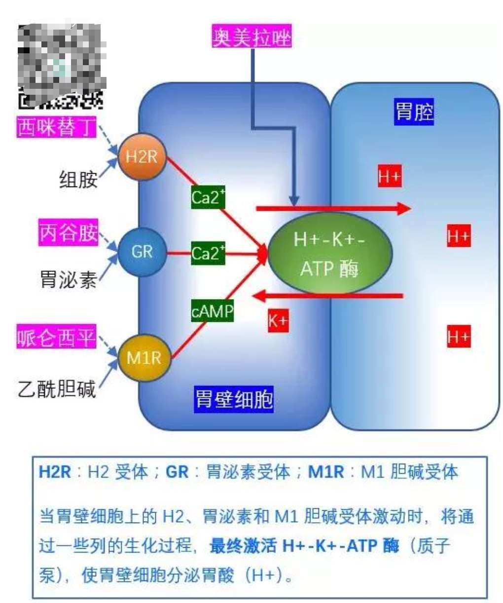

简单点判断民营医院几个原则：[哪些民营医院（包括被承包的公立医院）属于「莆田系」？ - 知乎](https://www.zhihu.com/question/23539856/answer/24885363)  
曾经投放百度竞价广告、曾经被媒体报道过医疗欺诈事件、与莆田系存在直接关系的医院目录名单：[GitHub - open-power-workgroup/Hospital: OpenPower工作组收集汇总的医院开放数据](https://github.com/open-power-workgroup/Hospital)

毛巾牙刷不要放在不通风、湿度大的卫生间因为容易滋生细菌  

长沙的文先生在3月23号接受了一次开颅手术，医生从他的大脑中取出了一条长达11厘米的寄生虫。经了解，两年前文先生在杀青蛙的时候手受伤了，寄生虫的幼虫从这个伤口里面爬到血管里面，再从血管里面寄生到脑袋里面去。民间传说用青蛙肉和蛇肉贴敷眼、颌面等处的伤口或脓肿，有清凉解毒的作用。若蛙肉或蛇肉中染有裂头蚴，裂头蚴这种寄生虫就会从贴敷处的皮肤、粘膜、伤口侵入人体

嘌呤极易溶于水，你吃500g肉，你朋友A吃500g肉，朋友B吃400g肉等等都用一口锅涮，这一锅水可就不知道溶了多少嘌呤了，此时就算你涮一片大白菜，我估计嘌呤含量也不逊于一块鸡胸肉，最好先涮菜，再涮肉。在捞夹食物时，应尽量沥净汤汁，以减少嘌呤的摄入。更不要贪图鲜美，去喝火锅的汤汁，煮越久的汤嘌呤含量越高，痛风患者首选是自己在家打火锅，用清水作锅底，可以保证用量、用料和食物的新鲜。如果实在是要去外面吃，那就请坚定地对服务员说：“我不要骨头高汤，也不要什么菌汤，清汤也不要，给我清水就好！  

而我们吃的动物性食物里面，比如鸡鸭、猪肉、牛肉和羊肉，主要成分是肌肉纤维。而肌肉纤维除了含蛋白质和水以外，还有大量的细胞核。细胞核里面含有大量的嘌呤，在煲老火汤的过程中，蛋白质这样的营养成分其实大部分还是留着了肉里面，而肉中嘌呤则溶解在汤里面。看来，一碗小小的老火肉汤，可以说是一碗满满的嘌呤浓缩精华。喝汤不吃肉的行为，虽然肉是少吃了，但肉里的嘌呤却没少吃，尿酸自然是降不下来的。煲汤前先用沸水将肉类氽烫几分钟后，去旧水，加入新水再煲，就可去掉大部分嘌呤。但是还是建议大家要少喝肉汤哦，以免引起尿酸升高，诱发痛风

最常见的忽悠就是拿保健食品当保健药品来推销。目前正规的保健药品只有一种准字，和国内所有药品的准字是一样的，就是「国药准字」。 如果有商家大吹特吹保健品的「药效」，但你打开说明书一看是「卫食健字」或「国食健字」，那其实只是一款保健食品。更过分的是说明书上写「卫药健字」，这是假药无疑，因为「卫药健字」这种批准文号早已被废除了。 即便是注明了「国药准字」的药，也建议去国家食品药品监督管理总局网站的「数据查询」一栏，查一查这个准字是否对应这个药。一些假药的说明书上会印一个看上去很正规的国药准字批准文号，但你去查了才发现，根本就是张冠李戴

热饮致癌这个观点，不是第一次出现了。在既往研究中，进食过烫和食道癌的关系已经很明确。 食道癌，是世界上第八常见的癌症。 我们的口腔和食道表面，覆盖着娇嫩而脆弱的粘膜。 适宜的进食温度是 10℃～40℃， 能耐受的高温也只在 50℃～60℃， 超过 65℃ 便足以烫伤粘膜。 当然了，食道癌的发生和发展不是朝夕之事，偶尔的烫伤，食管还可以自我修复。但是食管在长期反反复复「损伤 - 修复 - 损伤 - 修复 -」的过程中，不正常的「异型性」细胞会越来越多。 长期吃烫食、喝热饮，就算不得癌，口腔溃疡、食管溃疡等问题也在所难免。怎么判断温度超过 65 ℃？随身带温度计，总不现实吧？ 把热饮热食，放一放、凉一凉，用嘴唇抿一抿、试一试，感觉不烫口一般就可以了。像火锅这样含油量较高的，温度下降得会稍微慢一点。用勺子筷子搅动液体的食物可一定程度上加快温度下降，出门在外用嘴吹可能有失仪态，在家可以用风扇吹加快温度下降，或往液体食物里加入冰块

大医院也分专家号和普通号。一般的建议是初次看病，挂普通号，无论是专家，还是普通年轻医生，在病人第一次就诊时都需要做检查、了解疾病情况。而这些检查不管是谁开，结果都没太大差别。 第一次就诊时，选择普通号，做好检查和初步病情判断。如果普通门诊医生觉得自己不能解决的，也会联系上级专家来查看。疑难杂症，挂专家号 ,对于一些患有疑难杂症，已经去过了很多医院，各种抽血化验单、X 片、CT 等都是一堆，但最终还是没有得到明确诊断的，可以挂专家号。

H7N9 是一种禽流感，顾名思义，这是一种由甲型流感病毒引起的一种禽类（家禽 / 野禽）传染病，之所以叫它禽流感，而不是流感，是因为这种流感病毒一般只在禽类传播，绝大多数情况下是不会感染到人的。换句话说，其实禽类一直以来都受到禽流感的影响，病的病，伤的伤。 只不过绝大部分病毒不会感染到人，所以人不在乎，该吃吃，该炖炖。但是呢，有少部分禽流感病毒会对人类造成严重感染，而 H7N9 就是这少部分病毒的代表。根据现在的报道看 H7N9 病例主要表现为典型的病毒性肺炎，起病急，病程早期有高热（38 摄氏度以上），然后演变为呼吸困难，重症肺炎并加重，部分病例可迅速发展为急性呼吸窘迫综合征并死亡。因为现在看来，H7N9 主要还是禽类传染人，而不是人传染人，**H7N9 的主要传播方式大体是这样的**： 人类主动接触患病的禽类，比如直接接触到患病的家禽羽毛、血液、粪便等等。病毒通过消化道和呼吸道进入人体传染给人进而感染。 而患者通过家禽感染 H7N9 之后，不大会像其他传染性强的流感一样，持续性的「人传人」。虽然之前有报道过人与人之间传染的案例，但这种情况是很有限的，多是家庭聚集性病例。所以医学界普遍的共识是：H7N9 在当下条件暂时没有持续的人与人之间的传播证据。也就是说，H7N9 并不像流感等其它呼吸道传染病（比如 SARS）那样，会那么普遍地出现在人群中。这也是为什么新闻里，形容 H7N9 多用「散发态势」 这样的词语，因为从目前掌握的情况来看，由于还没有大规模出现人传染人的情况，公众感染 H7N9 禽流感病毒的风险并没有增加，虽然高发，但是仍然是散发的状态，只是因为年关将近，家禽市场活跃起来，购买禽类的人激增，加之当下的时节，天气变化大，人的免疫力也低，这样才一下子增大了传染的概率。如果留心观察 H7N9 的新闻，过去几年也都是在现在这个时候高发的。说起来，H7N9 有个很坑爹的属性。就是它虽然会对人造成感染，严重的会造成死亡，但是禽对禽类却是低致病性的，也就是说，禽类感染后多不发病，这使得我们难以通过禽类的发病和死亡来识别病毒的存在或借此限制传播。 所以，从大层面来说，最好的办法是有效切断禽 - 人传播途径。中国现有的禽流感病例，80% 的感染来源都是禽类接触或曾在活禽市场，因此减少接触活家禽，减少家禽现场宰杀，购买宰杀过的生鲜家禽，可有效消除禽流感传染源，并切断传播途径。**如果具体到个人，则可以采取如下措施：** 

尽量避免直接接触活禽类、鸟类或其粪便，假如有过接触，须尽快用肥皂洗手，也就是说没事不要玩鸡，也不要玩鸟，更不要玩 Shi；不要购买无检疫证明的鲜、活、冻禽畜及其产品；
生禽、畜肉和鸡蛋等，一定要烧熟煮透，加工处理生禽畜肉和蛋类后，要彻底洗手
若有发热及呼吸道症状，应带上口罩，尽快就诊，切记要告诉医生发病前的禽类接触史等。
疫苗还在实验中，现在还没有什么成熟的医药手段可以预防。民间一些服用某些汤药可以预防 H7N9 的说法基本是一派胡言。
现在还没有证据证明煮熟的家禽会传染 H7N9。

[空腹吃荔枝致孩子死亡？一文了解「荔枝病」 - 丁香园](https://endo.dxy.cn/article/565934)

用药助手那个 app 可以付费看到各种指南、专家共识

抽筋的原因一般有以下七种：  
1、寒冷刺激。如冬天在寒冷的环境中锻炼，准备活动不充分; 冬天游泳水温较低，都容易引起腿抽筋。晚上睡觉没盖好被子，小腿肌肉受寒冷刺激

2、肌肉连续收缩过快。剧烈运动时全身处于紧张状态，腿部肌肉收缩过快，放松的时间太短，局部代谢产物乳酸增多，肌肉的收缩与放松难以协调，从而引起小腿肌肉痉挛。 

3、出汗过多。运动时间长，运动量大，出汗多，又没有及时补充盐分，体内液体和电解质大量丢失，代谢废物堆积，肌肉局部的血液循环不好，也容易发生痉挛。 

4、肌肉疲劳过度。当长途旅行、爬山、登高时，小腿肌肉最容易发生疲劳。   

5、睡眠姿势不好，如长时间仰卧，很重的被子压在脚面，或长时间俯卧，使脚面抵在床铺上，迫使小腿某些肌肉长时间处于绝对放松状态，引起肌肉“被动挛缩”。

6、缺钙。在肌肉收缩过程中.钙离子起着重要作用。当血液中钙离子浓度太低时，肌肉容易兴奋而痉挛。 晚上睡觉时血钙离子浓度比白天低，所以最好是傍晚再吃钙片，老年妇女雌激素下降，骨质疏松，都会使血钙水平过低，肌肉应激性增加，而常发生痉挛。 另外青少年生长发育迅速，很容易缺钙，因此就常发生腿部抽筋。

跑 1000 米技巧：不要在弯道超人，因为一个弯道我们要多跑好几米，这几米很可能是最后决定胜负的关键，所以尽量在直道超，平时做一些下肢力量训练，如下蹲动作、跳台阶等，有助于增加下肢肌肉力量  

第一圈，对于体能比较好的人，抢个第一集团（前 3 的位置，最好是第 2 的位置）将非常有利于成绩的提高。不过对于普通的人来说，最好的位置在中间，也就是 5-7 位。在第一圈，不必要太过用力，紧跟前面的选手，他可以帮你档风，但是不要给第一集团抛离太多  
第二圈是提高成绩的关键，要做到和第一圈相同的成绩，是有一些困难，不过只要你注意一下，还是可以做到的。第一，要开始有意识的加大后登的力度（其实是你自己疲劳，力度减少了而已），从而加大你的步长。第二，身体适当的注意前倾（保持 85° 左右）从而带动自己的脚步。  
最后 100M 就是冲刺的时候了，就算你很累了，你也要把身体往前倾（80° 左右），让身体带动你跑，加快摆臂和跑步的频率，落地由脚后跟变成脚前掌，呼吸不需要坚持 2 步一呼吸的方式了，不过仍然要注意呼吸的深度。咬牙坚持到终点。

中长跑的后程（就 1000M 说，500M 以后就是后程了），跑步者的体内乳酸增多、氧债增大，人体已处于疲劳状态，在这种困难的状态下，跑步速度会自然而然的减低。要提高技术和跑速，确实是很艰难的。这时候就要求加大躯干的前倾，从而带动身体向前，为平衡这种前倾，自然要加强蹬摆的配合，增大上肢的摆动幅度 频率，加大步幅，降低点频率

跑步尽量坚持用鼻子吸气，不要用口吸气，尤其是在寒冷的天气里。因为用嘴吸气，冷空气直刺咽喉和气管，引起咳嗽，胃部吸入过多空气引起胃部不适，甚至引发岔气，令跑步难以坚持。用鼻吸气，鼻腔温暖了空气，鼻毛挡住了病菌，便可以避免这点了，在跑了一段时间或跑速加快之后，特别是在长跑比赛时，单位时间内的通气量要比平时增加几倍到几十倍，只用鼻呼吸不能满足呼吸需要，可以再加上口的呼吸。用鼻吸口呼或鼻口一起呼吸（鼻口一起呼吸吸入的氧气多一些），方法是: 口微开，轻咬牙，舌尖卷起，微微舔住上腭，让空气从牙缝挤出去。呼吸时，要做到均匀而有节奏。呼气要短促有力，有适当深度；吸气要缓慢匀和，两步一呼，再两步一吸；或三步一呼，再三步一吸。中途加速跑或比赛作终点冲刺时，应随着步伐的加快而相应加深和加快呼吸的深度和节奏。（吸气时不要吸至极致即吸气到最大，肺部和喉咙有些痛楚的状态，应在吸气到最大前呼气，否则容易呼吸肌疼痛），若感觉缓不过来就加快呼吸频率  

跑步时脚用前脚掌着地，使劲向后蹬，腿抬起来后向后不要抬得太高这样会加长你的滞空时间，给你创造好的成绩设下障碍，应该快速折叠收腿进行下一次送髋，但向前迈的时候一定用尽全身力气，迈开你的脚步，加快步频  
跑的时候一定要放松，跑的过程中手应该半虚握着，不要把拳握得很紧也不要咬紧牙齿把脖子绷得很紧，那样只会分散你的力量分布  
弯道技巧  身体向内侧倾斜，外侧摆臂要大于内侧，两脚前掌稍向内。同时弯道跑时要紧紧贴着自己跑道的跑线内侧来跑，算下来可以少跑二三米，弯道跑步幅稍大，频率稍低，这样可以节省体力。

可上网看下正确的跑步姿势的视频  

剧烈运动后不宜马上洗澡（无论是冷水还是热水）。运动时体内大量血液分布在四肢及体表，一旦运动停止，增加的血液量还要持续一段时间，此时如果马上洗澡，易导致血液过多地进入肌肉的皮肤，将使心脏和大脑的供血不足。 运动完后，最好休息 30-45 分钟，再洗澡  
三、不宜贪吃冷饮。运动后失水较多，往往口干舌燥、极想喝水，这时如喝下大量的冷饮容易引起胃肠痉挛、腹痛、腹泻等疾病。  
四、不宜蹲坐休息。长跑完慢走一段时间  
跑完后的肌肉放松：可以在跑完步之后慢走 1--2 分钟，对大腿和小腿的主要肌肉进行按摩，拍打，洗热水澡，做拉伸运动

运动前，吃点什么？运动后，吸收最好？：[是空腹运动，还是吃饱了再减肥？ - 丁香医生](https://dxy.com/column/4479)

# 牙齿

[误把三叉神经痛当牙痛 阿婆一口好牙几乎拔光-DV现场-荔枝网](https://www.gdtv.cn/tv/7f86552f961c566630c98fd2c5ad4d71)

塞牙时可以刷牙，用冲牙器 牙线

## 洗牙

洗牙前的个人情况咨询：  
有没有高血压、糖尿病、心脏病、血液病及其它系统疾病，有没有药物过敏，有没有正在服用的药物等等，这些内容相当重要，白血病深度洁牙后出血不止；糖尿病病人血糖控制不好，易感染；安有传统心脏起搏器或者做过瓣膜手术的患者排除超声洁牙禁忌症后，有些需要术前服用消炎药等等，总之一定要如实上报。  
一些牙周炎比较重的患者需要影像学检查，如拍全景片，了解牙周的状况，有些严重的还需进一步手术治疗。以及配合查血，了解凝血功能。如果有炎症，深度洁牙会造成比较严重的出血现象。必要时还要查感染全套，尤其是肝炎急性期，“大三阳”的患者是不能超声波洁牙的，一些朋友私信问我大三阳人群洁牙的问题，我详细说明一下：“大三阳”不建议洗牙，主要因为传染性太强。最好传染科医生会诊，把病毒控制住再去洗牙，另外还需要检查下肝功情况，全血和凝血情况

有时候对着镜子自己用手指扣黄色的牙结石也能扣下来一点

[科普①丨我们为了揭开洗牙的真相，连鹌鹑蛋都不放过，事实证明...... - 知乎](https://zhuanlan.zhihu.com/p/22055313)，先看这个  
 [洗牙的过程是怎样的？洗牙后有哪些需要注意的？ - 知乎](https://www.zhihu.com/question/20808679/answer/410818090)  

2021-03-25 大概刷了下知乎 google b 站 “超声波洗牙器”  
[小米有品众筹评测：素诺智能可视超声波洁牙仪，高清镜头祛除牙垢_哔哩哔哩 (゜-゜)つロ 干杯~-bilibili](https://www.bilibili.com/video/BV1p54y1471T?t=235), 相比于诊所医院的超声波洗牙，区别可能是频率小一点而且不是自动洒水  

网友：建议不要自己操作，牙齿上会有很多细小的隐裂，你自己给自己洗看不到，万一碰到了，会扩大裂痕  

[洗牙前验血有必要麽？？ - 知乎](https://www.zhihu.com/question/47115703)  
之前去过三甲医院和口腔诊所洗牙都是没有验血的  

[洗牙到底安全不安全？ - 知乎](https://www.zhihu.com/question/21031894/answer/17017915)  
[洗牙到底安全不安全？ - 知乎](https://www.zhihu.com/question/21031894/answer/194268254)  
 [医院可以拒绝乙肝携带者洗牙吗？ - 知乎](https://www.zhihu.com/question/64913982)  

超声洁牙的喷头和洁牙尖正规医院都是一人一套，用完之后就要送去消毒供应中心进行 10 多步各种高大上的仪器高温高压灭菌，再一次性打包的。一人一套, 医生手里拿的那个柄也是一人一套。没有换说明还不够正规  
美团上有些洗牙套餐，比较便宜，淘宝搜洗牙也有套餐

待刷问题：  
 [为什么在小诊所洗牙只要几十块，在地级市三甲医院要四五百？医院的隐形成本肯定高，只是技术差距有那么大吗？ - 知乎](https://www.zhihu.com/question/28022583?sort=created)  
 [去医院口腔科洗牙和去口腔诊所洗牙有区别吗？为什么很多专门的口腔医院洗牙团购价格低的离谱？ - 知乎](https://www.zhihu.com/question/28354792)  
 [洗牙在医院好还是美团找个牙科诊所好？ - 知乎](https://www.zhihu.com/question/42067266)

# 护唇  

处理已经干翘起的嘴唇死皮最好不要直接用手或牙齿或者其他工具直接的将它们撕掉，避免将嘴唇撕裂，出血甚至会引起感染问题。可以毛巾沾温水热敷嘴唇或涂润唇膏，等待 2 分钟左右，将唇上的脱皮充分的软化，用手轻轻在上下嘴唇各搓几下，死皮全部会搓下来。最关键是将死皮软化，软化后用嘴小心撕或手撕也没问题，吃饭时嘴唇不断接触热的东西也会软化死皮

在运动或者感冒鼻塞等时候，会忍不住用嘴巴呼吸。但是这个动作会使得大量的空气经过唇部，这样就会带走唇部的水分，导致嘴唇迅速干裂。

天气干燥的时候经常会看到有人不时的用舌头舔嘴唇，企图让嘴唇保持湿润的状态，但是其实这样是非常错误的做法，因为不但不可以滋润唇部的肌肤，反而会导致唇部的水分蒸发得更快，导致干燥问题更加的严重。快速用湿润的舌头舔一舔，嘴唇短暂湿润了，但是过一会儿会发现嘴巴干得更严重。这是因为口水里含有的消化酶等物质会破坏皮肤上的油脂成分。在唾液蒸发时，还会带走唇部更多的水分。

对牙齿有益的成分，不一定对嘴唇有益。事实上，残留在嘴唇上的牙膏会夺去宝贵和稀少的油脂和水分，造成嘴唇干裂，所以刷牙时要洗干净口唇  
如果嘴唇常常干裂的话，出门的时候不妨带一个口罩，戴口罩可以防风防晒，这样嘴唇比较不容易干，多喝水，身体缺水时嘴唇也会容易干裂起死皮

[口角炎](https://www.baidu.com/bh/dict/ydxx_8331848011690400915?tab=%E6%A6%82%E8%BF%B0&title=%E5%8F%A3%E8%A7%92%E7%82%8E&contentid=ydxx_8331848011690400915&query=%E5%8F%A3%E8%A7%92%E7%82%8E&sf_ref=search&sf_ch=ch_search_5386&from=dicta&isPageHome=1)  
天气比较干燥可以室内放个加湿器

用过的唇膏及时盖上盖子免得滋生细菌，开封后的唇膏保质期一般为一年。 辨别唇膏是否过了保质期方法很简单，当唇膏闻起来有异味，看起来有结块和变色的时候，特别是涂起来产生灼热感或各种过敏反应的话，便应该丢掉了

唇膏保质期过了可以用来擦氧化的银器、银饰，效果不错的。 可以用来当鞋油，擦皮鞋。 如果拉链发涩，可以用过期的唇膏来擦拭，因为唇膏含有油性成分。  
微量食用润唇膏没很大危害

过于频繁使用唇膏很可能会影响嘴唇皮肤的自我调节，形成恶性循环。常抹唇膏的人会习惯嘴唇上的这种湿润感，产生依赖性，正确的使用方法是一天涂 2~3 次即可

# 晕动病

[晕车晕船不用怕：抗晕动药物详解 - 丁香园](http://nurs.dxy.cn/article/505272?trace=drugs)

[治疗晕车和晕船症的药品列表 - A+医学百科](http://www.a-hospital.com/w/%E6%B2%BB%E7%96%97%E6%99%95%E8%BD%A6%E5%92%8C%E6%99%95%E8%88%B9%E7%97%87%E7%9A%84%E8%8D%AF%E5%93%81%E5%88%97%E8%A1%A8)

[孩子晕车，家长有什么可以做的？ - 丁香医生](https://dxy.com/column/3442)

个人经历：由于颠簸或刹车要稳住身体，腹肌不自觉用力，次数多了挤压腹部增加腹压，加上颠簸导致胃里的食物晃动，会造成反胃想吐的感觉，吞口水抑制这种想吐的感觉，久而久之头晕

从个人经历来看，晕车分两种，车内气味型晕车，运动型晕车（我自个儿造的词，将就着看吧），车内气味型晕车，车内乘客的一些汗臭味、汽油味等都刺激着人的嗅觉系统，有的人闻到这些气味就会晕车。我以前小时候对汽油味特别敏感，一闻必晕，做 10 分钟左右的车，立马能吐，跟要了半条命似的。相比来说，现在汽车的汽油味少了很多。总的来说，气味型晕车，我是没有什么应对经验，据说吃晕车药和吃较酸的水果（李子，橘子等）可以得到一些改善。再说说运动型晕车，人在运动的时候都是主动的控制平衡，而坐车是被动的，车的走向和颠簸程度，比较难预知，被动的控制平衡就会导致一系列生理反应，越想控制平衡，生理反应越激烈，从而会更晕车。从个人经验来看，避免这种类型的晕车，就是减少控制平衡的欲念。方法，坐 1/2 的坐垫（座椅前半部分），上身放松，不能倚靠靠背或者车壁，手抓着前座或者其他把手，手臂弯曲，放松不需要大劲儿，在车有急刹等情况时上身顺势前倾或后仰，弯曲的手臂起到缓冲的作用，避免磕伤摔倒即可。总的来说就是放松，减少被动去控制平衡的欲念。

晕车很难受可尝试深呼吸

我还尝试过清凉油、风油精、保心安油、双飞人、斧标驱风油等各种提神醒脑用精油涂抹太阳穴和耳根，这些神油的原理在这里就不妄言，以我神农尝百草的经历来说，效果可以忽略不计，专用的防晕车精油和晕车贴还有点用，也是作用于太阳穴和耳根，号称能持续 8 小时以上，不过我觉得顶多也就 4 小时吧，还是那句话因人而异。图为晕车贴，各个牌子功效都大同小异。

闭上双眼。睡觉（如果可以）。闭上眼睛就看不见任何东西，消除了造成晕动病的因素。此外，睡觉也能有效地让你不去想晕车这件事

保持良好的环境，不抽烟、及时通风换气、减少汽油等特殊气味对嗅觉的刺激

选择各种交通工具中颠簸幅度最小的座位，如汽车中靠近前中部的座位，飞机中部靠近机翼的座位，或船上中部尽量与甲板同一水平的座位。  
在上下颠簸剧烈的船舶中，如果条件许可，可以采取头向运动前方的水平俯卧位，这样可以减低频繁颠簸对平衡感受器的冲击。

即使你采取了所有预防措施，可能还是会晕车。准备一个一次性防溢呕吐袋。你也可以使用干净的空冰淇淋桶（附带盖子）。确保没有异味，才把它放在车里备用。盖子能很好地盖着里面的呕吐物，避免它们溢出。而且冰淇淋桶也很容易洗擦及重复使用。

---

以下方法有待验证：

注意调整姿势和呼吸，乘车时最好面向前并看着交通工具前进的方向。

晕动病发生时，最好采取闭目仰卧的姿势。如果只能坐着，可以把头紧靠在固定的靠背或物体上，避免大幅度的摆动，同时打开窗户，呼吸新鲜空气

想要避免晕车，或是如果你想在车上阅读、发简讯或使用电子设备，你可以在感觉不适前，像握着杯子一样屈起手掌放在眼睛前，挡住车外移动的物体。车外不断移动的物体是造成晕车的主要原因。你也可以戴防晕车眼镜，将车外不断移动、一闪而过的物体挡在视野外。

闻一闻新鲜的橙皮或柠檬皮。刚剥下的橙皮或柠檬皮散发的味道有助于预防恶心。

在车上放一些小苏打备用。如果你吐在汽车坐垫上，可以马上将小苏打撒在呕吐物上，消除异味，之后也能帮助清洁。

乘车前 1 小时左右，将新鲜桔皮表面朝外，向内对折，然后对准两鼻孔两手指挤压，皮中便会喷射也带芳香味的油雾。可吸入 10 余次，乘车途中也照此法随时吸闻。  

行驶途中将鲜姜切片，装于小塑料袋内随身携带，乘坐交通工具时随时放于鼻孔下面闻，使辛辣味吸入鼻中。

乘车前 5-10 分钟，饮一杯加有几滴食醋的温开水，途中也不会晕车。  

晕车的初期使口腔产生过量的唾液，这些唾液滴入胃内，产生恶心的感觉,橄榄及柠檬所产生的鞣酸，能使口腔干燥。因此，在出现恶心的初兆时，吃点橄榄，有助于消除恶心

另外，你也可以尝试吃姜糖（咀嚼片）、蘸了糖的姜或姜味薄荷糖。

如果是长途旅行，你也可以考虑准备姜茶，放在保温瓶里随时饮用

你也可以在药房购买生姜胶囊片服用，它含有高浓度的生姜成分

新鲜的薄荷叶也能治疗或舒缓恶心。一开始先吃 2 片薄荷叶，如有必要可以多吃。

嘴里含着薄荷糖（或是任何可以含很久而不会融化的硬糖）。即使你已经开始感到恶心，这个方法也能有效舒缓症状。不要咀嚼糖果，因为糖果融化后，恶心的感觉或许很快就会到回来。有的人闻到或尝到薄荷后，恶心症状反而更严重，在这种情况下，柠檬糖可能更有用。

含外用酒精的湿纸巾也能有效舒缓恶心。拆开湿纸巾，在纸巾轻轻擦过鼻子时闻一闻它的味道。

尝试闻报纸的味道。阅读报纸很可能会让你晕车，你只需随身携带，但不需要阅读。如果手边没有报纸，你可以从美术用品店购买新闻纸速写本（味道和报纸一样），然后放在车里。   

在旅行前和旅行途中吃腌黄瓜，或任何酸味食物，例如话梅，或许可以防止恶心。   

咀嚼口香糖吃咸饼干或其它稍咸的小吃。

# 幽门螺杆菌  

幽门螺杆菌简称 HP(Helicobocton Pylori)、H.pylori

[第五次全国幽门螺杆菌感染处理共识报告 - 中华消化杂志](https://rs.yiigle.com/CN311367201706/993370.htm) 中提到，“尽管 H.pylori 感染者中仅 15%～20% 发生消化性溃疡 [8]，5%～10% 发生 H.pylori 相关消化不良 [9]，约 1% 发生胃恶性肿瘤 (胃癌、MALT 淋巴瘤)[10]，多数感染者并无症状和并发症，但所有 H.pylori 感染者几乎都存在慢性活动性胃炎 (chronic active gastritis)，亦即 H.pylori 胃炎 [11,12]。H.pylori 感染与慢性活动性胃炎之间的因果关系符合 Koch 原则 [13,14]。H.pylori 感染可以在人→人之间传播 [15]。因此 H.pylori 胃炎不管有无症状和 (或) 并发症，都是一种感染性疾病，根除治疗对象可扩展至无症状者“，共识报告还指出根除指征、诊断方法、根除治疗方式等

[第六次全国幽门螺杆菌感染处理共识报告(非根除治疗部分) - 中华消化杂志](https://rs.yiigle.com/CN311367202205/1379799.htm)  
中国儿童幽门螺杆菌感染诊治专家共识（2022）

用药助手那个 app 可以付费看到各种指南、专家共识

[50%中国人感染幽门螺杆菌，到底需不需要治疗？还会复发吗？哔哩哔哩bilibili](https://www.bilibili.com/video/BV1Zv41147h4/)

幽门螺杆菌被彻底杀灭后，人体是否还会再次感染？因为人一旦感染幽门螺杆菌，体内便会产生免疫力，细菌被彻底杀灭，机体还可以继续抵御以后的传染，所以再次感染的机会是很小的。

 [和患有幽门螺杆菌的人一起吃饭，会不会被传染？ - 知乎](https://zhuanlan.zhihu.com/p/44284186) 提到：

 >传播途径还是离不开“口”，包括“粪－口”传播、“口－口”传播、“胃－口”传播。
 >
 >“粪—口”之所以可能传播，是因为寄居在胃粘膜上皮中幽门螺杆菌随着胃粘膜上皮的更新而脱落，经过胃－十二指肠－小肠－大肠，最后从粪便中排出，而如果你吃了被排泄物污染的食物和水源，那就有可能被感染上。不过呢，这一般情况下是很难的，因为正常情况下，十二指肠液会杀灭幽门螺杆菌，幽门螺杆菌很难突破这一屏障，但如果由于出现一些病态情况，比如胃酸缺乏，腹泻，幽门螺杆菌侥幸从胃一直到小肠大肠最后到粪便中排出，也不是完全没有可能。但不管怎样，这种途径机率很小。
 >
 >“口—口”和“胃—口”传播途径可能是主要的途径。幽门螺杆菌寄居在胃粘膜上皮，而胃粘膜上皮是不断更新脱落的，那么幽门螺杆菌也当然会随之脱到到胃液中。前面说了，幽门螺杆菌很大难突破十二指肠液的屏障，但它可以在胃液中存活，它不能往下走，但它往上是可以的，通过胃食道反流，有可能进入到口腔中，从而滞留在口腔中特别是牙菌斑中，最后通过唾液传播给他人。
 >
 >怎么知道自己有没有被传染呢？从症状上自我判断。排除口腔内病变的口臭。由于幽门螺杆菌可以在牙菌斑中生存，在口腔内发生感染后，会直接产生有臭味的碳化物，引起口臭，可以说幽门螺杆菌是引起口臭的最直接病菌之一。具有非常明显的胃肠疾病症状，感染幽门螺杆菌的人群多出现餐后嗳气、恶心、腹胀、腹部不适等消化系统症状，这些症状随时都会出现，有些患者自我感觉不太明显，有些感觉比较明显。

如果感染者发生呕吐、或者胃液反流，直接接触到了呕吐物或反流的胃液，会增加幽门螺旋杆菌的感染风险。

传播途径：中国保守的喂养方式，家长将食物嚼碎之后再喂给孩子，如果家长感染 hp，就会将病菌通过口口喂养的方式污染给孩子，喝 HP 患者喝过的饮料。恋人之间的亲吻，共用牙刷水杯，幽门螺旋杆菌广泛存在于感染者的唾液、牙菌斑、粪便中。打喷嚏传播：患者打喷嚏把口腔的部分唾液喷出

此外，还有一类特殊的途径，即医源性感染，主要是为感染者进行消化内镜检查后，未彻底灭菌，可导致为其他人检查时传染幽门螺杆菌。

[ 经此一“疫”，我们今后应该如何推进公筷公勺以及分餐进食？ - 知乎-生命时报的回答](https://www.zhihu.com/question/381084375/answer/1099386727)

预防：吃围餐尽量使用公筷，独立餐具，分餐制，避免唾液里的细菌通过筷子传播到食物上并相互传染。公筷是公用的筷子，即大家用来夹菜的筷子， 放在盘上， 大家拿来用，不过不能放到口里， 是为卫生问题设计的。私筷是大家各自的筷子。对于刚会进食的宝宝或者吃饭时难“伺候”的幼儿，父母最好不要用口嚼食物喂他们。碗筷用消毒柜高温消毒

分餐制主要形式有三种：厨师分餐，厨师在厨房将制作的菜点成品按每客一份分配，由服务员送给每位就餐者进食；服务员分餐，餐厅服务人员在分餐台或台面将菜点成品分配给每位就餐者进食；就餐者自行分餐，就餐者通过使用公筷、公勺等公用餐具分取菜点成品，再用各自餐具进食。分餐包括自助餐、快餐、盒饭、食堂打饭等，是相对于宴会、聚餐、在家吃饭等“合餐”形式而言

定期体检：已有家庭成员明确诊断幽门螺杆菌感染后，与其生活在一起的其他成员阳性率非常高，因此应及早防治。

感染者需积极治疗：幽门螺杆菌感染常常呈现家族聚集的现象，所以为了有效的根除幽门螺杆菌，防止二次感染，则应积极治疗幽门螺杆菌感染的家庭成员，避免感染其他人。

做到饭前、便后洗手，尽量吃经过高温加热的熟食因为高温能杀死幽门螺杆菌，避免吃生食因为生食可能沾有做菜人的一些唾液且没洗掉，喝开水，生吃瓜果蔬菜时洗净、去皮因为水果的皮上可能沾有一些人的唾液

[医院如何检测幽门螺杆菌？ - 知乎](https://www.zhihu.com/question/49130763)

[幽门螺杆菌呼气试验](https://www.baidu.com/bh/dict/ydjc_4000270886881540586?tab=概述&title=幽门螺杆菌呼气试验&contentid=ydjc_4000270886881540586&query=c13呼气试验&sf_ref=search&sf_ch=ch_search_50581&from=dicta&isPageHome=1)

哺乳动物细胞中不存在尿素酶，且在胃中尚未发现有其他种类的细菌存在，故人胃中存在尿素酶是幽门螺杆菌存在的证据。患者口服尿素 c13 后，如果胃中有幽门螺杆菌，其产生的尿素酶能迅速将尿素分解为二氧化碳和氨气，二氧化碳经血液进入肺而呼出体外。收集患者呼出的二氧化碳，测量呼气中 c13/c12 同位素比值的变化，即可诊断胃内有无感染幽门螺杆菌。

一般通过 c14 或 C13 呼气检查即可检查出是否感染 hp，只要患者口服碳同位素标记的药物前后对着检查袋吹口气，仪器就可以测出患者是否有幽门螺旋杆菌感染，整个诊断过程大概只要 30 分钟。复查吹气必须在治疗结束后 4 周才能进行，这是防止细菌未完全清除只是进入休眠状态，从而出现假阴性，C13 和 C14 检查都是如今检测幽门螺杆菌所常用且较为敏感的测试，在本质上没有什么区别。主要的区别点是 C13 是 C14 的改良版，没有放射性，由于是稳定性核素，对人体无损害，敏感性和特异性较高，更适合孕妇以及儿童。虽然 C14 有一定的放射性，但是对于普通的成人来说，C14 就足够了，目前为止未发现不良报道。c13 大约 250 块，c13 比 c14 要贵

进行 C13 呼气检查的步骤:

1. 收集第 1 次气体：使用集气袋收集气体时，被检测者维持正常呼吸，屏住呼吸 10 s 以上，然后呼出前半段气体，弃去，再把肺部的末段气体吹进集气袋内，直至气袋充满后，立即盖紧集气袋。使用收集管收集气体时，被检测者正常呼吸，勿深呼吸，呼气时吸管应插入收集管底部，平缓呼气吹入收集管，持续 4~5 s（呼气不可中断），呼气的同时缓缓拔出吸管，吸管离开管口后，迅速拧紧收集管盖子。收集好后做好标记，此时收集的为样本气体

2. 吞服尿素 13C 试剂：收集第 1 次气体后，马上服用尿素 13C 试剂。若尿素 13C 试剂为颗粒剂或散剂者，建议第 1 次呼气操作前后清洁口腔（清水漱口），服用胶囊者不必清洁口腔。服药后应保持静坐，禁食，禁烟，等待 30 min，避免剧烈活动。

3. 收集第 2 次气体：服药等待 30 min 后，操作步骤同第 1 次气体收集，将气体吹进集气袋或收集管内，此时收集的为服用尿素 13C 试剂后 30 min 的呼气样本（样气）。切忌从吸管吸出已呼入收集管中的气体，

进行 C13 呼气检查的注意事项：

1. 检测前至少停用各类抗生素 4 周，停用质子泵抑制剂（PPI）、铋剂、H2 受体拮抗剂等 2 周，停用有抑菌作用的中药 4 周，否则会造成检测结果假阴性

2. 试验者禁食至少 2h 或早上空腹再进行呼气检查

3. 上消化道急性出血可使 hp 受抑制，有可能造成检测结果假阴性，消化道出血一周以上不影响诊断

4. 曾行胃切除手术可能会导致假阳性或假阴性情况

如果查出来感染 hp 可以把之前使用的筷子牙刷全换掉或进行水煮消毒，洗个牙 (幽门螺杆菌存在于牙菌斑)，沸水煮 15-30 分钟可杀死幽门螺杆菌  
Hp 治疗结束停药至少 4 周后方可复查 Hp 是否已被根除，否则可呈假阴性

[根除幽门螺杆菌治疗失败的4大原因！-MedSci.cn](https://www.medsci.cn/article/show_article.do?id=7d9813538ed6)

第一次没杀死一般要隔半年左右才能第二次用药，防止细菌耐药性

# 胃炎

[空腹不能喝牛奶？真正不能空腹吃的东西被你忽略了 - 丁香医生](https://dxy.com/column/31391)

避免过度饥饿和过度饱，吃饭吃个七分饱即可，别暴饮暴食，定时吃饭尽量别饿了再吃，别饿一顿饱一顿因为会导致胃酸分泌紊乱

对于肠胃强大的人可能不是什么大事，但很多有胃部不适、消化不良、身体虚弱问题的人，在空腹状态下吃太多冷冰冰的东西，会刺激胃肠发生挛缩，甚至诱发胃痛、腹泻等。含有很多辣椒的辛辣食物，或者味道过酸的食品，会对胃黏膜造成强烈的刺激特别是空腹的时候，引起胃肠痉挛、绞痛，影响消化功能，特别是有消化道溃疡等问题的人，吃辣之后喝些牛奶保护胃黏膜，一饿就胃疼很可能是胃里有溃疡，喝酒前吃点东西垫肚子减少酒精对胃的刺激，胃炎患者尽量少喝酒

一般来说，如果胃酸、胃部灼热感比较明显，应尽量避免酒、咖啡、碳酸饮料、辣等刺激性食物及油腻食物；胆汁反流性胃炎患者不要吃过分油腻的食物，以免刺激胆汁分泌增多，加重胆汁的反流 ，避免吃太多粘粘糯糯的东西例如糯米和很坚硬有韧性的东西因为不好消化，避免吃太多生冷和冰凉的东西，尽量在固定的时间点吃饭，不要经常不吃早餐，不要经常熬夜，如果需要熬夜例如你需要熬夜到 3 点 则可以在 11 点左右吃点容易消化的东西例如面包牛奶  

尽量细嚼慢咽，把食物嚼烂点，避免吃得太快、囫囵吞枣地吃因为这样容易吃进许多空气而且不容易消化，仔细咀嚼每一块食物有助于食物进入胃肠道之前的分解，减轻消化系统负担。吃水果可以用榨汁机直接喝更方便消化，含大量碳水化合物（淀粉）的食物更要在口腔里嚼久一点，因为人类只有胰腺分泌淀粉酶和口腔唾液中含有淀粉酶  

积极治疗口咽部感染灶，勿长期将痰液、鼻涕等带菌分泌物吞咽入胃。积极通过刷牙冲牙器等清理口腔，否则口腔滋生很多细菌，吞咽时一并经过喉咙吞入胃中，容易引起慢性咽喉炎，虽然胃液有一定的杀菌功能，但长期这样也可能引起慢性胃炎

长期处于紧张、焦虑、抑郁、恐惧等精神压力下容易引起功能性消化不良

[2016-8 中国皮肤清洁指南.pdf](http://60.205.159.92/pdf/%E7%9A%AE%E8%82%A4%E6%80%A7%E7%97%85%E7%A7%91/%E4%B8%AD%E5%9B%BD%E7%9A%AE%E8%82%A4%E6%B8%85%E6%B4%81%E6%8C%87%E5%8D%97.pdf) 中提到，沐浴禁忌：忌空腹、饱食、酒后洗澡，忌较长时间体力或脑力活动后马上洗澡。因为上述情况可能造成大脑供血不足，严重时还可引发低血糖，导致晕倒等意外发生  
刚吃完饭时，为了消化吸收，会有大量血液流向胃肠道，饭后立刻洗热水澡时在热水刺激下，皮肤血管扩张，一部分血液会流向体表。于是，留给大脑的血液就不多了，如果再加上本身血压偏低的话，就很容易发生晕厥。

饭后胃肠道正属于消化高峰期，大量血液聚集在胃肠道，立刻进行大量运动，导致血液就往四肢骨骼肌分布，留在胃里面帮助消化的血液就变少了，饭后立刻运动还容易刺激胃因为胃内装满食物，如果进行大幅度剧烈运动，可能造成食物反流  
其实关于吃完饭不能马上运动否则影响消化的说法，相信很多人都知道。那饭后究竟该如何运动呢？微医君在这里也统一整理了一下。  
饭后半个小时：以休息为主，不要进行剧烈运动。  
饭后 1 到 2 个小时：这个时候，食物消化的最高峰基本过去了，一般的运动如快走、慢跑等都可以慢慢展开了。  
饭后 2 到 3 个小时：可以进行各类运动，比如长跑、跳绳、踢足球、打篮球等。

吃完饭可以把腰带松一下减轻腹压，这样胃不容易反流想吐，感觉大腿与上半身的角度变小挤压腹部也会增加腹压例如弯腰，腹肌用力也会增加腹压。饭后不要立刻坐下，可以站着玩电脑一小时后再坐，因为坐着容易反流而站着不容易，饭后不要立刻长时间弯腰蹲下，因为腹压增加容易反流

饱饭一顿后别急着开车，饭后胃肠对食物的消化需要大量的血液，所以会造成大脑暂时性相对缺血，反应也变得迟钝，注意力下降。

避免胃胀嗳气：大口吃东西太快会导致吸入大量的空气，闭嘴咀嚼会有所帮助，一边吃一边说话，则容易把空气连同食物一起咽下去，直接从杯子中喝水，而不要用吸管吸。用吸管喝饮料时，会有空气随着饮料一起进入胃部，而小口小口直接从杯中喝水则能大大减少进入胃部，尽量抑制打哈欠的冲动因为打哈欠会吃进不少空气。如果你确实非常想打哈欠，就尽量保持嘴巴紧闭，等待这股冲动过去。平时少吃会产生较多气体的食物。焗豆、小扁豆、西兰花、小椰菜、白菜、花椰菜、莴苣、洋葱、都会在消化过程中释放出气体，这就可能引起打饱嗝和肠胃气胀。笋干、芹菜、西兰花等富含膳食纤维的食物或红薯、土豆等淀粉密度高的食物也会产生较多气体容易形成放屁现象，少喝碳酸饮料，腰部太紧的裤子加大腹压容易引起打饱嗝

洗澡时，在温水刺激下，四肢及全身皮肤血管扩张，致使血液汇集在身体表面，胃肠血流量就会相应下降，消化液分泌减少。若经常饭后洗澡，久而久之可引起消化不良。另外，饭后立即洗澡，还会导致心脏供血不足，诱发心脑血管疾病  

很多人有饭后饮茶的习惯，实际上，这会给健康埋下隐患。饭后马上喝茶，茶叶中的茶多酚容易与食物中的铁质、蛋白质等产生络合反应，从而影响人体对铁质和蛋白质的吸收  

吃饱饭后立刻平躺、睡前吃很多食物，长期以往，容易引起胃食管反流

---

来源：[烧心反酸，胃食管反流，应该怎么办？ - 丁香医生](https://web.archive.org/web/20170720060118/https://dxy.com/column/4372)

带着酸味的消化物从胃里反流到咽部或口腔，这样的滋味可真不好受……

不少人都把「反酸」当成一种生理现象，实际上，可能已患上了一种极为常见的疾病——胃食管反流病。

这个疾病并不少见，根据对北京、上海的问卷调查统计，大约 20 个人里，就有 1 人患有该病。

这是种什么病？  
胃食管反流病，顾名思义，胃里消化了一半的食物会反流到食管甚至口腔的一种疾病。

该病最常见的症状是：烧心和反酸。

烧心：是指胸骨后的烧灼感，常在餐后 1 小时左右出现。

反酸：有反酸问题的患者则会感受到一股热流从下往上涌到胸口正中，并有烧烫感、刺痛感。

有些患者还会出现胸痛、吞咽困难，或者咳嗽、咽部不适、胸闷心慌等非消化道症状。

临床上常有人因胸痛、胸闷、心慌，去看心血管内科，最后转诊回消化内科确诊胃食管反流病。

为什么会有这种情况？  
正常情况下，食管是这么工作的：

蠕动着将吞咽的食物缓缓送达食管下端，此时下端的食管下括约肌松弛，允许食物进入胃内；等食物进入胃中，食管下括约肌又恢复其张力，把住入口，防止食物从胃里反流入食管。

这一肌肉就像一道闸门，食物通过后，闸门应该关闭。如果关不紧，再加上有时门里的压力过大，就会导致食物返回食管，引起不适。

所以，当「把门」的食管下括约肌因某种原因松弛，伴有或不伴有胃内压增高（暴饮暴食、胃排空延迟等）、腹内压增高（怀孕、腹水、负重劳动等），就会引起反流症状的出现。

另外，食管蠕动和唾液分泌的异常以及消化道粘膜的损伤，也可导致该疾病的发生。

怎么诊断？  
医生会根据症状，结合胃镜、pH 监测等检查结果，综合分析判断。使用抑制胃酸的药物试验性治疗，如果可以明显缓解症状的话，也有助于确诊本病。

需要强调的是，早期食管癌也可单纯以烧心、反流这些胃食管反流病的典型症状为表现。所以如果存在上述情况，别忍着，及时去消化内科，听听医生的建议。

烧心反酸怎么办？  
确诊胃食管反流病后，大部分患者需要系统性的药物治疗。

医生会根据个体情况选择长期、短期或症状发作时服药。

首选药物是制酸药，一般选择各种叫「拉唑」的药物（质子泵抑制剂），通过抑制胃酸分泌，降低胃内容物酸度起到治疗作用。

对于部分夜间发作严重的患者，有些医生还会嘱咐在睡觉前加用一类叫「替丁」的药物（H2 受体阻断剂）。

根据具体情况，促胃肠动力药物，比如西沙必利；或是胃黏膜保护剂，例如磷酸铝、铝碳酸镁等也可使用。它们通过改善食管蠕动功能、促进胃排空、保护受损的食管粘膜，达到治疗的目的。有部分患者甚至需要加用抗焦虑、抗抑郁类药物。

具体药物选择、联合种类、疗程，强调个体化，所以务必在专业消化科医师指导下进行。

至于极少部分不耐受药物、药物治疗无效、出现严重并发症或怀疑有癌变可能的患者，可能需要通过手术或内镜下治疗。

生活方式的改变也有用？  
有用！

有数据表明，约 20% 的患者可单纯通过调整生活方式来改善症状。比如：

避免餐后立即平躺或立即运动、劳作；  
睡前 3 小时不进食，可抬高床头 15～20 厘米，利用重力作用加强酸清除作用，减少睡眠时反流；  
避免腹压过高的状况发生，如便秘、肥胖、系过紧的裤带；  
控制茶、咖啡、巧克力、高脂食物、酸辣刺激性食物的摄入量，因为这些食物可以导致食管下端肌肉张力下降；  
戒烟戒酒，因为烟草、酒精可通过多种机制导致胃食管反流病的反复发作；  
调节心理平衡，因为应激也是胃食管反流病的一种致病因素。

-----

[胃食管反流，反酸、烧心…这些食物要注意！|丁香医生](https://dxy.com/article/79487)

促胃动力药与抗胆碱药（如阿托品），两者药理作用相拮抗，不宜联用；胃促动药还会缩短其他药物在胃内的作用时间，可能降低后者疗效；如需联用，服药时段应错开，如餐前半小时服胃促动药，餐后 2～3 小时服黏膜保护药；先服抗酸药，一小时后再服胃促动力药。

（一) 抗酸药。常见的是铝碳酸镁（达喜），铝碳酸镁还有结合吸附反流到胃中的胆汁的胆酸的功能，中和胃酸的同时也会使胃蛋白酶失活，所以消化能力变差

1）吸收性抗酸药：如碳酸氢钠，经口服后除在胃内中和胃酸外，易被肠道吸收而引起碱血症，还可用于酸血症和碱化尿液；

2）非吸收性抗酸药：如氢氧化铝、铝碳酸镁、碳酸钙、氧化镁、三硅酸镁，含有难吸收的阳离子，口服后能直接中和胃酸，而不被胃肠道吸收。此外，胶体制剂如氢氧化铝凝胶、三硅酸镁除能中和胃酸外，还可在溃疡面形成一层保护性薄膜，减少胃酸和胃蛋白酶对溃疡面的腐蚀和消化作用。

[这些年用过的抗消化性溃疡药物（抗胃酸篇） - 丁香园](http://yao.dxy.cn/article/512070)

[抗酸药 - A+医学百科](http://www.a-hospital.com/w/%E6%8A%97%E9%85%B8%E8%8D%AF)

铝碳酸镁与胃酸反应的化学方程式为：Al₂Mg₆(OH)₁₆CO₃·4H₂O+18HCl=2AlCl₃+6MgCl₂+CO₂↑+21H₂O，因为会产生二氧化碳所以可能导致胃胀

（二）促胃肠动力药

以下来自一篇 06 年发表的文献叫 [促胃肠动力药的作用机制及临床应用研究进展 ](https://www.doc88.com/p-1106887349732.html)：临床上常用的促胃肠动力药有四代，第一代如甲氧氯普胺，商品名为胃复安、灭吐灵，是具有胆碱能特征的多巴胺受体拮抗剂，甲氧氯普胺有较多的中枢性副反应, 早期用于治疗上消化道动力障碍如功能性消化不良、胃轻瘫等, 目前已经被二代, 第三代及第四代促动力药所代替, 但由于胃复安有注射剂, 并有止吐作用, 临床上目前多作为止吐药使用 ， 第二代促动力药是多潘立酮, 商品名为吗丁啉, 为外周多巴胺受体阻滞剂, 临床应用广泛，第三代是西沙必利, 是一种化学结构上取代了烷化苯丙咪唑的甲氢氯普胺，但近年临床发现在西沙必利高敏患者中可出现 Q-T 间期延长或导致尖端扭转性室性心动过速 , 对于其在临床进一步应用, 还有着很大的争议，第四代为莫沙必利, 为非选择性 5-HT4 受体激动剂, 是新型促胃肠动力药物，安全、有效, 临床正在广泛使用 ，目前最新的胃肠动力药为替加色罗和伊托必利, 分别为 5-HT4 受体部分激动剂 和多巴胺受体阻滞剂 ， 另一种促动力药为红霉素, 具有胃动素样的促动力效应 ， 在促胃肠动力方面是研究的热点, 但由于其上腹痛、恶心、呕吐等不良反应明显, 限制了其临床应用

[２０２０ 年中国胃食管反流病专家共识](https://www.dzrmyy.cn/d/file/content/2021/01/600a2c355cbb1.pdf) 提到：

>共识意见１５：促动力药联合抑酸药物对缓解  
ＧＥＲＤ 患者的症状可能有效（推荐级别：Ａ ＋ ，  
２６． ７％；Ａ，５３． ３％。证据等级：中等质量）。  

>欧美国家较少应用促动力药治疗ＧＥＲＤ，但亚洲国家较为普遍。日本和欧洲指南推荐促动力药联合抑酸药物治疗部分ＧＥＲＤ 患者，在改善症状上有一定补充作用，但不推荐单独使用促动力药物，而美国指南则明确指出不推荐使用促动力药治疗ＧＥＲＤ。  
>
>常用促动力药物包括多巴胺Ｄ２ 受体拮抗剂如 甲氧氯普胺，胃动素受体激动剂如红霉素和类似物， 外周性多巴胺Ｄ２ 受体拮抗剂多潘立酮，选择性 5- 羟色胺４ 受体激动剂如莫沙必利，多巴胺Ｄ２ 受体 阻滞和乙酰胆碱酯酶抑制双重作用的伊托必利，以 及５- 羟色胺４ 受体激动剂和多巴胺受体拮抗剂西尼 必利。我国一篇纳入１４ 项ＲＣＴ 共１ ４３７ 例患者的 ｍｅｔａ 分析，结果显示促动力药联合ＰＰＩ 在症状缓解方面的疗效较单用ＰＰＩ 更佳，但两组间黏膜愈合率比较差异无统计学意义

[胃药「吗丁啉」到底还能不能吃？ - 丁香园](http://yao.dxy.cn/article/501889)

[胃肠动力药怎么用？四个问题轻松搞定！ - 丁香园](http://gi.dxy.cn/article/542372)

2020-08 ，看了一些牌子的莫沙必利，有些牌子写着不超过 20 度保存，有些牌子没有对保存的温度做出说明

（三）抑酸药，抑止胃酸分泌，降低胃内酸度，减少酸的刺激

下图来自：[壹生资讯-西咪替丁、雷尼替丁、法莫替丁……之间的区别](https://www.cmtopdr.com/post/detail/ccf20ce8-561d-454f-8896-d02949846d99)  

[H2受体阻断剂和质子泵抑制剂的抑酸机制有何不同？ - 丁香园](http://gi.dxy.cn/article/507055)

自从雷尼替丁、法莫替丁等第二三代 H2 受体阻抗剂面世以来，药物相互作用和副作用相对较大的西咪替丁的使用量已有所减少。

[这些年用过的抗消化性溃疡药物（抗胃酸篇） - 丁香园](http://yao.dxy.cn/article/512070)

[质子泵抑制剂 - 维基百科，自由的百科全书](https://zh.wikipedia.org/wiki/%E6%B0%AB%E9%9B%A2%E5%AD%90%E5%B9%AB%E6%B5%A6%E9%98%BB%E6%96%B7%E5%8A%91)

[欧盟宣布全面停用雷尼替丁 - 四川省医药保化品质量管理协会](http://www.rrrry.com/art_46668.htm)  
[治疗胃病的良药雷尼替丁存在治癌风险？调查结果已经公布 - 知乎](https://zhuanlan.zhihu.com/p/105860698)

（四）胃黏膜保护剂。铝碳酸镁、硫糖铝都属良好的黏膜保护剂。此外，也可选用丽珠得乐 (枸橼酸铋钾)、维敏（胶体果胶铋）等铋制剂，还有麦滋林也可选用  

[这些年用过的抗消化性溃疡药物（黏膜保护药） - 丁香园](http://gi.dxy.cn/article/512210?trace=drugs)

[铋剂_百度百科](https://baike.baidu.com/item/%E9%93%8B%E5%89%82/5160010?fr=ge_ala)

硫糖铝和铋制剂需在酸性环境中才能在黏膜损伤处形成保护膜，故与抗酸药及抑酸药合用时需错开服药时间；铝碳酸镁常与抑酸药合用，但两者服药时间须相隔 1～2 小时。

（五） 辅助消化类：复方消化酶（多酶片很便宜，两者都含胃蛋白酶和胰酶，复方消化酶多了淀粉酶，胰酶，纤维素酶等其他酶，复方消化酶有对应的 otc 药和保健品，一般复方消化酶在胶囊的设计上结合了胃溶和肠溶，胃溶出胃蛋白酶，肠溶出胰酶等，如果在胃就溶出胰酶，胰酶会被胃酸灭活因为胰酶等消化酶的本质是蛋白质） , 乳酸菌素片 (乳酸菌素是乳酸菌产生的一种抑菌物质，能抑制肠道内目标有害菌的生长) ，干酵母片（本品是啤酒酵母菌的干燥菌体，富含 b 族维生素，类似的有食母生片，也是啤酒酵母菌的干燥菌体，淘宝搜”啤酒酵母“也有一些产品，），中成药类如江中健胃消食片 ，淘宝搜”胃蛋白酶“”消化酶“”益生菌“就能看到各种药物

胃蛋白酶需在一定的酸性环境才有活性，故例如多酶片不宜与抗酸及抑酸药合用。

胰酶包括胰蛋白酶、胰淀粉酶和胰脂肪酶

百度百科：啤酒酵母是指用于酿造啤酒的酵母。啤酒酵母是啤酒生产上常用的典型的上面发酵酵母。菌体维生素、蛋白质含量高，可作食用、药用和饲料酵母，还可以从其中提取细胞色素 C、核酸、谷胱甘肽、凝血质、辅酶 A 和三磷酸腺苷等。在维生素的微生物测定中，常用啤酒酵母测定生物素、泛酸、硫胺素、吡哆醇和肌醇等。

调节肠道菌群药物，这类药物是利用国家批准的有利于肠道菌群平衡的益生菌制成的，主要作用是恢复并保持处于紊乱状态的肠道菌群，因为肠道菌群一旦失衡，容易导致便秘、腹胀、腹泻等消化不良症状（粪菌移植也是类似的原理）。之所以称其为益生菌，是因为这类药物并不直接帮助消化，而是通过维持肠道的菌群平衡使得肠道的消化、抗菌等功能恢复正常。 代表药物：培菲康（双歧杆菌三联活菌散），适怡 ( 酪酸梭菌肠球菌三联活菌片)， 2020-08-25 以上两者都是处方药 ，复合乳酸菌胶囊，乳酶生（ 本品为活的肠球菌的干燥制剂，肠球菌是乳酸菌的一种，在肠内分解糖类生成乳酸，使肠内酸度增高，从而抑制腐败菌的生长繁殖，并防止肠内发酵，减少产气，因而有促进消化和止泻作用）

有些乳酸菌素片的成分里含有滑石粉，[药片中作辅料的滑石粉长期服用对人体有有害吗？ - 知乎](https://www.zhihu.com/question/290109550)，化妆品中的滑石粉可能致癌

[治疗消化不良的药品列表 - 常用助消化药品 - 胃肠推动药 - A+医学百科](http://www.a-hospital.com/w/%E6%B2%BB%E7%96%97%E6%B6%88%E5%8C%96%E4%B8%8D%E8%89%AF%E7%9A%84%E8%8D%AF%E5%93%81%E5%88%97%E8%A1%A8)

乳酸菌是一类能利用可发酵碳水化合物产生大量乳酸的细菌的统称，益生菌（Probiotics）是指一般认为食入后对宿主（如动物或人类）有正面效益的食入性微生物，而益生菌主要是指乳酸菌和部分酵母菌。

购买益生菌的保健品时经常看到 cfu，菌落形成单位（CFU，colony-forming unit）是计算细菌数量的一种方法，其值越高表示样品中所含的细菌越多。菌落形成单位的计量方式与一般的计数方式不同，一般直接在显微镜下计算细菌数量会将活与死的细菌全部算入，但是 CFU 只计算活的细菌。计算的方式是将一份样本平均地抹在洋菜培养基上，等待菌落生成，再计算形成的菌落数目。菌落，是指由单个或少数微生物细胞在适宜固体培养基表面或内部生长繁殖到一定程度，形成以母细胞为中心的一团肉眼可见的、有一定形态、构造等特征的子细胞集团。

在食用益生菌时，尤其需注意的一点：就是避开胃酸的干扰因为胃酸可以杀死益生菌，以最大范围的保留其到达肠道的活性。食物进入胃后，胃酸即开始分泌，逐渐达到高峰，因此在吃饭时补充效果也不太好，在餐后 30-60 分钟后，逐渐达到饱腹感，胃酸的分泌有所减少，加之此时食物还在胃中，可以中和胃酸，PH 值有所升高，大大减少了对益生菌的破坏，这期间摄入益生菌是比较适合的。若是服用了抗生素类药物，为避免抗生素减弱其活性，建议与益生菌间隔两小时服用

待验证：服用益生菌期间不要吃辛辣、刺激性食物因为这样的肠道环境不利于有益菌生长，不要与咖啡茶同时服用或间隔半个小时以上，因为咖啡因或茶多酚能降低益生菌功效，把益生菌存储在阴凉干燥的环境因为有利于益生菌的生存，life space 建议是 30 度以下的环境

[身体告诉你需要补充益生菌的7个信号 7 Signs You Need More Probiotics_哔哩哔哩_bilibili](https://www.bilibili.com/video/BV1wJ411r7qc/?vd_source=568600721e4a7665b71d32bda0302591)

[益生菌为什么突然这么火？真的有用么？ - 知乎-老爸评测的回答](https://www.zhihu.com/question/325553256/answer/1105408538)

[益生菌再好，吃多了也不好-新华网](http://www.xinhuanet.com/politics/2018-09/18/c_1123444463.htm)

[科学期刊称服用益生菌无用还可能有害 多年的酸奶算是白喝了吗](https://baijiahao.baidu.com/s?id=1611449540336398109&wfr=spider&for=pc)

[益生菌为什么突然这么火？真的有用么？ - 知乎，碧生源的回答](https://www.zhihu.com/question/325553256/answer/769815545)

[11款益生菌产品测评：益生菌真的“有益”吗？如何选择适合你的益生菌？ - 知乎](https://zhuanlan.zhihu.com/p/60777779)

[老爸评测 | 益生菌一定好？检测了28款婴幼儿益生菌，不推荐其中21款！ - 知乎](https://zhuanlan.zhihu.com/p/38287025)

益生菌有哪些常见菌种：[益生菌 - 维基百科，自由的百科全书](https://zh.wikipedia.org/wiki/%E7%9B%8A%E7%94%9F%E8%8F%8C)

2020-08-26 ，在京东/淘宝搜索益生菌看了一些产品，像普丽普莱和 life space 的益生菌保健品的益生菌含量和价格普遍比像合生元之类的益生菌粉和像复方乳酸菌胶囊之类的调节肠道菌群药物更划算

西甲硅油和二甲硅油的药理作用很类似，适应症都是缓解胃肠道胀气，西甲硅油比二甲硅油贵很多，西甲硅油宣称能用于婴儿的肠绞痛，它可以改变消化道中存在于食糜和黏液内的气泡的表面张力，并使其破裂。释放出的气体可以被肠壁吸收，并通过肠蠕动排出体外。二甲硅油的药理作用也是类似，之前买的嘉健维多力二甲硅油片还含有氢氧化铝，氢氧化铝可以中和胃酸，对于不是胃酸分泌过多的人来说用氢氧化铝中和胃酸可能是错误的选择因为减弱了你的消化能力

# 体检

[体检都能查什么？ - 知乎](https://zhuanlan.zhihu.com/p/22589203#)

项目：全脊柱正侧位 X 光，如果结果显示颈椎问题严重可加做颈椎双斜位、过伸过屈位 X 光 ， 颈椎腰椎 CT MRI

普通人群筛查结直肠癌，在 50～74 岁时做就好，项目包括粪便潜血检测和结肠镜检查。再鉴于目前消化道寄生虫疾病在成年人中的患病率减少，粪便常规在体检中的意义不大。粪便常规完全可以不用做

要做体检先想清楚目的是什么，如果是最近身体有什么明显不适的话，建议去三甲医院的体检中心做专业体检，这种情况的好处是查出哪部分问题之后就可以挂号直奔相关科室，体检报告直接交给医生就可以用了。缺点应该不用我说了，去过三甲医院看病的人都应该知道吧，挂号 + 人多排队 + 费用 + 糟糕的服务。（可去医院官网了解相关的体检套餐）

如果想做每年定期的健康体检的话，建议去正规的体检中心，国内最大的几家目前是美年大健康、慈铭、爱康国宾，瑞慈，里面的设备除了针对某些特殊疾病的检查机构外，现在与医院差不多了，而且专业体检中心的信息化是做得比医院好的，你个人的健康信息可以在里面记录和累计，以后每年检查可以每年对比。价格来说，同样的项目价格一般来说比医院更有竞争力。不过缺点的话，受体制和薪酬原因，这些体检中心的医生肯定不可能全从三甲医院出来，设备也不可能像公立医院那样大手笔采购高尖端的各种检查设备。

综上，结论就是，如果重治疗且钱多不怕麻烦，找三甲医院；如果重预防，且希望钱能买到更好的服务，找体检中心。

心内科，心外科都可以开心脏彩超的申请单，网上挂号时看哪个最快有号就挂哪个，因为一般开了申请单后还要排队预约，几天之后才能做心脏彩超，到时还要重新挂号让医生看检查结果

禁忌 1：抽血前一天 22 时以后别进食  
抽血体检一般需要空腹。她说，需要抽空腹血的化验，大多是作生化检验的项目，如肝功能、糖、蛋白质、脂类、与各种无机离子（钾、钠、 钙、磷等）的检测。这是因为餐后 10 至 12 小时，胃肠的消化与吸收活动已基本完毕，血液中的各种生化成分比较稳定。这时候测得的各种数值能比较真实地反映 出机体的生化变化，有利于医生对疾病的诊断。“因此，做抽血检查，最好在前一天 21：30～22：00 以后不再进食，最多喝点水。而做血脂检查，需在餐后 12 小时抽血。”她说，而且血脂检查之前，最好不要吃含油脂过高的食物。血糖检查，餐后血糖，一定要吃饭后再做检查；餐前血糖，早上不能吃饭，才能检查。  

她还提醒，抽血当天不要穿袖口太小太紧的衣服，以免抽血时衣袖卷不上去，或者抽血后因衣袖太紧导致手臂血管血肿。“此外，高血压患者体检前，不要停药，”她说，这样便于让医生知道患者血压的控制情况。

禁忌 3：胃镜检查后别马上进食喝水  
抽烟的人，至少在检查前一天应停止吸烟； 有活动假牙的人，检查前应取下假牙  
“胃肠镜检查时应禁食禁水至少 8 小时以上，此外，体检的前一天应进食清淡、少油或无油的食物，晚饭最好吃易消化的食物

胃镜经食道伸下到胃部会因为生理反应飙泪水，干呕，注意用鼻子呼吸，尽量不要咽口水，因为咽口水容易导致胃镜刮伤食管黏膜  

如果下午做胃镜的话,那么早上可以喝少量糖水,早上和中午都不能吃饭.  
因为胃镜检查需要将胃镜经食道伸下到胃部，少数患者会出现咽部黏膜轻微擦伤，在检查完两小时后会缓解，因此，做完胃镜后，要注意休息， 但不要马上进食和喝水。尤其是做了无痛胃镜的人，因为在麻药的作用下，咽喉部位的功能尚未恢复，吃的东西有可能会误入气管，引发呛咳。“最好在做完胃镜一小时之后再进食或喝水，此时最好吃易消化的流质食物”  

“此外，对胃肠镜特别恐惧的，可考虑做全麻。”他说，但是，有心脏病、慢阻肺等基础病或有酗酒习惯的人，如果要做全麻胃肠镜，应提前告诉医生，因为对 这些人群使用麻药要有所控制。“还有，如果是做全麻的无痛胃肠镜，最好有个人陪着，因为检查之后，可能会有一段时间头脑不是完全清醒或者会出现走路不稳的 情况。”

胃镜后咽口水可能会痛，可能是食管粘膜轻微的损伤，可以吃点抗生素，很快就会好的，注意短时间不要饮酒吃辣的

禁忌 4：对海带过敏别做胃肠道 CT  
“CT 可用于包括神经、头颅、胸部、肺部、肝脏、肾脏、泌尿系统、生殖系统在内的全身检查。”广医三院放射科主任、主任医师宋亭提醒，做腹部、消化道的 CT 时，也需要空腹，在前一天晚餐后就不宜再进食。  
“跟 X 光一样，CT 同样也存在辐射的问题。”宋亭提醒，而且 CT 的射线剂量是连续剂量，比 X 光的剂量还要多，因此，孕妇或准备怀孕的人，不宜做 CT 检查，以免对妊娠发生不良影响。同时，若无必要，儿童最好也不要随便做 CT 检查。  

“通常情况下，如果需要对胃肠道内的肿块的性质、范围和边界进行确定时，需要做增强检，即‘碘造’，”宋亭说，做“碘造”时，需要从血管注射造影剂， 因此要做过敏实验，对碘过敏的患者进行该检查比较危险。如果平时对海带、紫菜或青霉素有过敏现象的人，就不能做这种 CT 增强检，可用核磁共振的检查来替 代。此外，肾脏功能不好的人，也不能做 CT 造影。  
宋亭也提醒，医院在做 CT 检查时，也应对身体的其他部位采取防射线保护措施，尤其是生殖部位。

禁忌 5：做不孕检查前别过性生活  
对于妇科检查来说，通常的原则是经期不做妇检。“但是，如果经期出现不规则的流血，就必须及时到医院就医。”她说，如果发现经期流血跟正常的月经不一样，应是某种疾病的提醒，所以，即使是经期，也应赶紧就医。  

如果是宫腔镜、输卵管通水、造影等不孕检查，一定要在月经干净一个星期内进行，而且，不要有性生活。“因为万一有额外的排卵，就有可能受孕。而这一时期是难以发现的，如果进行了宫内操作，就会影响妊娠。”  
做雌激素水平及卵巢功能的检查的女性，如果已经没有月经，可随时到医院抽血检查，如果仍有正常的月经，最好是在月经来了之后的第二天或第三天到医院抽血检查。  

如果是做炎症检查，检查前切忌自行用药消炎，以免影响医生的判断。  
“还有，很重要的一点是，女性无论是做什么手术，都不宜选择在经期来临前住院。”生秀杰说，因为女性月经期是不宜做手术的。如果在经期前住院，就无谓地延长了住院时间。“当然，急诊手术除外。”

禁忌 6：做心电图别穿化纤类衣服  
“很多人做心电图时会忽视很多细节。”广医三院心血管内科主任、主任医师陈晞明介绍，比如，很多人去做心电图时会穿化纤类衣服。化纤类衣服很容易因摩 擦产生静电。虽然现在一般的大医院使用的心电图检查机都是能抗静电干扰的，但很多基层医院的心电图检查机是没有这个功能的，这时产生的静电就有可能会影响 检查结果。“因此，尽量穿纯棉的衣服做心电图检查。”尤其是做 24 小时动态心电图时，更不宜穿化纤类衣服，因为静电会对信号的收集产生干扰。  

他还提醒，做心电图前，先休息十分钟，同时，不要吸烟、喝酒以及浓茶和咖啡，以免引起心动过速或心率失常。此外，做心电图不要穿连裤装或连衣裙。因为做心电图时需要把衣服提到胸部以上，如果是连裤装或连衣裙，检查时，几乎要全裸身体，会让医生和体检者都觉得尴尬。

一、需要空腹做的检查项目  
对于一些腹腔脏器的检查，由于进食、饮水后会使胃容积增大，遮挡后面的脏器，对超声的强度和图像造成影响；同时油腻食物还会刺激胆汁、胰液的分泌，也可能会影响检查结果。因此，在做肝脏、胆囊、胰腺的 B 超检查时应禁食禁水至少 8 小时以上，此外，体检的前一天应进食清淡、少油或无油的食物。  

空腹一般是指 8~14 小时不吃东西。 也就是说，假如需要在某一天早上 8 点体检，在抽血前一天晚上，最好 6 点左右就吃饭。过后不要吃夜宵，当然，第二天早晨的早餐，也可以在体检后进行。也不要过长时间空腹，以免造成血糖等检测的不准确。

其他的饮料尽量不喝。比如含糖的果汁、奶、茶水，会直接就改变血液内的化验指标；而像咖啡那样的，即使是黑咖啡，也会感染血液中激素水平的变化，影响血液生化指标。 而有慢性病的患者，不需要因为害怕喝水而连药物也不敢服用。只要以清水送服对于上述检查是也是没有影响的，因为清水在胃内停留时间很短。为了维持自己各项情况的问题，也不应该贸然停药。 如果不清楚是否应该喝水，具体的在体检前要遵循医生指导或体检说明。

嘴同时担当了呼吸道和消化道的前台大厅，在咽喉处兵分两路，形成紧挨着的气管和食管。如果吃了东西，呕吐物从胃到达口腔，就有机会进入气管，引起危及生命的窒息。 刺激咽喉部、容易引起恶心的检查，如喉镜、胃镜、支气管镜、经食管超声心动图等检查，必须空腹。  
此外，一些影像学检查，如增强 CT、增强磁共振，需要注射造影剂，造影剂可能发生过敏继而引发呕吐，因此建议安全起见最好空腹  

二、需要大量饮水后做的检查项目  
体检者做膀胱、肾脏、男性前列腺、女性输尿管 B 超检查时，为使图像清楚，检查准确，应在膀胱充盈的情况下进行，即有明显的憋尿感。女性体检者做膀胱、子宫及附件 B 超检查时，也应在膀胱适度充盈的情况下进行。因此，在做上述部位的 B 超检查时，当天检查之前要大量饮水憋尿，不受是否进食的影响。  

另外需要指出的是，孕妇进行孕期 B 超检查子宫及胎儿时，只有在早孕的时候需要充盈膀胱，而妊娠中晚期，由于胎儿的生长、发育以及子宫的增大，则不需要充盈膀胱。  

体检当天，不吃早餐，抽血前喝少量的水，同时带上一瓶，以便某些检查需要大量喝水憋尿时可即时饮用。 一般体检中心会备有早餐，在抽血和 B 超等检查结束后，可尽快食用早餐，以避免空腹时间过长出现低血糖  
其他

# 保护听力

可以手机装个 app（可能不准确）或买个分贝计测量声音多少 db

过长时间佩戴入耳式耳机、尤其是封闭式入耳式耳机，会让耳道内通风受阻，容易滋生细菌。闷住的条件会导致耳屎分泌增多（定期清理耳屎），入耳式耳机沾染了耳耵聍后也会携带细菌，如果彼此共享耳机（比如情侣）也会传播这些细菌。然而我们一般人的抵抗力都完全可以搞定这些细菌；不过在抵抗力低下、耳道有炎症的时候，就最好不要使用入耳式耳机了，使用入耳式耳机可能导致耳屎在耳机插入耳道的同时被推进中耳, 这能造成耳鸣, 瘙痒 减弱听觉，疼痛或细菌感染。

音量不能过大，应选择合适的音量。那么如何确定合适的音量呢？以在安静无人的情况下情况下戴上耳机听起来合适、不大不小的音量为宜。在嘈杂环境最好不要听歌或者选用主动降噪耳机，总之不要因为环境嘈杂而盲目增加音量。在夜深人静的时候，听你常听的音乐，把音量从最小开始调大，一直调到你感觉吵得难受为止，记下这个位置的音量值，作为音量上限。 以后在其它场合听耳机的时候，严格遵循这个上限

我们耳朵中的鼓膜是非常的脆弱的，而入耳式耳机或耳塞在带上之后耳腔就成了一个封闭的腔体，无论是快速塞入还是快速扯出，因为耳压的快速变化，有可能会对鼓膜造成永久伤害，需要格外的注意，拔出耳塞时为了避免耳鼓受挤，应慢慢地将耳塞旋出而不是强拉出来。（对于记忆棉耳塞和耳机也如此）

但是如果你觉得你的耳垢太多了，你可以用挖耳工具来清洁。也可以选择耳垢软化剂

如果你有过长期使用耳机大音量听歌的经历，可以去大医院做一个听力测试，看下自己的听力是否下降

测试自己的耳朵能听到多少 hz 多少 db 的声音，可以用这个网站：[Free hearing test on line – Equal loudness contours and audiometry](http://newt.phys.unsw.edu.au/jw/hearing.html) ，测试的时候要在安静的环境，分左右耳分别进行。另外建议用耳塞测，因为头戴耳机左右声道通过头夹的串扰比较明显。只测 500~12k 频段就可以，噪音性听力损伤一般先发生在这个范围

市面上有许多耳机都强调低频的提升，就是为了在提升音响效果的同时，不过多地提高整体音量，保护耳朵免受损伤，人耳的低频接收部分也相对高频不容易受到损伤。如果不需要监听耳机的环境，建议买一些带有低频提升的耳机，能够在较低的音量下有更好的听感

3，在可能出现巨大声响的环境中保持警惕，及时捂住耳朵保护自己。旁边有人放鞭炮，有商店在大喇叭放音乐，音响出现故障发出尖锐噪音等等，捂住耳朵能够避免出现一些急性听力受损，甚至暂时的耳聋。

4，太 high 的音乐不要长时间听例如从早到晚放摇滚，放死亡金属，放 DJ 舞曲（这并不绝对，和音量有关系），适当地要听一些舒缓的音乐，去演唱会的时候，尤其是一些摇滚乐队什么的，带上一副耳塞，觉得耳朵难受的时候及时堵上，哪怕影响到了音质，也比长时间暴露在 100dB 以上对听力的损伤好，注意选择座位，不要坐在靠近扩音器、话筒或舞台显示屏的地方。离声源远一点比较好

6，避免自己受到长时噪音的干扰。如果自己的学习工作环境持续长时间出现一种噪音，想办法解决，要么从源头上阻止，要么加装隔音装置  
连续戴耳机听音乐的时间超过 60 分钟就休息一下，不要戴着耳机放歌入睡

在洗澡后擦干耳道来避免细菌滋生。还要避免在脏水里游泳，如果耵聍 (耳屎) 过多，游泳前则需要掏一下。否则耵聍太多，下水后泡胀了，则可能会堵住了耳朵引起炎症

如果你要在音乐酒吧或俱乐部呆上一整夜，尽量每个小时出去 5 分钟。让你的耳朵从噪音里解脱出来，休息一下

[航空性中耳炎_百度百科](https://baike.baidu.com/item/%E8%88%AA%E7%A9%BA%E6%80%A7%E4%B8%AD%E8%80%B3%E7%82%8E/396351?fr=aladdin)

[耳聋和听力损失：听力安全](https://www.who.int/zh/news-room/questions-and-answers/item/deafness-and-hearing-loss-safe-listening)

# 冻疮

适度的体育锻炼：能促进全身血液循环，是预防冻疮的终极手段。跑步及其他的有氧运动都可以达到目的。孕妇、老年体虚者和心功能不全的人不必勉强自己进行大强度的锻炼，可以用快步走或是散步的方式替代。

很多人认为羊肉等食品也许可以预防冻疮，吃完后会觉得「暖暖的」，主要是由于高蛋白的羊肉提供了充足热量而已，对于改善局部微循环并无特殊功效，所以不要打着预防冻疮的旗号给自己解馋。

部分人群在遇到冷风时会出现片状凸起的皮疹，即风团，并且伴随剧烈的瘙痒，多发于面、手等暴露处的皮肤，可自行消退但又反复分批再发新疹，这并非是冻疮，而是寒冷型荨麻疹。荨麻疹的瘙痒比冻疮剧烈得多，但不伴随局部血管痉挛或淤血，而仅仅是血管源性的局部水肿。对于大多数的寒冷型荨麻疹患者，发病时在没有皮疹的皮肤上用指甲稍用力划一个「十」字，3 分钟后常常可看到引起了同型的隆起与瘙痒，即可鉴别。这一类的疾病治疗应按荨麻疹治疗，与冻疮是不同的

冻疮常见于冬季，由于气候寒冷引起的局部皮肤反复红斑、肿胀性损害，严重者可出现水疱、溃疡，病程缓慢，气候转暖后自愈，易复发，寒冷是冻疮发病的主要原因。其发病原因是由于长时间的寒冷使小动脉收缩，时间长了之后血管麻痹，静脉就淤血了，局部血液循环不良，毛细血管渗透性增强，血浆渗出来跑到组织间隙里去，进而发病。此外，患者自身的皮肤湿度、末梢微血管畸形、自主性神经功能紊乱、营养不良、内分泌障碍等因素也可能参与发病。缺乏运动、手足多汗潮湿、鞋袜裤过紧及长期户外低温下工作等因素均可致使冻疮的发生，痒感明显，遇热后加剧（泡脚后立刻睡觉容易痒睡不着），溃烂后疼痛

大多数冻疮是由于长期暴露于 0 ℃以上、10 ℃ 以下的寒冷环境中而导致。即便不是直接触摸，也能够引起。而湿度大的环境，会比干燥而寒冷的环境更容易让人长冻疮。此外，冷热急变也是引起冻疮的常见原因

温暖之所以会让冻疮更折磨人，是因为低温使得皮肤小血管收缩，动脉血运不进营养与氧气，静脉血运不走代谢废物，导致细胞代谢障碍，而当进入温暖环境后，小动脉受热扩张，动脉血注入，但此时小静脉却没有相应响应，血液不能及时回流导致局部循环产生淤血。淤血同时会伴血管通透性增加，就造成了皮肤组织发红水肿，而组织水肿又会刺激神经末梢产生痒痛感。这就是为什么进入温暖环境后冻疮导致的痒痛才发作

受寒之后绝对不能马上烤火或者泡热水！冷热急变正是诱发冻疮的原因之一。当我们长时间处于寒冷环境中时，末梢血管都在收缩，突然接触过热的热水或者烤火会使毛细血管突然放松扩张，局部血液循环立刻瘀滞，很快就会形成冻疮。正确的做法首先是尽快回到温暖环境中，比如室内。然后可以按摩受寒最重的肢端，比如手外露者可以拍拍手，反复搓揉手指和手掌，帮助局部血液循环，待肢端麻木的感觉消失以后，才可以用温水毛巾短暂地敷一下

注意防冻、保暖防止潮湿，不穿过紧鞋袜；入冬后坚持每天热水泡手脚

当某一天长时间手脚发冷得难受，第二天很可能长冻疮，最好在当天及早治疗，防范于未然

在冻疮比较轻的时候及早治疗以免恶化

洗冷水澡能提高个体对寒冷的适应性，的确能达到预防冻疮的目的。长期洗冷水澡可以让循环末端多次而短暂地接受冷刺激，使末梢血管弹性增强而不易在寒冷季节中被冻得麻痹造成淤血。但洗冷水澡不能一蹴而就，而是要循序渐进，洗之前稍事热身，从天气尚暖时便开始洗冷水，直至冬季来临仍然坚持，而不是天寒地冻时心血来潮说换冷水就换冷水，否则很可能在解决冻疮之前先遭遇一场感冒。

冻疮好复发，而且常常仍旧发于以前长过冻疮的部位。我们应该特别注意对曾经长过冻疮的部位进行保暖，假如去年长在耳廓，今年应该注意外出时戴上带耳罩的帽子或是保暖耳罩，假如去年长在手上，今年应特别注意佩戴手套，进行洗碗、洗脸等行为时也应尽量使用暖水，假如去年长在脚上，今年应检讨是否鞋袜过紧不利于血液循环，而改穿松紧适宜的厚棉袜和厚鞋。

(注意以下有些治疗方法对已溃烂的冻疮不适宜) 治疗冻疮的关键是加强冻疮处的血液循环

用生姜稍用力挫患处到发热硬块稍软，一层没汁了，再削去一层接着来

清水中放辣椒，煮沸，待水凉下来，温热时擦洗，早晚一次或直接辣椒汁抹在手脚上，泡的同时不断按摩冻疮处

大蒜，生姜放在水里煮， 拿蒜水擦患口处， 反复擦， 蒜煮熟了 ，捏软了敷

把大山楂籽弄出去，在炉子上烤熟，等稍微凉一点不是太烫的时候敷在冻疮上用纱布包裹一宿

生的圆白萝卜，就是生吃很辣的那种，切开，用剖面在火上微微烤热，然后用这一面擦有冻疮的地方  

十滴水 正骨水的确有用，但作为一天到晚得坐下来的学生，每天涂在手上然后被这个味道萦绕真的是会头痛欲裂，也超干扰身边的人，所以综合来看我觉得味道稍好的云香精会好一些，味不太大，清凉止痒作用也是几个里面最好的。 另外如果觉得味大影响别人，我的经验是等吸收后涂一层芦荟胶在外面，可以很好的隔绝味道，并且镇定和固定药物帮助吸收的作用也很好~ 还有冰黄软膏，也是去湿止痒的，现在出了个白色的版本，味道和颜色都会好一些，后来我就用它代替芦荟胶来固定云香精了。

冻疮虽然是一个局部皮肤炎症损害，但是由寒冷引起，并不是由致病微生物引起的，所以完全没有必要服用抗生素。只有冻疮溃破者，为了预防、治疗感染，可能需要外用或者内服一些抗生素

涂药膏只能缓解冻疮的症状，很多时候要天气回暖才会完全痊愈

扩张血管的药物有很多种，医生会视情况选择口服或者静脉给药。扩张血管的药物，比如硝苯地平和烟酸

未破溃者可外用复方肝素软膏、多磺酸粘多糖乳膏、维生素 E 软膏等。已破溃者外用 5% 硼酸软膏、1% 红霉素软膏等

如果冻疮局部有感染的迹象，可外擦百多邦或服用抗菌药物。冻疮较重发生水泡时，处理方法与烧伤水泡类似，保留水泡外皮有利愈合。水泡型冻疮不要把表皮撕掉以防感染，最多用针捅破水泡把液体放出来

一些冻疮膏含有生姜辣椒提取物  
活血的药例如云南白药酊，伤湿止痛膏，正骨水 、娥罗纳英 h 软膏  
红外线理疗灯

# 酸奶和乳酸菌

每瓶至少含有 100 亿个活性乳酸菌的乳酸菌饮料。如果只是将活性乳酸菌饮料当水喝，那什么时候都可以。但如果想发挥其助消化的作用，就不应空腹了。因为此时，胃中 pH 值较低，会杀死活性乳酸菌，保健作用会大打折扣。因此，建议饭后 2 小时饮用，效果较好。处在常温条件下，活性乳酸菌饮品放一周左右影响不大，但一周后活性乳酸菌数量就会迅速减少，最后全部死亡。这时的乳酸菌饮品的保健功能就会消失，甚至有害无益。在一般的冷藏条件下（约 4℃），一个月后活性乳酸菌的数量将会大量递减，存活下来的数量将会很少。而在常温下这一情况将更严重，两个月还存留的活菌数量更是非常少。所以，活性乳酸菌饮品的保质期一般是半个月左右而且要求在 2~10℃下贮存和销售，非活性乳酸菌饮料其中的乳酸菌在生产过程中的加热无菌处理阶段时已被杀灭。这种饮料可在常温下贮存和销售，也就不存在活性乳酸菌的功效，保质期则可达到 6 个月。

在酸奶刚生产出来时，里面都是活菌，只有冷藏才能将活菌很好地保留下来。最好不要加热，因酸奶中的有效益生菌在加热后会大量死亡，营养价值降低，味道也会有所改变。很多人都认为牛奶经过发酵变成酸奶后会更有营养，事实上从营养价值来说，两者差异不是很大。不过，酸奶与牛奶相比，酸奶更易于消化和吸收，使得它的营养素的利用率有所提高。此外，牛奶中所含的糖分大部分是乳糖，有部分成人的消化液中缺乏乳糖酶，影响了对乳糖的消化、吸收和利用，造成这些人喝牛奶后胃部不适甚至腹泻，称为 " 乳糖不耐受症 ",此时可以用酸奶来代替牛奶

酸奶是由优质的牛奶经过乳酸菌发酵而成的，本质上属于牛奶的范畴；酸奶饮料，只是饮料的一种，不再是牛奶。酸奶饮料【酸奶饮品】，包括酸性乳饮料、乳酸饮料、乳酸菌饮料等 ，酸奶饮料，除了微量的牛奶外，还有水、甜味剂、果味剂等成分。在口味上，由于加了水和果汁，奶味较淡。 按照乳品行业的规定，100 克的酸奶要求蛋白质的含量≥2.9 克，而酸奶饮料的蛋白质含量却只有 1 克左右，酸奶需要保存在 2℃至 8℃的低温环境中，保质期 1 个月左右，而市面上的常温下可保存 5 个月左右的酸奶几乎不含有活的乳酸菌

# 抗生素与消炎药的区别

身体有病，就会有炎症，只要把炎症消下去，病就能好，这是大部分人对治疗常见疾病的认识。

然而，炎症并不是特定的某种疾病名称，而是很多疾病都具有的共同表现：红、肿、热、痛等。 引起炎症的原因有很多种，包括细菌感染、病毒感染、真菌感染、过敏、外伤等。

抗生素可以对一些对抗生素敏感的细菌引发的炎症产生效果。但是，注意这里，抗生素对病毒、真菌、过敏、外伤等引发的炎症无能为力。 换句话说，如果你的病症不是一些细菌引发的，而是病毒，真菌，过敏等引发的，那么吃再多抗生素也没有用。 这也是为什么抗生素在医药学书籍里统一被称为「抗菌药物」，而解释抗生素药理作用的英文单词「anti-infection」，被翻译为「抗感染作用」，不是「消炎作用」。

因为抗生素和消炎药本来就是两种东西，只是抗生素在特定场景下有消炎作用，并不是全职对抗炎症。 而真正对抗炎症的是「消炎药」，它们才是能直接减轻你红、肿、热、痛等炎症表现的药物。 甚至人自身都可以自行产生一些可的松激素类的「消炎药」，像感冒等疾病引起的嗓子发炎，即使不用任何药，好好休息几天也会自愈，这就是人体自身分泌「消炎药」的作用。 那回到问题本身，究竟哪些药物是抗生素，哪些药物是消炎药呢？日常生活中怎么区分呢？ 最好的办法自然是看说明书，如果看不懂，教你一个简单的办法：

一般药名里含有「霉素」「菌素」「沙星」字样的，大多是抗生素（少数是化疗药）。

阿莫西林这类名字里有「西林」的当然也不例外了，像阿莫西林、氨苄西林、苄卡西林、羧苄西林等，都属于经典的「青霉素类」抗生素。  
而消炎药，一般有两类： 一类是我们常说的激素，如可的松、氢化可的松、地塞米松等；

另一类是消炎止痛药，如布洛芬、阿司匹林等。

滥用抗生素不仅仅会延误治疗身体的病症，更重要的是，因为抗生素被滥用，会导致「超级细菌」的产生。 这种超级细菌有耐药性，刀枪不入，很难被杀死，那么这意味着人一但感染将可能无药可医。比如现在已经出现的超级细菌——耐甲氧西林金黄色葡萄球菌（MRSA），就是因为青霉素滥用导致的。 超级细菌的出现会严重威胁人类的健康，相当于面对一些细菌的侵袭，医疗界将束手无策，一旦日常生活中大规模出现超级细菌，那人类的结果很可能是： 但是很庆幸，这种情况，现在还没有出现，全社会日益重视起抗生素滥用问题。医疗工作者也更加注重选择合理使用抗生素，该用的时候必须用，不该用时，不要用。
