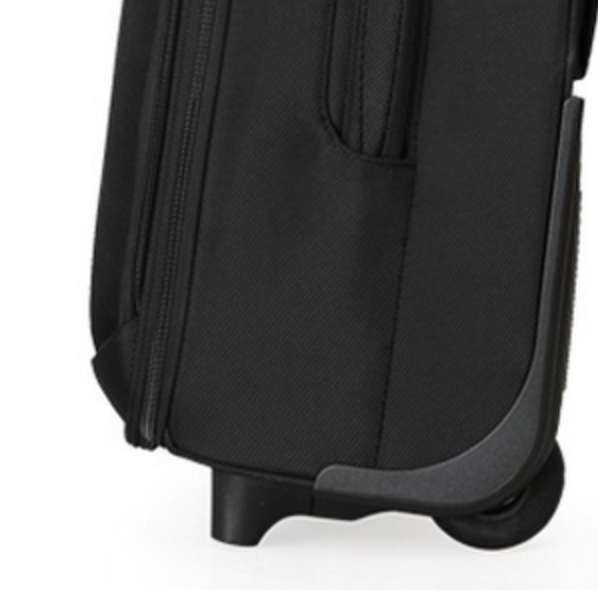

22 寸， 在国内航线不是很严格的时候，是也可以登机的。但是廉价航空，例如春秋，是检查的很仔细的，就不能登机，22 寸箱体增大了，但实际容积并没有增加很多。这就是 22 寸有点尴尬的地方

32 寸拉杆箱没有太常见的尺寸，大多都需要特别定做，实际售卖的话，新秀丽的拉杆箱偶有这么大尺寸的。根据《中国民航旅客行李国内运输规 则》，32 寸的拉杆箱是可托运的最大尺寸拉杆箱了，再大尺寸的话，飞机是上不了了。

登机箱三边之和不超过 115，托运箱三边之和不超过 158

16-20 寸的箱子都是登机箱  
22-24 寸及以上的箱子就不可带上飞机了，这里需要托运

四、选择软箱还是硬箱？  
软箱：  
材质为帆布、EVA、尼龙、皮革等，特点就是、箱体轻，但缺点是防水差一些，也有防水的，不抗压

硬箱：  
材质为 ABS、PC、PP、铝镁合金等，硬箱的特点就是耐高温、耐磨，能够起到防水抗压作用；但是容易有很多划痕，也可以买个箱套或贴贴纸或者贴花布

显而易见的，软箱抗摔性要强于硬箱的，基本的装卸都摔不坏（因为箱体比较软），比较结实耐用，但是软箱里面不能放易碎品（易碎品一般来说推荐放在登机箱里），很容易摔碎或者被砸碎；同理，硬箱确实有被摔裂的危险，随着科技的进步，越来越好的材料保证了硬箱的坚韧性，例如 PC 材质，硬箱的特点是 有很好的抗压性，为箱内物品提供保护。软箱硬箱按需选择，如果只是装衣物，并且给它们套上塑料袋，软箱也可以起到很好防水作用；如果托运几瓶红葡萄酒，软箱就不太能够胜任了，这时候更适合选择硬箱。

软箱外部一般有小口袋，便于装点小物件，随时取用，

1.箱体材质

硬箱：PC>PP>ABS+PC>ABS  
软箱：尼龙（锦纶）>=涤纶>牛津纺>pu>真皮  
推荐德国拜耳 pc 材质，抗变形，快速回弹

2.轮子  
一般分为 2 轮、4 轮（万向轮）、8 轮（飞机轮）  
2 轮：结实，平整地面较为吃力  
4 轮：静音轻巧，最常见的  
8 轮：顺滑稳定，成本高，千元以下箱子的 8 轮多数做工一般  
推荐日乃本 HINO 轮子，4 轮 8 轮都有，可连续行进 50km，而国内的轮子一般 10-20km，高端箱专用，轮子上有 hino 的字样  
万向轮就是传说中的活动脚轮，它的结构设计允许轮子在水平 360 度自由旋转，应用在拉杆箱之后，也就实现了拉杆箱的 360 度方向移动，而传统的拉杆箱轮子都是单向移动的。使用了万向轮的拉杆箱除了可以拉动以外，由于采用了四轮配置，用户可以不用倾斜箱子，直接平行的就可以推箱子，这样比起定向轮就轻松了很多。但万向轮的拉杆箱是四个轮子都露在外面的，容易发生在托运时被摔掉的现象；而定向轮一般都是内嵌在箱子底部的，不是轮子完全露出的设计，不容易发生轮子被磕掉的现象。

3.拉链还是铝框？  
拉链箱：材质种类多，经济实惠  
铝框箱：pc 较多，结实，可以当凳子，不会被圆珠笔划开，承托性更好  
推荐铝框箱，另外 ykk 的拉链很好，是普通拉链的 10 倍价格，甚至 15 倍，国内最好的是 sbs 拉链

五、PC vs ABS 哪个好，好在哪？

PC vs ABS  
100%PC 材质密度较 ABS 高 15% 以上，所以不需要很厚即可达到坚固的效果，又可减轻箱体的重量，这就是所谓的轻量化，ABS 箱子相比之下比较笨重和厚，ABS+PC 介于中间；  
PC 可承受的温度：-40 度~130 度（此数据与上面的介绍有出入），ABS 可承受的温度：-25 度~60 度；  
PC 抗压强度比 ABS 高 40%  
PC 拉伸强度比 ABS 高 40%  
PC 抗弯强度比 ABS 高 40%  
纯 PC 的箱子遇到大力冲击只会产生凹陷痕迹，不容易断裂；ABS 则耐压度没有 PC 好，容易出现断裂破碎，出现白化。  
上述分析得知，PC 具有突出的冲击韧性，有很高的耐热性，耐寒性也很好，脆化温度达 -100℃，对比 ABS 的优势显而易见，在托运行李限重的当下，一个轻量化的箱子是必须条件，耐寒性也是重要的指标，总不能去趟东北或者北欧，箱子冻硬了一磕就碎吧~

六、不容忽视的：箱子的自重  
刚才讲到的 PC 对比 ABS 的优势，其中就有重量优势，但实际重量对比下来可以发现，它们的差距并不大，PP 的绿色拉杆箱最重的原因也是因为它的体积最大， 根据上图分析，布箱，PC 箱，ABS 箱，PP 箱，28 寸的重量几乎不相上下，可以粗略计为 5 公斤，大家可以按需选择。

有人把 8Y9 奉为神箱，全 PC 材质 + 铝框，确实很不错的配置，但是一般的箱子加了铝框都会重上 2-2.5 公斤，8Y9 达到了 7.3 公斤的自重。亲测 28 寸拉链 PC 箱，净重 5 公斤，装满半箱衣物后 11.5 公斤，假设航空公司免费托运重量在 25 公斤，还有半箱空 间 +13.5 公斤的富余，28 寸的购物箱，富余的空间和重量很完美。铝框箱虽然重，但是也有它的优势，防盗性好，下文会专门提到拉杆箱的防盗性能。

七、通过暴力测试的 PC 箱们  
在讲解 PC vs ABS 的时候就说了，PC 以抗冲击性能最为突出，韧性很高，所以 PC 箱可以承受的了这样的蹦跳踩踏，有的朋友觉得 PC 的箱子又薄又软，就不待见了，其实这 是个误区，PC 就是这样的特性，有铝框加固的 PC 箱形变会好一些，拉链款的 PC 箱真的很软很容易形变，但是不表示这样就容易坏。

强大的回弹力

八、不得不重视的：拉杆箱的防盗  
圆珠笔可以不费吹灰之力就撬开拉链，拉链的箱子确实存在被盗的风险，主要发生在机场，行李长期脱离视线的情况下，行李传送带上的失窃，盗窃者利用摄像头盲区进行偷盗，现在机场都加强了安保和摄像头，失窃的情况要好了很多；在火车站，客车站等场所，行李不会长期离开视线，随时加强警惕，一般不会有失窃发生；在旅馆，在密码锁的基础上，最好在加一条带密码锁的十字打包带，一般来说是很安全的。

应对拉链事件，很多箱包公司也有了各种各样的对策，大家都普遍认可铝框的安全性要优于拉链，但是很多箱子为了追求轻便，依然没有放弃拉链箱

没有什么功能可以做到绝对的防盗，被贼惦记上，什么都能给撬开，铝框加大了拉杆箱的安全性，但是增加了重量，各位可以按需选择，如果经常需要携带贵重物 品的，尽量选择防盗性能好的箱子；如果只是携带衣物等不是很贵重的物品，可以选择更轻便的拉链箱。这里要说明一下，其实贵重物品最好的方式是随身携带，无论是火车还是飞机，都可以做到随身携带，在自己视线范围内最安全。

九、拉杆箱的好伙伴：防开裂防盗的打包带  

十字打包带有非常实用的作用，防开裂，醒目，防 盗，如果出国旅游，建议选择 TSA 密码锁打包带。壮哉我大淘宝，量产化的打包带价格十分感人，基本可以做到 10 元包邮，个人建议选购价钱稍微贵一些，质量 更可靠的产品。

上面这款打包带是我自用的，十字捆扎，最长 3.8 米，TSA 密码锁，带指示灯，被打开后颜色会由红色变为绿色，一般带 TSA 的都比较贵，一字打包带在 30 元，十字打包带在 60 元左右。如果不出国门，用不到 TSA，普通的密码锁款式就完全够用。

如下图，一般的拉链箱都是这样的设计，密码锁在一边，折叠在另一边，这样即使拉链被圆珠笔划开，偷盗者也不能完全打开箱子，加上十字打包带，箱子的开口就更小 了，想偷什么大点东西难度都非常大。另外密码锁是锁住拉链头的，拉链被打开后根本没法恢复，打眼一看就知道箱子被开过了。这里也告诫大家，拉链要上锁，加 强安全意识。

十、不可不知的：拉杆箱保修条例

DELSEY 箱包及配件的保修范围包括：  
非人为损坏的箱包拉杆及其组件等  
非人为损坏的箱包轮子及其组件等  
非人为损坏的箱包外挂密码锁  
非人为损坏的箱包拉链的拉链头  
非人为损坏的箱包手挽的缝合处  
非人为损坏的箱包 LOGO 脱落，但没有丢失。  
不在 DELSEY 箱包保修范围且不能维修的包括：  
箱包的整体面料及内衬面料。如有开裂、破损、划伤、起皱、污损等均不在保修范围。  
箱包拉锁锁链自然磨损的。如锁链断裂等均不在保修范围。  
箱包手挽的面料自然磨损的。如手挽污损、开裂均不在保修范围。  
箱包四周的护边、护角的面料由于自然磨损的。如：护边和护角产生破损、开裂等均不在保修范围。  
品牌 LOGO 脱落并已丢失的。  
虽然箱体的开裂破损不在保修范围，但是其他的比如拉杆，轮子，密码锁都是在保修范围内的，尤其轮子和拉杆这两项，还是很人性化的。关于雅士和美国旅行者，没有查到具体的保修条例，雅士的保修上面这样写道： 若保修期间，因正常使用磨损，负责维修。本公司与其他知名品牌秉持一惯原则，对于不适当使用造成的损坏，不予负责，若飞航旅途中行李有所损坏，离开机场前，请告之搭乘的航空公司。

每个箱子上面都有自己的保证书，大家购买之后要保留好发票，跟保证书放在一起，装在箱子的内袋里面，走到哪坏了，就去哪个城市的维修点修理，几页纸，也 不重，推荐随箱携带，不过维修的问题我还没有遇到过，即使是几年前买的国产箱子，现在也用的好好的，人品还是要攒的一路上有你：拉杆箱的简单介绍 。

箱体表层的面料最好是密封性好，防雨防水的，表层材质颗粒度大一点，这样表层就比较容易耐磨。当然现在也有很多光滑材质的表层，特殊处理后同样也比较耐磨。但是一旦留下划痕，光滑表面比粗糙表面要明显得多。

拉杆箱在装满物品的时候，拉链常常会处于紧绷状态。如果拉链质量不过硬的话，就会产生“爆箱”，为了避免爆箱，许多厂商都会选择在拉链上做功夫，通常是采用双层链齿加固的方式来提高咬合度。我们在购买产品的时候，除了可以进行询问是否带有防爆设计外，还可以用尖锐的物体对着拉链进行划动，如果是防爆拉链，拉杆箱是不会被划开的，箱内的物品也能得到良好的保护。

首先是箱子侧面是否也带提手。很多朋友买到的箱子只有上面有提手，这个将会在之后的使用中特别的不方便。

部分拉杆箱会在拉杆箱的每个角设有加厚或者加设不同坚硬材质的设计来保护你的拉杆箱免受磕碰影响；同理，在箱子的表面也会有一些增设软垫来隔开拉杆箱与地面的直接接触，防止拉杆箱被划伤。如果对拉杆箱的使用寿命有较高的要求，挑选产品的时候可以重点关注一下有没有防磕划设计

在这里捎带一提的是，许多商家会强调自己的产品带有 TSA 锁，TSA 是美国运输安全管理局的意思。从 2003 年 1 月开始，TSA 规定所有进入美国机场的行李必须打开接受检查，同时 TSA 发出警告：除非使用 TSA 认证的锁，否则被检查行李要么不要上锁，要么海关就有权撬开破坏被检查的行李锁。拥有 TSA 锁的行李箱，海关的工作人员可以直接打开，而你自己也有一把钥匙。如果没这个锁，被“强拆”也是无处可诉。如果常往美国出行，可以考虑购买一个配备 TSA 锁的产品。 TSA 锁的标志是一个红色菱形

如果你的拉杆箱平时需要装西服或者笔记本一类的东西。请注意观察产品是否专门设计了此类的隔层。以西服为例，专有的西服隔层会让你携带西服更方便，而且在最大限度保障西服的平整。在内室设计中，不建议大家选择使用大量拉锁的，因为这种设计如果箱子没有装满，在托运的过程中，容易造成拉链连接处的损坏，所以建议多选择插口型的。

在拉杆箱的内室设计中，有没有伸缩围对用户来说非常重要，尽管你可能一辈子都不会将它展开，但是一旦有一天你的拉杆箱出现了满载的情况，你会十分庆幸自己的拉杆箱具备伸缩围

整理衣物时，我们可以将袜子卷成筒状，然后塞到鞋子里，不仅能防止鞋子被压扁，同时也能节省空间，两全其美。在装载行李时，要记得尽可能地将拉杆箱 装满，避免空隙，不然托运后，会让箱包内的东西乱七八糟，一片狼藉。为了防止这种情况发生，可以用毛巾。内衣等体积小又易折叠的物件来填补空隙。

在放置物品时，也有很多的技巧，比如将较重、较结实的物品放在下面，将质量轻的放在上面，遵守下重上轻的原则，尤其是贵重衣物一定要放在上面，避免被压轴弄坏。

对于易碎物品，比如瓶装化妆品等等，可以用衣服包裹在外面，从而起到缓冲的效果，最好选择携带旅行专用的护肤品小套装，不仅轻便，可以随身携带，而且也不会占用太多的空间。

另外对于干湿物品，要分开放置，避免液体溢出，弄湿了拉杆箱内其他的东西，最好在液体物品外多套上几个塑料袋，并且与干燥物品分开放。

外置式拉杆

推荐大家选择内置式拉杆，虽然会比较占用箱内空间，但会比较稳固。材质最好的当然是全铝的，材质比较轻，坚固，不易变形，成本也比较 高。

首先必须说明【最耐用的 XX 品牌】注定是不会有唯一答案的。就好比田忌赛马，用我的上等马跟你的下等马比，所以说我的马更快？同理，A 品牌的心血之作跟 B 品牌的低端货比，也不能说明 A 品牌是更耐用的。所以即便是专业的评测机构也无法得出此类问题的准确答案。

如果非要给出一个明确答案，最耐用的无疑是专业级安全箱（可作旅行箱用），通常被人们用来运送枪械、摄影摄像器材、精密仪器等。虽然绝大部分人不会用这货来拉行李，但其质量是真心碉堡了。比较知名的安全箱有以下两个品牌：

Pelican 派力肯（塘鹅）  
Pelican 的安全箱被各国军队及专业机构（如国家地理频道摄制组）广泛采用，在很多战争电影中都能看到 Pelican 的身影。从直升机上距地面 50 米直接扔下，悍马 碾压对它都毫发不伤，部分型号还是防弹。Pelican 公司对安全箱的承诺是“终生包换，即使作为遗产传给你的子孙后代，继续包换”，

HPRC 亚玛比利亚  
HPRC 在国内有一定知名度，大多是专业的摄影摄像从业者用来运输和保管娇贵摄影摄像器材的。

1、坚固耐用

不 论国际还是国内航班，头等舱还是商务舱，托运行李都是被各种扔来扔去，只有耐操的货才能在如此恶劣的生存环境中勇敢地活下去。以机场的摔打程度，管他 PP 还是镁铝合金，通通都能给你摔成变形金刚，每月都能在微博看到摔到报废的 Rimowa，然后机场赔你 200～400 不等。  
2、轻便

微博上我们已经见过不少 RIMOWA 面目全非的案例，所以很多人逐渐转变观点为“不能托运，那就只买登机箱”，可惜商家所宣传的“既结实又轻薄”也是无稽之 谈，RIMOWA 铝合金的 20 寸登机箱最轻的也有 3.7 公斤，而大部分款式重量都在 4.2 至 4.8 公斤。需要提醒大家的是，航空公司对手提行李的重量和尺 寸都是有限制的，按照 5 公斤的最低规定，您只能在箱子里放几件衬衣了。虽然通常情况下可以超重，但也得碰运气，亲眼见过几次乘客都到了登机口被迫将行李转 托运的。

结论（比较同等价位且价格没有太多水分的产品）：

耐用性：尼龙软箱最佳、塑料（指 PP,PC,ABS 之类的）其次、铝合金再次，皮质最差  
轻便性：塑料最轻、尼龙其次，铝合金再次，皮质最重  
价格：尼龙最低、塑料其次、合金再次、皮质最贵

十一、拉杆箱的品牌推荐

皇冠 crown

美国旅行者  
American Tourister(“美旅”) 箱包品牌，1933 年索卡夫勒先生（Mr.Solkoffler）创立于美国罗德岛 ，有着近八十年的悠久历史。90 年代加入新秀丽国际箱包公司，作为新秀丽家族第二品牌

雅士  
雅士 EMINENT 创立于 1979 年，源自台湾——万国提箱股份有限公司，是箱包业内最大的世界级 ABS、PP、PC、尼龙、聚酯类的旅行箱包之专业设计、制造公司，年产量达 600 万只提箱，产品 90% 以上销往欧美日等国家。2004 年公司股票在台湾上市（代号 9950），也是箱包业界唯一股票挂牌上市公司。

外交官  
外 交官（Diplomat）品牌自 1971 年创立于台湾,是专业生产 ABS、EVA 等材质 的包括拉杆箱、旅行箱、化妆箱等品种在内的各类高级旅行用品，行销遍及全球等三十多个国家和地区，是世界三大品牌之一。

法国大使  
二战后的欧洲正是法国工艺的精湛时期，两位执着的法国人 Delahaye 和 Seynhaeve 合力创建了 Delsey 品牌，专研于旅行箱包的研发及设计。当 Delsey 首创可移动的行李箱以后，我们才看到了现在的各类拉杆箱。DELSEY 一直以来都秉持着用最低的价钱做最好的品质

 新秀丽  
Samsonite（新秀丽）——国际著名箱包品牌， 于 1910 年始创于美国。1910 年推出全世界第一个硬式旅行箱开始，便以超凡设计和卓越品质，成为其他品牌模仿与追随的榜样

curv 材质，真正做到了轻盈和坚韧的结合，不过缺点是箱体是软的，对易碎产品保护不好，采用 curv 材质的箱子，一撞也是一个坑，但是这个坑会自动弹回来，外观上也看不出很明显的损伤  
日默瓦  
RIMOWA 高级旅行箱品牌是德国为数不多的旅行箱生产商之一，也是行业内仅有的承袭百年传统的生产商之一。RIMOWA 旅行箱以其独有的坚固与轻便并重的材质、时尚的外形设计以及合理的内部格局享誉世界，是几乎所有的好莱坞大制作影片挑选旅行箱道具时的不二选择，在《黑客帝国》、《蜘蛛侠》、《史密斯夫妇》、《007》、《少数派报告》等经典影片中都可以发现 RIMOWA 手提箱 (旅行箱) 的身影。

来自某知友：  
诚然，名牌不一定就好。这是一个品牌制胜的时代，擅于营销宣传的商家占据了有利的市场地位，他们拥有极高的知名度或口碑，但他们的产品质量和耐用性却很可能不是最好的，但也不至于太差，只是性价比不高，例如以下几个声誉较高的名牌：

Samsonite 新秀丽  
新 秀丽的广告我们见得多了，前几年有个平面广告还得了戛纳广告节的平面类全场大奖。其店铺专柜也大多分布在机场和高级商场，因而给大部分国人的印象是一个专 业的高级箱包品牌，不少用户非常认同他们的产品质量，但其品质只能说还可以，让人没有太深刻的印象或过人之处。网上有不少假冒的新秀丽，而在商场购买价格 水分又很大，国外代购相对实在一点。

Rimowa 日默瓦  
因为明星效应不久前才在国内火起来的品牌， 最大亮点就是它的外观设计确实有型，非常抢眼。缺点在于所谓的德国制造并不是像商家所宣传的那么坚固耐用，这一点违背了很多用户选择它的初衷，同时国内专 柜售价虚高得厉害。您要是实在喜欢的没办法了就好好爱惜着用吧（毕竟只有 5 年保修，报废的另当别论）。但如果您追求实用、耐用和性价比，强烈不推荐此 货，PP 或铝材的都不推荐。

Tumi 途米  
这也是一个高级的专业箱包品牌，不过设计方面更偏向于时尚类奢侈品。TUMI 的箱子大多采用皮质，很重也容易受损，不过口碑仍然很好，当然价格也很高。

zero Halliburton 零·哈里伯顿  
美帝出产，在国外拥有很高知名度，但在国内的知名度很低。其实我们经常在电影中看到它的身影，比如毒贩交易时用来装白粉或装钱的箱子通常是 Halliburton 的公文包，据说此箱曾在盗梦空间、王牌大贱谍、黑衣人、独立日、真实的谎言、迷失、CSI 等上百部好莱坞大片和剧集中露脸，也曾给 NASA 定制过收集月球标本的箱子，可见其营销能力也是很强的。他家的旅行箱跟 RIMOWA 一样拥有亮骚的金属质感和外形，但其主打产品并非铝材，而是由 聚酯（PC）材料制成金属质感，比铝合金更为坚固耐用，质量绝对远胜 RIMOWA，价格也更实在；不足之处是设计显得有些老气。

最后不得不说的是，还有一些质量非常靠谱，有较好的品牌积淀同时又不会被炒得很离谱的品牌，这些才是广大理性消费者的选择：

BRIGGS&RILEY  
轻便耐用，全球终身保修。flyertalk 上面有一篇关于旅行箱的讨论帖（原帖 [Best Luggage - Page 33 - FlyerTalk Forums](https://www.flyertalk.com/forum/travel-products/702133-best-luggage-33.html)），有人从近 500 篇回复中作出统计，好评加 1 分，评价中庸的不计分，差评减 1 分，BRIGGS&RILEY 以最高分遥遥领先。

Travelpro 特普罗·铁塔  
《在云端》中乔治克鲁尼使用的旅行箱，是由一位飞机师在退休之后凭借多年的工作经验设计出来的一系列行李箱包牌。其产品外形低调而有质感，结实耐用，设计合理，性价比高，非常适合经常乘坐飞机的人群。

Delsey  
源自二战后的法国，性价比高，质量靠谱，在国内没啥知名度。常见系列有 Karat 系列

American Tourister 美国旅行者  
上世纪 30 年代在美国诞生，后被新秀丽收购，性价比较高，国内粉丝也挺多。同时纠正之前的疏漏，天猫有其官方旗舰店，但国内（包括网上）的产品款式与北美或其他国家并不一致，比如北美并不销售塑料硬壳系列。常见系列有 Cosmolite 系列 Engenero 系列

截至 2016/02/21， 24 寸纯 pc 箱为例 国内价格（没算满减，优惠券等其他优惠） 外交官普遍 600 左右，雅士 600，新秀丽 2K，皇冠 800，日默瓦 5K，TUMI 5K， Delsey 和美旅 600，瑞士军刀 1K Travelpro，BRIGGS&RILEY，Rimowa ，zero Halliburton 需要海淘，价格没去了解

最后的一个小小推荐，适合想买个箱子又不知道明确用途的：PC+ 铝框 +24 寸 + 万向轮 + 铝合金拉杆 +TSA 十字打包带 即保证了防压防水，又有很好的防盗性，24 寸的容积够用又不容易超重，身材娇小的女生也 hold 住，实在是居家旅行必备的好箱子  

用正确的姿势拉箱子  

这个侧面图就可以看出来，拖的方式，会比较容易损到轮子呢。人行道如果有凸起物，还会伤到箱体的下侧也会被刮到。箱子有一个向下的力，轮子又受到一个向上的力。轮托容易脱节，轮托下面会蹭到地面。

万向轮的行李箱，最好是平推  

斜拉这种方式比较伤。不要用拉两轮箱子的方式，来拉四轮箱，不然质量再好，也经不住呀  

两轮 or 四轮：
它们的区别主要是结构存在差异。  
两轮的结构简单，轮子定向，一般是半埋在箱子里的，与整个箱子连接紧密。在质量过关的情况下几乎不可能出问题。

而使用四个万向轮的箱子，都是固定在箱子底部的，轮子小、连接处细，相对于两轮的箱子，同体积下它要高出不少来。相对而言，四个轮子不管是数量上还是单个质量上，出问题的概率要大的多了。

拖箱子方面：  
1.平整的地面：定向轮箱子的斜拉，较为吃力，尤其是东西很重的情况下加重了负担。而万向轮箱子是四轮子平移，非常省力。  
2.斜坡：两种箱子都要斜拉，定向轮箱子一般轮子轴线跟箱子拉杆是重合的，比万向轮箱子略微省力一点点。然而有个细节是，定向轮箱子可以直接拉上去，而万向轮如果提起来过坎再使用两个轮子斜拉，很有可能轮子就是在地面上滑动摩擦而非滚动，就很恼火。  
3.不平整的地面：定向轮箱子拉的极其颠簸，万向轮箱子由于没有倾角反而更加吃力。

堆放方面：  
4.一般万向轮比定向轮箱子重，放高很困难。  
5.一般万向轮比定向轮箱子高，需要的空间位置大。  
6.公共交通内：万向轮箱子必须放倒，否则车辆颠簸、刹车、加速会到处跑（带刹车的万向轮箱子更贵）。定向轮箱子肯定自带刹车。

其他：  
定向轮箱子，在无座的车上我可以直接坐在上面，结实的很。但是万向轮的轮子太金贵了，我不敢坐

如果你是高级白领，行李不算多，长途坐飞机短途坐汽车（非公共交通），万向轮箱子这种颜值高又省力的高级货就很适合你。如果你东西非常多又想塞进一个箱子的，最好别用万向轮箱子，因为质量不好就极其容易坏轮子，并且难以搬动，公交上一旦滑走了拽都拽不住哇（没刹车的定向轮） 但用定向轮也要考虑到会很吃力 且拉杆容易损坏

对于我这种常年出差到船厂的，去往各种鸟不拉屎海边、江边、河涌地区，又要拉着箱子溜大街的人来说，万向轮箱子我真的伺候不起哪  
除了在火车站的地板上，滑动起来非常省力以外，我不能忍受万向轮箱子的是：坐公交/火车卧铺桌子底下箱子总是跑、凹凸（石子、泥巴、人行道）路面极其难拖、无座火车不能坐箱子，轮子还容易坏，坏一个就揪心哪

固定式密码锁指锁的位置固定，不是指密码无法修改，美旅的拉杆箱修改密码：首先把密码置成初始密码 000，然后按下小圆点（在锁的周围），按下后，再拨动密码轮，设置自己想要的密码 ，比如 008。这时再按开锁按钮，把小圆点弹上来，听到啪的响声就可以了

机场一般有行李车，可以把箱子放上去推着走
