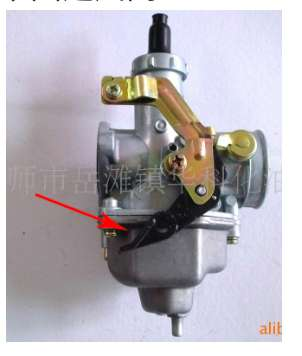

# 电动车

电动车的分类，能否载人，走机动车道或非机动车道看 [电动车载人新规来了，3月起多地实施，载人年龄放宽，但要注意6点](https://baijiahao.baidu.com/s?id=1758889940701729585&wfr=spider&for=pc)，非机动车行驶在机动车道要被交警查处

新国标规定宽度不能超过 45cm。实际情况是如果加装后视镜大概率会超出 45cm 的限宽，如果装 45cm 限宽以内的后视镜，就基本上没啥用了，看不到后面。所以现在大部分的电动车出厂都没有后视镜  

新国标电动自行车要求整车重量在 55kg 以内，所以为了满足这个重量要求，很多不是必须安装的东西就被简配了，比如迷你号的脚蹬和车座，前后车架也被减重。后视镜这种装了也有相当一部分不会看的使用群体自然是不会标配的，而且后续自行加装也很方便。  

新国标电动车中并未强制要求安装后视镜。也有不少车标配了后视镜，特别是网上买的车，寄过来时，后视镜和脚踏都是未安装，需要自己动手装，这是出于运输成本的考虑，可以减少包装体积。  

没有后视镜的话拐弯和变道之前需要减速然后头快速偏一下，余光一扫，后面没有车过来再拐过去，时速是 25km/h，只要回头看 1 秒，车向前盲开了 0.7 米的距离。时速是 40km/h，向后看 1 秒，就向前开了 1.5 米左右，如果你向后多看几秒，就多开出去几米，时速特别快的车甚至达到 10 米以上，当前方有遮挡物、行人、车辆，避让不好就有摔倒碰撞的危险  

上牌之前不要对电动自行车加装任何东西，因为上牌拍照需要原装的样子。上牌之后再加装，因为安装后尾箱，一般会破坏电动车的平衡点，可能导致失去平衡而摔倒，所以交警上牌不让安装，电动自行车加装车尾箱、手机支架、长坐垫会被交警查处，一般来说，合格证上车辆图片是啥样上牌时就要啥样，

新国标电动自行车的鞍座长度只有 35cm，像 雅迪 de2 那种类型的电动自行车 也能加装长坐垫和尾箱，[九号电动车F系列一体加长座椅安装哔哩哔哩bilibili](https://www.bilibili.com/video/BV1tB4y1C7qk/?spmidfrom=333.1007.0.0&vdsource=568600721e4a7665b71d32bda0302591)  

像 雅迪 de2 那种类型的电动自行车的锂电池是安装在坐垫下面的坐桶里，有网友说可以暴力打开坐垫然后就能偷走锂电池，锂电池是通过一个插头连接的，拔下插头就能把锂电池提走，很多电动轻便摩托的电池安装在踏板那里，坐垫下面的坐桶可以储物，装铅酸电池的车子一般电池装在踏板那里，装锂电池的一般装在坐垫的坐桶  

把电动自行车的链条拆了，脚踏就不会跟着转动  

根据新国标规定，电动自行车厂家在出厂前，必须要具有脚蹬骑行的功能。脚蹬是在电动车没电的时候，还能踩着脚蹬骑行，但现在的电动车一般都比较重，轮胎也比较粗，如果电动车真的没电，用脚蹬骑一公里以上，就吃不消了，蹬这个脚蹬要花很大的力气，而骑电动自行车的大部分是接娃的妇女或老年人，他们的力气都不是很大。关键是有这个脚蹬，骑行的时候不方便，弄不好就碰到脚，还把脚给弄疼。如果你要拆除掉，你的电动车却又变成违规了，那就属于“改装”车辆  

待验证：这个脚踏骑行功能，也就是这个链条，时间长了，飞轮生锈了，一不小心就卡着了，如果装上链子的话车子往后倒的时候脚踏也会跟着往后倒，一不小心就会挂到衣服就会摔倒，就会受伤。新国标电动自行车限制重量 55 公斤，这就造成了车身非常轻，骑起来轻飘飘，新国标电动自行车由于限制重量，它的车圈基本上都是钢圈，所以使用的轮胎基本上也都是 14X2.125，也就是说是所有真空胎里面质量最差的，骑行起来轮胎不抓地，路面稍微有点积水，拐弯的时候就会打滑的现象，容易摔倒  

新国标的电动自行车电机功率小，扭矩小，载人的时候可能上不了坡度大的斜坡，[Ninebot九号F90载人上坡测试哔哩哔哩bilibili](https://www.bilibili.com/video/BV1QX4y1b7cS)  

[315晚会点名绿源小牛电动自行车 多品牌电动自行车公然违规提速哔哩哔哩bilibili](https://www.bilibili.com/video/BV1iR4y1F7Pn/?vdsource=568600721e4a7665b71d32bda0302591)

网友说深圳广州很多外卖员的电动自行车是深远 009，这车子的车架（裸车、不包括电池）便宜只要 1800 块，而且车子用的是锂电池，外卖员一般换电柜那种租锂电池一般 200 块一个月，深远这个品牌的很多电动自行车都可以选配最高 130AH 的电池，电池仓够大放得下大容量电池，也有网友说电池虚标，其他车可能要改装车架更换大的电池仓才能放得下大容量电池，电池容量越大一般体积也越大重量越大，电动自行车装太大容量的电池可能超过 55KG 的限重，上牌时要注意，可以上牌时装小容量电池，上牌后再装大容量电池，四季星、麦铃、格士铃是类似于深远的电动自行车品牌，大多是外卖车

但有人为了追求速度，就会选择改装电机；解速（解码）之后，自然续航里程就会跟不上，于是又得改装电池；一旦速度过快，刹车和减震和轮胎自然也得跟着改，像新国标电动自行车通常会设定“超速提示警报”装置，部分车主在改装解速后会选择拆除这个速度提示音响装置（有些车子用解码器解除限速的同时也能把这个声音消掉），解速后车载显示屏最高只能显示到“25km/h”，但实际上在此之后还能加速，“最高时速能跑 40 公里

非法改装车在行驶中发生交通事故可能将面临保险不予理赔的  

按下定速巡航键后会自动以当前速度自动驾驶不用捏油门，加油门或捏刹车或按下定速巡航键取消定速巡航

九号电动车的应急骑行模式，在车辆故障不能正常骑行情况下，可优先保障基本骑行功能正常运行，并从系统层面暂时关闭智能化服务等其他后台程序，为用车安全加强保障，在车辆故障不能正常骑行情况下，可以进入应急骑行模式保障车辆低速行驶，并主动暂时关闭影响骑行的传感器信号检测。但是当控制器、电机、定速巡航按键本体损坏或者连接线断开等情况下，应急骑行模式会失效。当车辆进入应急骑行模式时，最大速度为 25kh,当车辆故障解除后，速度恢复为正常速度，此时车辆恢复正常，可正常骑行，应急骑行模式操作说明：1、双击定速巡航键，听到声音后，代表已经进入应急骑行模式：2、长按定速巡航键，提供动力，松开定速巡航键，失去动力  

有网友说九号电动车带 C 尾缀的型号都是铅酸电池  

动能回收（能量回收）是松开油门自动减速以充电（此时一般仪表盘亮绿色指示灯），车子用中撑架起来后打开电源不给油门用另外的方法让后轮转起来也能充电，打开电源不给油门找另外的车子拖行或从山下滑行下来也能充电，有网友说动能回收的减速是利用电机制动，不会出现机械制动没 abs 的情况下车轮抱死打滑的情况

有些车装有 gps ，可以在 app 上看到车辆位置，这种车用 gps 测速的话仪表上显示的时速就比较准确，不会出现欢乐表的情况，但 gps 会增加耗电量，有些车可以在 app 上获得电池拔出提醒、车辆异动提醒（锁车后有人动你的车会提醒）、充电提醒、忘记锁车提醒，电子围栏（划定安全范围），有些车如九号 q90 有转向灯自动回正功能像汽车那样，当转向完成,车头摆正时,转向灯会自动返回关闭状态

以后再研究一下当快没电时是不是开一档开慢点相比于开三挡开很快，前者的路程更远

一些电动轻便摩托可以在给车体装护杠，这样摔车时减轻车辆损坏程度  
有些车没有钥匙孔和钥匙，只用 nfc 卡或手机解锁，没钥匙孔杜绝了被物理破解开锁的情况，但感觉只用 nfc 或手机解锁也能被人软件上破解开锁

听说在广州一个身份证能登记一辆电动自行车，所以当前车不想开了去注销或过户车牌才能购买其他车上牌，把旧车牌装到新车上属于套牌  
据说电动自行车的车牌里面有块芯片

续航与承重、温度、时速有关，速度越快越耗电，温度低续航变短， [能跑100公里的电动车到底需要多大电池?看完后，再不怕买车被骗了 - 西瓜视频](https://www.ixigua.com/7074059375715090958?widtry=1)

坐垫感应（乘坐感应）是感应人有无坐上车，通常是为了自动锁车和助力推行，助力推行是下车推行时完全捏紧油门也只有约 5km/h 的速度，预防突然捏油门车辆冲出去的情况，但推行上坡时车辆很慢，自动锁车是人离开车子几秒后自动锁车，边撑感应是感应边撑有无收起来，通常是为了自动锁车，坐上车后感应到边撑没收起来通常捏油门也

看淘宝上的介绍绿源电动车有液冷电机的专利，降低电机温度，防水性能好，普通电机进水容易生锈，高温导致退磁

电动车的车座下面一般有合格证，合格证上面有车辆参数（有些销售也对车辆参数了解不准确，听销售说还不如看合格证）

车辆上的铭牌和合格证上一般有车子的生产日期，实体店里打折的车一般是生产日期比较久的车，一般来说买生产日期较近更好

有些车关了电源（熄火）之后推车也推不走，显示 p 档，电机还会给一个反方向的力

有些车捏刹车时动力自动关闭，拧油门也没用

有些车有 usb 充电口，适用于跑外卖给手机充电  
小牛有几万块的最高 100km/h 的跨骑电摩

2023-06 ，淘宝上 48V 20AH 的石墨烯铅酸电池 ，直接购买是 550 块 ，以旧换新是 330 块 ，12V 一个电池，4 个串联在一起就是 48V 的电池，48V 20AH 的锂电池直接购买是 1000 块，好像不能以旧换新，是整个一体的 有个提手，通过插头连接到车体

铅酸电池比锂电池重，很多电动自行车因为新国标有车辆重量的要求所以用锂电池，很多电动轻便摩托用的是铅酸  
一般铅酸电池 比锂电池更耐冻 ，表现为低温下电量衰减没那么厉害  
[买电动车选铅酸还是锂电，哪个更好？十几年修车老师傅告诉你哔哩哔哩bilibili](https://www.bilibili.com/video/BV1VQ4y1r75H/?vdsource=568600721e4a7665b71d32bda0302591)  
铅酸电池使用寿命一般为 2 年左右，而锂电池较耐用，寿命多为 4-5 年; 且铅酸电池循环完全充放电一般为 300 次内，而锂电池则完全充放循环次数超过 500 次，看淘宝上雅迪的介绍，雅迪有某些技术让他家摩托车的铅酸电池的充放电循环次数达 1000 次  

相比锂电池仅 2.5/3 公斤的轻巧车身，一般同容量铅酸电池重约 16/30 公斤; 不仅电池质量较大，体积也大; 相比铅酸车费力的辗转腾挪，锂电车可拆卸设计，骑行搬运更方便，可拿回家充电，一般锂电池的充电速度比铅酸快，锂电池可快速拆卸，拆卸后拿回室内就不怕被偷但要预防室内电池着火的情况，铅酸电池拆卸比较麻烦需要拧螺丝，不把电池拆下来，车辆放在外面的话可能被小偷偷走

可以把电动车的锂电池换成铅酸电池但要注意一些东西

车子提速太慢可以用某些方法改

台铃电动车 RD 按键是防飞车防止误扭油门的安全锁键，用于停车时使用。按一下 RD 键就可以防止误扭油门了，需要开车的时候再按一下 RD 键就可以取消保护操作，例如在启动车子的时候，就需要先按下 rd 键，才能够拧油门这辆车子才能够进行正常的启动行驶。在停车的时候，按下停车安全键，这时候无论怎么扭转，车子上的油门也是不会有反应的。这样就能够保证行车安全，或者是在误拧的时候，也不会让驾驶员处于危险情况之下，这就是停车安全锁最大的作用。

尽量不要在疏散走道、楼梯间、安全出口停放电动车或者为电动车充电。一旦起火，会阻断逃生通道，易造成人员伤亡。把电池带回家充电时一旦着火损失更大  

尽量不要飞线充电，因为线路磨损、老化、极端天气等情况，易酿成火灾，可以挖个槽、搭个管来给电线一个保护  

锂电池长期处于高温环境例如太阳直晒、靠近火源容易引起着火，锂电池经受穿刺、挤压、碰撞、跌落也可能着火，感觉可以在电动车的电池仓放一些减震缓冲或固定的东西

充电柜，充电桩，针对外卖小哥的换电柜例如铁塔换电、智租换电，快递网点那里可能有充电柜

某品牌换电柜具有的功能：  
消防：每个换电柜的电池仓安装 1 个热气溶胶灭火器，可实现火灾的自动探测，自动灭火等功能，且无需任何类型供电，能满足全天候电控柜火灾消防。  
防盗：换电柜采用外置全景 180 度摄像头，具有防盗监控及信息反馈能力。且采用了具备防盗功能的锁具。  
防爆：电池仓采用不低于 1.5mm 的优质钢板制作而成，柜体内设计排水结构；柜体内外应经过磷酸纯化处理，环氧树脂静电喷涂，保持高光洁度并最大限度的降低腐蚀和湿气及紫外线的影响；单仓事故例如电池爆炸不会扩散到其他单元，且不造成 2 次事故（注：2 次事故指仓门脱落、飞溅、伤及他人等）。

共享电动车，租赁电动车

加大电池容量、加装音响、照明等要注意可能造成线路超负荷，引发火灾。  
电动车充电时，要远离易燃易爆物品，以防电动车起火后火烧连营，造成更太的事故。  

整夜充电且无人看管，一旦电池、电线等出现问题，极易引发火灾。尽量在白天充电，充满及时断电。可以安装一个定时插座，到点自动断电  

下雨天电动车内部一旦进水，就有可能引起短路，从而导致车辆自燃等事故。

遇到一些坑洼的地方，车辆受到震荡，电动车上的某些部件的连接可能脱落导致车辆启动不了

[广州市公安局交通警察支队关于实施电动自行车登记管理的通告](http://gaj.gz.gov.cn/gkmlpt/content/7/7868/mmpost_7868425.html#322) 提到

>居民个人自用电动自行车，凭有效材料登记核发白底黑字正式号牌和行驶证。  
>符合“新国标”并获得 CCC 认证的网约配送电动自行车，凭有效材料登记核发蓝底白字正式号牌和行驶证，并按网约配送的用途使用。  
>办理电动自行车登记的，应当交验电动自行车，并提供以下材料原件：车辆所有人身份证明、车辆来历证明、合格证明或进口凭证。  
>根据广东省非机动车牌证费的收费项目和标准，办理登记的电动自行车每辆收取牌证费 30 元/套。

（待验证）锂电池的不同种类：[买电动车是买锂电池的还是铅酸电池的？ - 知乎](https://www.zhihu.com/question/282702232/answer/1330830804)

电动车充电器的输出电压关于电动车电池的寿命，如果充电器输出电压比电池的电压大太多，用这样的充电器充电会损伤电池，如果充电器输出电压过小，不能把电池充满电，有某些方式可测量充电器的输出电压电流

有些品牌的车可以自己校正仪表显示的速度，避免欢乐表：[今天才知道，电动车的仪表码数不准也能调整，试过后真的太好用了哔哩哔哩bilibili](https://www.bilibili.com/video/BV1Ss4y1M7Fw/?vdsource=568600721e4a7665b71d32bda0302591)

电机进水生锈进行清理：[这才是电动车跑不远的真正原因？只需要把电机拆开清理一下就好了哔哩哔哩bilibili](https://www.bilibili.com/video/BV1X7411w7Wd/?vdsource=568600721e4a7665b71d32bda0302591)  

清理电机：[这才是电动车费电跑不远的真相，修车的一般都不说，师傅来告诉你哔哩哔哩bilibili](https://www.bilibili.com/video/BV1sA411h7rh/?vdsource=568600721e4a7665b71d32bda0302591)

# 油摩

[摩托车点火系统原理，原来是这样启动车子的，机械与电路完美搭配 - 西瓜视频](https://www.ixigua.com/6851731644068561412)，电门锁指的是把车钥匙插进去的那个锁，点火开关指的是车把上的点火按钮，火花塞也就是俗称的火嘴，化油器将汽油雾化并把雾化的汽油与空气混合，然后将混合气体输送到发动机的气缸，火花塞产生火花将混合气体点燃，传统的摩托车采用脚踩式启动，通过用脚将启动杆（也叫打火棍）踩下去，通过齿轮将运动传导给曲轴使之转动，电池有问题不影响脚踩点火成功

点火器坏了导致无论脚踩还是电启动都连接火花塞的那条线都没火花产生，车子就启动不了：[摩托车线路不会打火怎么办？试下这个方法，轻松修好 - 西瓜视频](https://www.ixigua.com/6851855017406792200)  

[摩托车启动不着了怎么办？师傅教你最简单的修理方法；直接修好哔哩哔哩bilibili](https://www.bilibili.com/video/BV1VJ411y7s3)  
[摩托车启动不着怎么办？只需检查下这3个地方，0基础也能学会修理哔哩哔哩bilibili](https://www.bilibili.com/video/BV1Pv411B7ui/?spmidfrom=333.788.videocard.19&vdsource=568600721e4a7665b71d32bda0302591)  
油箱生锈或汽油中有水， 火花塞击穿或淹死：[摩托车骑行半路启动不着了怎么办？试下这 3 个方法，轻松修好故障 - 西瓜视频](https://www.ixigua.com/7139169781055226398 )  

摩托车长时间停放之前如果没把化油器内的汽油放尽，容易导致长时间停放后汽油中的杂质堵塞化油器的量孔、油道等部件导致启动困难，如果因此导致启动困难只需放掉化油器的汽油就行，如何放化油器的汽油看：[长时间停放的摩托车启动不了！千万不要乱维修，快来试试这一招,汽车,汽车保养,好看视频](https://haokan.baidu.com/v?vid=11705710276972442446)  

火花塞电极间的间隙对火花塞的工作有很大影响，间隙过小，则火花微弱，并且容易因产生积碳而漏电；间隙过大，所需击穿电压增高，发动机不易启动，且在高速时容易发生“缺火”现象，故火花塞间隙应适当，冬天的时候把火花塞间隙调小一点更好启动，调整火花塞间隙：[摩托车冷车难启动的真正原因你知道吗？师傅教你3个妙招轻松修好-哔哩哔哩bilibili](https://www.bilibili.com/video/BV1iz4y1S75G/?spmidfrom=333.788.videocard.6&vdsource=568600721e4a7665b71d32bda0302591)

待验证：洗完摩托车后，就打不着火了，这是为什么，可能火花塞进水了  

新的火花塞很快就变黑导致打不着火，是进油量偏大的问题，调整化油器进油量可以调整混合比螺丝或进气阀油针，调整进气阀油针： [冬天摩托车难启动，呛火花塞，排气管放炮！修车师傅教你解决故障 - 西瓜视频](https://www.ixigua.com/6635143398317621764)  

启动后加油门容易熄火或冬天需要热车十几分钟才能走否则加油门熄火，调整化油器混合比螺丝：[停放三年的摩托车，启动后如何调整化油器，行内不说的方法在这里 - 西瓜视频](https://www.ixigua.com/7024669743281865223)，[摩托车冷车难启动的真正原因你知道吗？师傅教你3个妙招轻松修好-哔哩哔哩bilibili](https://www.bilibili.com/video/BV1iz4y1S75G/?spmidfrom=333.788.videocard.7&vdsource=568600721e4a7665b71d32bda0302591)

发动机缺机油也可能打不着火

[冬天摩托车太难启动说明这些方法你没有用上易车](https://news.yiche.com/hao/wenzhang/31392790)  
[霍氏养车告诉你摩托车冬季启动难的原因及改善方法 - 知乎](https://zhuanlan.zhihu.com/p/440590924)  

冬天车子难启动可以尝试在化油器和进气管外侧浇以沸水，提高化油器温度，可以给缸头浇一壶开水，或者用电吹风或用热风枪吹一下  

冬天的室外是冰天雪地，室内的温度要好上很多，如果车主的摩托车在冬天打不着，可以将车放在室内，这样启动的时候，摩托车的发动机就不会温度过低，启动也比较容易一点！如果最低气温下降到零度以下，一定要将蓄电池拆下，放到室内温暖地方保存，这样可以防止蓄电池冻裂。最后还可将火花塞卸下，清洗干净后再将其间隙调小一些，这样可使火花塞容易点火。  

高档的摩托自带化油器加热装置，可有效缓解启动难和热车时间长的问题。  

气温低时化油器雾化效果不好，不好点火。车子启动后视气温情况热车若干分钟，一般北方冬季大概需要 5 分钟左右，否则会感觉发动机无力，给油就熄火，不可大力给油，冷车时候润滑不足，强行给油的话对发动机磨损很大。

天气气温低时，打不着火，打开阻风门（一般打开一半即可），加大进气量，加大油气混合比，有时也被称为加浓混合气，更容易打火成功以及发热量更大，摩托车发动后。预热 2 到 3 分钟。摩托车发动机的温度升高了。这个时候就可以把风门关闭了。摩托车也可以正常行驶了。 有化油器的车才有风门，电喷的车没有风门，化油器是将汽油和空气进行混合的  

化油器用久了很脏的话化油效果不好，启动摩托自然慢，可以清洗化油器  

待验证：虽然汽油在冬天不会结冰，但是汽油在低温下雾化的难度变大，所以车主一定要空踩几下（空踩指的是熄火时加油门），这样可以给火花塞多泵一点油，更易发动。然后再将电门锁打开并稍带一点油门后发动。，[在发动机熄火的情况下踩油门，会把汽油踩到气缸里去吗？|化油器|喷油器|汽油泵|燃油网易订阅](https://www.163.com/dy/article/G3ISSPMU0527GQ35.htm)，电门锁指的是把车钥匙插进去的那个锁

待验证：踏板车很难启动可以检查踏板车自动风门是否卡死在关闭位置了（就是卡在伸出来的位置不会退回了）  

检查发动机的压缩情况，如果气门漏气或者是发动机磨损严重，冷车当然不好发动，这就需要修理发动机了  

汽油里有水也可能导致打不着火

>待验证：  
>来源：[请问冬季室外该怎么停放摩托车？ - 知乎](https://www.zhihu.com/question/438419966/answer/1720735620)  
>首先说明下，大多数无法启动的电瓶主要是铅酸胶体电池和锂电池，这两种电池抗低温性能非常差劲，低温几乎就废掉了。唯一可靠的办法就是拆下来充电，再装上去，当然了，这个需要每天频繁拆装，没有地库的话非常麻烦。  
>
>为什么我的车却能一枪着呢？马上因为在摩托车电池里，还有一类电池是很多人没注意到的，也忽略的，加水电池，这类电池初始化需要加电解液，一般都是加酸性液体，这类铅酸电池抗低温性能极其出色，前几天零下十几度，我的车就是因为使用了加水铅酸电池才能保证低温不失电的。我在网上找到的资料，稀硫酸的冰点基本在 -30 度以下，那么零下十几度对于加水铅酸电池来说完全就是洒洒水，因为还没到不可放电温度下限。
>
>所以摩托车尽量选择换装加水的铅酸电池，相比胶体和锂电池，增加的那点重量和抗低温性能比起来不值一提。

铁锂电池的低温启动性也不错，看淘宝上的一些商品介绍说 -30 度也能很好启动，而且相比铅酸电池，更低的自放电，1 年不用不充电也不会坏（有待验证)

机油的标号的含义：[发动机要求用 5W40 的机油，加 0W40 的机油对发动机会有影响吗？ - 知乎](https://www.zhihu.com/question/416546560/answer/2070601569)，冬天用低温性更好的机油

摩托车长时间停放前的处理：[摩托车长时间不骑电瓶没电了怎么办？百度知道](https://zhidao.baidu.com/question/2016457653375480188.html)，[摩托车长时间停放 - 知乎](https://zhuanlan.zhihu.com/p/42905562)  

摩托车长时间停放，摩托车的电瓶也会持续放电直至亏空，把电瓶拆下来可以大大减缓这个过程，有条件可以考虑每隔半个月到一个月给电瓶充一次电。用起车架 、脚撑让轮胎悬空防止车胎与地面接触受潮会使车胎风化裂纹，保证轮胎的气压，定时打气，长时间停放后重新骑行时可以更换机油因为机油放久了沉淀可能影响润滑效果  

摩托车没有把电瓶取下来长时间停放例如停放一年不充电，一般电瓶因为长期亏电就会坏掉不能用了  

摩托车长时间停放的处理：  
1.撑起中撑。一是为了让轮胎压力减小，避免漏气，二是让左右减震受力均匀，避免减震不对称的使用损耗。如果车辆没有中撑，有条件的可以考虑用起车架  
2.罩上车衣防尘和油漆老化  
3.找一个可以停放摩托车的写字楼地下车库封车，尽可能停在有遮挡的地方，比如天桥下的停车位，或者雨棚下面  
3、问问附近车行，有没有提供冬季寄存服务的，当然，可能花点钱。  
4、切记把车停在有监控的地方，把锁锁好。 把钥匙打到关闭档或直接拔出来，免得耗电

防冻液影响发动机散热，需定期更换

清洗化油器：  
[化油器内部严重腐蚀是什么样？还能继续使用吗？ - 西瓜视频](https://www.ixigua.com/7023930856427225608)  
[摩托车长时间不骑，化油器内部腐蚀如何清洗？用这方法轻松搞定 - 西瓜视频](https://www.ixigua.com/7022468766957044228)

推车将摩托车启动：[〖实用派〗冬天摩托车打不着火怎么推发？（GSX250 演示）哔哩哔哩 bilibili](https://www.bilibili.com/video/BV1Pt4y1r7wB)，自动挡的踏板车不能用这方法 ，推发时可以找个斜坡坐在车上冲下去，或找人开车用绳子拉着你的车走，就不用自己推了  

对于摩托车，在电瓶并不是完全没有电的时候，你拧开钥匙门，发现全车通电，但一打火车辆就自动重启，点火器伴随着滋滋滋的过电声音，车辆灯光也虚了，这时候，你就别倔劲儿一上来不信打不着了。电瓶明显是亏电，你肯定是打不着了。推吧，怎么推？教教你，把车推到一个前方 10 米左右没有障碍的地方，钥匙门拧到通电状态，捏住离合前后推一下车，让齿轮活动一下左脚往上一抬，直接挂到二挡 (如果是大排量车，可以适当增加挡位)。离合不要松，之后双手扶住车把右手备好刹车油门也得带上一点儿，牟足劲你就推吧，能推多快就推多快，狂奔 6、7 米时，不要减速，快速松开离合使后轮动力传递给发电机，然后必须快速捏住，因为万一着车了你没捏离合，那你也只能眼睁睁的看着爱车跟刚学会走路的婴儿一样，撒欢似的跑出去然后摔倒。

电瓶没电的时候把买的应急启动电源接到电池上就可以打火了，对摩托车和汽车都能用，使用方法之一 [冬天摩托车几天不骑就打不着火？不到 20 元改装解决大问题！哔哩哔哩 bilibili](https://www.bilibili.com/video/BV1D34y1o7FU)，其实化油器的车如果用电打不着火，踩打火棍（也叫启动杆）也行，电喷的车一般没打火棍

摩托车启动不了，用汽车的电池给摩托车搭电启动：[教你怎么给摩托车搭电哔哩哔哩 bilibili](https://www.bilibili.com/video/BV1WX4y1w7GM)，其实用摩托车电池也行

摩托车没电打不着车呢？有几种常见情况，第二，电瓶到岁数了，也就是老化了。使用率高的车电瓶，寿命虽然会明显高于使用率低的车电瓶，但也阻止不了时间的侵蚀。电瓶老化，也容易造成电瓶亏电，第四，气温过低也会让电瓶迅速衰竭。冬天的时候，有时候太冷了，车在室外放一会就打不着了。最后一种就扯淡了，因为螺丝松了，正负极连接虚了

俗称的“女装车“的正式叫法是踏板摩托车，分为电动和加油的，不用换挡，没有手动的离合器，类似于汽车里的自动挡，踏板是指其在车座与车把之间有宽大的脚踏板，骑车时可以把脚舒适的放在上面，而不需要像跨骑车那样跨坐在车上。踏板车方便买菜放东西，俗称的“男装车“的正式叫法是跨骑摩托车，除了踏板 、跨骑还有弯梁摩托车  

踏板摩托车的无级变速系统（CVT），功能主要有无级变速、自动离合器、传输动力，就是会随着发动机转速带动产生的离心力自动调整档位，踏板摩托车的起步和加速完全用油门控制，不需要像跨骑摩托车一样捏离合和挂档。要减速时，只要松掉油门车就会逐渐减速，如果要快速减速和停车，还可以配合使用刹车

>来源：[踏板摩托车有什么缺点和不足？ - 知乎](https://www.zhihu.com/question/306819298/answer/561280657 )  
>目前那边踏板车究竟有什么缺点和不足呢？以下就是：  
>油箱偏小，续航短，市区型小踏板常见 4、5 升出头的油箱，百公里 3 升算，一百多公里就要加油，但这在城市并不是什么大问题  
>轮子小，离地间隙小，通过性差，越野能力基本为零，但这在城市也并不是什么大问题  
>大多数踏板没有 ABS，这个确实是个问题，期待它早日普及，现在基本只有 200cc 以上的踏板车才会配 ABS  
>略费油，也没办法，CVT 传动效率就是偏低的，损耗大的  
>轴距短，前轮倾角小，拖曳距小，高速不稳，但这在城市里反而是优点，因为非常灵活

大多数跨骑摩托车不使用无级变速箱的原因主要有三点：一是无级变速箱的动力输出较绵顺，同等排量下加速性和动力不如带挡位的车型，二是无级变速的油耗比“挡车”更高，燃油经济性不如匹配挡位变速箱的跨骑摩托车；三是踏板车主要突出实用性和舒适性，而跨骑式摩托车多突出表现操控感，目前，国内外摩托车厂都有一些“无级变速式跨骑摩托车”，但多采用“手自一体”的变速机构，如本田推出的采用了 6 速双离合变速箱的 VFR1200 和 NV700X，就实现了无级变速与挂挡的结合。 本田黑科技 DCT，DCT 就是所谓的双离合变速箱。

[弯梁摩托车的设计定位是什么？ - 知乎](https://www.zhihu.com/question/52607019)  
[摩托车的刹车和换挡形式为什么不能参照自动挡汽车？ - 知乎](https://www.zhihu.com/question/342288261)  
[为什么很少有自动挡的跨骑摩托车？ - 知乎](https://www.zhihu.com/question/490011708)  
跨骑车与踏板车的优缺点：[一万元内到底是购买踏板摩托车好还是跨骑车好？师傅来告诉你答案 - 西瓜视频](https://www.ixigua.com/7133974696953020964)

摩托车怎么电打火？先打开钥匙开关，如果是跨骑车，要把档位换到空档或捏住离合器，如果是踏板车，要捏住刹车手柄，然后按下点火按钮就行了，跨骑摩托车把档位挂到空挡，用脚踩或按点火按钮点火。这个过程是不用捏离合的。如果档位不是空挡要捏离合再点火，不捏离合点火会导致点火成功后车辆突然往前冲然后熄火，踏板摩托车想要按点火按钮点火一般必须捏刹车，脚踩点火则不需要捏刹车，跨骑摩托车如果是在空挡启动（点火），绝大多数车都可以直接启动，没有任何问题，只有极少数车即使是在空档时使用电启动也必须要捏离合器。如果不是在空档，就要看该车的启动电路设计了，一些车在非空档的情况下不捏离合是不能接通启动电路的，但也有一些车，非空档的情况下不捏离合也能电启动

踏板车插入钥匙拧到 lock 那一档就能打开座盖，打开座盖之后就能看到有小空位放东西和加油的地方

一般来说，用手打开跨骑摩托车的油箱开关，油箱里的油就会流到化油器，而踏板摩托车的油箱与化油器之间多了个油箱真空负压开关，负压开关的好处是当摩托车不启动的时候油箱里的汽油便不会流出来，一来更加安全，二来减少汽油挥发也更加省油。  

负压开关上有一根负压管（吸气管）连接发动机，一根出油管连接化油器，负压开关工作原理如下：当点火后或按下点火按钮时，发动机内产生负压（吸力），通过负压管传到负压开关，使得负压开关里的弹簧克服自身的弹簧力，燃油阀门被打开，使燃油通过燃油管流入（被吸入）化油器。当发动机停止时，随负压的逐渐降低，弹簧依靠自身的弹簧力自动回位，关闭燃油通道，燃油无法流进化油器，用嘴或医院打针的注射器向负压管吸气 人为产生负压应该也能打开燃油阀门  

负压开关坏了会造成关闭发动机也会出油（不是网上说的点火按钮旋到 on 位置才会出油）或发动机启动后也不会出油或负压管内有汽油，负压管漏气会造成发动机启动后负压开关不出油  

有网友说一旦负压管里有油，汽油会从负压管直接吸入气缸，会造成混合气过浓，使车油耗增加、热车行驶无力、排气管冒黑烟、发动机温度升高声音沉闷等，严重的还会造成淹缸使发动机无法起动。  

负压管内有汽油的维修案例：[只需更换一个开关就把摩托车费油的问题解决 - 西瓜视频](https://www.ixigua.com/6886423831397794318)

摩托车的副油箱仅仅是个概念说法，其实就是一个油箱，出油管在油箱内部有两个高低不同的塑料管，高的就是所谓的主油箱（其实是主油面），油用到主油面以下，就不出油了，这时就将三通开关打到副油箱（比主油面低的管子）就又有点油了，但他只是提醒你，剩下的油仅够去加油站了。踏板车是靠真空负压吸油的，所以无法用那个主副油箱，都是用油位表和警示灯提醒。备用油箱的原理和常见故障：[摩托备用油箱开关打开后不会出油怎么办？师傅教你在家 2 分钟修好 - 西瓜视频](https://www.ixigua.com/6782579372839666184)  

踏板摩托车可以买个 3 L 左右的备用油箱放在坐垫下面，主油箱没汽油时可以用备用油箱

如行驶的道路条件较差例如山泥路可以选用越野摩托车

[工薪阶层到底追求多大排量的摩托车才合适 - 西瓜视频](https://www.ixigua.com/7058561963395121698)  
待刷：[电动车和小踏板摩托车哪个更合算？ - 知乎](https://www.zhihu.com/question/357811304)，[上班 60 多公里通勤，选择踏板还是跨骑摩托？ - 知乎](https://www.zhihu.com/question/465333345)  

活塞从上止点移动到下止点所通过的工作容积称为气缸排量；如果发动机有若干个气缸，所有气缸工作容积之和称为发动机排量。一般用升（L）来表示，排量 1300CC 即 1.3 升 ，通常排量大，单位时间发动机所释放的能量（即将燃料的化学能转化为机械能）大，也就是“动力性”好， 一般而言，排量越大，百公里油耗也相应越高。但二者之间是不可能存在公式的，起码驾驶者的操控这一点就不可能使之公式化。但下列因素可以作为比较大的权重作为油耗参考：排量；整备质量；满载质量；发动机实际工况（转速、输出扭矩）；路况可以通过发动机的实时参数反映出来。其它还有很多，像风阻（速度很大时有影响）、轮胎等

买油摩时看电喷还是化油器，看油耗，之前家里那台踏板车 2.5L/100km(参数表上的数据)，跨骑车一般比踏板车省油，看最高车速，看排量，一般有张单独的 a4 纸参数表写明车辆的这些信息，有可能参数表上的信息与车辆实际不匹配 (看车辆底部或外观能看到一些零件)，例如之前那里那台踏板车 参数表上写着喷射器型号但从车辆底部看里面零件是化油器 (也有可能这里的喷射器指的不是电喷)，买车时用中撑把车架起来挂最高档捏油门看车速表应该能测出最高车速但不准确因为实际开车轮胎会接触地面有阻力 有风阻，车速表上的读数也可能不准确（没 gps 准确）  

踏板车底盘低可能容易磨损底部的发动机造成漏机油特别是在高度不平的路面开车但一般不会那么容易因为发动机外壳还是挺坚硬的，有网友说发动机漏油更多可能是发动机密封圈老化

汽油用手摸起来就是清凉的因为汽油易挥发，像酒精那样

电喷摩托车的大概原理：[电喷摩托车喷油嘴，直接通电能喷出油吗？这是什么原理？ - 西瓜视频](https://www.ixigua.com/7106768004343562783 [电喷摩托车加油门凸凸怎么办？教你不用电脑清洗下喷油嘴就能修好 - 西瓜视频](https://www.ixigua.com/6997304750626898468)  
[摩托车电喷和化油器都有什么不一样？ - 西瓜视频](https://www.ixigua.com/6812521373831791118)  
[现在是电喷时代了！不是化油器时代了！车家号发现车生活汽车之家](https://chejiahao.autohome.com.cn/info/1560824)

[摩托车即将取消报废年限，几时可以定下来呢？请看 - 西瓜视频](https://www.ixigua.com/7039359316230570504)

下图红色箭头是化油器上的风门  
  

天气气温低时，打不着火，打开阻风门（一般打开一半即可），加大进气量，加大油气混合比，有时也被称为加浓混合气，更容易打火成功以及发热量更大，摩托车发动后。预热 2 到 3 分钟。摩托车发动机的温度升高了。这个时候就可以把风门关闭了。摩托车也可以正常行驶了。 有化油器的车才有风门，电喷的车没有风门，化油器是将汽油和空气进行混合的  

大部分踏板车是自动风门即电控加浓阀，它就装在化油器上，化油器旁边一个带电线的黑色塑料件就是了。这种“风门”由温度和电流来控制，不需要人工操作，当发动机熄火后对“风门”的供电停止，过一会儿它就会自动打开加浓喷孔，再起动时化油器会自动提供较浓的混合气，即相当于拉风门，而起动后发动机开始给“风门”供电，很快就会使它关闭，这时化油器开始提供正常浓度的混合气。踏板车可以找人改装化油器，加上手动的阻风门。

一般跨骑摩托都有远近光灯，先打开右把手的大灯开关，然后打开一般在左把手的控制远近光灯的开关

之前我那台 3 千多买的跨骑摩托车，把右脚踏调得比右刹车矮一点点，相比于右脚踏和右刹车在同一水平面，会感觉你踩右刹车时刹车更给力。因为前者你在踩刹车时要稍微抬起脚踩刹车，向下踩到你的脚向下自然屈伸到不会感觉很刻意很不自然地往下踩刹车，途中踩过的刹车的行程会长一些

之前我那台 3 千多买的跨骑摩托车，前刹车按一点点就会亮刹车灯，但后刹车踩到底才会亮刹车灯

机油尺有可能被偷

[13N 摩托车教学全集（共 23 集），新手摩托车技巧、要点，如何骑好摩托车哔哩哔哩 bilibili](https://www.bilibili.com/video/BV1BJ411K7Tp?p=10)，如何选购二手车

有网友说国道、省道边上的加油站给什么车加油是不受地方政府管理的。这样可以避免非粤 a 牌加不了油，或者自己开汽车去加油然后抽出来 或加私油  
有网友说广州好歹粤 A 能在加油站加汽油，东莞除了警用摩托，别的摩托都不给加，因为东莞已经没有任何合法上路的粤 S 摩托车了 ，路上看到的都是脱审的，东莞东部那一带不严有些可以加，有些自己有卡自己动手都可以。

# 安全驾驶

刹车的制动力大于轮胎与地面的摩擦力，就会轮胎抱死了。抱死的意思就是轮子不转了，在路面上面滑行。除非车子有 abs，轮胎用久之后，轮胎与地面的摩擦力会下降，除此之外，地面有水或沙子，轮胎与地面的摩擦力会下降，高速行驶急刹车不要一下捏到底因为轮胎被抱死然后打滑摔倒，有种叫 abs 的东西可以解决这个问题  

制动时，由于惯性力的作用，重心会前移，速度越快时越明显，前轮对地面的压力变大，后轮压力变小。相应地，前轮对地面的摩擦力变大而后轮变小，在刹车系统同样的制动力下，前轮不易抱死打滑而且也更容易把车停下来就是制动距离更短，而后轮很容易打滑，产生危险。例如同样的时速，只用前刹，5 米就能停下来，只用后刹的话需要 10 米，所以摩托车设计时会将前轮的制动能力设计得强，后轮弱一些。其实自行车和汽车也是同理

刹车时车头是歪的话容易摔车  
下陡坡时前刹不可太大，容易翻车  

要熟悉你的车在什么速度下的刹车极限在哪里就是制动距离最短是多少米，在速度下时和其他车保持好这个距离，免得出现紧急状况即使刹车了还是撞车  

一般前后刹几乎一起按，前刹先于后刹按，速度 70 公里以下可以前 5 分后 5 分力，70-90 之间前 7 分力后 3 分力，达到 100 以后必须前刹间歇性点刹，速度减下来后再前刹捏死后刹轻踩，这需要相当时间练习。这里的前后刹比例只是一个参考，因为每台车的轻重比例和前后刹制动力不一樣，单人跟载人的刹车比例可能又不一樣了，紧急刹车就是平常刹车力道的延伸，平时养成好的习惯， 因为紧急状况下没有时间让你思考，不管如何，刹车技术作为一门学问，需要大家平时多练习，找个空旷安全路面，尝试不同速度下面的刹车力度，记住原则，干燥平整路面，使用前刹多于后刹（例如上面说的前 7 后 3），湿滑路面例如地面有水或沙子落叶，后刹多于前刹，后刹在湿滑路面比前刹更安全，更高效，了解各自车辆的性能状态，把握好整体力度。后轮打滑還有办法救回來，前轮要是打滑很容易失控摔车

[【档车教学：紧急刹车】大排量#摩托车#日常实用基础驾驶技巧知识中文教学 - 汽车 - 高清完整正版视频在线观看 - 优酷](https://v.youku.com/vshow/idXMTY0Mjk0NTY5Mg==.html)，视频里说的档刹指的是挂抵挡不按离合器利用发动机制动，这个视频被删了的话可以去 [13N 摩托车教学全集（共 23 集），新手摩托车技巧、要点，如何骑好摩托车哔哩哔哩 bilibili](https://www.bilibili.com/video/BV1BJ411K7Tp?p=16) p 16 ，两者是同一个视频  

[干货！你需要知道的摩托刹车技巧都在这 - 知乎](https://zhuanlan.zhihu.com/p/127111400)  
[摩托车紧急制动一定要先后刹再前刹吗？？ - 知乎](https://www.zhihu.com/question/398064117/answer/1310182101)

车身轻的车开得太快容易被风吹得晃动  

靠边停车注意打转向灯  

开到住宅区、路口、停车场、两边停满车辆的道路，开慢点，要注意可能有人突然冲出来特别是小孩

搭载儿童用摩托车安全带或安全座椅，个人感觉这种产品好处是避免儿童乱动掉下车，坏处是开得很快撞车时人会跟着车子摩擦翻滚好几米

气胎的弊端是如果突然爆胎容易摔车，真空胎不容易有这问题

开慢点例如 40 比开的很快例如 60 快不了多少时间，开 60 一旦摔车擦伤皮肤撞伤关节，恢复花费的时间要多得多

可以装个 gps 定位器，或装报警器预防车辆被盗，装个行车记录仪方便发生交通事故时有个证据

关于载客摩托车安装遮阳伞的安全隐患，[东莞：两电动车发生碰撞 全因遮阳伞惹祸-DV现场-荔枝网](https://www.gdtv.cn/tv/f72f9ee649c28b775d09a3f0d12fdac8)，[深圳：外卖小哥骑车摔倒 被车上雨棚刺中脖子-DV现场-荔枝网](https://www.gdtv.cn/tv/63786ed012e5e345d3478c6abbe59eed)  
加装遮阳伞发生交通事故可能面临保险不理赔的情况，加装遮阳伞会增加行驶过程的风阻

从汽车旁边经过时小心鬼探头或开门杀

跨骑车安装保险杠/防摔杠，摔倒时减少受伤程度，跨骑车用比摩托车身更宽的车尾箱的一个好处就是侧摔时车尾箱会首先受到冲击缓解了一部分冲击力而且不会让你的腿被车身完全压着拖行 ，踏板车因为脚放在踏板上，车子侧摔时车身不容易压到脚

开摩托车建议穿长裤长袖 、穿鞋 、戴手套、夏天可穿袖套，这样如果出了车祸，减轻一定的受伤程度，衣物 、鞋、手套可以减轻皮肤擦伤的程度，有条件的买专门的摩托车防具

手在摔车时也很容易受伤，专门的摩托车手套在指关节 、手掌会有加强的防护

冬天可以穿个薄的防寒手套然后外面再穿个摩托车手套加强保暖 ，有网友说可以搜“代尔塔 防寒手套”买那种劳保级别的 、冷库使用的 、有涂层的手套，用保温绒内衬的洗碗用的橡胶手套因为橡胶透气性比较差所以防风性能比较好但可能时间长了手会出汗而且手套不透气就更冷了，电加热车把、 电加热手套、 挡风车把，有网友说电加热车把那玩意对手把胶非常不友好，基本上一年以后手把就会变得黏黏糊糊分解掉了，就得换新的手把了。

护膝（机械腿） 护肘 护肩 护臀 护胸 护背 护甲 等 ，有些骑行裤 骑行服 会内置这些护具，也有单独的内置或外置护具卖，护具要买摩托车用的而不是买医用的那种，外置护具是绑在衣服外面的，穿脱方便，但发生撞击时容易移位，就不能很好地保护你的身体，内置护具是在衣服里面的，不容易移位，有网友说可以选择带护肩的护甲然后护肘连在上面就不会滑下来了

中高帮的质地硬一点的运动鞋或专门的骑行靴 ，保护脚踝和脚掌，劳保鞋可能也行

有网友说防暴服也能用  

[摩托车骑行服怎么选？【高性价比机车服、摩托车护具、手套品牌推荐】 - 知乎](https://zhuanlan.zhihu.com/p/328300701)  
[这将是最符合中国国情的摩托教程 ｜ 装备篇哔哩哔哩 bilibili](https://www.bilibili.com/video/BV1ji4y1g7mk)  
[「直击」终于明白，外置护具为什么不靠谱了哔哩哔哩 bilibili](https://www.bilibili.com/video/BV1jt411V7xH)  
[含泪用膝盖亲测摩托硬质护具跟软质护具的差别哔哩哔哩 bilibili](https://www.bilibili.com/video/BV1TL4y1H7n5)，顺便看简介  
[骑摩托车穿气囊马甲真能在事故时救命吗？哔哩哔哩 bilibili](https://www.bilibili.com/video/BV1Uk4y127wa)

[如何选择一顶适合自己的摩托车头盔（一） - 知乎](https://zhuanlan.zhihu.com/p/50282652)  
[摩托车骑行装备选购攻略 | 摩托车头盔推荐什么值得买](https://post.smzdm.com/p/114994/), 这篇文章除了讲头盔还讲到了护颈、手套  
质量差的头盔是怎样的： [《每周质量报告》 20211121 电动自行车头盔质量调查CCTV节目官网-CCTV-13央视网(cctv.com)](https://tv.cctv.com/2021/11/21/VIDEoIbVrGG8uYVkPemKvAPW211121.shtml)

搜一下双 d 扣 就知道双 d 扣大概是啥样，日常生活中常见的那种塑料卡扣就是快拆扣，双 d 扣 （d 形扣）的卡扣是金属的，而且两者的系法不一样，头盔的双 D 扣是比快拆扣安全，专业的摩托车比赛都是双 D 扣，对于普通的日常通勤，行驶速度并不快，快拆扣就够用了，头盔的扣带的作用就是发生撞击时防止头盔甩出你的头

双镜片的头盔一般内镜片是深色的用来抵挡阳光

镜片最好是 防雾防划，也可以自己在镜片涂些防雾剂  

排气管可能会导致烫伤，所以尽量从左侧下车和推车，当停车、人坐在车辆上时用左脚支撑车辆（排气管通常在右侧）

网友：有些头盔里面有眼镜凹槽，可以很好的固定眼镜，没有凹槽的怎么办？很简单，比划出你眼镜在头盔里的位置，用硬物压出眼镜腿形状的凹槽就行了，动手能力强的可以先把头盔衬里拆下来，用烧红的铁丝在头盔里那层很硬的泡沫里烫出眼镜腿的形状就行了。

每款头盔都有一个使用年限，无论玻璃钢、工程塑料，还是泡沫塑料，都存在老化现象，随着时间的推移以及长期的使用损耗，各类材料的强度下降导致头盔的防护性能就会减弱，所以过期的头盔不建议使用（一般为 3-5 年）。要养成定期检查头盔的外观习惯，出现破损或裂纹 变形的头盔切记不可掉以轻心。  
[《生活提示》 20230106 安全头盔也有“保质期”吗？](https://tv.cctv.com/2023/01/06/VIDERPBLxxLcQjZyUiu42s4m230106.shtml)

头盔的顶级品牌有 SHOEI、ARAI、AGV 等，价格都大约在 2000 元以上。中端品牌有 HJC、MARUSHIN、UNEX 等，价格在 500-2000 元左右，国产品牌有坦克、永恒、LS2，大多都在 100-500 元之间

余清用那个永恒头盔得出的经验，如果戴着眼镜情况下以全盔形式戴进头会根本戴不了因为眼镜会卡住，如果摘下眼镜把头盔戴进头后再戴眼镜，眼镜没有防滑套还是比较容易戴进去，有防滑套就很难戴进去，目前的方案是先戴着眼镜，戴进头时 3/4 头盔形式且用手把头盔撑大一点，

网友：全新头盔刚佩戴会有点紧的 ，而头盔是越带越大的，带过一段时间就会好些 ，新海绵没得到压缩处于膨胀的状态，没得到压缩，所以刚戴都比较紧，多戴几 次海绵会适应你面部轮廓，到时候就会很舒适了，如果刚开始就松，晃来晃去的 ，那这个头盔是不安全的

有些头盔带 眼镜槽例如下图

雨天骑车太正常了，有时候还由不得你，摩旅在路上，前进途中突遇下雨甚至暴雨，不是什么稀奇事儿，需要放慢速度，如果是防水的装备就无需停车更换雨衣，浑身打湿并不好受，头部不要紧，头盔的风道关闭再大的雨也不会进水，只不过防雾镜片是必须的，否则随着呼吸很快看不清路面，最好镜片涂抹斥水剂，毕竟头盔没有雨刮，没有斥水剂也没关系，很多手套都有擦拭雨水的设计。雨天骑车时头盔的镜片有水会看不清路面，淘宝上的头盔雨刷不知道好不好用，或者你把镜片掀起来看路

开车时尽量避开路面的各种画线特别是常见的白线，因为它们的摩擦力偏小容易摔车，如果不可避免需要在白线上行驶，不要随意刹车或加速否则容易摔车

定期检查链条，添加链条润滑油，高速行驶中链条断裂是很麻烦的

夜晚开车可以在衣服或车辆上贴个反光条  
骑夜路有后尾灯的话对安全驾驶有很大的作用。不至于周围环境黑暗时追尾，没后尾灯的话可以在车辆后面装个反光条，但如果周围黑暗环境下后面的来车不开灯行驶，反光条就发挥不了作用

后视镜也有盲区，拐弯和变道之前除了看后视镜最好减速然后头快速偏一下，余光一扫，后面没有车过来再拐过去，车时速是 25km/h，只要回头看 1 秒，车向前盲开了 0.7 米的距离。时速是 40km/h，向后看 1 秒，就向前开了 1.5 米左右，如果你向后多看几秒，就多开出去几米，时速特别快的车甚至达到 10 米以上，当前方有遮挡物、行人、车辆，避让不好就有摔倒碰撞的危险

骑车上路别两个耳朵戴耳机调声音太大，耳机声音太大，就听不清楚后面超车者的声音或一些鸣笛声，风险系数大

坐在后车的人尽量也要带好护具

[骑车时反穿衣服的风险 - @世间多纷扰z 的视频 - 视频 - 微博](https://weibo.com/tv/show/1034:4839017271984140?from=oldpcvideoshow)

路面上有细砂的情况，最容易让新手大意，这种路面比冰雪路面还危险，慢速行驶

有第三方的摩托车安全驾驶培训机构（安驾培训）例如北京的东方时尚，更多的是适用于档车

待验证：下雨天骑车很不方便，把整个车子都罩住的雨披不建议用因为有新闻说雨披后摆被摩托车后轮卷入导致翻车和勒死人的惨剧且行驶过程中雨披容易刮蹭车旁边的物体或车辆。行驶过程中一旦要跳车，穿着雨披很难跳车，所以建议分体或连体雨衣、高筒雨鞋，高筒雨鞋是因为前轮飞溅起来的水足以弄湿大腿，如果暴雨，那纺织材料的雨衣根本没用，会渗水，注意是渗水不是漏水，纺织面料的雨衣防的是漏而不是渗，所以要塑胶雨衣，天晴的时候就是晒，头盔一定要戴，前车车轮卷起的沙石尘土、蜻蜓、飞蛾、蚊子等等在行驶时会往你脸上、眼睛里撞，所以头盔要有镜片，还得是双镜片，外透明内墨镜式，白天阳光刺眼需要墨镜，外镜片要透明要好，不然晚上会车啥也看不清，镜片必须不炫目。 最好选择连体雨衣，避免从腰部甩进去雨水，同时袖口裤脚最好能收紧，但不用雨披的话车子被雨淋到，一些电路可能进水

# 其他

摩托车边箱/边包指挂在摩托车侧边的箱/包，摩托车油箱包指挂在油箱那里的包，摩托车后座包/箱，一些车子可以在车头装个篮子像自行车的车头蓝  
踏板车可以在踏板那里加装一个踏板箱（中置箱），安装踏板箱后可以在踏板两边安装脚踏放脚，踏板车可以在车把那里安装一个网兜、挂包放东西  
以载物来看，身上的背包也是不错的选择  

买车后核对车子上的车架号、发动机号/电机号是否与合格证上的一致，不一致是无法上牌

驾驶证都是合并的。哪怕你有很多准驾车型，但驾驶证只有一本，分数也只有十二分。有 c1 但没摩托车驾驶证即 D 或 E 驾驶摩托车属于准驾车型不符，我看网友有的被罚款扣 12 或 24 分并拘留，有的仅罚款  

[一张罚单19分1400元 广州增城重拳整治“摩电”-今日关注-荔枝网](https://www.gdtv.cn/tv/9c8eb0e4d355cb1f60ce00fd71e886af)，视频中驾驶准驾不符的车辆（有 c1 但没摩托车驾驶证）扣 9 分 罚款 1000，车辆未悬挂号牌扣 9 分 罚款 200，未戴头盔扣 1 分 罚款 200  

网友：2019 年骑摩托被查，有 C1 照但是对于摩托车而言，一是无证驾驶摩托车，二是准驾不符，结果扣了 24 分。最后参加了 6 天的学习（就是在车管所看视频）和一天的路口站岗，重新补考科目一以及科目三。像你这种情况，再去增驾是不行的，因为你的驾驶证已经记满 12 分了，我当时去交警队处理的时候，驾驶证当场就暂扣了。按照规定你只需要参加学习以及通过科目一理论考试合格后，把 12 分销掉后才允许增驾的。另外，当时在路口被查时，有几个人说既没有带身份证也没有驾驶证，结果交警用手机的小仪器（类似于手机）给你拍张照片，通过人像就筛选就八九不离十了，再问你叫什么名字，然后家住哪里。就查的清清楚楚，包括身份证号以及驾驶证。当时那个人都懵逼了，所以说忘带身份证的在目前科技手段前也是行不通的，除非交警不想查你，想给你一次机会。  

如果不要摩托车 人跑掉还好，跑不掉的话一查身份证信息就知道你的驾驶证信息，开了罚单不去处理都不行，一样被扣驾驶证分数  

网友：我去年也被查到，我的也是无牌，准驾不符说要扣 24 分.我当时吓的差点就尿了，我也属于正常行驶没有违规，然后交警查了一下我的资料我的是 b2 照，然后又不忍心扣我的分，然后喊我找一个有摩托车驾照的帮我扣，然后我就拿我表姐的来扣了 2 分在罚款 50 块然后就解决了

[驾驶证分扣满12分怎么办,要交钱吗-有驾](https://www.yoojia.com/wenda/734881.html?fromtype=top1&swebfr=220011)  
[驾驶证被记满12分该怎么办？看这里！ 热点回应 福建公安公众服务网](http://gat.fujian.gov.cn/jmhd/rdhy/202112/t202112295804236.htm)

风挡可以让你在冬天骑车没那么冷但可能有些安全问题

碟刹系统制动力强，相对来说鼓刹的制动动力要差一些。同时，由于摩托车在泥沙多的路面行驶时，车轮卷起的泥沙打在后轮的会比较多，如果后轮用碟刹，碟盘和刹车片也会比前轮磨损的快，所以普通 125 摩托车使用前碟后鼓的设计既安全，又可以控制成本。

广义上来说，放电后，能够用充电的方式使内部活性物质再生，把电能储存为化学能；需要放电时再次把化学能转换为电能。将这类电池称为蓄电池 ，蓄电池包括铅酸电池、锂离子电池等，但现实生活中蓄电池一般特指铅酸电池  
[免维护蓄电池百度百科](https://baike.baidu.com/item/%E5%85%8D%E7%BB%B4%E6%8A%A4%E8%93%84%E7%94%B5%E6%B1%A0/6392839) 免维护蓄电池不用自己加电水  
用于充蓄电池的充电器不能充锂电池  
9AH 是这是电瓶的容量值，表示电瓶 (或充电电池) 能储存电量的多少，9A 放电可用 1 小时，4.5A 放电可以用 2 小时，这只是个大概值，实际的容量与标称容量有一定的出入

广州的禁摩区域：[广州市人民政府关于继续实施限制摩托车行驶措施的通告 - 广州市人民政府门户网站](https://www.gz.gov.cn/gfxwj/szfgfxwj/gzsrmzf/content/post_8001575.html)  
[新政来了，广州“解禁摩电”到底该如何解读？新车资讯,品牌动态,机车测评,摩托赛事,专题关注，摩托旅行](http://www.i-motor.com.cn/article-8131-1.html) 政策可能有变化，最好先咨询当地车管所

摩托车爆胎后可以用车载的电动充气泵充气后 ，趁着还没漏光气， 小心开车到车行修理，或淘宝搜爆胎助推器 或淘宝搜“摩托补胎“

当空间不够时，摩托车掉头可以侧边脚撑为支点 原地转动 180 度，但可能容易弄坏脚撑，技巧没掌握好还可能把车弄倒，看 [民警叔叔教你如何原地调头，一下子就能学会。哔哩哔哩 bilibili](https://www.bilibili.com/video/BV1GM4y1N7jx/)  
电影里常见的很酷的跨骑车掉头方式看 [不会吧！不会吧！现在还有人不会摩托车原地调头？哔哩哔哩 bilibili](https://www.bilibili.com/video/BV1Mp4y1S78F)

很多 4 千块左右的电动轻便摩托车开到 40km/h 左右的续航是 60km 左右，125 的跨骑油摩的油耗一般是 100 公里 2L 汽油，以后再实际对比下电动车还是油摩省钱
