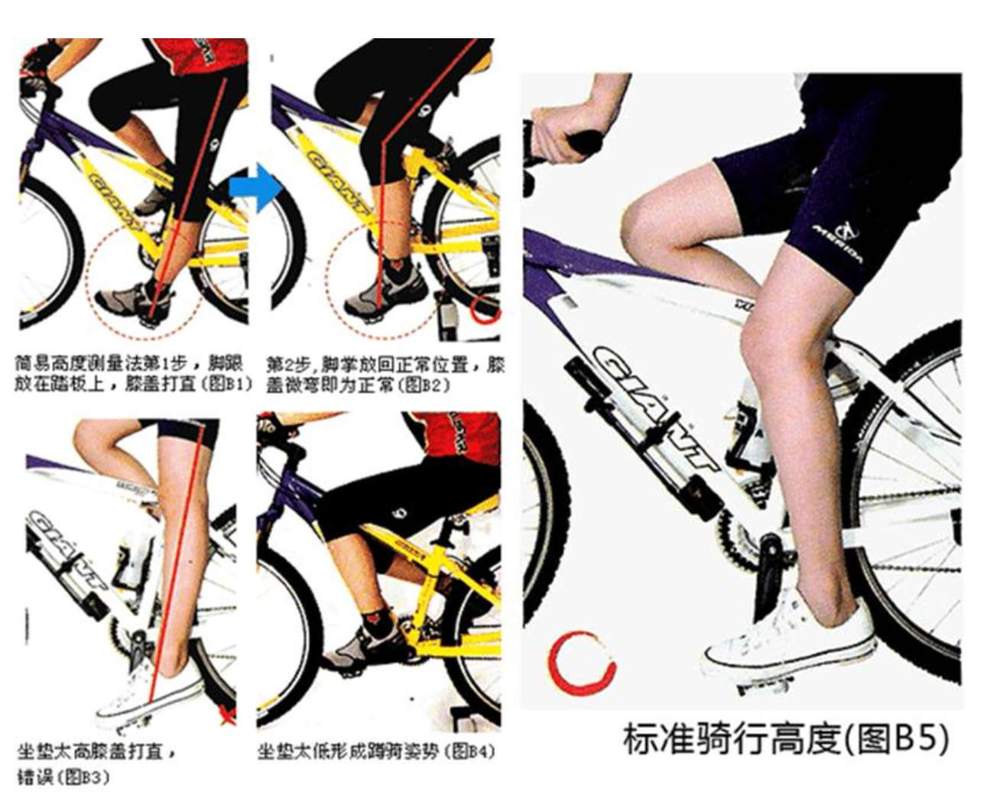

贼偷电动车多了就会有经验偷车时把大牌的电动车自带的 GPS 给拆了，可以从网上买了个宠物用的定位器藏在车上，价格稍高点的电动车，都配有龙头锁。龙头（车头）锁是一种机械装置，通过龙头里面的一个卡块，用锁将它卡死。锁上之后，龙头就转不动了。如果是推的话，电动车只能在原地打转

快拆车座的那个螺丝是扭不死的也不用扭死，按住那个螺母就能扭紧和拆出来

以后想买上班通勤车可刷一下“通勤（代步，上班）自行车，通勤，折叠车，挡泥板，自行车戴头盔，需要注意的安全事项，自行车保养等”，

买二手车或黑车可以去二手车论坛，最好不要在那里买锁

V 刹是自行车上由两块刹车皮对车圈互夹产生摩擦力，从而达到制动的效果。因其形状酷似“V”字，所以称为 V 刹，V 刹的螺母不能扭死，否则刹车后刹皮弹不开，除了 v 刹还有碟刹

国内主流高档一点的山地车应该属美利达和捷安特了，美利达勇士 560 价格 1398，捷安特 atx6 开头的（atx660 1098 元，atx 670 1198 元，atx690 1398 元），出了这几款车，两个牌子的其他车都过 1500 了，这些价格都是透明的，都可以从网上查到，但各个地区的价格会有点差异，而且不能还价，一般都是用来骑行长途或者小长途的。其他的好多就不用说了。

除了捷安特和美利达的山地车之外，热销的应该就是喜得盛了，相比捷安特和美利达来说，600-1500 元的性价比更高，相同价位的话，喜得盛的配置往往会高一点，质量也还是相当可靠的，比如说喜得盛一款逐日 600 是 1550 左右，基本配置是 3x8=24 速的，这个价位美利达捷安特都是 21 速的，刹车采用的是 BB5（线碟中的性价比之王），自然有点优势了，跟大家说一下喜得盛是可以还价的，还多少就是你们的本事了。

千里达还是蛮多的，主要是价格方面有优势，款式也很多，特别是 600-1000 这个价位的好多同学喜欢，确实在山地车来说是比较便宜的，可以作为刚接触山地车又不是很富有的同学作为入门级山地车是完全可以的，

山地车还有其他很多杂牌子的，价格从 250—500 不等，像什么 YIZU,炎山，千里马，还有好多我忘了，我不怎么建议大家用这些车踩长途，哪怕是小长途，有些配置看起来还行，21 速（一般变速都是渣渣，尽管有些用的是喜马诺的，还是不怎么好用），前后双碟刹，质量不怎么的，不过确实是便宜，有些同学想感受一下山地车，用来代步的话也还是可以的。

普通代步车  
说完了山地车，现在来说说我们平时骑得比较多的单车，我跟朋友一般都称为屌丝车，这个价位一般从 150—400 不等（不包括捷安特的一些普通车，要贵一点），牌子真的是一大堆。有些同学喜欢买那种很便宜的，可买回来就知道问题是很大的，我遇到过不少同学的修车费超过了单车的原价，而且用起来也不爽。所以这类车子里面我更觉得大家应该加个一百块钱买好一点的，质量方面没有任何问题，我推荐的有日本三菱，铃木等品牌，这都是身边同学用过的，这些好一点的屌丝车绝对够你正常使用 4 年的，所以我对这一类型的车建议就是买 300 左右的，不要那种 180 的（这些天我看南亭那边打出了特价 180，好多点都卖这个价），因为那种骑得感觉就很差，当然还是觉得于个人了。

死飞有跨刹，跳刹等刹车技巧，死飞是场地车，严格意义上只能在体育场馆内比赛使用。固齿死飞优势是零件少，轻，速度在场地车中速度最快的，也是奥运场地指定用车。这车是场地车，在别的地方骑是不如别的公路、山地好的，不管是速度舒适度还是安全度，最好装上刹车

公路车是在“铺设路面”骑行的，山地车是在“较差路面或是非铺设路面”骑行的，公路车入门门槛相对来说比山地车更高.现代公路车的一个特点就是具备手变,这个特点使得其价格不会偏低.感受手变的入门车型 r902,ocr3300 之类的,光车就 2000 多,加上各种相应级别人身装备 3000 多就没了.娱乐级别的车友多半是买一辆车一顶头盔就完了.花 3000 多才能玩全套,

本人骑着一辆 500 以内的山地车，杂牌的，只是上课代步用，一年下来的基本状况是：变速已失灵，车架把手各种生锈，刹车修了两次，最后沦为一辆普通自行车，还骑得时候偶尔会有嘎吱响，都懒得去修了。实在舍不得就买辆二手捷安特或美利达入门款，五六百也差不多，还耐用，500 山地车 肯定是走不了山地的，但是可以用作通勤和平日健身用。

死飞（Fixed Gear）又称单速车、固定齿轮自行车，死飞就是后面轴承上的齿轮是死的，可以倒着骑，才叫真死飞。，凡是不能倒着骑的都不是死飞，现在比较流行的假死飞（神车），一般两三百块，比如倒刹车，脚往后倒的话只能刹车，不能倒骑。假死飞的材料，质量等比真死飞差很多

山马党，就是在马路上骑山地车的人。

一般来说，实心胎骑起来确实比充气胎要费劲。原因主要有两点，一是因为实心胎比充气胎要重，车重了，摩擦力自然就大，大家骑起来就会比较费劲。。另外，实心轮胎比较容易变形，车轮不圆了，也会使人骑起来感觉很累。实心胎为何容易变形，主要原因也有两点：“一来车轮全是橡胶填充物，比较软、易被压扁，尤其在高温的夏季，骑起来颠簸。二来，由于实心胎重量比较大，骑起来也没有空气做缓冲，对于车轮钢丝的强度也有不小要求，如果钢丝强度不够，容易使整个车轮变形。公共自行车一般使用实心胎，最大优点是防刺防爆，一来不需要定期充气，二来能防止尖锐物件刺入胎体。

自行车空心胎主要有开口胎、真空胎、管胎三种。  
开口胎就是开口轮圈 + 外胎 + 内胎，常见的自行车，摩托车胎就是这样。  
真空胎就是开口真空轮圈 + 外胎  
管胎就是无开口的管胎轮圈 + 胶水/双面胶 + 管子一样的管胎（在内胎外面贴一层外胎的样子）  
长途骑行一般用开口胎，便于补胎，换胎，安装，打气。  
真空胎：草山用，内有补胎液可以自动补细小漏洞，气压低抓地好，爆胎后基本只能呼叫四轮，补好也打不进气，不适合长途。  
管胎：不考虑价格可以长途，内有补胎液可以自动补细小漏洞，气压高省力 路感好，爆胎后用双面胶换一条。运气差的一个月爆胎花几千

　　防盗  
　　自行车尽量把车放在比你贵的车旁边，和一些柱子等锁在一起，不要放在太偏僻的地方。单车不见了先在周围找找，特别是隐蔽处，黑暗处，小偷一般先把车搬到那里再等深夜没人再搬走撬开。其次放单车的时候放在一排单车的中间，越紧越好，然后锁两把锁，一前一后，最后记得新车拿点土，喷漆什么的做旧做丑

　　用砂纸把新车上的漆打磨掉，使车部分生锈，再贴上一些极难看的胶条，或者下雨时故意让车溅上泥浆，总之怎么磕碜怎么来。后来修车的师傅拓展了做旧业务，还会问我们“几成新？”这种方法的局限性是，没有女生愿意坐你的车。

　　随身携带，搬上楼，安装 GPS，不用锁，车不离身

　　山地车停车的时候把档位调到 1-1，，1-1 是什么概念呢，就是你死命蹬好几圈也走不了多远，上陡坡才会用到的那种档位，找一辆掉了链子的车子试一下就知道什么感觉，当场发现车被偷小偷也骑不了很远

　　准备一个快拆车座。离开视线就把车座拆掉。此方法面对大部分小偷好使，但有些小偷是直接把车推走而不是骑走，那就没办法了。（有的小偷会在包里揣一个车座，那真心没辙）

　　自行车弄一个带快拆杆的花鼓，离开视线就把车轮拆掉。之后既可以带着车轮进屋，也可以把车轮放在一边锁在柱子上。此方法基本无敌，小偷也不会去偷一个没有了车轮或者车轮放在一边的的自行车

　　车丢了过几天就去附近的二手市场（一般的车店偷来的车放几天再拿出来卖的），车店找，记得带购车发票还有几个朋友一起去，，带上购买凭证对照中轴部钢印

　　被偷的单车一般都是卖给南亭那些卖单车的老板，发现偷了单车以后可以去南亭转转，如果你时间和地点凑巧的话，还是有可能的，我宿舍那个就找回一次，当时那个老板死活不认账，说了好久之后还是答应把单车给我们，如果你发现你的单车在老板那，直接去找他要，一般他也不想把事情搞大，会还给你的，不行就报警咯，一般都能解决问题的

　　最常见的蟹形锁因铁皮薄梁细易被撬被砸变形而开；"U" 形锁外壳虽厚但 " 互开率 " 安全性能也较低；蛇形钢丝锁对偷车贼的剪线钳毫无防范作用。推荐用金点原子锁，密码锁，双向报警器，三种锁，价格不一，视情况而定。金点原子锁：湖大车协重点推荐，要注意购买全金属的那一种。停在人多车多的地方，停在有监控有保安的地方

　　不少保险公司推出了为自行车保险的业务，如果投保期间，自行车被窃，保险公司会给于一定的赔偿，

　　虽然打钢印的效果并不明显，但也有一定的防范作用，贼在偷车时，更倾向于无钢印的。因为打钢印也退而求其次地给小偷制造心理障碍。至于打钢印方式可以在所购买的自行车店咨询。

　　自行车防盗技巧：

　　第一、不要在自己学校附近的自行车店购买自行车；

　　第二、买车过程中切记不要透露自己的学校信息，特别是不要告诉对方自己住在哪个区哪栋楼；

　　第三、买自行车时一定不要使用商家赠送的锁，如果买了密码锁，要马上修改密码。

　　买车要果断加两个不同的锁，而且不能去同家店买。

　　防盗最好买新锁，买车千万要选好锁，普通的锁非常容易撬开，所以一般偷车贼都是“认锁偷车”。老板向小林透露，一些黑心商家甚至会雇偷车贼去偷自己卖出的车，并将车钥匙提供给偷车贼以方便他们下手。而偷回来的自行车他们会稍加翻新再次出售，从而赚取高额利润。

　　另外，车店的老板还告诉了小林一个防盗技巧，在自行车较为隐秘的地方做上标记。自行车失窃后，可以到附近的自行车市场寻找，发现有相似的车辆便上前查看，确认是自己所丢的车辆就当场骑走，如果商家有意阻拦就报警，“卖车人一般都不敢阻拦，当然最好多带几个同学一起出动

　　遇到门难关、锁难开时，一些市民会往锁眼灌油、甚至肥皂水，这也是错误的。虽然门会暂时灵活起来，但油变干、变稠后，会影响锁内弹簧的伸缩性，大大降低锁的防盗功能。

　　停车的时候找有人看守的地方，摄像头视线范围内。找不到有人看守的地方就尽量找感觉安全的地方吧，比如有保安或者人比较多一点的地方，去闹市口 CBD 这些地方，就找地下停车场，找不着收费停车场的就找一些写字楼，那边肯定有停车的地方。被人问起可以说是写字楼某公司的员工，或者借口来面试之类的。虽说保安没收费停车场那么负责，但是总好过停路边上吧。如果是去同学家玩或者没有停车场写字楼的地方，就找个小区停在楼道里啊。反正那些大叔大妈大哥大姐都没空搭理你的小车，只要你停的时候注意点，别把路堵到就行。如果刚好小偷住这栋楼或者去串个门子什么的发现了你的车，那就只能说命该如此了

　　好的自行车的车架都有固定的编码，编码就和自行车的身份证一样是唯一且固定不变的。在架子的最下面（你把自行车倒立就看的很清楚）

　　车锁

　　必须具备两个要素：一是钢筋铁骨，一是锁心强悍。

　　钢筋铁骨，指的是锁要经得起“三防”考验：整体防锯，防大力钳，防大锤砸。小偷下手，通常喜欢用钢锯，尤其是德国进口钢锯，一般的锁只能撑十几秒，而高质量的锁则能抵抗 5-10 分钟；大力钳主要针对链条锁，链条要做到大力钳钳不断，对材料的要求就非常高，因为链条的单面材料直径要比轮扣锁的杆子要细，胳膊一般拧不过大腿啊；至于用大锤砸，目标则集中在碟锁。碟锁没用钢材制造，基本是锌合金成分，经不起撬棒撬和大锤砸，通常一榔头下去，锁就捐躯了

　　锁心强悍，主要是应对万能钥匙、钢丝和手枪转。一般的锁，通常是锁插（锁插就是固定锁芯的那根销钉）暴露或锁芯暴露，给小偷机会。如果小偷专攻销钉，则锁芯就成了摆设；如果锁芯暴露（目前国内 90% 以上的锁芯材质为铜），碰到了小偷的钢制工具，那就是弱女子遭遇了土匪，结果呵呵。

　　能够在两方面都靠得住的，还得是可利泰（Kryptonite）。来自美国的可利泰，锁具界鼎鼎大名，走的是高端路线，造出来的锁，每一件都是经得起砸锤锯钻钳等折腾的，尤其是它家的 U 型锁，更是锁中极致。U 型锁，正是可利泰在 1971 年发明的，也是它的得意之作。它敢公开宣称它的 U 型锁不怕锁头剪、不怕铁锯、不怕铁鎚、不怕凿子，品质一流！而且承诺：在美国地区如果用此锁而被盗，可以获得保险公司 2000 美元赔偿

　　至于锁芯，目前市面上主要分一字、十字、圆形梅花、月牙型、DISK 锁芯等。其中一字和十字锁芯，几近淘汰，还在用这种锁的，相当于在说：我家大门常打开。而月牙立体型的锁芯，是现在流行的，安全系数属中级。至于圆形梅花锁芯和 DISK 锁芯，都跟可利泰有关。

　　圆形梅花锁芯曾经是可利泰的得意之作，可后来又在此栽了大跟头。原因就是，一个自行车爱好者在开会时闲着无聊，竟然用圆珠笔芯打开了这种锁芯并将此写进博客，在网上传开了。可利泰震惊之下，宣布无偿退换受影响的锁，10 天内更换了 10 万把锁，花费近 1000 万美刀，而它的年营业额才 2500 万美刀。后来才得知这只是一个意外的巧合，它所用的轴向弹子锁芯的大小恰好和普通的比克牌圆珠笔芯一样，典型的躺枪，好在可利泰正吃一堑长一智，或者说痛定思痛，后面造出来的 U 型锁，质量杠杠的。所用的锁芯，则换成了 DISK 锁芯。

　　DISK（叶片）锁芯是目前最高级的锁芯。它的结构其实很简单，就是将十多片钢片排列组合成一定的次序，每一片钢片都有一个角度来控制锁芯的开启，假设有 7 道开关则必须要 7 个角度完全正确才能打开，而且锁芯里面全是钢片组合，没有一般锁的弹簧和钢珠，防水、防沙、防钻甚至是防酸，都是兵来将挡水来土掩，多用于银行和金融的防盗门系统中。而且，这种锁芯最外面的一层，几乎都是军工钢，普通的电钻钻花都不如它硬，暴力开启就一个字：难！德国的 abus 锁，西班牙的 LUMA 锁和法国的 trelock 锁，都是同款锁芯配备

　　　如果你的自行车是上档次的快拆车，建议你除了 U 型锁以外，再来一把它家的链条锁，链条有 2 米多长，以把快拆车的前叉，前轮，车架，后轮，车座等快拆或值钱的玩意一并串联起来并且固定在车旁的柱子等固定物上，防止整车或零件被搬走

　　U 型锁 只要不是劣质锁,其牢固程度远远高于铁链锁,劣质锁徒手两秒就可以打开。U 形锁分一点固定和两点固定,即看 U 字和一字能否分开。一点固定 U 形锁的弱点在于 U 字和一字交接处,铰链结构必然造成厚度不够,可以被钳子剪开。两点固定 U 形锁防盗性能很好，被盗率很低。U 形锁钥匙形状防盗指数: 一字形<十字形<交错形<月牙形<o 形<空转型（越奇怪越好）

　　空转锁 锁芯可以空转，防撬效果好，号称是目前市场上防盗性能最好的车锁，但价格也不便宜。

　　磁码锁 锁孔不能转动，电机锁又叫磁码锁，钥匙和锁里都有一组带磁性的编码。每一把锁的编码都是不同的，所以没有专业的工具，是无法将它打开的。但通过暴力的方法还是能把电机锁给破解掉的，防万能锁匙强制开锁，防 16 吨液压。

　　两把锁是必须的，同时用两种不同类型的锁，至少要有一把是 U 型锁，因为 U 型锁的作用最大，一般液压钳是需要点时间的，如果真的抗液压钳就基本没什么事了，好一点的锁是很有必要的，比如立兆四节锁，碟刹锁，可调式报警锁，自动报警锁，最好不要买一般的钢丝锁和链条锁，密码锁

　　保养

　　我们平时用的代步车，最简单的就是定期加一点油，哪怕是一学期一次，加了油还是好骑好多，能够防止链条生锈，要不然不仅难踩，而且噪音相当大，反过来对车子磨损也很大，单车加油一般也不需要什么钱，有时间去南亭的时候就顺便加一下油就可以了。好一点的山地车一般大家都会意识到保养，至于具体的怎么保养，我建议车友自己去百度一些保养单车的帖子，有些确实很到位

　　骑车姿势

　　坐垫角度首先先调整最简单的坐垫角度。坐垫的角度大致上要保持水平，由于目前市面上的坐垫的垫面大多是弧面，用目视可能不太准确，所以可以先拿一把长尺放在坐垫上，再用眼睛目测抓水平，这样就容易多了。不过坐垫得角度绝不是死板板的。比如说，有些人骑完车后常常会抱怨胯下痛，这或许是坐垫前端的压力过大所致，这是可以将坐垫的鼻端稍稍向下调整一点，这样做可以减轻对胯下部位的压力，特别是在上坡的时候。相反地，有些人不是很长骑上坡，反而喜爱冲下破的乐趣，而冲下坡时因为要控制重心的关系，骑乘者常常会在坐垫与坐垫后方移来移去的，这时最好将坐垫鼻端稍微往上仰个几度，同时将坐管高度放低，这样做有助于下坡时身体在坐垫上的灵活度。  

  

　　坐垫高度再来就是设定坐垫的高度了。坐垫的高度是单车设定中最重要的一环，尤其与膝盖伤害与踏踩出力息息相关。坐垫太高的话膝盖容易受伤，而且重心太高也容易产生意外；太低的话脚踏踩不出力量，长期用不正确的姿势踩踏也会对膝盖与腿部产生不好的影响。膝关节是单车运动时使用最频繁的身体部位，但也是最脆弱、最容易受伤的部位。当我们的腿每踩踏一圈，膝关节就会活动一次，这样频繁的动作，如果施力的方法、方向或位置不正确的话，很容易就会让膝关节受伤，设定坐垫高度常常听一些专家说什么要（胯下长 X0.885）如何如何量测的？其实你不打算当一个选手的话，真的不需要将一件简单的事情搞得那样复杂。慢慢地调整坐垫高度，等到踏到最低点时膝盖正好打直（如图 B1），这时候的坐垫高度就已经八九不离十了！依照这样的标准坐垫高度，再将“脚掌”放回原来的标准踩踏位置，如此一来，膝盖在踩踏的最低点时自然就会有一点点弯曲（如图 B2），这样的伸展姿势既可以兼顾踩踏事的出力，也不会让膝关节再踩踏时受伤。当然，如果新手一下子无法习惯这样的高骑乘位置，也可以将这个“标准坐垫高度”再降低一、两公分、甚至三、四公分，还是在可以接受的范围。设定坐垫高度时最忌讳将坐垫拉得太高，这样的坐垫高度在踩踏时会让膝盖打直（如图 B3），是很危险的动作！像单车运动这样需要双腿频繁地作踩踏回转的动作，这时如果还让膝盖打直，不仅会让踩踏有“顿点”发生，影响踩踏的连续性，而且打直时的膝盖也很伤膝关节及腿部韧带。虽然拉高坐垫后会有一种将踩踏力量“直直打出”的错觉，好像要这种姿势才能踏出去，但其实不然，不管是肌肉还是膝关节都很容易在这时（膝盖打直）磨损受伤。所以一点要记住！骑车踩踏是切忌不能让膝盖打直。坐垫高度也不能太低，一般初学者由于不习惯高重心的骑车姿势，所以往往会将高度下拉，而且拉得太多，这样“蹲骑”的姿势会让腿部的力量伸展不开来（如图 B4），虽然骑车时安心了些（因为重心低、而且脚掌可以踏到地面的缘故），但舒展不开的大腿、小腿、与膝盖不止会让你骑不快，长时间下来也容易造成肌肉与关节的磨损。因此，我们在这里建议，还是先将自己的“标准坐垫高度”找出来，之后可以稍微降低几公分，慢慢习惯重心的变化，然后再一点一点地（半公分或一公分）向上调整，一直到找到那个既可以让你安心自信、又可以兼顾踩踏出力、并且能避免身体受伤的好位置（如图 B5）。　

　

　　坐垫的前后位置坐垫的前后位置其实也与膝关节大有关系。坐垫的前后位置，与坐垫高度同样影响膝关节甚巨，所以设定时一定要小心谨慎才对。坐垫前后位置的设定其实相当简单：先在坐垫上坐好，将脚掌放在踏板上正确的位置（如图 C1）然后踩个几下，接着将踏板摆成水平，这是前脚的“膝盖下点”所垂下的垂直线要刚好通过踏板的中心位置（也就是踏板轴），这样就完成了（如图 C2）！如果垂线没有通过踏板的中心位置，就要依次调整坐垫的位置。（如图 C3）坐垫位置就太过前面，而图 C4 则是太后面，坐垫位置太过前面或后面会影响到腿部的踩踏出力，与膝盖的磨耗也息息相关，所以不可不小心。这个位置当然也不是死的，而是有一点弹性：如果位置再后面一点点，可以让大腿的出力更好更直接，适合喜欢“大脚踩踏”方式的高出力型猛男；如果位置再前面一点点则可以染膝盖与小腿的回转更顺畅，适合喜欢“她会转速”的朋友（踩踏出力小一些、但踩踏速度快一些）。但不管是向前向后，移动的位置都不可超过标准位置 2.5 公分以上，超过的话很容易就会伤及膝盖与肌肉。一般车友最容易犯的错误是将坐垫放在过于后面的位置（如图 C4），这样做好像能燃车子看起来更俊更酷，踩踏是好像也比较容易有那种扎实的踩踏感，但这样硬操的结果，长期下来其实对膝盖时会有所损伤的。  

  

  

  

　　龙头（车把）的高度长度龙头的高度长度主要是在调整体重压在单车上时的配重，同时也会影响操控的灵活度。正常骑行时，我们应该将身体的重量均匀分配在骑车的“金三角”：分别是“手把”、“坐垫”与“脚踏”上（如图 D3）。不常骑车或没有骑车运动习惯的人，由于不善于使用上半身的肌肉群，腰部也不经常运动到，所以会不自觉地将龙头把手的位置弄得又高又近（接近身体），让骑车的姿势好像平常坐着的姿势那样（如图 D2）。但这样看起来技术富有自然的姿势其实会让身体的重量过于集中在“坐垫”上，而“把手”所分到的重量却只是点到为止。这样的设定一开始虽然可以感觉到很自然舒服，但将大多的身体重量压在臀部（坐垫）上，骑乘久了之后臀部会因为压力过大而产生不舒服，跨下的部位也容易会有麻木的感觉。另外，像这样太过于“正直”骑姿将使得骑乘者的脊椎直接面对地面所传来的冲击，久了后就会产生腰酸背痛，长期下来对身体其实是很不好的。所以设定龙头的高度与长度时，千万不要一味地想将龙头加高缩短；相反地，要将龙头设定在适切的位置，让身体的重量能够分一些到把手上面去（也就是上半身与手臂的肌肉上）。虽然一开始时会因为这边的肌肉群平时很少用到的关系，所以会感觉比较无力而且容易疲惫，但骑过一两次车、等肌肉群习惯这样的使用方式与强度后，酸痛不适的感觉自然就会消失。所以设定龙头的长度高度时一定要记住“骑车黄金三角 333 配重原则”。龙头的长度则会随着车子上管长度的不同而有所变化。由于每台车子的上管长度不尽相同，所以龙头长度也不是个固定的数字。龙头过短的话体重不容易压在前轮上，骑车时操控容易有些轻飘飘的感觉，上坡时前轮也比较容易浮起，产生危险或打乱节奏，而且上半身的力量也会有施展不开的感觉；相反地，龙头过长则会放太多重量在前轮上，除了会让操控碍手碍脚之外，下坡时重心太过前面、后轮载重不够容易浮起或导致抓地力不足，对骑乘安全也会大打折扣，上半身过于拉伸也会增加疲累感。所以选择适当的龙头长度往往是新车设定最要的一环，但也是店家最不容易（或不愿意）调整、而且是消费者最不容易马上感受到效果的一项设定。所以说，专业的单车店家一定要准备多种龙头长度供消费者设定或选换。把手可以适当锯短、坐管坐垫也都可以轻易使用快拆或工具调整，唯独龙头是得大费周章的更换，是最不容易调整的操控零件。不过，一定不能怕麻烦，一点要找到自己最适合的龙头长度高度才行！除了店家能为你建议设定外，我们也建议车友可以多购一些不同长度的龙头。偶尔更换一下，这样才能真正找到自己的“最好最舒适的骑车黄金三角”位置。骑起车来才能更不费力、也更安全。

  

  

　　煞车把角度骑车前一定要先学会停下车，也就是煞车。这是安全骑乘的第一步。煞车把手的角度当然也就扮演关键性的角色。煞车把手一般可以先设定在 35-45 度之间，让骑乘时，手背与前臂可以打平为准（如图 E1）。如果手背与前臂间的角度上弯（如图 E2）或下弯（如图 E3）太多，都表示把手的角度不对，得重新调整。正确的煞车把手角度可以让手臂手掌的肌肉能最舒服，而且能最快速地施力与反应。记住，让车子停下来，也就是煞车，是骑乘单车安全的第一步。一点要将煞车把手放在最好最对最自然的位置，这样遇到意外时才能让危险发生的机会降到最低。

　　煞车把手位置煞车把手的角度对了还不够，手指是否能正确地控制手把也是关键。现在的自行车零件多以欧美人的体型作标准，因此对东方人来说。尺寸上往往大了一号，让人“指长莫基”。还好，经过多年的演化，现在的煞车把手大多都是有很宽广的调整空间了。所以只要请店家老板将煞车手把的位置依照你的手掌大小、手指长度作调整，基本上食指与中指的第二节要可以稳稳地放在煞车把手上才算及格（如图 E4），这样真正遇到危险时，刹车的反应时间与力道才够快够有力。尤其是手掌小的女性朋友一定要特别注意这点！千万不要拿你小小的手掌手指去屈就那个设计给西方大男人用得大大的把手，其实只要一丁点的调整，就能够让车子变成你身体的一部分。安全是绝对不能偷懒的哦

　把手宽度车把手的宽度大概要比肩膀再宽一些些，至少要与肩膀同宽，这样操控室才会灵巧有力，而且胸部肌肉自然舒展，可以呼吸得很顺畅（如图 F1）。太窄的车把手宽度会让转弯时碍手碍脚，既影响操控也危险，而且也没法大口呼吸（如图 F3）。但过宽的车把手宽度也不好，操作起来会像在开“拖拉机”（卡车），上半身也容易太前倾，徒增气力、增加腰部的负担（如图 F2）。  

  

  

  

　　总结所以，当你将坐垫的角度、高度、与前后位置、还有龙头的高度长度、以及把手的宽度都照以上的方法设定对后，骑乘的姿势便会像图 G1 这样，膝盖与腿部能真正使出气力并不容易受到运动伤害；上半身则是略成一个“弓”状，可以自然吸收路面的冲击与震动；而前手臂微张微弯，也稍微负载着上半身的重量（如图 G2）；手指则是很自然地放在煞车手把上，可以快速轻易地停下车来。这样一来就可以完成单车的设定了  

  

